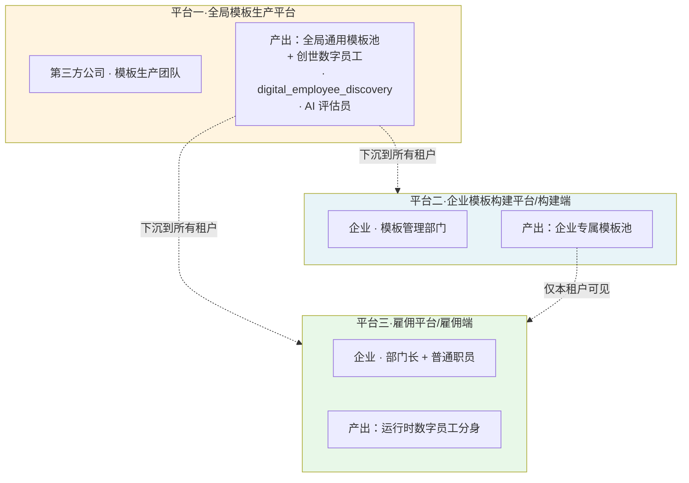
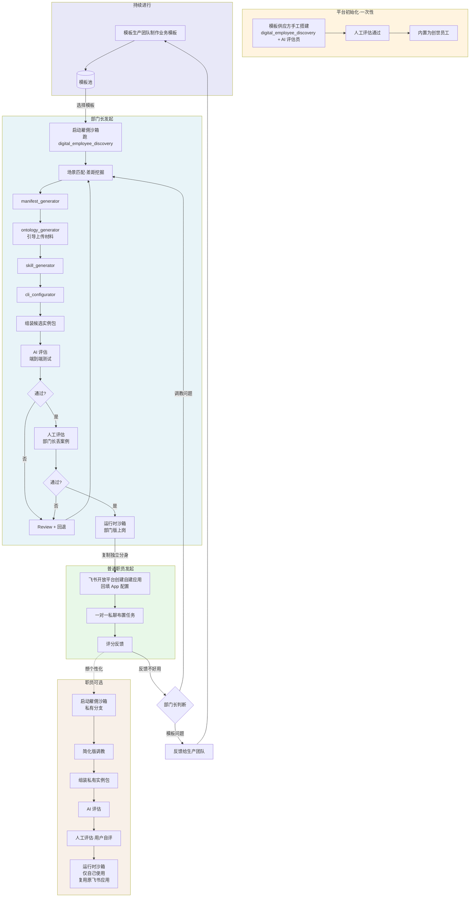
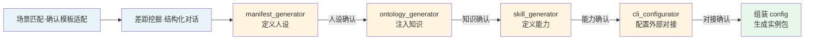
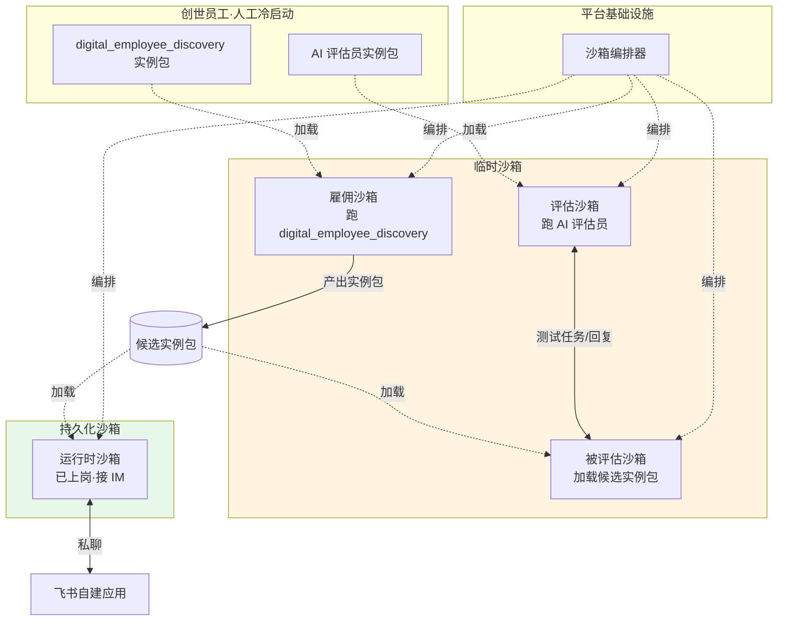

# 数字员工雇佣平台 · 产品设计备忘录

> **文档版本**：v2.0（飞书接入模式由模式 C 改为模式 A）
> **文档定位**：MVP 阶段产品设计的关键决策汇总，用于产品、工程、业务团队对齐
> **配套文档**：《构建端详细需求规格说明书》

---

## 一、产品概述

### 1.1 产品定位

数字员工雇佣平台是面向企业内部使用的 SaaS 产品，为企业员工提供"开箱即用"的数字员工雇佣、调教、使用能力。员工通过该平台获得数字员工分身，接入企业 IM（如飞书）后以一对一私聊的方式给数字员工分配任务，数字员工在沙箱中以真实员工的身份完成工作并交付结果。

### 1.2 核心设计理念（5W1H）

| 维度 | 内容 |
|---|---|
| **Who** | 企业内的部门长（调教者）和普通职员（使用者） |
| **Why** | 通过数字员工分担重复性、流程化的工作，提升员工产能 |
| **When** | 员工日常工作时间，按需向数字员工布置任务 |
| **Where** | 企业 IM 渠道（如飞书），一对一私聊场景 |
| **What** | 由 manifest、skill、ontology、cli 四类资源组成的数字员工实例 |
| **How** | 由雇佣教练全程引导，模板实例化 → AI 评估 → 人工评估 → 上岗使用 |

### 1.3 关键产品原则

1. **开箱即用**：用户不需要懂 AI、ontology、cli 等技术概念，由雇佣教练引导完成全流程
2. **企业级严格门槛**：所有数字员工必须经过 AI 评估和人工评估两个阶段，不可跨级、不可跳过
3. **数据完全隔离**：分身一旦复制即与母版脱钩，互不影响；私有分支与他人完全隔离
4. **不允许过度自由**：用户不能上传私有 skill；个性化只能在分支内进行，不影响他人
5. **一对一私聊**：数字员工只支持私聊任务布置，不支持群聊和员工间协作

---

## 二、三平台架构

### 2.1 平台总览

整个产品体系由三个平台组成，分工明确、数据隔离、各自服务不同的用户群体。



### 2.2 三平台对照表

| 维度 | 平台一·全局模板生产 | 平台二·构建端 | 平台三·雇佣端 |
|---|---|---|---|
| 归属 | 第三方公司（产品方） | 企业租户 | 企业租户 |
| 主要使用者 | 模板生产团队 | 模板管理部门 | 部门长 + 职员 |
| 核心产出 | 全局通用模板 + 创世员工 | 企业专属模板 | 数字员工分身 |
| 关键质量门槛 | 通用性、可复用性 | 业务契合度 | 实际使用效果 |
| 数据隔离层级 | 产品方独有 | 租户独有 | 租户独有 |
| MVP 阶段状态 | **暂不构建独立平台**，创世员工以内置形式存在 | 试点企业使用中 | 试点企业使用中 |

### 2.3 平台间的数据流向

| 流向 | 内容 | 性质 |
|---|---|---|
| 平台一 → 平台二 | 全局通用模板可作为基础蓝图被定制 | 单向只读 |
| 平台一 → 平台三 | 全局通用模板 + 创世员工（雇佣教练 + AI 评估员） | 单向只读 |
| 平台二 → 平台三 | 企业专属模板（仅本租户可见） | 单向只读 |
| 平台三 → 平台二 | 部门长对模板的反馈（不好用、需改进） | 反馈通道 |
| 平台二 → 平台一 | 企业层面对全局模板的共性问题反馈 | 反馈通道 |

### 2.4 MVP 阶段的简化策略

当前 MVP 阶段的实际状态：

- **平台一暂不独立构建**——但创世员工（雇佣教练、AI 评估员）作为标准能力已经存在并真实运行
- **平台二、平台三在试点企业落地**——使用同一企业账号，数据由试点企业管理
- **试点企业体量较大、能代表工业场景**——作为单点场景验证

**未来扩展路径**：业务规模做大后，独立构建平台一，提供面向多租户的全局模板池和创世员工管理能力。

---

## 三、角色矩阵

### 3.1 完整角色清单

| 角色 | 所在平台 | 主要职责 | MVP 阶段状态 |
|---|---|---|---|
| 模板生产团队 | 平台一 | 生产全局通用模板，维护创世员工 | 由产品方团队事实承担 |
| 模板治理团队 | 平台一 | 全局模板的发布、版本管理、下架 | 由产品方团队事实承担 |
| 模板管理部门 | 平台二 | 生产/治理企业专属模板池 | 试点企业的对应部门 |
| 部门长 | 平台三 | 调教部门版数字员工，双阶段评估，处理部门反馈 | 试点企业的中层管理者 |
| 普通职员 | 平台三 | 复制分身使用、布置任务、评分、可建私有分支 | 试点企业的一线员工 |
| 雇佣教练（创世员工） | 平台一生产，平台二、三使用 | 引导整个雇佣过程的交互 | 已存在 |
| AI 评估员（创世员工） | 平台一生产，平台二、三使用 | 端到端评估候选实例包 | 已存在 |
| 数字员工实例（业务） | 平台三 | 在 IM 中以分身形式服务任务 | 试点企业使用中 |

### 3.2 关键权限边界

| 权限 | 部门长 | 普通职员 |
|---|---|---|
| 查看数字员工列表 | 全部数字员工 | 仅已上岗的 |
| 调教模板 | 可以（部门版） | 不可以 |
| 复制分身 | 可以 | 可以 |
| 创建私有分支 | 可以 | 可以 |
| 处理反馈 | 是部门反馈的接收者 | 反馈给部门长 |
| 修改创世员工 | 不可以 | 不可以 |
| 上传私有 skill | 不可以 | 不可以 |

---

## 四、协作流程图

### 4.1 整体协作流程



### 4.2 雇佣流水线（子 skill 编排）

雇佣教练作为总编排者，依次调用四个子 skill 完成实例包的五件套生产：



### 4.3 沙箱架构（沙箱套沙箱）

整个平台运行时的本质是"沙箱套沙箱"的递归结构：



| 沙箱类型 | 何时启动 | 何时销毁 | 性质 |
|---|---|---|---|
| 雇佣沙箱 | 用户开始雇佣 | 候选实例包组装完成 | 临时·任务驱动 |
| 评估沙箱 | 评估开始 | 评估报告产出 | 临时·任务驱动 |
| 被评估沙箱 | 评估开始 | 评估完成 | 临时·任务驱动 |
| 运行时沙箱 | 数字员工转正 | 数字员工被退役 | **持久化** |

---

## 五、digital_employee_discovery 板块详解

### 5.0 概念说明

**digital_employee_discovery（即雇佣教练）** 是平台一生产并内置在所有租户环境中的"创世数字员工"之一,负责引导用户完成数字员工的整个雇佣流程。

下文中 digital_employee_discovery 与"雇佣教练"是同一对象的不同称呼,设计文档与工程实现统一以 digital_employee_discovery 为准。

### 5.1 内部结构

digital_employee_discovery 自身是一个完整的数字员工实例,具有自己的五件套。其内部结构如下:

```
digital_employee_discovery 数字员工
├── manifest 包       ← 它自己的人设(引导者、产品经理、配置助手)
├── ontology 包       ← 它自己的知识(模板市场全貌、雇佣最佳实践、各类业务场景的常见诉求模式)
├── skill 包          ← 它自己的能力清单
│   ├── manifest_generator    （工位 3:生成新员工的人设)
│   ├── ontology_generator    （工位 4:生成新员工的知识)
│   ├── skill_generator       （工位 5:生成新员工的能力)
│   └── cli_configurator      （工位 6:配置新员工的外部对接)
└── cli 包            ← 它自己对接的外部系统(模板市场、上传系统、沙箱编排器)
```

**关键区分**:digital_employee_discovery **自己用的子 skill**(manifest_generator 等)是它内置的工具,**它生产出来的产物**(新员工的 manifest 包、ontology 包等)是给被雇佣者的物料。两者不能混淆。

### 5.2 六大步骤总览

digital_employee_discovery 引导整个雇佣流程,共分为六大步骤:


| 步骤 | 性质 | 是否调用子 skill |
|---|---|---|
| 1·场景匹配 | 对话引导 | 否,由 digital_employee_discovery 主体处理 |
| 2·差距挖掘 | 对话引导 | 否,由 digital_employee_discovery 主体处理 |
| 3·人设生成 | 工位执行 | 是,调用 manifest_generator |
| 4·知识生成 | 工位执行 | 是,调用 ontology_generator |
| 5·能力生成 | 工位执行 | 是,调用 skill_generator |
| 6·外部对接配置 | 工位执行 | 是,调用 cli_configurator |

### 5.3 步骤 1·场景匹配(Scenario Matching)

#### 任务
通过对话明确用户想雇佣的数字员工要解决什么场景,并匹配现有模板。

#### 输入
- 用户的初始诉求(自由文本对话)
- 当前可用的模板池(全局通用模板 + 企业专属模板)

#### 输出
- 选定的基础模板(若派生)或确认从零生产
- 场景描述,写入 `config.use_case.scenario_summary`

#### 关键交互
- 通过 3-5 轮对话明确:
  - 这个员工要服务什么场景?
  - 目标用户是哪种角色(客服、销售、运营等)?
  - 主要工作内容是什么?
- 给出基础模板推荐时,必须说明匹配度估计和缺口

#### 关键判断
- 如果现有模板能覆盖 ≥ 80% 用户诉求,推荐直接基于该模板派生
- 如果现有模板覆盖 < 50% 用户诉求,建议从零生产或反馈给模板供应方
- 中间区间由用户决策

#### 退出条件
- 用户确认基础模板选择(或确认从零生产)
- 场景描述被用户确认

### 5.4 步骤 2·差距挖掘(Gap Discovery)

#### 任务
基于步骤 1 的场景描述,把"用户想做的具体任务"结构化抽象成四类需求清单,作为后续四个工位的输入。

#### 输入
- 步骤 1 的场景描述
- 基础模板的能力描述(若选用了基础模板)

#### 输出(四份清单)
- **知识缺口清单**——给步骤 4 ontology_generator 用
- **能力清单**——给步骤 5 skill_generator 用
- **外部系统清单**——给步骤 6 cli_configurator 用
- **边界清单(out_of_scope)**——给步骤 3 manifest_generator 用

写入 `config.use_case.customization_needs` 和 `out_of_scope`。

#### 关键交互
- digital_employee_discovery 心里有结构化的清单(按 manifest/ontology/skill/cli 四维度)
- 通过对话引导用户用任务驱动的方式说出诉求(用户从"事情"出发,系统内部抽象成"知识/能力/对接/边界")
- **必须显式询问**有哪些事是这个员工**不应该做**的(用于填充 out_of_scope)

#### 设计要点
- 步骤 2 是整条流水线最关键的阶段——它决定了后续四个工位都拿到什么样的输入
- 用户感受到的是"任务驱动"的对话(更符合直觉),系统内部完成"任务 → 知识/能力/对接/边界"的分流抽象
- 这一步如果做不到位,后续四个工位都会受影响

### 5.5 步骤 3·人设生成(manifest_generator)

#### 任务
为新数字员工定义人设——角色、定位、回复风格、行为边界。

#### 调用的子 skill
`manifest_generator`

#### 输入
- 步骤 1、2 的输出
- 基础模板的 manifest(若派生)

#### 输出
- 完整的 manifest 包
- 写入 `config.components.manifest`

#### 关键交互
- 询问人设要点(角色定位、风格)
- 询问语气和回复风格
- 询问边界——什么不能做(基于步骤 2 的 out_of_scope 清单)
- 用业务语言回显生成的 manifest 给用户审核(不展示 json 源文件)
- 支持反复迭代直到用户确认

#### 退出条件
- 用户确认 manifest 内容
- `manifest.status` 切换为 `confirmed`

### 5.6 步骤 4·知识生成(ontology_generator)

#### 任务
基于人设,为新数字员工注入领域知识——本体、SOP、术语、关系。

#### 调用的子 skill
`ontology_generator`

#### 输入
- 已确认的 manifest
- 步骤 2 的知识缺口清单
- 用户上传的原料文件

#### 输出
- 完整的 ontology 包
- 写入 `config.components.ontology`,记录上传的源文件 id 列表

#### 关键交互
- 基于知识缺口清单,结构化询问需要哪些原料
- 引导用户上传文件:支持 docx/xlsx/pdf/pptx/txt/md/png/jpg
- 解析文件内容,生成 ontology 草稿
- digital_employee_discovery 判断"原料是否充足"——这是核心能力
- 用业务语言回显知识结构图给用户(如客户分类、流程节点、术语解释)
- 支持反复迭代直到用户确认

#### 设计要点
- 文件上传是体力劳动,要做到"上传过的不要求重新上传"(详见评估失败处理章节)
- 解析失败的文件必须明确提示用户,不能静默忽略
- 知识结构必须用业务语言而非技术语言展示

#### 退出条件
- 用户确认 ontology 内容
- `ontology.status` 切换为 `confirmed`

### 5.7 步骤 5·能力生成(skill_generator)

#### 任务
基于人设和知识,定义新数字员工的具体能力清单。

#### 调用的子 skill
`skill_generator`

#### 输入
- 已确认的 manifest
- 已确认的 ontology
- 步骤 2 的能力清单

#### 输出
- 完整的 skill 包
- 写入 `config.components.skills`

#### 关键交互
- 基于已有人设和知识,跟用户对话挖掘"这个员工要会做哪些具体的事"
- 自动生成 skill 包内容
- 用业务语言回显能力清单(如"这个员工可以处理:退款、查询订单、回答常见问题……")
- 支持反复迭代直到用户确认

#### 关键约束
- 生成的能力**不能超出 ontology 覆盖的知识范围**(不能让员工做它不懂的事)
- 生成的能力**必须遵守 manifest 的 out_of_scope 边界**
- **用户不能上传私有 skill**——所有 skill 必须由 skill_generator 自动产出(这是"不允许过度自由"原则的具体落地)

#### 退出条件
- 用户确认能力清单
- `skills.status` 切换为 `confirmed`

### 5.8 步骤 6·外部对接配置(cli_configurator)

#### 任务
基于能力清单,配置新数字员工对接的外部系统(CRM、工单、内部 API 等)。

#### 调用的子 skill
`cli_configurator`

#### 输入
- 已确认的 manifest、ontology、skills
- 用户提供的外部系统配置信息

#### 输出
- 完整的 cli 包
- 写入 `config.components.cli`

#### 关键交互
- 基于 skills 询问需要对接哪些外部系统
- 用业务语言询问("客户信息在哪查?工单在哪开?"),不让用户直接配置 json/yaml
- 收集 API 地址、认证方式、调用参数
- **必须做连接测试**——避免运行时才发现配置错误
- 敏感信息(API key 等)加密存储,UI 中遮蔽显示
- 支持反复迭代直到用户确认

#### 退出条件
- 所有外部系统连接测试通过
- 用户确认外部对接配置
- `cli.status` 切换为 `confirmed`

### 5.9 流水线收尾·组装实例包

四个工位全部 confirmed 后,系统自动:

1. 将四个组件聚合到实例包存储路径
2. 生成完整的 config 文件(实例化场景)或 config 模板(模板生产场景)
3. 状态切换:`assembling` → `ai_evaluating`
4. 移交给 AI 评估员进行端到端评估

### 5.10 digital_employee_discovery 的迭代权

- digital_employee_discovery 由平台一生产和维护
- **企业不能修改 digital_employee_discovery**,只能反馈问题
- 平台一根据反馈迭代 digital_employee_discovery 的版本
- 升级后只影响"未来的雇佣过程",不影响"过去的雇佣产物"(因为分身快照式独立)

---

## 六、关键产品决策汇总

### 6.1 数字员工实例包结构

每个数字员工实例由以下组件构成：

```
数字员工实例包
├── config.json         ← 实例级配置（id、归属、版本、飞书 App 配置等）
├── manifest/           ← 人设包（角色、定位、语气、边界）
├── skills/             ← 能力包（具体可调用的技能集合）
├── ontology/           ← 知识包（领域本体、SOP、术语、关系）
└── cli/                ← 外部系统包（CRM/工单/API 的接入配置）
```

### 6.2 状态机

数字员工实例的生命周期状态：

| 状态 | 含义 | 可见性 |
|---|---|---|
| 已雇佣 | 用户开始雇佣，但尚未完成调教 | 仅雇佣者可见 |
| 实习中 | 正在 AI 评估或人工评估阶段 | 仅雇佣者可见 |
| 已上岗 | 双阶段评估通过，进入运行时 | 部门长可见全部，职员仅见已上岗 |

### 6.3 评估机制

| 评估阶段 | 主体 | 方式 | 测试集 |
|---|---|---|---|
| AI 评估 | AI 评估员（创世员工） | 端到端跑预设测试任务 | 模板自带 + 部门长沉淀 |
| 人工评估 | 部门版 = 部门长，私有分支 = 用户自己 | 实时丢案例·看输入输出 | 评估者临场挑选 |

**关键原则**：
- 双阶段必经，不可跳过、不可跨级
- AI 评估通过才能进入人工评估（保护人的时间）
- 两阶段同构，只是测试集和评判方式不同

### 6.4 评估失败处理（MVP 简化版）

| 完整版能力 | MVP 简化版做法 |
|---|---|
| 五个包可视化 review | 仅展示 AI/人工评估报告，不展示包内容 |
| 嫌疑包定位 | 报告写清楚哪个测试任务失败、为什么不达标 |
| 任意工位回退 | 提供六个回退按钮（场景匹配、manifest、ontology、skill、cli、组装），用户盲选 |
| 子 skill 二次进入 | **MVP 不做**——回退即从零重做该工位 |
| 已上传材料保留 | 保留（避免重复上传） |

### 6.5 私有分支机制

普通职员的个性化路径：

- 普通职员可以基于已上岗的部门版分身，创建私有实习分支
- 私有分支需要走完整的双阶段评估，**不能跳过人工评估**（评估者 = 用户自己）
- 私有分支的数据与他人完全隔离
- **私有分支的产物不能反向公开**（MVP 阶段不做私转公）

### 6.6 IM 接入与使用

- 实例评估通过后，用户在飞书开放平台为该数字员工创建一个**独立自建应用**，开启机器人能力，并将 `app_id`、`app_secret`、`verification_token` 等配置信息回填到运行时沙箱
- 每个数字员工（部门员工、个人分身）拥有独立的飞书自建应用，在飞书联系人列表中对应一个独立联系人
- 数字员工通过私聊接收任务，**不支持群聊**（在飞书应用后台配置只接收 P2P 消息）
- 一对一布置任务，多个数字员工之间不协作
- 私有分支复用原分身的飞书应用，无需重新创建，平台内部切换消息路由

### 6.7 评分与反馈

- 普通职员可对数字员工的工作进行评分
- 评分主要给职员自己看（决定是否继续使用）
- 部门版的聚合反馈给部门长，作为是否需要重新调教或上报的依据
- 私有分支的评分纯个人，不外溢

---

## 七、健康检查清单

### 7.1 创世员工资产隔离

| 检查项 | 期望状态 | 重要性 |
|---|---|---|
| 雇佣教练和 AI 评估员的存储路径独立于业务模板 | 物理或逻辑隔离 | 高 |
| 创世员工的代码可以一键打包导出，复用到下一家试点 | 几行命令搞定 | 高 |
| 创世员工有版本号，能回滚到之前的版本 | 至少有 tag 机制 | 中 |
| 创世员工的产物数据归属边界清晰 | 内容归企业，模式归产品方 | 中 |
| 创世员工的迭代权完全在产品方手里 | 企业只能反馈不能修改 | 高 |

### 7.2 数据模型隔离预留

| 检查项 | 期望状态 | 重要性 |
|---|---|---|
| 业务数据表里有 `tenant_id` 字段 | 即使现在只有一个租户也要加 | 高 |
| 模板表里有 `source` 字段 | 标记"全局通用"还是"企业专属" | 中 |
| 模板和实例包在数据库和 API 层面分开 | 概念不混用 | 高 |
| 实例包的 `instance_type` 字段 | 区分"部门版"和"私有分支" | 高 |

### 7.3 反馈和迭代机制

| 检查项 | 期望状态 | 重要性 |
|---|---|---|
| 试点企业的反馈在内部有"行业共性 / 这家特殊"标记 | 决定是否驱动产品迭代 | 高 |
| 团队对"产品该做的事 vs 服务该做的事"有共识 | 避免试点期过度兜底 | 高 |
| 有明确判断标准何时接触第二家试点 | 避免在一家陪跑过久 | 中 |

### 7.4 风险信号识别

下列信号一旦出现需要警惕：

- 试点企业反复要求"为我加个特殊功能"——可能在从产品验证滑向项目交付
- 试点企业某些工作流跟标准雇佣流程对不上——评估是改流程还是引导客户改习惯
- 工程师频繁手动帮试点企业完成本应产品自动化的工作——产品没真正跑通
- 试点企业的反馈中"这家特殊"占比超过 30%——单点验证的代表性需重新评估

---

## 八、未来演进方向

### 8.1 短期（MVP 阶段内）

- 完善创世员工的资产隔离机制
- 在数据模型中预留多租户和模板分层字段
- 沉淀第一份测试任务集

### 8.2 中期（试点扩展期）

- 接触第二家试点企业，校准产品的行业共性
- 启动平台一的独立构建（全局模板池 + 创世员工管理后台）
- 通用模板池开始填充（基于试点经验抽象）

### 8.3 远期（规模化阶段）

- 平台一作为独立产品上线，面向多租户提供全局能力
- 模板分层模型完整落地（通用池 + 企业专属池）
- 商业模式分层（标准订阅 + 定制服务）

---

## 附录：术语表

| 术语 | 定义 |
|---|---|
| **数字员工** | 由 manifest+skill+ontology+cli 四类资源构成、运行在沙箱中的智能体 |
| **实例包** | 数字员工的完整资源包（含 config 文件） |
| **模板** | 待被实例化的"数字员工蓝图"，本身不在沙箱运行 |
| **创世员工** | 平台内置的数字员工，由模板供应方手工搭建（digital_employee_discovery、AI 评估员） |
| **digital_employee_discovery** | 引导整个雇佣过程的创世员工。文档中也称"雇佣教练"，两者为同一对象的不同称呼，工程实现统一以 digital_employee_discovery 为准 |
| **manifest_generator** | digital_employee_discovery 内部的子 skill，用于生成被雇佣员工的 manifest 包（步骤 3） |
| **ontology_generator** | digital_employee_discovery 内部的子 skill，用于生成被雇佣员工的 ontology 包（步骤 4） |
| **skill_generator** | digital_employee_discovery 内部的子 skill，用于生成被雇佣员工的 skill 包（步骤 5） |
| **cli_configurator** | digital_employee_discovery 内部的子 skill，用于配置被雇佣员工的 cli 包（步骤 6） |
| **AI 评估员** | 端到端评估候选实例包的创世员工 |
| **部门版** | 部门长调教并通过双阶段评估的数字员工，部门内可复制分身 |
| **分身** | 普通职员从部门版复制出的独立运行实例，与母版脱钩 |
| **私有分支** | 普通职员对自己分身的个性化调教版本，仅自己可用 |
| **沙箱** | 加载实例包并运行的隔离环境 |
| **构建端** | 平台二，企业模板构建平台 |
| **雇佣端** | 平台三，雇佣平台 |
| **飞书自建应用** | 用户在飞书开放平台创建的企业内部应用，每个数字员工独立一个，用于在飞书中呈现数字员工身份并接收私聊消息 |

---

**文档结束**
