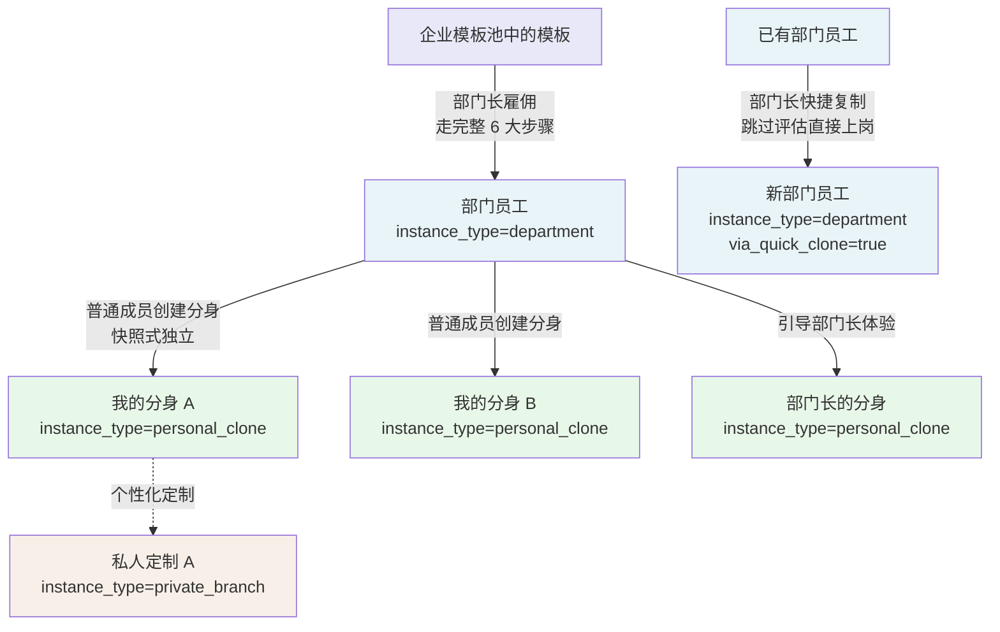
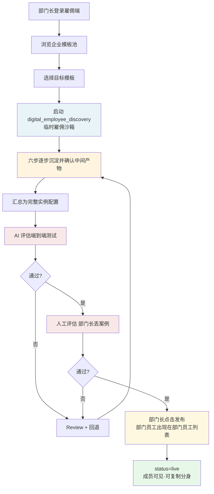
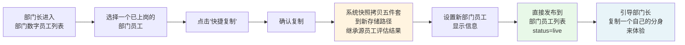
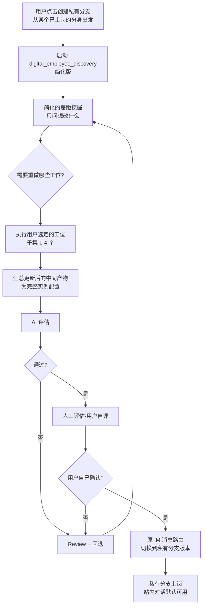
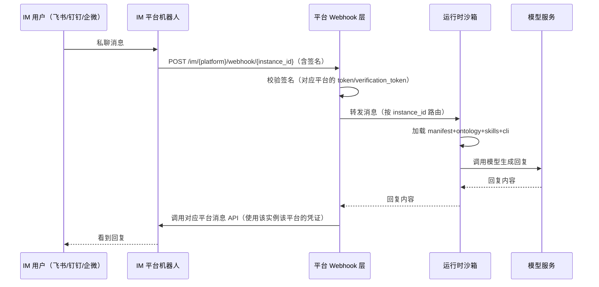
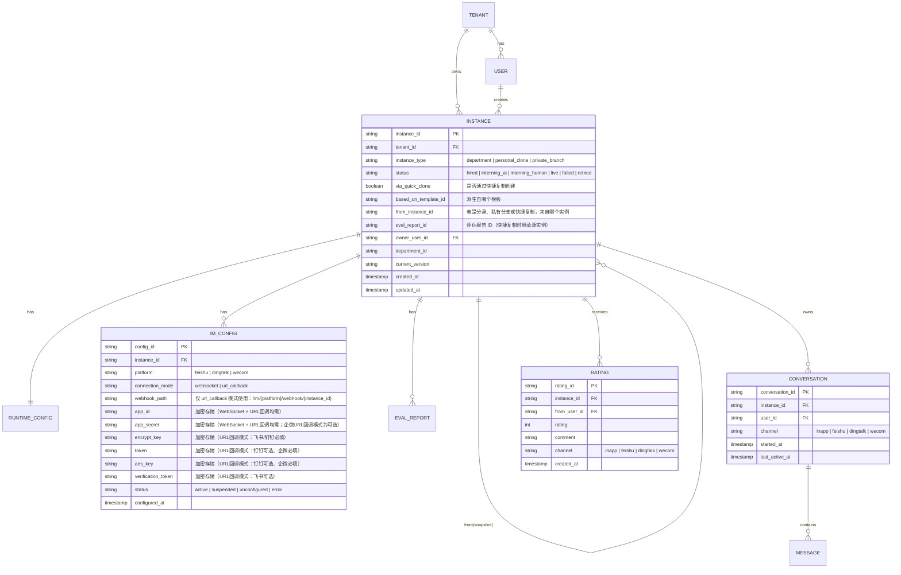
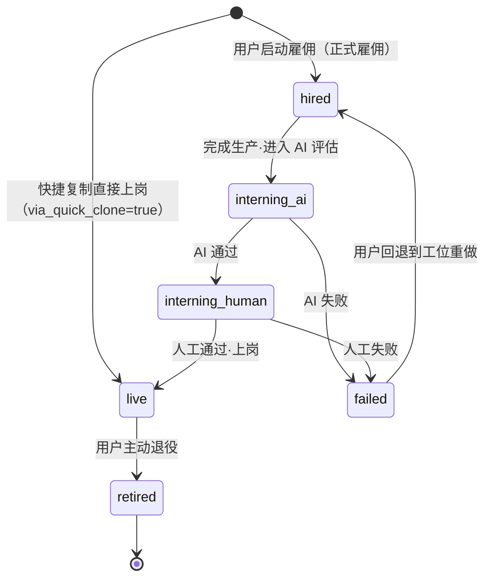
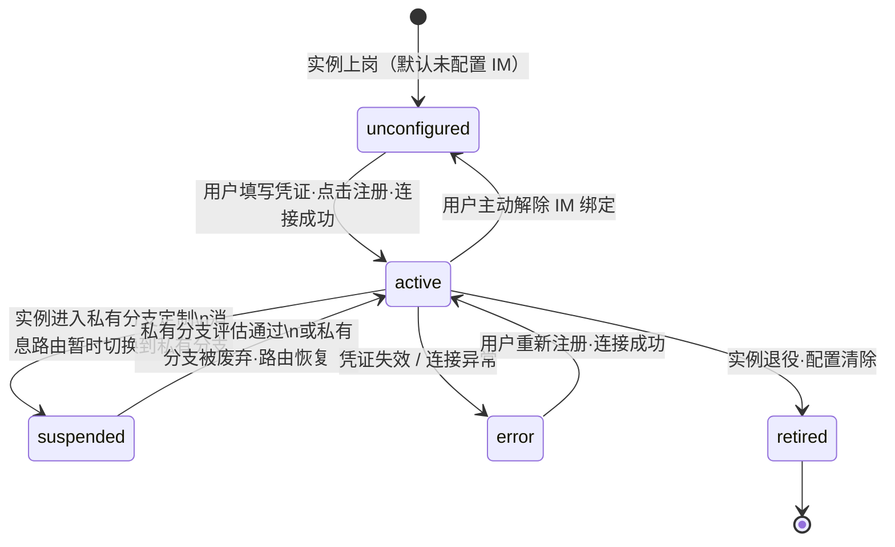

# 雇佣端详细需求规格说明书

> **文档版本**: v4.0（新增：部门长快捷复制、站内对话、多平台 IM 接入）
> **文档定位**: 平台三(雇佣平台)的详细需求规格，工程团队据此开发，产品团队据此对齐
> **读者**: 产品团队、工程团队(前端、后端、算法、IM 集成)
> **配套文档**: 《产品设计备忘录》、《构建端详细需求规格说明书》、《雇佣端 UX 文档_V13_20260427》
> **相较 v3.0 的变更**: 新增 4.3 部门长快捷复制；新增 10.站内对话；第 9 节由"飞书集成"扩展为"多平台 IM 集成（飞书/钉钉/企微）"；更新数据模型、接口规格、MVP 范围

---

## 第一部分 · 总体说明

## 1. 平台定位

### 1.1 平台基本信息

| 项目 | 内容 |
|---|---|
| 平台名称 | 雇佣平台（雇佣端） |
| 在三平台架构中的位置 | 平台三 |
| 主要使用者 | 企业内的部门长、普通成员 |
| 核心产出 | 运行时数字员工分身（已上岗、可在站内或 IM 中接受任务） |
| 与构建端的关系 | 下游接收方，从企业模板池中获取模板进行实例化 |
| 与平台一的关系 | 下游接收方，接收全局通用模板和创世员工 |

### 1.2 平台核心价值

雇佣端解决的核心问题是：**让企业员工以最低门槛获得能在平台内和 IM 中实际工作的数字员工分身**。

对部门长而言，雇佣端把已有模板雇佣为本部门可复用的"部门员工"；同时提供**快捷复制**路径，让部门长可从已有部门员工一键创建新的部门员工版本。对普通成员而言，雇佣端让他们从部门员工创建自己的分身，通过**站内对话**直接在平台内布置任务，也可按需接入 IM 进行外部通信。

雇佣端是整个产品体系中**唯一面向业务终端用户**的平台——开箱即用的核心理念在雇佣端必须百分百兑现。

### 1.3 雇佣端与构建端的边界

雇佣端和构建端共用大量底层能力（创世员工、沙箱、雇佣流水线），但产出物本质不同：

| 维度 | 构建端 | 雇佣端 |
|---|---|---|
| 使用者 | 模板管理部门 | 部门长、普通成员 |
| 产出物 | 模板（可被实例化的蓝图） | 实例（直接运行的数字员工） |
| 产出物状态 | 静态资源，存放在模板池 | 动态资源，运行在沙箱中 |
| 评估对象 | 模板的默认实例化结果 | 六步确认后的完整实例配置 |
| 评估通过后 | 发布到企业模板池 | 实例上岗，接入站内对话 + 可选 IM |
| 是否绑定 IM | 否 | 是，可选核心动作 |
| 是否支持站内对话 | 否 | **是，主要对话渠道** |
| 是否涉及分身复制 | 否 | **是，核心动作** |
| 是否涉及私有分支 | 否 | **是** |
| 用户技术门槛 | 中等（模板管理部门有一定专业度） | **极低（开箱即用是底线）** |

**关键理解**：雇佣端跟构建端走的是同一套雇佣流水线（场景匹配 → 五件套生产 → 双阶段评估），但流水线终点产出的是**实例**而非模板；并且雇佣端在实例上岗后还要做**站内对话、IM 绑定（可选）、分身复制、运行时管理**等构建端不涉及的工作。

### 1.4 雇佣端核心子场景

雇佣端服务四类核心子场景，工程实现时需明确区分：

| 子场景 | 主体角色 | 核心动作 | 产出 |
|---|---|---|---|
| **部门版雇佣** | 部门长 | 走完整六大步骤，把模板实例化为部门员工 | 部门员工（已上岗） |
| **部门长快捷复制** | 部门长 | 从已有部门员工一键复制，直接发布为新部门员工 | 部门员工（已上岗，继承源员工评估） |
| **分身复制** | 普通成员 | 从部门员工创建个人分身，可选配置 IM | 我的分身（已上岗，与母版脱钩） |
| **私有分支** | 普通成员（可选） | 在"我的分身"基础上做个性化定制 | 私人定制（仅自己使用） |

---

## 2. 角色与权限

### 2.1 角色清单

| 角色 | 职责 | 关键权限 |
|---|---|---|
| 部门长 | 浏览企业模板池、发起部门版雇佣、快捷复制部门员工、参与双阶段评估、管理部门数字员工 | 可见企业模板池、部门数字员工全部状态、人工评估权、快捷复制权 |
| 普通成员 | 从部门员工创建分身、站内对话、评分、可选创建私有分支、可选配置 IM | 仅可见已上岗的部门员工、创建分身权、个人分支权 |

MVP 阶段不再细分角色，简洁为这两类即可。

### 2.2 权限矩阵

| 操作 | 部门长 | 普通成员 |
|---|---|---|
| 浏览企业模板池 | ✓（全部） | ✗ |
| 浏览"部门数字员工"中的部门员工 | ✓（全部状态） | ✓（仅已上岗） |
| 启动模板雇佣（部门版） | ✓ | ✗ |
| **从部门员工快捷复制** | **✓** | **✗** |
| 上传雇佣 / 定制材料 | ✓（部门级） | ✓（仅私有分支） |
| 启动 AI 评估 | ✓ | ✓（仅私有分支） |
| 执行人工评估 | ✓（部门员工） | ✓（仅自己的私有分支） |
| 部门员工上岗确认 | ✓ | ✗ |
| 创建分身 | ✓ | ✓ |
| **站内对话** | **✓** | **✓** |
| 配置 IM（飞书/钉钉/企微） | ✓ | ✓ |
| 私聊布置任务（IM） | ✓ | ✓ |
| 评分 | ✓ | ✓ |
| 创建私有分支 | ✓ | ✓ |
| 修改创世员工 | ✗ | ✗ |
| 上传私有 skill | ✗ | ✗ |

### 2.3 数据可见性边界

| 数据对象 | 部门长可见 | 普通成员可见 |
|---|---|---|
| 部门员工本身的运行配置 | ✓ | ✗ |
| 自己产生的对话记录（站内 + IM） | ✓（自己的） | ✓（自己的） |
| 他人产生的对话记录 | ✗ | ✗ |
| 自己分身的评分历史 | ✓（自己的） | ✓（自己的） |
| 部门员工的评分聚合 | ✓ | ✗ |
| 私有分支（他人的） | ✗ | ✗ |

**关键原则**：**不同人产生的对话记录、任务执行记录之间完全隔离**——部门长也不能看到下属的具体对话内容，只能看到聚合的评分信息。

---

## 3. 核心概念定义

### 3.1 数字员工实例的状态

| 状态 | 含义 | 可见性 |
|---|---|---|
| `hired` | 已雇佣，刚启动雇佣流程 | 仅雇佣者可见 |
| `interning_ai` | 实习中 - AI 评估阶段 | 仅雇佣者可见 |
| `interning_human` | 实习中 - 人工评估阶段 | 仅雇佣者可见 |
| `live` | 已上岗，可在站内对话和 IM 中工作 | 部门员工对全部门可见；分身和私有分支仅雇佣者可见 |
| `failed` | 评估失败，需 Review 后重试 | 仅雇佣者可见 |
| `retired` | 已退役，不再接受新任务 | 仅雇佣者可见，只读历史记录 |

### 3.2 部门员工 / 我的分身 / 私人定制三层关系

雇佣端的实例有三种"亲缘关系"形态：



| 实例类型 | 来源 | 谁能创建 | 谁能使用 | 是否双阶段评估 | IM 配置 |
|---|---|---|---|---|---|
| 部门员工（department） | 模板雇佣 或 快捷复制 | 部门长 | 部门内所有人（通过创建分身） | 是（正式雇佣）/ 否（快捷复制，继承源员工评估） | **无**，部门员工不配置 IM |
| 我的分身（personal_clone） | 部门员工的快照式复制 | 部门长 / 普通成员 | 仅创建者本人 | 否（继承部门员工的评估结果） | **可选**，分身 owner 自行配置，每平台独立 |
| 私人定制（private_branch） | 在"我的分身"基础上的个性化定制 | 部门长 / 普通成员 | 仅创建者本人 | 是（评估者=用户自己） | **复用原分身的 IM 配置** |

### 3.3 快照式独立的工程含义

"分身一旦创建即与母版脱钩"——这是核心原则。工程实现要点：

- 创建分身时，**完整拷贝**部门员工的五件套到新的存储路径，不使用引用
- 部门员工后续若被部门长重新雇佣，**不会影响**已经创建出去的分身
- 分身被退役、被改造，也**不会影响**部门员工

**部门员工和分身在数据层是完全独立的两个实例**，只在 metadata 中保留 `from_instance_id` 字段（用于审计和来源追溯）。

### 3.4 创世员工在雇佣端的调用

雇佣端的整个流程依赖两个创世员工：

- **digital_employee_discovery**（雇佣教练）：引导部门长完成部门版雇佣的六步流程、引导普通成员完成私有分支定制
- **AI 评估员**：对完整实例配置进行端到端评估

雇佣端**只调用、不修改**创世员工。

#### 子 skill 初始化执行顺序

`digital_employee_discovery` 在 Round 0 正式开始前，按以下顺序执行一次预初始化：

1. **generator-skill**：从模板已有能力定义中产出初始能力清单
2. **ontology-skill**：基于初始能力清单，定义精确的初始本体切片

**顺序不可颠倒**。ontology-skill 依赖 generator-skill 的输出作为范围锚点，以确保本体切片最小且充分。颠倒顺序会导致切片边界与实际能力脱钩。

ontology-skill 在输出本体切片的同时，还会基于切片内容**自动生成测试用例**，直接传入 AI 评估环节使用。测试用例覆盖三类：实体识别、动作执行、约束合规（约束合规类优先级最高）。

### 3.5 对话渠道定义

v4.0 起，数字员工支持三类对话渠道，用户可按需选择，上岗后默认提供前两类：

| 渠道 | 入口 | 说明 | 是否需要额外配置 |
|---|---|---|---|
| **平台会话** | 我的员工列表 → 点击员工卡片 | 在雇佣端平台内嵌界面直接对话，上岗即可用 | **否，上岗即开放** |
| **拉起 IM** | 员工卡片 / 详情页 → 点击"去 {平台名}" | 从平台直接跳转到对应 IM 应用，在 IM 中与员工私聊 | 需先完成 IM 注册（凭证回填 + 连接成功） |
| **直接在 IM 中私聊** | 用户自行在 IM 应用中找到机器人 | 不经过平台跳转，在 IM 应用内直接使用 | 同上，需先完成 IM 注册 |

**三种渠道的关系说明**：
- "平台会话"和"拉起 IM / 直接 IM"是**独立的对话上下文**，消息历史互不共享
- 同一员工可同时开启三类渠道，各渠道底层共用同一运行时沙箱
- "拉起 IM"是"直接在 IM 中私聊"的快捷方式，两者本质相同，区别仅在于入口是否经由平台跳转

---

## 第二部分 · 功能需求

## 4. 部门版雇佣流程（部门长发起）

### 4.1 流程总览



### 4.2 各阶段说明

#### 阶段 1：模板浏览与选择

**功能要求**：
- 部门长可见的模板包括全局通用模板（来自平台一，只读）和本企业已发布的模板（来自构建端）
- 仅支持关键词搜索，不提供模板来源、业务场景、所属部门等筛选入口
- 支持查看模板详情（人设、能力描述、覆盖场景），不可见模板源代码
- 部门长在模板详情中点击"雇佣"后进入流程

#### 阶段 2-7：完整六大步骤

详见《构建端详细需求规格说明书》第 6 节。六步全部确认后，系统将已沉淀的中间产物汇总为完整实例配置，再进入 AI 评估。

##### 六步执行规则：两阶段自由度

六步流程分为两个阶段，执行自由度不同：

**阶段一：首次完整通过（严格顺序）**

- 六步必须从第一步开始依序执行，**不允许跳步**
- 每一步完成并确认后，才能解锁下一步
- 下一步按钮仅在当前步骤确认后激活，未确认步骤不可跳过或绕过
- 适用范围：当次雇佣会话中，六步尚未全部完成至少一遍之前

**阶段二：首次完整通过后（自由补充模式）**

- 六步全部确认过至少一遍后，进入自由补充模式
- 用户可在会话框**随时追加说明、修正任意步骤的内容**，无需重新走完整流程
- 系统接收补充内容后，局部更新对应步骤的中间产物，其余步骤产物保持不变
- 支持在任意步骤之间来回修改，不限制顺序
- 已汇总的实例配置在自由补充期间标记为 `draft_updated`，待用户确认"完成修改"后重新汇总

**系统状态标记：**

| 状态 | 含义 |
|---|---|
| `first_pass_in_progress` | 首次完整通过进行中，严格顺序模式 |
| `first_pass_complete` | 首次完整通过已完成，进入自由补充模式 |
| `draft_updated` | 自由补充模式下已有修改，尚未重新汇总 |

#### 阶段 8-9：双阶段评估

详见第 7 节。评估对象是六步全部确认后的完整实例配置。

#### 阶段 10：发布到部门员工列表

评估通过后，部门长在平台内确认发布：
- 启动运行时沙箱
- 状态切换为 `live`
- **部门员工直接出现在"部门数字员工"列表**，部门内所有成员可见
- 成员可从该员工创建个人分身；个人分身 owner 可按需配置 IM
- **部门员工本身不配置 IM**——IM 接入在个人分身层面完成

---

### 4.3 部门长快捷复制（新增）

#### 4.3.1 功能定位

部门长从**已有的、状态为 `live` 的部门员工**出发，通过一键复制创建一个新的部门员工。新部门员工**继承源员工的评估结果，不重走双阶段评估**，直接上岗发布到部门员工列表。

**与正式雇佣的区别**：

| 维度 | 正式雇佣（4.1） | 快捷复制（4.3） |
|---|---|---|
| 来源 | 企业模板池中的模板 | 已上岗的部门员工 |
| 流程 | 完整六大步骤 + 双阶段评估 | **跳过六大步骤和评估** |
| 用时 | 数小时到数天 | **分钟级** |
| 评估结果 | 新评估 | **继承源员工评估结果** |
| 适用场景 | 全新引入一类数字员工 | 快速复用成熟员工，创建多个并列版本 |

#### 4.3.2 流程总览



#### 4.3.3 各阶段说明

**阶段 1：选择源员工**
- 入口：部门员工列表 → 某个 `live` 状态的部门员工的操作菜单 → "快捷复制"
- 只有 `live` 状态的部门员工才能作为快捷复制的源；`hired`、`failed`、`retired` 状态不可用

**阶段 2：确认复制**
- 向部门长展示确认弹窗，说明：
  - 将基于「{源员工名称}」创建新的部门员工
  - 新员工继承源员工的评估结果，无需重新评估
  - 创建后可引导体验
- 部门长确认后，系统执行：
  - 生成新的 `instance_id`
  - 完整快照拷贝五件套到新存储路径
  - `instance_type=department`、`from_instance_id` 指向源部门员工
  - `via_quick_clone=true`（标识此实例来自快捷复制，用于审计）
  - 继承源员工的 `eval_report_id`（评估报告归档引用）

**阶段 3：设置显示信息**
- 部门长填写新部门员工在平台内的呈现信息：
  - `display_name`（必填）：如"客服小张（二号）"，部门内不能重名
  - `display_avatar`（可选）：默认沿用源员工头像
  - `display_description`（可选）

**阶段 4：直接发布**
- 系统将新实例状态**直接切换为 `live`**，跳过 `hired → interning_ai → interning_human` 阶段
- 启动运行时沙箱
- 站内对话立即可用
- 新员工出现在部门员工列表，部门内成员可见并可创建分身

**阶段 5：引导体验**
- 发布成功后，平台弹出引导提示："该员工已发布，建议您先复制一个自己的分身来体验"
- 提供快捷操作："立即创建我的分身"（跳转至分身复制流程，预填充源为刚发布的新部门员工）
- 部门长也可选择"稍后再说"，直接回到部门员工列表

#### 4.3.4 约束与边界

- 快捷复制**只能创建部门员工（department 类型）**，不能创建普通成员的分身
- 快捷复制来源**只限部门员工**，不能从个人分身（personal_clone）快捷复制出部门员工
- 快捷复制后的新员工**独立运行**，与源员工无任何关联——修改源员工不影响复制出的新员工
- 快捷复制来的员工**不记录在正式雇佣历史**中，但保留 `from_instance_id` 和 `via_quick_clone` 供审计
- IM 接入：快捷复制的新员工**需单独配置 IM**（若需要），不能复用源员工的 IM 配置（每个员工对应独立机器人）

---

## 5. 分身复制流程（普通成员发起）

### 5.1 流程总览

```mermaid
flowchart LR
    Start[成员登录] --> Browse["进入'部门数字员工'<br/>已上岗视图"]
    Browse --> Detail[查看某个部门员工详情]
    Detail --> Create["点击'创建分身'"]
    Create --> Confirm[确认复制]
    Confirm --> Snapshot["系统快照拷贝五件套<br/>到新存储路径"]
    Snapshot --> Identity["配置平台内显示信息<br/>display_name 等"]
    Identity --> Live["个人分身上岗<br/>站内对话立即可用"]

    Live -.可选.-> IMBind["配置 IM<br/>飞书/钉钉/企微"]

    style Start fill:#e8f8e8
    style Snapshot fill:#fff4e0
    style Identity fill:#fff8e0
    style Live fill:#e8f8e8
    style IMBind fill:#fff8e0
```



### 5.2 流程极简化要求

- 从点击"创建分身"到完成上岗，**用户操作步骤不超过 3 步**（去掉了 IM 配置作为必须步骤）
- 平台侧 P95 ≤ 30 秒
- **不需要任何对话引导**——digital_employee_discovery 不在分身复制场景中介入
- 用户只需做三件事：**确认复制 → 设平台内显示信息 → 上岗**
- IM 配置为**可选操作**，在员工卡片上提供"配置 IM"入口

### 5.3 各阶段说明

#### 阶段 1：浏览部门数字员工并查看详情

- 普通成员只能看见**本部门的、状态为 `live` 的**部门员工
- 详情页在 `live` 状态下展示"创建分身"按钮

#### 阶段 2：确认创建分身

一键确认，系统自动：
- 生成新的 `instance_id`
- 完整拷贝部门员工的五件套到新存储路径
- `instance_type=personal_clone`、`from_instance_id` 指向母实例
- 不进入双阶段评估（继承母实例的评估结果）

#### 阶段 3：配置平台内显示信息

- `display_name`（必填）：平台内显示名，同一用户下不能重名
- `display_avatar`（可选）：默认沿用部门员工头像
- `display_description`（可选）

#### 阶段 4：上岗

- 启动运行时沙箱（持久化）
- 状态切换为 `live`
- **站内对话立即可用**——用户在"我的员工列表"点击该员工即可进入对话
- 员工卡片展示"配置 IM"入口，用户可按需接入外部 IM

### 5.4 分身的退役与重建

- 用户可主动退役自己的分身，状态切换为 `retired`，运行时沙箱销毁，IM 配置解绑
- 退役后可重新从同一部门员工创建新分身——需要重新配置 IM（若需要）
- 退役后的对话历史保留，只读

---

## 6. 私有分支流程（部门长 / 普通成员可选）

### 6.1 触发条件

入口：在"我的数字员工"中，从某个"我的分身"的详情页提供"创建私有分支"按钮。

### 6.2 流程总览



### 6.3 关键约束

**1. 评估强度不变**：MVP 阶段仍然要求双阶段评估，不可跳过人工评估。

**2. 评估者**：AI 评估由 AI 评估员执行；人工评估**由用户自己执行**。

**3. 数据隔离**：私有分支的 ontology、对话记录、产出全部归用户私有。

**4. IM 侧的处理**：
- 私有分支创建后，**复用原分身已配置的各平台 IM 凭证**（不需要重新创建机器人）
- 系统将各平台的消息路由从原分身实例切换到私有分支实例
- 用户在 IM 的体验上，感觉就是"这个员工变聪明/变了一点风格"，不是"多了一个员工"
- 站内对话也自动切换到私有分支版本

**5. 不可二次分支**：用户不能在私有分支基础上再创建私有分支。

### 6.4 私有分支的废弃与回退

- 用户可主动废弃私有分支，系统将各平台 IM 消息路由切换回原始分身，站内对话也恢复到原分身
- 废弃操作不可撤销，但用户可以重新创建私有分支

---

## 7. 双阶段评估流程

### 7.1 评估流程与构建端的对仗关系

| 维度 | 构建端 | 雇佣端·部门员工 | 雇佣端·私人定制 |
|---|---|---|---|
| 评估对象 | 模板的默认实例化结果 | 完整实例配置（部门员工） | 完整实例配置（私人定制） |
| AI 评估员 | 创世员工 AI 评估员 | 创世员工 AI 评估员 | 创世员工 AI 评估员 |
| 人工评估者 | 模板部门主管 / 模板评估者 | **部门长** | **用户自己** |
| 通过阈值 | 总分 ≥ 75 且无单维度低于 60 | 总分 ≥ 75 且无单维度低于 60 | 总分 ≥ 75 且无单维度低于 60 |

详细评估规格参见《构建端详细需求规格说明书》第 7 节。

### 7.2 测试任务集

| 来源 | 部门员工 | 私有分支 |
|---|---|---|
| 模板自带的通用测试集 | ✓ 复用模板的测试集 | ✓ 复用基础分身的测试集 |
| 雇佣/定制过程中沉淀的测试用例 | ✓ digital_employee_discovery 引导部门长沉淀至少 5 个真实任务 | ✓ 引导用户沉淀至少 3 个真实任务 |
| ontology-skill 自动生成的测试用例 | ✓ 雇佣流程中由 ontology-skill 基于本体切片自动生成 | ✓ 同上 |
| 人工评估时临场输入的案例 | ✓ 评估完成后自动沉淀回测试集 | ✓ 评估完成后自动沉淀回**该用户私有的**测试集 |

### 7.2.1 评估启动前的测试用例衔接检查

AI 评估启动时，系统执行以下衔接检查，确保测试用例来源不为空：

```
1. 检查实例的 session state 中是否存在 test_cases（由 ontology-skill 生成）
   ├── 存在且 test_cases.length ≥ 1
   │     → 直接进入评估，使用已有测试用例
   └── 不存在或为空
         → 自动触发 ontology-skill 重新执行，生成测试用例
               ├── 生成成功 → 继续启动评估
               └── 生成失败（context 不足） → 评估页展示"测试用例生成中断"提示
                   告知用户当前仅能使用模板通用测试集，建议返回雇佣流程补充本体信息
```

**此衔接检查对用户无感**——正常路径下 ontology-skill 在雇佣阶段已生成测试用例，检查即通过。仅在雇佣流程异常中断或 ontology-skill 未能成功执行时，衔接检查才会触发补充生成。

### 7.3 评估失败的 Review

跟构建端一致，采用 MVP 简化版方案（详见《构建端详细需求规格说明书》第 8 节）。

### 7.4 雇佣端独有：评估通过后的"发布"

| 步骤 | 构建端发布 | 雇佣端·部门员工发布 |
|---|---|---|
| 1 | 模板部门主管确认发布 | 部门长点击"发布到部门员工列表" |
| 2 | 填写模板元数据 | 状态切换：interning_human → live |
| 3 | 状态切换：human_passed → published | **启动持久化运行时沙箱** |
| 4 | 同步到雇佣端模板池 | **部门员工出现在"部门数字员工"列表，成员可见** |
| 5 | 通知雇佣端有新模板上架 | 成员（含部门长）可复制个人分身；分身 owner 可选配置 IM |

**关键说明**：部门员工发布后不需要配置 IM。IM 接入属于个人分身层面的操作，由各成员在自己的分身上按需完成。

---

## 8. 评估失败处理（Review）

### 8.1 与构建端共用 Review 机制

详细规格参见《构建端详细需求规格说明书》第 8 节，本节不重复。

### 8.2 雇佣端独有的 Review 触发场景

私有分支定制时评估失败场景下，用户可以选择"放弃私有分支"——系统直接销毁未上岗的私有分支，IM 路由保持在原分身，站内对话也保持在原分身。

---

## 9. 多平台 IM 集成（飞书 / 钉钉 / 企微）

> **v4.0 变更**：本节由"飞书集成"扩展为"多平台 IM 集成"，支持飞书、钉钉、企微三个平台，每个平台独立配置，同一员工可同时接入多个平台。IM 接入为**可选**操作，数字员工上岗后默认提供站内对话，IM 为额外通道。

### 9.1 多平台接入概述

| 维度 | 说明 |
|---|---|
| 支持平台 | 飞书、钉钉、企业微信（企微）三个平台 |
| 配置主体 | **仅个人分身（personal_clone）和私人定制（private_branch）**；部门员工（department）不配置 IM |
| 配置方式 | 分身 owner 在对应平台后台创建机器人，将凭证回填到平台 |
| 多平台并行 | 同一分身可同时接入多个平台，各平台消息独立处理 |
| 是否必须配置 | **否**，上岗后平台会话默认可用，IM 为可选扩展 |
| 接入时机 | 分身上岗后随时可配置，每个平台独立管理 |
| 私有分支处理 | 复用原分身已有的各平台 IM 配置，仅切换内部路由 |

**选择"用户自建机器人，回填凭证"模式的原因**：
- 每个平台账号归属清晰，企业对机器人身份有完全控制权
- 无需平台与各 IM 厂商之间建立特殊 API 合作关系
- 每个数字员工对应一个独立机器人，消息路由通过 Webhook URL 天然解决
- 配置为一次性操作，操作难度低

### 9.2 各平台接入模式与凭证

每个平台均支持两种接入模式，用户在配置时选择其一：

| 接入模式 | 说明 | 适用场景 |
|---|---|---|
| **WebSocket 长连接** | 平台主动向 IM 服务端建立持久连接，消息实时推送，无需暴露公网 URL | 推荐，配置最简单 |
| **URL 回调（Webhook）** | IM 平台将消息推送到平台提供的公网 URL | 网络环境要求公网可达时使用 |

#### 9.2.1 飞书接入

**WebSocket 长连接**（推荐）：

| 凭证字段 | 来源 | 说明 |
|---|---|---|
| `app_id` | 飞书应用后台 → 凭证与基础信息 | 应用唯一标识 |
| `app_secret` | 飞书应用后台 → 凭证与基础信息 | 加密存储，用于鉴权与发送消息 |

**URL 回调**：

平台提供 Webhook URL：`https://{platform_domain}/im/feishu/webhook/{instance_id}`

| 凭证字段 | 必填 | 来源 | 说明 |
|---|---|---|---|
| `app_id` | 是 | 飞书应用后台 → 凭证与基础信息 | 应用唯一标识 |
| `app_secret` | 是 | 飞书应用后台 → 凭证与基础信息 | 加密存储，用于发送消息 |
| `encrypt_key` | 是 | 飞书应用后台 → 事件订阅 → 加密策略 | 加密存储，用于解密飞书推送的消息体 |
| `verification_token` | 否 | 飞书应用后台 → 事件订阅 | 加密存储，用于校验 Webhook 签名 |

**注意事项**：
- 飞书企业自建应用存在数量配额，平台在接入引导中需提示用户关注企业配额情况
- 用户在飞书应用后台需设置机器人仅接收 P2P（私聊）消息，统一禁用群聊

#### 9.2.2 钉钉接入

**WebSocket 长连接**（推荐）：

| 凭证字段 | 来源 | 说明 |
|---|---|---|
| `app_id` | 钉钉应用后台 → 基础信息 | 应用唯一标识（ClientID） |
| `app_secret` | 钉钉应用后台 → 基础信息 | 加密存储，用于鉴权与发送消息 |

**URL 回调**：

平台提供 Webhook URL：`https://{platform_domain}/im/dingtalk/webhook/{instance_id}`

| 凭证字段 | 必填 | 来源 | 说明 |
|---|---|---|---|
| `app_id` | 是 | 钉钉应用后台 → 基础信息 | 应用唯一标识（ClientID） |
| `app_secret` | 是 | 钉钉应用后台 → 基础信息 | 加密存储，用于发送消息 |
| `encrypt_key` | 是 | 钉钉应用后台 → 消息加密配置 | 加密存储，用于解密推送消息体 |
| `token` | 否 | 钉钉应用后台 → 消息加密配置 | 加密存储，用于校验签名 |
| `aes_key` | 否 | 钉钉应用后台 → 消息加密配置 | 加密存储，消息体 AES 解密密钥 |

#### 9.2.3 企业微信（企微）接入

**WebSocket 长连接**（推荐）：

| 凭证字段 | 来源 | 说明 |
|---|---|---|
| `app_id` | 企微管理后台 → 应用管理 → 应用 | 应用 AgentID |
| `app_secret` | 企微管理后台 → 应用管理 → 应用 | 加密存储，用于鉴权与发送消息 |

**URL 回调**：

平台提供 Webhook URL：`https://{platform_domain}/im/wecom/webhook/{instance_id}`

| 凭证字段 | 必填 | 来源 | 说明 |
|---|---|---|---|
| `token` | 是 | 企微管理后台 → 应用接收消息配置 | 加密存储，用于校验消息签名 |
| `encoding_aes_key` | 是 | 企微管理后台 → 应用接收消息配置 | 加密存储，消息体 AES 解密密钥 |

> **企微 URL 回调说明**：URL 回调模式下，`token` 和 `encoding_aes_key` 用于接收消息验证；发送回复时仍需企微应用凭证，建议通过企业统一管理后台获取，或在应用初始化时额外配置 corp_id + agent_id + agent_secret。

### 9.3 消息路由

多平台消息路由机制统一，通过 Webhook URL 中的 `instance_id` 天然路由：

```mermaid
flowchart LR
    UserFeishu[飞书用户] -->|私聊| FeishuBot[飞书机器人]
    UserDing[钉钉用户] -->|私聊| DingBot[钉钉机器人]
    UserWecom[企微用户] -->|私聊| WecomBot[企微应用]

    FeishuBot -->|POST /im/feishu/webhook/{id}| Platform[平台 Webhook 层]
    DingBot -->|POST /im/dingtalk/webhook/{id}| Platform
    WecomBot -->|POST /im/wecom/webhook/{id}| Platform

    Platform -->|按 instance_id 路由| Sandbox[实例运行时沙箱]
    Sandbox -->|回复| Platform

    Platform -->|飞书消息 API| FeishuBot
    Platform -->|钉钉消息 API| DingBot
    Platform -->|企微消息 API| WecomBot
```

**消息路由说明**：

| 环节 | 说明 |
|---|---|
| 消息进来 | Webhook URL 含 `instance_id`，平台直接定位对应沙箱，无需查表 |
| 消息出去 | 平台用该实例对应平台的凭证调用对应 IM 的消息 API 发送回复 |
| 路由失败 | 如 instance 已退役，向用户发"这个员工已退役"的标准提示 |
| 多平台并行 | 同一沙箱处理来自不同平台的消息，上下文在站内对话和 IM 间共享 |

**私有分支的路由处理**：私有分支上岗后，复用原分身的各平台 IM 配置，平台将各平台 Webhook 的请求转发到私有分支实例的沙箱处理。废弃私有分支时，恢复转发至原分身实例。

### 9.4 消息处理时序



**性能要求**：从用户在 IM 发消息到收到回复，P95 ≤ 8 秒（含模型推理时间）。

### 9.5 异常处理

| 异常场景 | 处理方式 |
|---|---|
| 沙箱冷启动延迟 | 先回复"正在思考..."，待真实回复就绪后追加 |
| 沙箱报错 | 向用户发标准错误提示，不暴露内部错误 |
| 外部系统（cli）调用超时 | 向用户说明"调用 X 系统超时，请稍后再试" |
| Webhook 重复投递 | 平台侧做幂等处理，基于 message_id 去重 |
| 用户消息过长 | 截断 + 提示用户"消息过长已截断" |
| 用户上传文件 | MVP 阶段拒收，提示"暂不支持文件，请用文字描述" |
| 签名验证失败 | 丢弃请求，记录告警日志 |
| IM 凭证填写有误 | 注册失败，提示用户重新检查凭证信息 |
| IM 凭证过期或被重置 | 向实例 owner 发平台站内通知，提示重新配置 |
| 未配置 IM 但用户想去 IM | 引导用户先配置对应平台 IM 凭证 |

### 9.6 IM 配置的快捷入口

为方便用户随时配置和访问 IM，员工卡片和详情页提供快捷入口：

| 入口 | 出现条件 | 点击行为 |
|---|---|---|
| "配置 IM" | 员工 `live` 状态，某平台尚未配置 | 跳转到对应平台的 IM 配置页 |
| "去飞书" | 飞书已注册且连接成功（status=active） | 跳转飞书（或提示在飞书联系人中找到该机器人） |
| "去钉钉" | 钉钉已注册且连接成功 | 跳转钉钉 |
| "去企微" | 企微已注册且连接成功 | 跳转企微 |

---

## 10. 平台会话与拉起 IM（新增）

### 10.1 功能定位

雇佣端提供两类主动发起对话的方式：

- **平台会话**：用户无需任何额外配置，直接在平台 Web 界面内与员工对话，上岗即可用。
- **拉起 IM**：已完成 IM 注册的员工，在平台内提供"去 {平台名}"快捷按钮，一键跳转到对应 IM 应用并进入与该员工机器人的私聊界面。

两种方式面向不同使用场景，不互斥，用户可自由切换。

### 10.2 平台会话进入方式

- 在"我的员工列表"中，**点击任意 `live` 状态的员工卡片**，即进入该员工的平台会话界面
- 不需要跳转到任何外部平台

### 10.2A 拉起 IM 进入方式

**触发条件**：该员工至少有一个 IM 平台已注册且连接成功（`IM_CONFIG.status = active`）

**入口位置**：
- 我的员工列表 → 员工卡片次要操作区：显示已配置平台的图标按钮（飞书 / 钉钉 / 企微）
- 数字员工详情页 → IM 接入区：每个已连接平台显示"去 {平台名}"按钮
- 平台会话页 → 顶部栏：显示"切换到 IM"快捷入口

**跳转行为**：

| 平台 | 跳转方式 | 说明 |
|---|---|---|
| 飞书 | 飞书 deep link（`lark://`协议）或飞书 Web 链接 | 跳转后直接定位到与该机器人的私聊会话 |
| 钉钉 | 钉钉 deep link（`dingtalk://`协议）或钉钉 Web 链接 | 跳转后直接定位到与该机器人的私聊会话 |
| 企微 | 企微 deep link（`wxwork://`协议）或企微 Web 链接 | 跳转后直接定位到与该应用的私聊会话 |

**多平台处理**：若该员工已配置多个 IM 平台，点击"去 IM"时弹出平台选择气泡（飞书 / 钉钉 / 企微的图标列表），用户选择后跳转。

**未配置处理**：若该员工尚未配置任何 IM，点击"去 IM"时显示引导提示"该员工尚未接入 IM，是否立即配置？"，提供"去配置"和"取消"两个选项。

### 10.3 平台会话功能要求

#### 10.3.1 对话界面

| 功能项 | 说明 |
|---|---|
| 消息输入 | 文本输入框，支持换行（Shift+Enter），Enter 发送 |
| 消息展示 | 用户消息（右对齐）+ 员工回复（左对齐），时间戳 |
| 流式回复 | 员工回复支持流式输出（逐字显示），提升体感 |
| 加载状态 | 回复生成中显示加载动画 |
| 员工信息 | 对话顶部展示员工的 display_name 和 display_avatar |
| 历史记录 | 默认展示最近 50 条消息，支持上拉加载更多 |

#### 10.3.2 对话历史

- 对话历史**持久化保存**，用户重新进入对话界面时可继续上次会话
- 对话历史按 `instance_id + user_id` 隔离，他人不可见
- 站内对话历史与 IM 对话历史**分开存储、分开展示**（两个独立的上下文）
- 用户可主动清空自己的站内对话历史（不影响 IM 历史）

#### 10.3.3 上下文管理

- 站内对话维护独立的上下文，不与 IM 渠道的上下文混用
- 上下文长度上限：最近 20 轮对话（超出部分自动截断最早消息）
- 沙箱重启后上下文从外部存储恢复，用户无感知

### 10.4 性能要求

| 场景 | 指标要求 |
|---|---|
| 进入对话界面（列表页加载） | P95 ≤ 500ms |
| 第一个字符出现（流式） | P95 ≤ 3s |
| 完整回复输出完成 | P95 ≤ 8s |

### 10.5 三种渠道对比

| 维度 | 平台会话 | 拉起 IM | 直接在 IM 私聊 |
|---|---|---|---|
| 是否需要 IM 配置 | 否，上岗即可用 | 是，需先注册 IM | 是，需先注册 IM |
| 入口 | 平台员工卡片"开始对话" | 平台"去 {平台名}"按钮 | 用户自行在 IM 中找到机器人 |
| 跳转 | 不跳转，在平台内打开 | 跳转到对应 IM 应用 | 无需平台参与 |
| 对话上下文 | 平台会话独立上下文 | IM 平台独立上下文 | 同上 |
| 历史记录 | 平台内查看 | 各 IM 平台聊天记录 | 各 IM 平台聊天记录 |
| 底层沙箱 | 共用同一运行时沙箱 | 共用同一运行时沙箱 | 共用同一运行时沙箱 |

---

## 11. 评分机制（原第 10 节）

### 11.1 评分

**功能要求**：
- 用户在站内对话中可通过界面菜单对最近一次回复打分
- 用户在 IM 中可通过指令（如发"/评分"）对最近一次回复打分
- 评分范围：1-5 星
- 可附带文字评论（可选）

**评分数据归属**：

| 评分场景 | 评分归谁看 |
|---|---|
| 用户给自己分身的评分 | 主要给用户自己看 |
| 同一部门员工下所有分身的评分聚合 | 给部门长看 |
| 私有分支的评分 | 仅用户自己看，不外溢 |

### 11.2 当前边界

当前版本仅保留评分能力，不建设独立反馈链路。

---

## 第三部分 · 技术规格

## 12. 数据模型

### 12.1 核心实体



### 12.2 关键字段说明

#### INSTANCE 表

| 字段 | 类型 | 说明 |
|---|---|---|
| `instance_id` | string | 主键 |
| `tenant_id` | string | **多租户隔离字段，MVP 必加** |
| `instance_type` | enum | `department` / `personal_clone` / `private_branch` |
| `status` | enum | hired / interning_ai / interning_human / live / failed / retired |
| `via_quick_clone` | boolean | true = 来自部门长快捷复制（department 类型专用） |
| `based_on_template_id` | string | 派生自哪个模板（模板 id）；快捷复制来的实例继承源实例的该字段 |
| `from_instance_id` | string | 若是 personal_clone / private_branch / 快捷复制的 department，记录来源实例 id |
| `eval_report_id` | string | 评估报告 ID；快捷复制时直接引用源实例的评估报告 id |
| `owner_user_id` | string | 实例归属用户 |
| `department_id` | string | 所在部门 |

#### IM_CONFIG 表

> 本表替代 v3.0 中的 `FEISHU_APP_CONFIG` 表，支持多平台。一个实例可有多条记录（每平台一条）。

| 字段 | 类型 | 说明 |
|---|---|---|
| `config_id` | string | 主键 |
| `instance_id` | string | 关联的实例 |
| `platform` | enum | `feishu` / `dingtalk` / `wecom` |
| `webhook_path` | string | 平台分配的 Webhook 路径（`/im/{platform}/webhook/{instance_id}`） |
| `status` | enum | `active`（已注册，连接成功）/ `suspended`（私有分支占用中）/ `unconfigured`（未配置）/ `error`（连接失败或凭证异常） |
| `configured_at` | timestamp | 最近一次成功配置的时间 |

**各平台各模式凭证字段说明**：

| 平台 | 模式 | app_id | app_secret | encrypt_key | token | aes_key | verification_token |
|---|---|---|---|---|---|---|---|
| feishu | websocket | 必填 | 必填 | - | - | - | - |
| feishu | url_callback | 必填 | 必填 | 必填 | - | - | 可选 |
| dingtalk | websocket | 必填 | 必填 | - | - | - | - |
| dingtalk | url_callback | 必填 | 必填 | 必填 | 可选 | 可选 | - |
| wecom | websocket | 必填（AgentID） | 必填 | - | - | - | - |
| wecom | url_callback | - | - | - | 必填 | 必填（EncodingAESKey） | - |

> **私有分支说明**：私有分支不创建独立的 IM_CONFIG 记录，而是通过平台内路由逻辑将各平台的消息转发到私有分支实例的沙箱处理。

**唯一性约束**：同一 `instance_id` 下每个 `platform` 最多一条有效记录。

#### CONVERSATION 表

新增 `channel` 字段区分对话渠道（`inapp` / `feishu` / `dingtalk` / `wecom`）。对话历史按 `instance_id + user_id + channel` 三重隔离。

### 12.3 多租户隔离要求

所有业务数据表必须包含 `tenant_id` 字段，所有查询必须始终携带 `tenant_id` 过滤条件，文件存储路径按 `tenant_id` 隔离。

### 12.4 个人数据隐私保护

- CONVERSATION 和 MESSAGE 数据必须有**用户级别的可见性控制**
- 部门长对部门员工的评分聚合权限，**仅限于看聚合统计，不能下钻到具体对话内容**
- 私有分支的 ontology 内容、对话内容只对 `owner_user_id` 可见

---

## 13. 接口规格

### 13.1 与构建端的接口

#### 13.1.1 模板池查询

```
GET /api/templates
Query params:
  - tenant_id: required
  - keyword: optional
  - status: required (published)
```

#### 13.1.2 模板详情加载

```
GET /api/templates/{template_id}
```

### 13.2 与创世员工的接口

#### 13.2.1 启动 digital_employee_discovery

```
POST /api/coach/start
Body:
  - tenant_id
  - user_id
  - mode: "hire_department" | "hire_personal_clone" | "hire_private_branch"
  - based_on_template_id: 当 mode=hire_department 时必填
  - based_on_instance_id: 当 mode=hire_personal_clone 或 hire_private_branch 时必填
```

**特别地**：`hire_personal_clone` 模式下，digital_employee_discovery 跳过六大步骤，直接进入实例化；`hire_private_branch` 模式下，简化执行差距挖掘，按需调用工位。

#### 13.2.2 启动 AI 评估员

```
POST /api/evaluator/start
Body:
  - tenant_id
  - target_type: "instance"
  - target_id: instance_id
  - test_case_set_id
```

系统在执行此接口前，自动完成测试用例衔接检查（§7.2.1）。接口返回中包含测试用例来源说明：

```json
{
  "evaluation_id": "...",
  "status": "started",
  "test_case_source": {
    "from_ontology_skill": true,
    "from_template_default": true,
    "ontology_test_case_count": 8,
    "generated_on_demand": false
  }
}
```

`generated_on_demand: true` 表示衔接检查时补充触发了 ontology-skill 生成，属于异常路径。

### 13.3 快捷复制接口

#### 13.3.1 执行快捷复制

```
POST /api/instances/{source_instance_id}/quick-clone
Body:
  - tenant_id: required
  - user_id: required（必须是部门长）
  - display_name: required（新部门员工的显示名）
  - display_avatar: optional
  - display_description: optional
```

返回：
```json
{
  "new_instance_id": "...",
  "status": "live",
  "from_instance_id": "{source_instance_id}",
  "via_quick_clone": true
}
```

约束：
- 源实例必须为 `instance_type=department` 且 `status=live`
- 调用者必须是部门长角色
- `display_name` 在该部门内的 `live` 状态部门员工中不能重名

### 13.4 站内对话接口

#### 13.4.1 发送消息

```
POST /api/instances/{instance_id}/inapp-chat/messages
Body:
  - user_id: required
  - content: required（文本内容）
  - tenant_id: required
```

返回（流式，SSE）：
```
Content-Type: text/event-stream
data: {"delta": "..."}
data: {"delta": "..."}
data: [DONE]
```

#### 13.4.2 获取对话历史

```
GET /api/instances/{instance_id}/inapp-chat/messages
Query params:
  - user_id: required
  - tenant_id: required
  - limit: optional（默认 50）
  - before: optional（cursor，用于分页）
```

#### 13.4.3 清空对话历史

```
DELETE /api/instances/{instance_id}/inapp-chat/messages
Body:
  - user_id: required
  - tenant_id: required
```

### 13.5 多平台 IM 接口

#### 13.5.1 获取实例 IM Webhook URL

```
GET /api/instances/{instance_id}/im-webhook-url?platform={feishu|dingtalk|wecom}
```

返回：
```json
{
  "platform": "feishu",
  "webhook_url": "https://{platform_domain}/im/feishu/webhook/{instance_id}"
}
```

#### 13.5.2 注册 IM 配置（含连接验证）

```
PUT /api/instances/{instance_id}/im-config/{platform}
Body:
  - connection_mode: required  ("websocket" | "url_callback")

  # WebSocket 模式（飞书/钉钉/企微通用）
  - app_id: required
  - app_secret: required

  # URL 回调模式·飞书
  - app_id: required
  - app_secret: required
  - encrypt_key: required
  - verification_token: optional

  # URL 回调模式·钉钉
  - app_id: required
  - app_secret: required
  - encrypt_key: required
  - token: optional
  - aes_key: optional

  # URL 回调模式·企微
  - token: required
  - aes_key: required  (EncodingAESKey)
```

平台接收后：
1. 加密存储所有凭证字段
2. 根据 `connection_mode` 自动发起连接验证（WebSocket 握手 或 URL 可达性测试）
3. 返回注册结果与连接状态

返回：
```json
{
  "status": "active" | "error",
  "connection_mode": "websocket" | "url_callback",
  "message": "连接成功" | "连接失败原因描述"
}
```

#### 13.5.3 获取 IM 配置状态

```
GET /api/instances/{instance_id}/im-config
```

返回：
```json
{
  "configs": [
    { "platform": "feishu", "status": "active", "configured_at": "..." },
    { "platform": "dingtalk", "status": "unconfigured" },
    { "platform": "wecom", "status": "unconfigured" }
  ]
}
```

#### 13.5.4 撤销 IM 配置

```
DELETE /api/instances/{instance_id}/im-config/{platform}
```

退役实例时或用户主动解除绑定时调用，清空对应平台的凭证字段，Webhook URL 停止响应。

#### 13.5.5 接收 IM 消息（Webhook，由各平台调用）

```
POST /api/im/feishu/webhook/{instance_id}    （飞书推送）
POST /api/im/dingtalk/webhook/{instance_id}  （钉钉推送）
POST /api/im/wecom/webhook/{instance_id}     （企微推送）
```

各平台按自身标准 Webhook payload 格式推送，平台先校验对应平台的签名，通过后路由到对应运行时沙箱。

---

## 14. 非功能性需求

### 14.1 性能要求

| 场景 | 指标要求 |
|---|---|
| 模板池查询 | P95 ≤ 500ms |
| 部门版雇佣对话回复（digital_employee_discovery） | P95 ≤ 5s |
| 分身复制平台侧耗时 | **P95 ≤ 30s** |
| 快捷复制平台侧耗时 | **P95 ≤ 30s** |
| 站内对话首字符出现（流式） | **P95 ≤ 3s** |
| 站内对话完整回复输出 | **P95 ≤ 8s** |
| IM 消息收到 → 回复发出 | **P95 ≤ 8s**（含模型推理） |
| AI 评估完成 | 10 个用例 P95 ≤ 5 分钟 |
| 沙箱冷启动 | P95 ≤ 10s |

### 14.2 安全要求

#### 14.2.1 数据隔离

- **多租户隔离**：所有查询强制携带 tenant_id 过滤
- **用户级隔离**：同租户内 A 用户不能访问 B 用户的实例、对话、评分记录
- **部门长的越权防护**：不能访问部门内其他成员的私有分支和个人对话

#### 14.2.2 敏感信息处理

- IM_CONFIG 中所有凭证字段必须**加密存储**，UI 中遮蔽显示（`****`）
- 部门员工的 cli 配置中的敏感字段（API key 等）加密存储
- 对话内容中可能包含的敏感业务信息，日志中需脱敏

#### 14.2.3 IM 侧安全

- 每次收到各平台 Webhook 推送时，必须校验平台签名，防止伪造请求
- 各平台凭证定期提醒用户轮换
- IM 配置的回填和更新操作记录审计日志

### 14.3 可观测性要求

- 所有 IM 消息流转可追溯（Webhook 进 → 签名校验 → 路由 → 沙箱处理 → 回复发出）
- 所有站内对话请求可追溯
- 所有沙箱生命周期事件可追溯
- 关键操作（创建实例、快捷复制、创建分身、上岗、退役、私有分支创建、IM 配置回填）有审计日志

### 14.4 资源约束（MVP 阶段）

#### 14.4.1 持久化沙箱

- 一旦实例上岗，运行时沙箱长期在线接收消息（站内和 IM）
- MVP 阶段采用**消息唤醒模式**：沙箱按需启动，处理完消息后休眠，下次消息再唤醒
- 上下文（对话历史）外置存储，不依赖沙箱内存
- 单实例运行时内存：≤ 2 GB；休眠时不占用计算资源

#### 14.4.2 IM 应用数量说明

- 多平台模式下，每个上岗的数字员工每平台对应一个 IM 机器人
- 各平台均存在企业应用数量配额，平台在 IM 接入引导页面中需明确提示
- MVP 阶段做各平台配额使用量监控，接近上限时向租户管理员告警

---

## 第四部分 · MVP 边界与排期建议

## 15. MVP 范围明确

### 15.1 MVP 必做清单

| 模块 | 优先级 |
|---|---|
| 部门长视角的部门版雇佣完整流程 | P0 |
| **部门长快捷复制部门员工** | **P0** |
| 普通成员视角的分身创建流程 | P0 |
| **站内对话（主要对话渠道）** | **P0** |
| **站内对话历史持久化** | **P0** |
| 飞书 IM 接入引导 + 凭证回填 + 注册（WebSocket/URL回调两种模式） | P0 |
| 飞书消息接收（Webhook 签名校验 + 路由） | P0 |
| 飞书消息发送 | P0 |
| 双阶段评估流程（部门员工） | P0 |
| 评估失败简化 Review | P0 |
| 持久化运行时沙箱 | P0 |
| 部门员工 / 我的分身 / 私人定制三层关系建模 | P0 |
| 多租户隔离基础 | P0 |
| 用户级数据隔离 | P0 |
| 员工卡片快捷 IM 入口（配置 IM / 去 IM） | P0 |
| **钉钉 IM 接入** | **P1** |
| **企微 IM 接入** | **P1** |
| 评分基础 | P1 |
| 私有分支定制流程 | P1 |

### 15.2 MVP 不做清单（明确推迟）

| 模块 | 推迟原因 |
|---|---|
| 飞书 / 钉钉 / 企微群聊接收 | 与"一对一私聊"原则冲突 |
| 数字员工之间的协作 | 与原始需求"不需要协作"一致 |
| QQ 机器人接入 | 暂不支持 |
| 部门长越权访问部门成员对话 | 与隐私保护原则冲突 |
| 实时仪表盘（评分、使用量） | MVP 用静态报表 |
| 私有分支的二次分支 | 避免无限套娃 |
| 用户上传私有 skill | 与"不允许过度自由"原则冲突 |
| 跨部门的分身共享 | 与数据隔离原则冲突 |
| 站内对话与 IM 上下文互通 | MVP 各渠道维护独立上下文 |
| IM 配置自动同步到平台 display_* 字段 | MVP 由用户手动保持一致 |

### 15.3 MVP 边界守护

下列情况出现需要警惕：
- 用户要求"让两个数字员工拉群一起讨论"——**拒绝**，违背一对一原则
- 用户要求"在飞书群里 @ 数字员工"——**拒绝**，违背群聊禁用原则
- 用户要求"在分身里直接写 skill 代码"——**拒绝**，违背"不允许过度自由"原则
- 部门长要求"我想看下属跟数字员工的对话"——**拒绝**，违背隐私保护原则
- 用户要求"在私有分支基础上再分支"——**拒绝**，避免无限套娃
- 用户要求"把站内对话和飞书对话的上下文合并"——**拒绝，MVP 不做**

### 15.4 与构建端的协同边界

- 雇佣端**不实现模板的生产能力**——所有模板必须来自构建端或平台一
- 雇佣端**不修改创世员工**——平台一全权管理
- 雇佣端当前版本**不建设**回流到构建端和平台一的运行时反馈链路

---

## 16. 关键风险点

| 风险 | 影响 | 应对 |
|---|---|---|
| 各 IM 平台应用配额触顶 | 大规模分身时无法创建新机器人 | MVP 阶段做配额监控，接近上限时告警；提前告知用户申请扩容 |
| 用户忘记在 IM 平台禁用群聊 | 群聊消息可能触发 Webhook | 接入引导中明确步骤；平台侧对群聊消息做安全过滤 |
| IM 凭证泄漏 | 攻击者可伪造消息发送 | 加密存储；提醒用户定期轮换；Webhook 必须校验签名 |
| 持久化沙箱的资源消耗 | 大量分身在线推高成本 | 消息唤醒模式，休眠时不占用计算资源 |
| 用户对"快照式独立"的认知差 | 用户期待母版升级后分身也升级 | 产品文案明确说明，UI 上提示分身的独立性 |
| 私有分支的隐私边界被部门长越权 | 严重的信任崩塌 | 在数据库 ACL 层面强制隔离，代码评审重点关注 |
| 快捷复制的滥用（大量低质部门员工） | 部门员工列表混乱 | MVP 阶段无数量限制，但建议后续加入部门长的员工管理入口 |
| 站内对话与 IM 上下文割裂带来的用户困惑 | 用户期望"在飞书说过的我在平台里也能看到" | 明确告知两个渠道的上下文独立，界面上做区分展示 |

---

## 附录 A：核心状态机

### A.1 数字员工实例状态流转



### A.2 IM_CONFIG 状态流转



---

## 附录 B：关键决策追溯

| 决策 | 来源 |
|---|---|
| 一对一私聊，不支持群聊 | 用户原始需求 |
| 一员工对应多个独立数字员工 | 用户原始需求 |
| IM 接入采用"用户自建机器人回填凭证"模式（Mode A） | 工程简洁性决策（避免多 bot 身份复杂度） |
| 分身快照式独立，不级联升级 | 用户简化决策（无迭代逻辑） |
| 私有分支必须双阶段评估 | 用户原始需求（企业级严格门槛） |
| 私有分支评估者=用户自己 | 讨论中决策（影响范围只到自己） |
| 私有分支复用原分身 IM 配置 | 讨论中决策（用户 IM 体验不变，无需多一个联系人） |
| 部门长不能越权访问下属对话 | 讨论中决策（隐私保护） |
| **站内对话为主要对话渠道，IM 为可选** | **讨论中决策（降低接入门槛，上岗即可用）** |
| **支持飞书/钉钉/企微三平台，同一员工可多平台并行** | **讨论中决策（多平台覆盖，各平台独立凭证）** |
| **部门长快捷复制：跳过评估，继承源员工评估结果** | **讨论中决策（快速复用成熟员工，不重复评估成本）** |
| **快捷复制来源限定为部门员工（不含个人分身）** | **讨论中决策（部门员工有评估背书，个人分身无法作为部门级来源）** |
