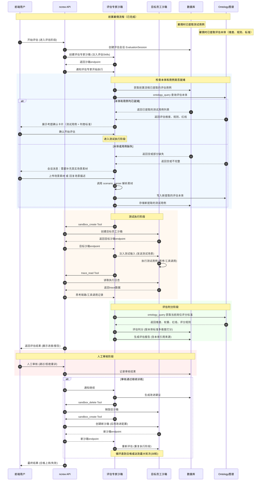

# 数字员工AI评估模块设计文档

> 版本: v0.8
> 日期: 2026-04-22
> 状态: 设计讨论中（评估专家驱动模式 + Ontology 知识图谱）

---

## 1. 项目背景

### 1.1 整体流程

```
员工雇佣申请 → 提交资料（员工模板切片、技能描述、真实工作案例场景）
    ↓
资料解析提取（雇佣流程）
    ├── 提取 Skill 配置 → 注入员工 Harness
    ├── 提取员工本体 → 员工专属知识图谱（上岗后使用）
    └── 提取评估本体 + 测试用例 → 评估知识图谱 + 用例库（评估时使用）
    ↓
雇佣完成 → AI评估（本模块）→ 人工评估 → 转正上岗
```

> **关键设计**：评估本体和测试用例在雇佣流程的资料解析阶段已完成提取。AI评估模块的职责是**检查和使用**这些已提取的标准，而非生成它们。

### 1.2 AI评估环节核心目标

自动评估数字员工在真实工作场景下的表现，判断其是否具备上岗能力。

### 1.3 Ontology 概念说明

> **本体（Ontology）** 是 ncrew 平台 Harness 架构的核心组件之一，基于知识图谱实现。详见 [ClawHub Ontology](https://clawhub.ai/oswalpalash/ontology)。

在评估场景中，本体分为两种：

| 本体类型 | 所属 | 用途 | 内容示例 |
|---------|------|------|---------|
| **员工本体** | 目标数字员工 | 员工上岗后做业务时参考 | 企业的业务规则、岗位操作知识、产品上下文、系统使用指南、企业特殊语境 |
| **评估本体** | 评估专家 | 评估专家评判员工是否合格 | 评估维度定义、评分规则、权重配置、一票否决项、行业标准 |

**类比**：员工本体 = 员工培训手册（怎么干活），评估本体 = 考试评分标准（干得好不好）。

两种本体的源头相同（来自用户上传的资料），但视角不同：
- SOP 文档 → 员工本体提取"SOP说先安抚用户"（告诉员工该怎么做）
- 同一 SOP → 评估本体提取"必须先安抚用户，否则交互质量扣分"（告诉评估专家该怎么判）

---

## 2. 需求分析

### 2.1 核心功能需求

| 需求项 | 描述 |
|-------|------|
| **场景解析** | 根据上传的真实工作案例（PDF/Word/TXT），自动解析生成标准化测试用例（输入参数 + 预期输出） |
| **调度执行** | 调用数字员工沙箱执行测试用例，捕获完整执行过程 |
| **结果评估** | 对比实际产出和预期标准，自动判断是否合格 |
| **本体检查** | 评估开始前检查评估本体和测试用例是否就绪，缺失时提示用户补充 |
| **标准可视化** | 评估开始前展示考题和判卷标准供用户确认，评估后报告中体现引用的评分依据 |
| **流程可视化** | 全流程节点和中间结果可视化，支持人工Review |
| **训练反馈** | 不合格时生成改进建议，触发重新训练，直到合格 |

### 2.2 典型应用场景示例

**客服数字员工评估场景：**

> 电商行业，处理用户申诉商品质量问题的场景。用户申请"某某商品质量有问题"，要求客服数字员工进行处理。

**预期解析输出：**
- **测试输入**：用户申诉内容
- **预期行为序列**：安抚用户 → 判断退换标准 → 决策退/换 → 登记工单
- **中间检查点**：语气友好度、工单调用成功、流程合规性
- **预期输出**：问题解决、用户满意

**执行过程捕获：**
- 思考链路（如何判断退换标准）
- 工具调用记录（查询商品、调用工单系统）
- 对话内容（语气、安抚效果）
- 最终结果

**评估维度：**
- 功能完整性（工单登记成功、决策正确）
- 交互质量（语气友好度、安抚效果）
- 流程合规（遵循标准流程）
- 问题解决（最终效果）

---

## 3. 技术架构设计

### 3.1 整体架构

> **核心设计理念**：评估流程由"评估专家"数字员工驱动执行，评估专家是平台内置的数字员工，通过其 Skills 和 Tools 来操控整个评估流程。

基于 ncrew 平台的 **数字员工 = Model + Harness** 架构，评估专家本质上是一个特殊的数字员工：

```
┌─────────────────────────────────────────────────────────────────────────────────┐
│                           ncrew 平台                                             │
├─────────────────────────────────────────────────────────────────────────────────┤
│                                                                                  │
│   ┌───────────────────────────────────────────────────────────────────────────┐ │
│   │                     评估专家数字员工 (内置)                                │ │
│   │                                                                           │ │
│   │   Harness 配置:                                                           │ │
│   │   ┌─────────────────┐  ┌─────────────────┐  ┌─────────────────────────┐  │ │
│   │   │     Skills      │  │     Tools       │  │   Ontology (评估图谱)    │  │ │
│   │   │                 │  │                 │  │                         │  │ │
│   │   │ • evaluation_   │  │ • sandbox_      │  │ 评估本体 (知识图谱)      │  │ │
│   │   │   orchestrator  │  │   create        │  │ ├── 评估维度定义         │  │ │
│   │   │                 │  │ • sandbox_      │  │ ├── 评分规则             │  │ │
│   │   │ • scenario_     │  │   delete        │  │ ├── 权重配置             │  │ │
│   │   │   parser        │  │ • sandbox_      │  │ ├── 一票否决项           │  │ │
│   │   │                 │  │   send_message  │  │ └── 行业标准             │  │ │
│   │   │ • test_         │  │ • trace_read    │  │                         │  │ │
│   │   │   executor      │  │ • document_     │  │ 来源: 雇佣流程资料解析   │  │ │
│   │   │                 │  │   parser        │  │ 存储: graph.jsonl       │  │ │
│   │   │ • evaluator     │  │ • evaluation_   │  │ 约束: schema.yaml       │  │ │
│   │   │                 │  │   report        │  │                         │  │ │
│   │   │ • training_     │  │ • ontology_     │  │                         │  │ │
│   │   │   advisor       │  │   query         │  │                         │  │ │
│   │   │                 │  │ • fetch_        │  │                         │  │ │
│   │   │                 │  │   testcases     │  │                         │  │ │
│   │   └─────────────────┘  └─────────────────┘  └─────────────────────────┘  │ │
│   │                                                                           │ │
│   └───────────────────────────────────────────────────────────────────────────┘ │
│                                    │                                            │
│                                    │ Tool 调用                                  │
│                                    ▼                                            │
│   ┌───────────────────────────────────────────────────────────────────────────┐ │
│   │                        ncrew 平台 API                                      │ │
│   │                                                                           │ │
│   │   ┌─────────────────┐  ┌─────────────────┐  ┌─────────────────────────┐  │ │
│   │   │ 沙箱生命周期管理 │  │ 执行过程采集    │  │ 评估会话管理            │  │ │
│   │   │                 │  │                 │  │                         │  │ │
│   │   │ • 创建沙箱      │  │ • 思考链路      │  │ • EvaluationSession     │  │ │
│   │   │ • 销毁沙箱      │  │ • 工具调用记录  │  │ • 评估进度追踪          │  │ │
│   │   │ • 发送消息      │  │ • 对话内容      │  │ • 结果持久化            │  │ │
│   │   │                 │  │ • 最终结果      │  │                         │  │ │
│   │   └─────────────────┘  └─────────────────┘  └─────────────────────────┘  │ │
│   │                                                                           │ │
│   └───────────────────────────────────────────────────────────────────────────┘ │
│                                    │                                            │
│                                    │ 沙箱管理                                    │
│                                    ▼                                            │
│   ┌───────────────────────────────────────────────────────────────────────────┐ │
│   │                     目标员工沙箱 (被评估对象)                               │ │
│   │                                                                           │ │
│   │   ┌───────────────────────────────────────────────────────────────────┐  │ │
│   │   │                     目标数字员工                                    │  │ │
│   │   │                                                                     │  │ │
│   │   │   Harness 配置: (雇佣时上传的员工模板)                              │  │ │
│   │   │   • Skills: 根据岗位配置的技能清单                                  │  │ │
│   │   │   • Tools: 根据岗位配置的工具权限                                   │  │ │
│   │   │   • Ontology: 员工专属的企业语境                                    │  │ │
│   │   │                                                                     │  │ │
│   │   │   执行测试用例:                                                     │  │ │
│   │   │   • 接收测试输入                                                    │  │ │
│   │   │   • 执行行为序列                                                    │  │ │
│   │   │   • 调用工具/Skills                                                 │  │ │
│   │   │   • 生成输出结果                                                    │  │ │
│   │   │                                                                     │  │ │
│   │   └───────────────────────────────────────────────────────────────────┘  │ │
│   │                                                                           │ │
│   └───────────────────────────────────────────────────────────────────────────┘ │
│                                                                                  │
└─────────────────────────────────────────────────────────────────────────────────┘
                                    │
                                    ▼
                          ┌────────────────────┐
                          │   训练反馈循环     │
                          │  (不合格时的流程)   │
                          │                   │
                          │  生成改进建议      │
                          │       ↓           │
                          │  触发重新训练(人工)│ ← 需人工审核后执行
                          │       ↓           │
                          │  重新评估         │
                          │       ↓           │
                          │  合格 → 结束      │
                          │  不合格 → 轨次+1  │
                          │       ↓           │
                          │  轮次≥30 → 停止   │ ← 达到最大轮次限制
                          └────────────────────┘

**评估专家数字员工设计要点：**

| 设计要素 | 说明 |
|---------|------|
| **角色定位** | 平台内置的数字员工，专门负责评估其他数字员工的工作表现 |
| **Harness 结构** | 与普通数字员工完全一致，只是 Skills 和 Tools 专为评估设计 |
| **Skills** | 5 个评估类 Skill：编排器、场景解析、测试执行、评估判分、训练建议 |
| **Tools** | 7 个管控类 Tool：沙箱管理、执行采集、报告生成、本体查询等 |
| **Ontology** | 评估本体（知识图谱），包含评估维度、评分规则、权重、一票否决项、行业标准 |
| **生命周期** | 每次雇佣流程启动时，平台自动为评估专家创建专属沙箱 |

**评估专家与普通数字员工的对比：**

| 对比维度 | 评估专家数字员工 | 普通数字员工 |
|---------|----------------|-------------|
| 创建时机 | 用户点击"开始雇佣"时，平台自动创建 | 用户主动创建沙箱时创建 |
| Skills 来源 | 平台内置，不可修改 | 用户上传员工模板时配置 |
| Tools 权限 | 可管理其他员工沙箱（元级权限） | 只能操作业务系统 |
| Ontology | 评估本体（知识图谱：维度、规则、标准） | 员工本体（知识图谱：业务规则、岗位知识） |
| 沙箱生命周期 | 评估完成后自动销毁 | 用户手动管理 |
| 工作对象 | 其他数字员工（被评估者） | 业务任务（用户请求） |

**训练反馈循环机制设计：**

| 配置项 | 说明 | 默认值 | 可配置 |
|-------|------|-------|-------|
| 最大训练轮次 | 系统预设的最大重试次数 | 30轮 | 是，雇佣时可配置 |
| 当前轮次计数器 | 记录已执行的评估-训练轮次 | 0 | 系统自动更新 |
| 停止条件 | 达到最大轮次后停止训练 | 强制停止 | 否 |
| 人工审核节点 | 每次重新训练前需人工确认 | 必须 | 否 |

```json
{
  "training_feedback_loop": {
    "max_iterations": 30,
    "current_iteration": 0,
    "status": "running",
    "manual_review_required": true,
    "manual_review_status": "pending",
    "stop_conditions": {
      "success": "评估合格，退出循环",
      "max_reached": "达到最大轮次(30轮)，停止训练，标记为训练失败",
      "manual_abort": "人工手动终止训练"
    },
    "iteration_history": [
      {
        "iteration": 1,
        "evaluation_score": 65,
        "is_passed": false,
        "improvement_suggestions": [...],
        "manual_review": {
          "reviewed_by": "admin",
          "review_time": "2026-04-18T15:30:00Z",
          "decision": "approved",
          "comment": "同意按建议进行训练"
        },
        "training_time": "2小时",
        "training_result": "completed"
      }
    ]
  }
}
```

**最大轮次达到后的处理流程：**

1. **系统自动标记**：该数字员工训练状态变更为"训练失败"
2. **通知相关人员**：发送通知给管理员和申请者
3. **提供分析报告**：生成详细的训练过程分析报告，包括每轮的问题和尝试
4. **人工决策选项**：
   - 放弃该数字员工
   - 重置训练，从零开始（重新分析资料，生成新的测试用例）
   - 人工介入进行针对性调优
```

### 3.1.1 评估本体（Evaluation Ontology）Schema 定义

> **设计说明**：评估本体基于 [ClawHub Ontology](https://clawhub.ai/oswalpalash/ontology) 规范实现，存储为 `graph.jsonl`（追加写入的实体/关系日志），通过 `schema.yaml` 做约束校验。评估专家通过 `ontology_query` Tool 查询图谱获取当前岗位的评分标准。

**Schema 定义（`schema.yaml`）：**

```yaml
types:
  # === 岗位类型 ===
  RoleType:
    required: [name, industry]
    properties:
      name: string           # "customer_service" / "production_planner" / ...
      industry: string       # "ecommerce" / "manufacturing" / ...
      description: string

  # === 评估维度 ===
  EvaluationDimension:
    required: [name, definition, weight, threshold]
    properties:
      name: string           # "functional_completeness" / "interaction_quality" / ...
      definition: string     # 维度定义描述
      weight: float          # 0.0 ~ 1.0，所有维度权重之和应为 1.0
      threshold: int         # 该维度的合格线（默认 60 分）
      scoring_rules: list    # [{score_range: "90-100", criteria: "..."}]
      check_items: list      # ["开场安抚", "同理心表达", ...]

  # === 评分规则 ===
  ScoringRule:
    required: [score_range, criteria]
    properties:
      score_range: string    # "90-100" / "70-80" / "40-60" / "0-30"
      criteria: string       # 该分数段的判定标准描述
      examples: list         # 正例/反例

  # === 一票否决项 ===
  CriticalRequirement:
    required: [name, reason]
    properties:
      name: string           # "必须创建工单"
      reason: string         # "工单创建是合规底线"
      source: string         # 来自哪个 SOP/规范
      severity: string       # "critical"

  # === 行业/岗位标准 ===
  Standard:
    required: [name, category, content]
    properties:
      name: string           # "工单登记规范"
      category: string       # "compliance" / "process" / "quality"
      content: string        # 标准内容描述
      severity: string       # "critical" / "high" / "medium"

relations:
  has_dimension:
    from_types: [RoleType]
    to_types: [EvaluationDimension]
    cardinality: one_to_many

  has_standard:
    from_types: [RoleType]
    to_types: [Standard]
    cardinality: one_to_many

  has_critical_requirement:
    from_types: [RoleType]
    to_types: [CriticalRequirement]
    cardinality: one_to_many

  has_scoring_rule:
    from_types: [EvaluationDimension]
    to_types: [ScoringRule]
    cardinality: one_to_many
```

**Graph 数据示例（客服岗位）：**

```jsonl
{"op":"create","entity":{"id":"role_cs_001","type":"RoleType","properties":{"name":"customer_service","industry":"ecommerce","description":"电商行业客服专员"}}}
{"op":"create","entity":{"id":"dim_func","type":"EvaluationDimension","properties":{"name":"functional_completeness","definition":"完成所有必要功能步骤","weight":0.25,"threshold":60,"check_items":["预期行为序列中每个步骤是否执行","最终输出是否符合预期","是否创建了必要产出物"]}}}
{"op":"create","entity":{"id":"dim_interact","type":"EvaluationDimension","properties":{"name":"interaction_quality","definition":"与用户/相关方的沟通是否专业、友好","weight":0.30,"threshold":60,"check_items":["开场是否有安抚/问候","是否表达同理心","是否主动告知后续流程","是否闭环确认用户满意度"]}}}
{"op":"create","entity":{"id":"dim_process","type":"EvaluationDimension","properties":{"name":"process_compliance","definition":"是否遵循标准操作流程","weight":0.15,"threshold":60}}}
{"op":"create","entity":{"id":"dim_problem","type":"EvaluationDimension","properties":{"name":"problem_resolution","definition":"最终是否有效解决了用户问题","weight":0.20,"threshold":60}}}
{"op":"create","entity":{"id":"dim_tool","type":"EvaluationDimension","properties":{"name":"tool_call_correctness","definition":"是否正确调用了预期应该调用的工具","weight":0.10,"threshold":0}}}
{"op":"create","entity":{"id":"critical_ticket","type":"CriticalRequirement","properties":{"name":"必须创建工单","reason":"工单创建是合规底线","source":"客服SOP第3条","severity":"critical"}}}
{"op":"create","entity":{"id":"rule_func_90","type":"ScoringRule","properties":{"score_range":"90-100","criteria":"所有必要步骤完成，结果正确"}}}
{"op":"create","entity":{"id":"rule_func_70","type":"ScoringRule","properties":{"score_range":"70-80","criteria":"缺少非关键步骤，但结果基本正确"}}}
{"op":"create","entity":{"id":"rule_func_40","type":"ScoringRule","properties":{"score_range":"40-60","criteria":"缺少关键步骤，结果不完整"}}}
{"op":"create","entity":{"id":"rule_func_0","type":"ScoringRule","properties":{"score_range":"0-30","criteria":"核心功能未实现"}}}
{"op":"relate","from":"role_cs_001","rel":"has_dimension","to":"dim_func"}
{"op":"relate","from":"role_cs_001","rel":"has_dimension","to":"dim_interact"}
{"op":"relate","from":"role_cs_001","rel":"has_dimension","to":"dim_process"}
{"op":"relate","from":"role_cs_001","rel":"has_dimension","to":"dim_problem"}
{"op":"relate","from":"role_cs_001","rel":"has_dimension","to":"dim_tool"}
{"op":"relate","from":"role_cs_001","rel":"has_critical_requirement","to":"critical_ticket"}
{"op":"relate","from":"dim_func","rel":"has_scoring_rule","to":"rule_func_90"}
{"op":"relate","from":"dim_func","rel":"has_scoring_rule","to":"rule_func_70"}
{"op":"relate","from":"dim_func","rel":"has_scoring_rule","to":"rule_func_40"}
{"op":"relate","from":"dim_func","rel":"has_scoring_rule","to":"rule_func_0"}
```

**Graph 数据示例（排产员岗位）：**

```jsonl
{"op":"create","entity":{"id":"role_pp_001","type":"RoleType","properties":{"name":"production_planner","industry":"manufacturing","description":"制造业排产员"}}}
{"op":"create","entity":{"id":"dim_pp_func","type":"EvaluationDimension","properties":{"name":"functional_completeness","definition":"完成所有排产计划步骤","weight":0.40,"threshold":60}}}
{"op":"create","entity":{"id":"dim_pp_accuracy","type":"EvaluationDimension","properties":{"name":"accuracy","definition":"排产结果准确无误","weight":0.30,"threshold":70}}}
{"op":"create","entity":{"id":"dim_pp_timeliness","type":"EvaluationDimension","properties":{"name":"timeliness","definition":"方案交付及时性","weight":0.30,"threshold":60}}}
{"op":"relate","from":"role_pp_001","rel":"has_dimension","to":"dim_pp_func"}
{"op":"relate","from":"role_pp_001","rel":"has_dimension","to":"dim_pp_accuracy"}
{"op":"relate","from":"role_pp_001","rel":"has_dimension","to":"dim_pp_timeliness"}
```

> **注意**：不同岗位的评估本体是完全独立的子图。客服有"交互质量"维度，排产员没有。评估专家通过查询 `RoleType → has_dimension → EvaluationDimension` 获取当前岗位的评分标准，Skill 代码本身不包含任何硬编码的评分规则。

### 3.1.2 关键流程时序（评估专家驱动模式）

> **设计理念**：评估流程由"评估专家"数字员工驱动执行，评估专家通过 Tool 调用平台 API 来操控目标员工沙箱。
>
> **重要改动**：评估本体和测试用例的来源**前置到雇佣流程**中已完成提取。评估阶段首先检查本体和用例是否就绪，就绪时展示给用户确认后开始评估，缺失时提示用户补充。



**流程步骤说明：**

| 步骤 | 触发方 | 说明 |
|------|--------|------|
| 前置 | 雇佣流程 | 雇佣时解析员工资料，提取员工本体、评估本体和测试用例 |
| 1 | 前端用户 | 点击"开始评估"，进入评估阶段 |
| 2 | ncrew API | 创建 `EvaluationSession` 记录，关联员工模板 |
| 3 | ncrew API | 为评估专家创建专属沙箱，注入评估类 Skills |
| 4 | ncrew API | 通过 WebSocket 通知评估专家开始执行评估流程 |
| 5 | 评估专家 | 通过 `fetch_testcases` 获取前置流程已提取的评估用例 |
| 5b | 评估专家 | 通过 `ontology_query` 查询评估本体图谱，获取评分标准 |
| 6a | 图谱+DB | 若本体和用例均已就绪 → 展示考题确认卡片，等待用户确认 |
| 6a' | 前端用户 | 查看考题和判卷标准，确认后开始评估 |
| 6b | 评估专家 | 若本体或用例缺失 → 在会话中提示用户补充资料 |
| 6c | 前端用户 | 上传场景素材或回复场景描述 |
| 6d | 评估专家 | 调用 `scenario_parser` 解析素材，提取本体和用例并存入图谱/数据库 |
| 7 | 评估专家 | 通过 `sandbox_create` Tool 创建目标员工沙箱 |
| 8 | 评估专家 | 向目标员工发送测试场景输入 |
| 9 | 评估专家 | 通过 `trace_read` Tool 捕获目标员工的执行过程 |
| 10 | 评估专家 | 通过 `ontology_query` 获取评分标准，按标准多维度评估判分 |
| 11 | 评估专家 | 生成评估报告（含本体引用来源），持久化到数据库 |
| 12 | ncrew API | 返回评估结果给前端展示 |
| 13 | 前端用户 | 人工审核节点，决定是否允许继续训练 |
| 14 | ncrew API | 审核通过后，通知评估专家继续 |
| 15 | 评估专家 | 根据评估结果生成改进建议 |
| 16 | 评估专家 | 清理旧的目标员工沙箱 |
| 17 | 评估专家 | 创建新的目标员工沙箱，应用改进配置 |
| 18 | 评估专家 | 重新执行评估流程 |
| 19 | ncrew API | 最终结果：合格上岗或训练失败 |

**评估专家所需 Tool 权限：**

| Tool | 权限说明 |
|------|---------|
| `sandbox_create` | 创建目标员工沙箱，指定员工模板配置 |
| `sandbox_delete` | 销毁目标员工沙箱 |
| `sandbox_send_message` | 向目标员工沙箱发送测试输入 |
| `trace_read` | 读取目标员工执行过程（思考链路、工具调用、对话内容） |
| `document_parser` | 解析上传的素材文件（PDF/Word/TXT） |
| `evaluation_report` | 生成/更新评估报告 |
| `ontology_query` | 查询评估本体图谱，获取维度、评分规则、权重、红线、行业标准 |
| `fetch_testcases` | 获取前置雇佣流程已提取的测试用例 |

### 3.2 评估专家的 Skills 设计

> **核心变化**：原本的"三Agent架构"现在整合为评估专家数字员工的 4 个 Skills。每个 Skill 是评估专家 Harness 中的能力单元，评估专家通过调用这些 Skills 完成评估流程。

#### 3.2.1 场景解析 Skill (scenario_parser)

**所属：** 评估专家数字员工的 Skill

**职责：** 根据员工模板、行为准则和上传的场景素材，生成结构化测试用例 **和评估本体**。

> **重要改动**：scenario_parser 现在同时提取两类内容：
> 1. **测试用例** → 存入数据库
> 2. **评估本体** → 存入知识图谱（graph.jsonl）
>
> 主要在雇佣流程的资料解析阶段调用。评估流程中仅在用户补充缺失资料时才会调用。

**Skill 配置示例：**

```yaml
---
name: scenario_parser
version: 1.0.0
category: evaluation
ontology_refs:
  - concept: "test_case_generation"
    action: "parse"
  - concept: "evaluation_ontology_extraction"
    action: "generate"
tools_required:
  - document_parser
memory_access: read_write
execution_mode: single_pass
---

# 场景解析 Skill

## 目标
根据上传的员工资料和场景素材，同时生成：
1. 结构化的测试用例
2. 评估本体图谱实体（维度、规则、红线、标准）

## 输入来源
通过 `document_parser` Tool 读取：
- 岗位描述 → 提取 RoleType 实体
- SOP/操作规范 → 提取 EvaluationDimension、ScoringRule、CriticalRequirement、Standard 实体
- 真实工作案例 → 提取测试用例
- 优秀/失败案例 → 提取评分标杆（ScoringRule 的示例）

## 输出格式

### 1. 测试用例输出

```json
{
  "test_case_id": "TC-001",
  "scenario_name": "电商商品质量申诉处理",
  "input": {
    "user_request": "用户申请，某某商品质量有问题",
    "context": {
      "product_info": {...},
      "user_history": {...}
    }
  },
  "expected_behavior_sequence": [
    {"step": 1, "action": "安抚用户", "criteria": "语气友好，表达歉意"},
    {"step": 2, "action": "判断退换标准", "criteria": "查询商品信息，判断是否符合退换条件"},
    {"step": 3, "action": "决策处理方式", "criteria": "根据规则决策退货/换货/拒绝"},
    {"step": 4, "action": "登记工单", "criteria": "调用工单系统，记录处理结果"}
  ],
  "expected_output": {
    "resolution": "问题解决",
    "user_satisfaction": "用户满意",
    "ticket_created": true
  },
  "evaluation_criteria": [
    {"dimension": "功能完整性", "weight": 0.25, "description": "工单登记成功，决策正确"},
    {"dimension": "交互质量", "weight": 0.30, "description": "语气友好度，安抚效果"},
    {"dimension": "流程合规", "weight": 0.15, "description": "遵循标准流程"},
    {"dimension": "问题解决", "weight": 0.30, "description": "最终效果"},
    {"dimension": "工具调用正确性", "weight": "dynamic", "description": "正确调用预期工具"}
  ]
}
```

## 执行步骤
1. 使用 `document_parser` Tool 读取素材文件
2. 分析素材内容，提取关键场景要素
3. 结合员工模板和行为准则，生成预期行为序列
4. 根据场景特征，动态生成评估维度和权重
5. 输出结构化测试用例，存入评估会话上下文

## 注意事项
- 评估维度和权重由 LLM 根据素材内容动态生成，非固定配置
- 工具调用正确性维度必须包含，权重根据场景中预期工具调用次数动态计算
- 输出的测试用例需要存入评估会话上下文，供后续 Skills 使用
```

**依赖的 Tool：** `document_parser`

**实现要点：**
- 使用 LLM 进行场景理解，Prompt 需要包含员工模板和行为准则上下文
- 输出必须是结构化的测试用例，便于后续自动化执行
- 支持多种场景类型（客服、开发、数据分析等）

#### 3.2.2 测试执行 Skill (test_executor)

**所属：** 评估专家数字员工的 Skill

**职责：** 通过调用平台 Tools，管理目标员工沙箱的生命周期，执行测试用例。

**Skill 配置示例：**

```yaml
---
name: test_executor
version: 1.0.0
category: evaluation
ontology_refs:
  - concept: "sandbox_management"
    action: "execute"
tools_required:
  - sandbox_create
  - sandbox_delete
  - sandbox_send_message
  - trace_read
memory_access: read_write
execution_mode: sequential
---

# 测试执行 Skill

## 目标
创建目标员工沙箱，注入测试用例，捕获完整执行过程。

## 执行步骤

### 步骤 1: 创建目标员工沙箱
调用 `sandbox_create` Tool：
```json
{
  "employee_template_id": "TPL-001",
  "evaluation_session_id": "EVAL-001",
  "sandbox_config": {
    "resource_limits": { "cpu": "500m", "memory": "1Gi" },
    "timeout_seconds": 300,
    "mock_mode": "auto"  // 自动判断是否需要 Mock
  }
}
```

Tool 返回：
```json
{
  "sandbox_id": "SB-TARGET-001",
  "gateway_endpoint": "10.0.0.5:18789",
  "status": "running"
}
```

### 步骤 2: 注入测试输入
调用 `sandbox_send_message` Tool：
```json
{
  "sandbox_id": "SB-TARGET-001",
  "message": {
    "role": "user",
    "content": "用户申请，某某商品质量有问题"
  }
}
```

### 步骤 3: 捕获执行过程
调用 `trace_read` Tool：
```json
{
  "sandbox_id": "SB-TARGET-001",
  "trace_types": ["thought", "tool_call", "message", "state_change"],
  "duration_seconds": 60
}
```

Tool 返回完整执行轨迹：
```json
{
  "execution_trace": {
    "logs": [
      {"type": "thought", "timestamp": "...", "content": "..."},
      {"type": "tool_call", "timestamp": "...", "tool_name": "query_product", "..."},
      {"type": "message", "timestamp": "...", "role": "assistant", "content": "..."}
    ],
    "summary": {
      "total_tool_calls": 3,
      "success_rate": 0.67,
      "execution_time_seconds": 45
    }
  }
}
```

### 步骤 4: 清理沙箱（评估完成后）
调用 `sandbox_delete` Tool：
```json
{
  "sandbox_id": "SB-TARGET-001",
  "preserve_logs": true
}
```

## 故障处理
- 沙箱创建失败：记录错误，通知人工决策
- 沙箱超时：调用 `sandbox_delete` 清理，生成超时报告
- 沙箱崩溃：记录崩溃日志，通知人工决策

## Mock 模式支持
当 `mock_mode: true` 时，跳过沙箱创建，直接生成模拟执行结果。
```

**依赖的 Tools：** `sandbox_create`, `sandbox_delete`, `sandbox_send_message`, `trace_read`

**关键数据结构：**

```json
{
  "execution_task": {
    "task_id": "ET-001",
    "test_case_id": "TC-001",
    "employee_id": "EMP-001",
    "status": "running",
    "sandbox_id": "SB-TARGET-001",
    "mock_mode": false,
    "timeouts": {
      "step_timeout_seconds": 30,
      "total_timeout_seconds": 300
    },
    "execution_trace": {...}
  }
}
    },
    "progress": {
      "current_step": 3,
      "total_steps": 4,
      "current_action": "登记工单"
    },
    "logs": [...]
  }
}
#### 3.2.3 评估判分 Skill (evaluator)

**所属：** 评估专家数字员工的 Skill

**职责：** 根据测试用例、执行过程和从评估本体图谱查询到的评分标准，自动评估目标员工的表现。

**Skill 配置示例：**

```yaml
---
name: evaluator
version: 1.0.0
category: evaluation
ontology_refs:
  - concept: "evaluation_ontology"
    action: "query"
  - concept: "employee_assessment"
    action: "evaluate"
tools_required:
  - ontology_query
  - evaluation_report
memory_access: read_write
execution_mode: single_pass
---

# 评估判分 Skill

## 目标
根据测试用例和执行过程，查询评估本体图谱获取评分标准，按标准多维度评估目标员工表现，生成评分和判定结果。

## 输入来源
- 测试用例（由前置雇佣流程或 scenario_parser Skill 生成）
- 执行过程（由 test_executor Skill 通过 trace_read Tool 采集）
- **评估本体（通过 ontology_query Tool 从知识图谱查询获取）**

## 评分标准来源

> **关键改动**：评估维度、权重、评分规则、一票否决项不再硬编码在 Skill 中，而是通过 `ontology_query` Tool 从评估本体图谱动态查询。

评估专家在判分前，调用 ontology_query 获取：
1. **评估维度**：查询 `RoleType → has_dimension → EvaluationDimension`
2. **评分规则**：查询每个维度的 `EvaluationDimension → has_scoring_rule → ScoringRule`
3. **一票否决项**：查询 `RoleType → has_critical_requirement → CriticalRequirement`
4. **行业/岗位标准**：查询 `RoleType → has_standard → Standard`

不同岗位查询结果不同：客服有"交互质量"维度，排产员没有——Skill 代码无需修改。

## 输出格式

### 评估结果输出
调用 `evaluation_report` Tool 生成评估报告：

```json
{
  "overall_score": 85,
  "dimension_scores": {
    "functional_completeness": 90,
    "interaction_quality": 82,
    "process_compliance": 88,
    "problem_resolution": 80,
    "tool_call_correctness": 95
  },
  "is_passed": true,
  "pass_criteria": {
    "overall_threshold": 70,
    "per_dimension_threshold": 60,
    "all_dimensions_passed": true
  },
  "ontology_source": {
    "role_type_id": "role_cs_001",
    "role_name": "customer_service",
    "dimensions_queried": [
      {"id": "dim_func", "name": "functional_completeness", "weight": 0.25},
      {"id": "dim_interact", "name": "interaction_quality", "weight": 0.30},
      {"id": "dim_process", "name": "process_compliance", "weight": 0.15},
      {"id": "dim_problem", "name": "problem_resolution", "weight": 0.20},
      {"id": "dim_tool", "name": "tool_call_correctness", "weight": 0.10}
    ],
    "critical_requirements_queried": [
      {"id": "critical_ticket", "name": "必须创建工单"}
    ],
    "query_timestamp": "2026-04-22T10:30:00Z"
  },
  "critical_issues": [],
  "improvement_suggestions": [],
  "manual_review": {
    "required": true,
    "ai_decision": "passed",
    "status": "pending"
  }
}
```

## 核心设计原则

### 1. Generator-Evaluator 分离
- 评估专家（Evaluator）必须独立于目标员工（Generator）
- 避免自我评估偏差

### 2. Evaluator 调优为"怀疑者"
- Prompt 要求 Evaluator 批判性地审视目标员工工作
- 使用 Few-shot 示例校准判断标准

### 3. 工具调用正确性维度
- **遗漏必须调用**：该维度直接判为不合格（0分）
- **时机错误**：根据影响程度扣分
- **参数错误**：根据错误严重程度扣分

## 人工介入与 Override 机制

| 场景 | AI判定 | 人工操作 | 最终结果 |
|-----|-------|---------|---------|
| AI说合格，人工同意 | 通过 | 确认 | 通过 |
| AI说合格，人工打回 | 通过 | Override → 不通过 | 不通过 |
| AI说不合格，人工同意 | 不通过 | 确认 | 不通过 |
| AI说不合格，人工放行 | 不通过 | Override → 通过 | 通过 |
```

**依赖的 Tool：** `evaluation_report`

#### 3.2.4 训练建议 Skill (training_advisor)

**所属：** 评估专家数字员工的 Skill

**职责：** 当评估不合格时，生成具体的改进建议，触发训练反馈循环。

**Skill 配置示例：**

```yaml
---
name: training_advisor
version: 1.0.0
category: evaluation
ontology_refs:
  - concept: "training_feedback"
    action: "generate"
tools_required:
  - evaluation_report
memory_access: read_write
execution_mode: single_pass
---

# 训练建议 Skill

## 触发条件
评估结果 `is_passed: false` 时触发执行。

## 目标
分析评估失败原因，生成具体可落地的改进建议。

## 输出格式

```json
{
  "improvement_suggestions": {
    "summary": "主要问题在于交互质量和流程合规方面",
    "detailed_suggestions": [
      {
        "suggestion_id": "SUG-001",
        "dimension": "interaction_quality",
        "issue": "语气过于生硬，缺乏同理心",
        "example": {
          "actual": "'根据规定，您的商品符合退换条件'",
          "expected": "'非常理解您的困扰，这种情况确实让人着急，我马上为您处理退换'"
        },
        "modification_type": "prompt_enhancement",
        "modification_content": {
          "before": "你是一个客服专员，负责处理用户申诉。",
          "after": "你是一个客服专员，负责处理用户申诉。你需要使用同理心表达，如'我理解您的感受'、'这确实让人困扰'。"
        },
        "expected_improvement": "交互质量维度提升至60分以上"
      },
      {
        "suggestion_id": "SUG-002",
        "dimension": "tool_call_correctness",
        "issue": "遗漏了必须的工单登记步骤",
        "modification_type": "few_shot_example",
        "modification_content": {
          "example_added": {
            "user": "我的商品质量有问题",
            "assistant_response": "马上为您处理...",
            "tool_calls": [
              {"tool": "query_product", "parameters": {...}},
              {"tool": "create_ticket", "parameters": {...}}
            ]
          }
        },
        "expected_improvement": "工具调用正确性维度提升"
      }
    ],
    "priority": "high",
    "estimated_retraining_time": "2-3小时"
  },
  "manual_review": {
    "required": true,
    "status": "pending",
    "options": ["confirm_apply", "adjust_suggestions", "skip_iteration", "abort_training"]
  }
}
```

## 训练反馈循环

```
评估不合格 → 生成改进建议 → 人工审核 → 应用修改 → 创建新沙箱 → 重新评估
    ↑                                                          │
    │                                                          │
    └──────────────────────────────────────────────────────────┘
    
    最多 30 轮循环
    达到 30 轮后自动停止，标记为"训练失败"
```

## 版本控制
每轮训练的修改必须完整记录：
- 修改前后的 prompt/few-shot 差异
- 修改原因和预期效果
- 实际效果（下一轮评估结果）
```

**依赖的 Tool：** `evaluation_report`

#### 3.2.5 评估专家的 Tools 设计

> **核心能力**：评估专家通过 Tools 与平台 API 交互，实现对目标员工沙箱的管控。

| Tool 名称 | 调用平台 API | 功能说明 |
|----------|-------------|---------|
| `sandbox_create` | `POST /api/sandboxes` | 创建目标员工沙箱，指定员工模板配置 |
| `sandbox_delete` | `DELETE /api/sandboxes/{id}` | 销毁目标员工沙箱，保留日志 |
| `sandbox_send_message` | WebSocket | 向目标员工沙箱发送测试输入消息 |
| `trace_read` | `GET /api/sandboxes/{id}/trace` | 读取目标员工执行过程（思考链路、工具调用、对话内容） |
| `document_parser` | 内置服务 | 解析上传的素材文件（PDF/Word/TXT） |
| `evaluation_report` | `POST /api/evaluations/{id}/report` | 生成/更新评估报告，持久化到数据库 |
| `ontology_query` | `GET /api/ontology/query` | 查询评估本体图谱，获取当前岗位的维度、评分规则、权重、红线、行业标准 |
| `fetch_testcases` | `GET /api/evaluations/{id}/testcases` | 获取前置雇佣流程已提取的测试用例 |

**ontology_query Tool 详细设计：**

```json
// 查询请求示例
{
  "role_type": "customer_service",
  "query_type": "evaluation_standards",
  "include": ["dimensions", "scoring_rules", "critical_requirements", "standards"]
}

// 查询响应示例
{
  "role_type": {
    "id": "role_cs_001",
    "name": "customer_service",
    "industry": "ecommerce"
  },
  "dimensions": [
    {
      "id": "dim_func",
      "name": "functional_completeness",
      "weight": 0.25,
      "threshold": 60,
      "check_items": ["预期行为序列中每个步骤是否执行", "最终输出是否符合预期"]
    },
    {
      "id": "dim_interact",
      "name": "interaction_quality",
      "weight": 0.30,
      "threshold": 60,
      "check_items": ["开场是否有安抚/问候", "是否表达同理心"]
    }
  ],
  "critical_requirements": [
    {
      "id": "critical_ticket",
      "name": "必须创建工单",
      "reason": "工单创建是合规底线",
      "severity": "critical"
    }
  ],
  "standards": [...]
}
```

**Tool 权限控制：**

评估专家的 Tools 拥有"元级权限"——可以管理其他员工的沙箱。这是与普通数字员工的关键区别：

```json
{
  "evaluator_tools_permissions": {
    "sandbox_create": {
      "scope": "target_employee_only",
      "constraint": "只能为当前评估会话创建目标员工沙箱"
    },
    "sandbox_delete": {
      "scope": "target_employee_only",
      "constraint": "只能删除当前评估会话的目标员工沙箱"
    },
    "trace_read": {
      "scope": "target_employee_only",
      "constraint": "只能读取当前评估会话的目标员工执行过程"
    },
    "evaluation_report": {
      "scope": "current_session_only",
      "constraint": "只能为当前评估会话生成报告"
    }
  }
}
```

**执行过程采集详情：**

通过 `trace_read` Tool 采集的数据结构：

```json
{
  "execution_trace": {
    "sandbox_id": "SB-TARGET-001",
    "collection_time": "2026-04-21T10:30:00Z",
    
    "logs": [
      {
        "type": "thought",
        "timestamp": "2026-04-21T10:30:05Z",
        "content": "用户情绪激动，需要先安抚，再处理问题。",
        "reasoning_path": ["识别情绪 → 安抚优先 → 问题处理"]
      },
      {
        "type": "tool_call",
        "timestamp": "2026-04-21T10:30:15Z",
        "tool_name": "query_product_info",
        "parameters": {"product_id": "PROD-12345"},
        "result": {"return_eligible": true},
        "duration_ms": 120,
        "success": true
      },
      {
        "type": "message",
        "timestamp": "2026-04-21T10:30:20Z",
        "role": "assistant",
        "content": "您好，非常理解您的困扰...",
        "tone_analysis": {"friendliness": 9, "empathy": 9, "professionalism": 8}
      }
    ],
    
    "summary": {
      "total_thoughts": 3,
      "total_tool_calls": 2,
      "total_messages": 4,
      "success_rate": 1.0,
      "execution_time_seconds": 45
    }
  }
}
```

**关键挑战：**

沙箱是否支持执行过程采集，取决于 ncrew 平台的 Gateway 实现。可能的方式：

1. **原生支持**：Gateway 提供事件订阅接口（最理想）
2. **日志解析**：Gateway 输出结构化日志，平台解析
3. **WebSocket 监听**：平台监听 Gateway 的 WebSocket 消息流

### 3.2.6 评估报告格式（evaluation_report Tool 输出）

> **说明**：评估报告由评估专家通过 `evaluation_report` Tool 生成，调用平台 API 持久化到数据库。

**报告内容示例：**

```markdown
# 数字员工评估报告

## 基本信息
- 员工ID: EMP-001
- 员工类型: 客服专员
- 测试场景: 电商商品质量申诉处理
- 评估时间: 2026-04-18 14:30:00
- 评估时长: 5分32秒

## 评估标准来源

> 本次评估依据前置雇佣流程资料解析生成的评估本体进行判分。

| 标准项 | 来源 |
|--------|------|
| 评估维度（5个） | 评估本体图谱 `role_cs_001` |
| 权重配置 | 评估本体图谱 `EvaluationDimension` |
| 评分规则 | 评估本体图谱 `ScoringRule` |
| 一票否决项 | 评估本体图谱 `CriticalRequirement`：必须创建工单 |

## 综合评估结果

### 总体评分: 85/100 ⭐⭐⭐⭐☆
### 评估结果: ✅ 合格

## 详细评分

| 评估维度 | 权重 | 得分 | 合格线 | 状态 | 标准（来自本体） |
|---------|------|------|--------|------|----------------|
| 功能完整性 | 25% | 90 | 60 | ✅ 优秀 | dim_func |
| 交互质量 | 30% | 82 | 60 | ✅ 良好 | dim_interact |
| 流程合规 | 15% | 88 | 60 | ✅ 优秀 | dim_process |
| 问题解决 | 20% | 80 | 60 | ✅ 良好 | dim_problem |
| 工具调用正确性 | 10% | 95 | 动态 | ✅ 优秀 | dim_tool |

## 执行过程详情

### 测试用例输入
```
用户申请，某某商品质量有问题
```

### 预期行为序列
1. ✅ 安抚用户（语气友好，表达歉意）
2. ✅ 判断退换标准（查询商品信息，判断是否符合退换条件）
3. ✅ 决策处理方式（根据规则决策退货/换货/拒绝）
4. ✅ 登记工单（调用工单系统，记录处理结果）

### 执行过程记录

#### Step 1: 安抚用户
**时间**: 0:00:15
**动作**: 发送安抚消息
**内容**:
```
您好，非常理解您的困扰，商品出现质量问题确实让人着急。我是您的专属客服，马上为您处理这个问题，请您放心。
```
**语气分析**:
- 友好度: 9/10 ✅
- 同理心: 9/10 ✅
- 专业性: 8/10 ✅

#### Step 2: 判断退换标准
**时间**: 0:00:45
**动作**: 查询商品信息
**工具调用**:
```json
{
  "tool": "query_product_info",
  "input": {
    "product_id": "PROD-12345"
  },
  "output": {
    "product_name": "某某商品",
    "purchase_date": "2026-03-15",
    "warranty_status": "valid",
    "return_eligible": true
  },
  "duration_ms": 120
}
```
**判断结果**: 符合退换条件 ✅

#### Step 3: 决策处理方式
**时间**: 0:01:30
**动作**: 决策退货退款
**思考过程**:
```
根据查询结果：
1. 商品在保修期内
2. 用户反馈质量问题属实
3. 用户情绪激动，需要快速解决

决策：走退货退款流程，给用户全额退款，安抚情绪。
```
**决策正确性**: ✅ 正确

#### Step 4: 登记工单
**时间**: 0:02:15
**动作**: 调用工单系统
**工具调用**:
```json
{
  "tool": "create_ticket",
  "input": {
    "user_id": "USER-67890",
    "product_id": "PROD-12345",
    "issue_type": "quality_problem",
    "resolution": "refund",
    "amount": 299.00
  },
  "output": {
    "ticket_id": "WO-20260418-001",
    "status": "created",
    "estimated_refund_time": "3个工作日"
  },
  "duration_ms": 350
}
```
**工单创建**: ✅ 成功

### 最终处理结果
- **用户问题**: ✅ 已解决
- **用户满意度**: ✅ 满意
- **工单号**: WO-20260418-001
- **预计退款时间**: 3个工作日

## 评估分析

### 优势 ✅
1. **功能完整性优秀**: 所有必要步骤都正确执行，工单成功创建
2. **流程合规优秀**: 严格按照标准流程处理，无违规操作
3. **交互质量良好**: 语气友好，同理心强，有效安抚了用户情绪

### 待改进 ⚠️
1. **交互质量还有提升空间**:
   - 在解释退换政策时，可以更加详细说明退款时限
   - 建议主动询问用户是否有其他问题需要帮助

2. **问题解决维度**:
   - 虽然最终问题得到解决，但处理过程可以更加主动
   - 建议在处理完成后主动提供后续联系方式

## 改进建议

### 短期改进（1-2天）
1. **增加主动服务意识训练**: 在话术中增加"还有其他可以帮助您的吗"等主动询问
2. **细化退款说明**: 在承诺退款时，主动说明具体到账时间

### 中期改进（1周）
1. **增强流程闭环**: 在处理完成后，主动提供客服联系方式，确保用户有问题可以及时跟进
2. **提升主动性**: 训练员工在关键节点主动确认用户理解和满意度

## 结论

该数字员工在**电商商品质量申诉处理**场景下表现**合格**，具备上岗能力。

总体评分：**85/100** ⭐⭐⭐⭐☆

主要优势在于功能完整性和流程合规性，交互质量达到良好水平。建议针对主动服务意识进行针对性训练，可进一步提升用户满意度。

---

**评估人员**: AI评估引擎
**审核状态**: 待人工审核
```

### 3.3 前端页面设计

> **设计理念**：评估页面采用"左会话 + 右产物"的布局，用户可与评估专家实时对话，同时查看评估产物。
>
> **重要改动**：左侧会话窗口顶部新增"已提取场景"区域，展示前置流程已提取的评估场景列表。评估开始前新增考题确认卡片，展示测试用例和判卷标准供用户确认。

#### 3.3.1 页面布局结构

```
┌─────────────────────────────────────────────────────────────────────────────────┐
│                         EvaluationPage (/evaluation/:sessionId)                 │
├─────────────────────────────────────────────────────────────────────────────────┤
│                                                                                  │
│  ┌─────────────────────────────────────────────────────────────────────────────┐│
│  │                        顶部进度条区域 (固定高度 60px)                        ││
│  │  第 2/30 評训轮次                                    已完成: 1轮 ✅          ││
│  │  总进度 ████████░░░░░░░░░░░░░░░░░░░░░░░░░░ 10%                               ││
│  │  当前步骤: 执行测试                                                           ││
│  │  [本体检查 ✅] → [确认考题 ✅] → [执行测试 ⏳] → [评估判分] → [人工审核]       ││
│  └─────────────────────────────────────────────────────────────────────────────┘│
│                                                                                  │
│  ┌────────────────────────────────────────────┐ ┌──────────────────────────────┐│
│  │        左侧：会话窗口                       │ │      右侧：产物面板          ││
│  │        (flex-grow, 主区域)                  │ │      (320px, 可折叠)         ││
│  │                                             │ │                              ││
│  │  ┌─────────────────────────────────────┐   │ │  ┌────────────────────────┐ ││
│  │  │ 已提取场景 (前置流程产物)            │   │ │  │ 轮次选择: [第 2 轮 ▼]  │ ││
│  │  │ ───────────────────────────────────  │   │ │  └────────────────────────┘ ││
│  │  │ 📦 场景1: 电商商品质量申诉 ✅        │   │ │  ────────────────────────── ││
│  │  │ 📦 场景2: 退款处理流程      ⚠️ 缺失  │   │ │  [测试用例] [Trace] [报告] │ │
│  │  │ ───────────────────────────────────  │   │ │  ────────────────────────── ││
│  │  │ [补充缺失场景]                       │   │ │                              ││
│  │  └─────────────────────────────────────┘   │ │  测试用例 TC-001            ││
│  │                                             │ │  ───────────────────────    ││
│  │  ┌─────────────────────────────────────┐   │ │  场景: 电商商品质量申诉     ││
│  │  │ 会话消息列表                        │   │ │                              ││
│  │  │                                     │   │ │  输入:                      ││
│  │  │ 评估专家消息                        │   │ │  "用户申请，商品质量问题"   ││
│  │  │ ┌──────────────────────────────┐   │   │ │                              ││
│  │  │ │ 我已获取前置流程的评估用例... │   │   │ │  预期行为:                  ││
│  │  │ │ 发现场景2"退款处理"缺失       │   │   │ │  1. 安抚用户              ││
│  │  │ └──────────────────────────────┘   │   │ │  2. 判断退换标准          ││
│  │  │                                     │   │ │  3. 登记工单              ││
│  │  │ ⚠️ 缺失场景补充请求卡片           │   │ │                              ││
│  │  │ ┌──────────────────────────────┐   │   │ │  评估维度:                 ││
│  │  │ │ 场景"退款处理流程"缺失        │   │   │ │  功能完整性 25%            ││
│  │  │ │ 请上传相关素材或描述流程      │   │   │ │  交互质量 30%              ││
│  │  │ │ [上传文件] [文字描述] [跳过]  │   │   │ │  ...                      ││
│  │  │ └──────────────────────────────┘   │   │ │                              ││
│  │  │                                     │   │ │                              ││
│  │  │ 用户回复                           │   │ │                              ││
│  │  │ ┌──────────────────────────────┐   │   │ │                              ││
│  │  │ │ 退款流程：用户申请→审核→退款   │   │   │ │                              ││
│  │  │ └──────────────────────────────┘   │   │ │                              ││
│  │  │                                     │   │ │                              ││
│  │  │ ✅ 系统消息                        │   │ │                              ││
│  │  │ ┌──────────────────────────────┐   │   │ │                              ││
│  │  │ │ 场景2已补充，开始执行测试      │   │   │ │                              ││
│  │  │ └──────────────────────────────┘   │   │ │                              ││
│  │  │                                     │   │ │                              ││
│  │  └─────────────────────────────────────┘   │ │                              ││
│  │                                             │ │                              ││
│  │  ┌─────────────────────────────────────┐   │ │                              ││
│  │  │ 输入区                              │   │ │                              ││
│  │  │ [回复评估专家...] [发送] [上传文件] │   │ │                              ││
│  │  └─────────────────────────────────────┘   │ │                              ││
│  │                                             │ │                              ││
│  └────────────────────────────────────────────┘ └──────────────────────────────┘│
│                                                                                  │
└─────────────────────────────────────────────────────────────────────────────────┘
```

**布局说明：**

| 区域 | Desktop | Tablet | Mobile |
|-----|---------|--------|--------|
| **顶部进度条** | 60px 固定，完整显示 | 60px 固定 | 简化为单行 |
| **已提取场景区** | 左侧顶部，展示前置流程产物 | 同上 | 折叠为状态指示 |
| **左侧会话窗口** | flex-grow 主区域 | flex-grow | 全宽 |
| **右侧产物面板** | 320px 可折叠 | 底部抽屉 | 底部抽屉 |

#### 3.3.2 已提取场景展示区域

> **新增设计**：在左侧会话窗口顶部，展示前置雇佣流程已提取的评估场景列表。

```tsx
interface ExtractedScenariosPanelProps {
  scenarios: ExtractedScenario[];
  missingScenarios: string[];  // 缺失的场景名称列表
  onSupplementClick: (scenarioName: string) => void;
}

interface ExtractedScenario {
  id: string;
  name: string;
  status: 'ready' | 'missing' | 'supplementing';
  testCaseCount: number;
  source: 'hiring_process' | 'user_supplement';
}
```

**UI 示例：**

```
┌─────────────────────────────────────────────┐
│ 已提取场景 (来自前置雇佣流程)               │
│ ─────────────────────────────────────────── │
│                                              │
│ 📦 场景1: 电商商品质量申诉处理    ✅ 已就绪  │
│    已生成 2 个测试用例                       │
│                                              │
│ 📦 场景2: 退款处理流程            ⚠️ 缺失   │
│    前置流程未提取到该场景                    │
│                                              │
│ 📦 场景3: 用户投诉升级处理        ✅ 已就绪  │
│    已生成 1 个测试用例                       │
│ ─────────────────────────────────────────── │
│                                              │
│ ⚠️ 有 1 个场景缺失，需补充后才能继续评估     │
│ [补充缺失场景]                               │
└─────────────────────────────────────────────┘
```

**交互逻辑：**

1. 进入评估页面时，自动加载前置流程已提取的场景列表
2. 若所有场景都已就绪 → 直接进入测试执行阶段
3. 若有场景缺失 → 在会话中主动提示用户补充
4. 用户点击"补充缺失场景" → 展示上传/描述入口
5. 用户补充完成后 → 场景状态更新为"已就绪"，继续执行
└─────────────────────────────────────────────────────────────────────────────────┘
```

**布局说明：**

| 区域 | Desktop | Tablet | Mobile |
|-----|---------|--------|--------|
| **顶部进度条** | 60px 固定，完整显示 | 60px 固定 | 简化为单行 |
| **左侧会话窗口** | flex-grow 主区域 | flex-grow | 全宽 |
| **右侧产物面板** | 320px 可折叠 | 底部抽屉 | 底部抽屉 |

#### 3.3.3 顶部进度条设计

**设计决策：当前轮次 + 总进度（简洁）**

```tsx
interface EvaluationProgressBarProps {
  currentIteration: number;      // 当前轮次 (1-30)
  maxIterations: number;         // 最大轮次 (默认30)
  passedIterations: number;      // 已通过的轮次数
  currentStep: EvaluationStep;   // 当前步骤
  currentStepProgress: number;   // 当前步骤进度 0-100
}

type EvaluationStep =
  | 'ontology_check'     // 检查本体和用例是否就绪
  | 'confirm_standards'  // 展示考题和判卷标准，等待用户确认
  | 'test_execution'     // 测试执行
  | 'evaluation_scoring' // 评估判分
  | 'human_review'       // 人工审核
  | 'completed';         // 完成
```

**UI 示例：**

```
┌─────────────────────────────────────────────────────────────────────┐
│  第 2/30 評训轮次                                    已完成: 1轮 ✅   │
│  总进度 ████████░░░░░░░░░░░░░░░░░░░░░░░░░░ 10%                        │
│  当前步骤: 执行测试                                                   │
│  [获取用例 ✅] → [执行测试 ⏳] → [评估判分] → [人工审核]              │
│  ████████████████░░░░░░░░░░ 60%                                      │
└─────────────────────────────────────────────────────────────────────┘
```

#### 3.3.4 右侧产物面板设计

**设计决策：当前产物 + 历史可切换**

```tsx
interface EvaluationArtifactPanelProps {
  currentIteration: number;
  iterationArtifacts: Map<number, IterationArtifacts>; // 按轮次存储产物
  isCollapsed: boolean;
  onToggleCollapse: () => void;
}

interface IterationArtifacts {
  testCases: TestCase[];
  executionTrace: ExecutionTrace;
  evaluationReport: EvaluationReport;
  improvementSuggestions: ImprovementSuggestion[];
}
```

**功能要点：**

1. **轮次选择器**：顶部下拉选择，可切换查看任意历史轮次的产物
2. **Tab 切换**：测试用例 / 执行Trace / 评估报告 / 改进建议
3. **内容展示**：根据选中的轮次和 Tab 展示详细内容

#### 3.3.5 会话消息类型

扩展现有 ChatPage 的消息类型，新增评估专用类型：

```tsx
type EvaluationMessageType =
  | 'user'                    // 用户消息
  | 'assistant'               // 评估专家消息
  | 'system'                  // 系统消息（步骤完成、轮次切换等）
  | 'request_input'           // 需要用户补充资料/协助（卡片式）
  | 'confirm_standards'       // 考题和判卷标准确认卡片（评估开始前）
  | 'human_review'            // 人工审核请求（卡片式）
  | 'iteration_summary'       // 轮次总结
  | 'final_result';           // 最终结果
```

#### 3.3.6 考题确认卡片（评估开始前）

> **新增设计**：评估开始前，向用户展示测试用例和判卷标准，确认后开始评估。

```
┌─────────────────────────────────────────────────────────┐
│ 📋 评估内容确认                                         │
│ ─────────────────────────────────────────────────────── │
│                                                          │
│ 岗位: 客服专员 (电商行业)                               │
│                                                          │
│ ▸ 测试用例 (共 2 个)                                    │
│   ┌───────────────────────────────────────────────────┐ │
│   │ TC-001: 电商商品质量申诉处理                      │ │
│   │ 输入: 用户申诉"某某商品质量有问题"                │ │
│   │ 预期步骤: 安抚→判断→决策→登记工单                │ │
│   └───────────────────────────────────────────────────┘ │
│   ┌───────────────────────────────────────────────────┐ │
│   │ TC-002: 退款处理流程                              │ │
│   │ 输入: ...                                        │ │
│   └───────────────────────────────────────────────────┘ │
│                                                          │
│ ▸ 判卷标准                                              │
│   ┌───────────────────────────────────────────────────┐ │
│   │ 评估维度        权重     合格线                    │ │
│   │ 功能完整性      25%      60分                     │ │
│   │ 交互质量        30%      60分                     │ │
│   │ 流程合规        15%      60分                     │ │
│   │ 问题解决        20%      60分                     │ │
│   │ 工具调用正确性  10%      动态                     │ │
│   │                                                   │ │
│   │ 红线: 不创建工单 → 直接不合格                     │ │
│   │ 综合合格线: 70分                                  │ │
│   └───────────────────────────────────────────────────┘ │
│                                                          │
│ 以上考题和标准来自前置雇佣流程的资料解析                  │
│                                                          │
│ [确认开始评估]  [调整标准]                               │
└─────────────────────────────────────────────────────────┘
```

#### 3.3.7 协助请求卡片

当评估专家需要用户协助时，以卡片形式展示在会话窗口中：

```
┌─────────────────────────────────────────────────┐
│ ⚠️ 需要补充资料                                 │
│ ─────────────────────────────────────────────── │
│                                                  │
│ 场景素材中缺少"退款处理"的标准流程描述。         │
│ 请补充相关案例或直接回复流程说明。               │
│                                                  │
│ [上传文件] [直接回复] [跳过此步骤]               │
└─────────────────────────────────────────────────┘
```

#### 3.3.8 人工审核卡片

评估完成后，以卡片形式请求人工审核：

```
┌─────────────────────────────────────────────────┐
│ 📋 第 2 轮评估完成                              │
│ ─────────────────────────────────────────────── │
│                                                  │
│ 综合评分: 58/100  ❌ 不合格                      │
│                                                  │
│ 主要问题:                                        │
│ • 交互质量 (45分): 语气生硬                      │
│ • 工具调用 (35分): 遗漏工单登记                  │
│                                                  │
│ 改进建议已生成 → 查看右侧面板                    │
│                                                  │
│ [确认改进] [调整建议] [终止训练]                 │
└─────────────────────────────────────────────────┘
```

## 4. 关键技术决策

### 4.1 Agent通信机制

**决策:** 使用**文件**作为Agent间通信媒介，而非直接API调用或共享内存。

**理由:**
1. **持久化**: 文件天然持久化，支持故障恢复和审计
2. **解耦**: Agent之间完全解耦，可以独立重启和扩展
3. **可追溯**: 所有中间状态都有记录，便于问题排查
4. **支持长期任务**: 文件可以在不同会话、不同进程中传递

**实现方式:**
```
/planning/
  └── {task_id}_plan.json          # Planner输出：执行计划

/sprints/
  └── {task_id}_sprint_{n}.json    # 每个Sprint的规格和合同

/executions/
  └── {task_id}_execution.json     # 执行过程记录

/evaluations/
  └── {task_id}_evaluation.json    # 评估结果

/training_iterations/
  └── {task_id}_iteration_{n}.json # 每轮训练的修改记录

/reports/
  └── {task_id}_report.md          # 最终报告
```

### 4.2 上下文管理策略

**决策:** 采用**Context Reset（上下文重置）**而非Compaction（压缩）

**理由:**
1. 文章明确指出，Claude Sonnet 4.5表现出强烈的"上下文焦虑"
2. Compaction虽然保留了连续性，但不能给Agent一个干净的工作状态
3. Reset提供了一个干净的起点，代价是需要精心设计交接文档
4. 对于我们的评估场景，每个测试用例本身就是独立的，天然适合Reset模式

**实现方式:**
```python
# 每个测试用例开始前，完全重置上下文
for test_case in test_cases:
    # 创建新的Agent会话（Reset）
    agent_session = create_new_session()

    # 加载测试用例作为上下文
    agent_session.load_context({
        "test_case": test_case,
        "employee_profile": employee_profile,
        "behavior_guidelines": behavior_guidelines
    })

    # 执行测试
    result = agent_session.execute()

    # 保存结果，关闭会话
    save_result(result)
    agent_session.close()
```

### 4.3 Evaluator调优策略

**决策:** 采用**Few-shot校准 + 明确评分维度 + 怀疑者角色设定**

**理由:**
1. 文章明确指出，需要将Evaluator调优为"怀疑者"，才能有效避免评估偏差
2. Few-shot示例可以确保评估标准与人工偏好对齐
3. 明确的评分维度让评估有章可循，减少主观随意性

**实现方式:**

```python
# Evaluator Prompt示例
EVALUATOR_PROMPT = """
你是一位严格的质量审核专家，负责评估数字员工的工作表现。

你的职责是：
1. 客观、公正地评估数字员工的每一个操作
2. 发现问题时明确指出，不姑息、不包庇
3. 提供具体、可执行的改进建议

评估维度及权重：
{evaluation_dimensions}

请按照以下格式输出评估结果：

## 各维度评分
| 维度 | 权重 | 得分 | 评价 |
|------|------|------|------|
...

## 问题与改进建议
1. **问题**: ...
   **建议**: ...

## 总体评价
...
"""

# Few-shot示例
FEW_SHOT_EXAMPLES = [
    {
        "input": {...},  # 测试用例
        "execution": {...},  # 执行过程
        "evaluation": {
            "dimension_scores": {
                "functional_completeness": 90,
                "interaction_quality": 75,
                "process_compliance": 85,
                "problem_resolution": 80
            },
            "comments": "...",
            "improvement_suggestions": [...]
        }
    },
    # 更多示例...
]
```

### 4.4 训练版本控制与修改追踪机制

**决策:** 每一轮训练的修改点必须完整记录，并与评估报告一起可视化展示，便于人工Review时直观判断修改的合理性。

**理由:**
1. **透明性**: 人工Review需要知道"改了什么"才能判断"是否该继续"
2. **可追溯**: 30轮训练是一个漫长的过程，必须能回溯每一轮的决策依据
3. **可审计**: 数字员工上岗后的表现问题，需要能追溯到训练历史
4. **经验复用**: 成功的修改策略可以在其他数字员工训练中复用

**核心数据结构：**

```json
{
  "training_version_control": {
    "employee_id": "EMP-001",
    "total_iterations": 3,
    "current_status": "iteration_3_pending_review",

    "iterations": [
      {
        "iteration_number": 1,
        "iteration_id": "ITER-001-20260419-001",
        "timestamp_start": "2026-04-19T10:00:00Z",
        "timestamp_end": "2026-04-19T10:15:30Z",

        "baseline_snapshot": {
          "description": "初始版本，无任何干预",
          "prompt_hash": "sha256:a1b2c3...",
          "skill_config_hash": "sha256:d4e5f6...",
          "knowledge_base_version": "v1.0"
        },

        "evaluation_result": {
          "overall_score": 35,
          "is_passed": false,
          "dimension_scores": {
            "functional_completeness": 40,
            "interaction_quality": 30,
            "process_compliance": 35,
            "problem_resolution": 30,
            "tool_call_correctness": 35
          },
          "critical_issues": [
            {
              "issue_id": "ISS-001",
              "dimension": "tool_call_correctness",
              "severity": "critical",
              "description": "预期调用create_ticket工具，但实际未调用",
              "impact": "工单未登记，功能完整性受损"
            },
            {
              "issue_id": "ISS-002",
              "dimension": "interaction_quality",
              "severity": "high",
              "description": "语气生硬，缺乏同理心表达",
              "example": "实际: '你的商品有问题，我给你退款' 期望: '非常理解您的困扰，我马上为您处理'"
            }
          ]
        },

        "improvement_suggestions": {
          "summary": "主要问题在于工具调用遗漏和交互质量",
          "suggested_modifications": [
            {
              "modification_id": "MOD-001",
              "type": "prompt_enhancement",
              "target": "system_prompt",
              "description": "在prompt中明确强调'在处理用户申诉后，必须调用create_ticket工具登记工单'",
              "rationale": "解决ISS-001工具调用遗漏问题",
              "expected_improvement": "tool_call_correctness维度提升至60分以上",
              "actual_code_change": {
                "before": "你是一个客服专员，负责处理用户申诉。",
                "after": "你是一个客服专员，负责处理用户申诉。**重要：处理完用户申诉后，必须使用create_ticket工具登记工单，否则视为处理未完成。**"
              }
            },
            {
              "modification_id": "MOD-002",
              "type": "few_shot_example",
              "target": "prompt_context",
              "description": "增加一个高质量的客服对话示例，展示同理心表达和正确的工具调用",
              "rationale": "解决ISS-002交互质量问题，提供可参考的模式",
              "expected_improvement": "interaction_quality维度提升至50分以上",
              "actual_example_added": {
                "user": "我的商品质量有问题，很不满意！",
                "assistant_thought": "用户情绪激动，需要先安抚，再处理问题。",
                "assistant_response": "非常理解您的困扰，商品质量问题确实让人着急。我是您的专属客服，马上为您处理这个问题，请您放心。",
                "tool_calls": [
                  {
                    "tool": "query_product_info",
                    "parameters": {"product_id": "PROD-123"}
                  },
                  {
                    "tool": "create_ticket",
                    "parameters": {"issue_type": "quality_problem", "resolution": "refund"}
                  }
                ]
              }
            }
          ]
        },

        "review_status": {
          "reviewed_by": "admin_001",
          "review_time": "2026-04-19T10:20:00Z",
          "decision": "approved",
          "comment": "修改方向正确，同意执行下一轮训练和评估"
        },

        "next_iteration_preview": {
          "iteration_number": 2,
          "planned_changes": ["应用MOD-001和MOD-002的修改"],
          "expected_score_range": "45-60分",
          "risk_assessment": "如果工具调用问题未解决，需考虑是否是技能配置问题而非prompt问题"
        }
      }
    ]
  }
}
```

**可视化追踪界面设计：**

```
┌──────────────────────────────────────────────────────────────────────────────┐
│ 数字员工训练追踪 - EMP-001 (客服专员)                                          │
├──────────────────────────────────────────────────────────────────────────────┤
│                                                                               │
│  总览:  第3轮训练中  │  当前得分: 58分  │  目标: 70分  │  剩余轮次: 27轮      │
│                                                                               │
├──────────────────────────────────────────────────────────────────────────────┤
│  训练迭代时间轴                                                               │
│                                                                               │
│  ┌──────────┐    ┌──────────┐    ┌──────────┐    ┌──────────┐                │
│  │ 初始基线  │───▶│  第1轮   │───▶│  第2轮   │───▶│  第3轮   │───▶ ...       │
│  │   35分   │    │   42分   │    │   58分   │    │ 进行中   │                │
│  └──────────┘    └──────────┘    └──────────┘    └──────────┘                │
│       │              │              │              │                         │
│       ▼              ▼              ▼              ▼                         │
│   [查看基线]     [查看修改详情]  [查看修改详情]  [当前训练]                    │
│                                                                               │
├──────────────────────────────────────────────────────────────────────────────┤
│  第2轮 → 第3轮 的修改详情（点击可展开）                                        │
│                                                                               │
│  ┌────────────────────────────────────────────────────────────────────────┐   │
│  │ 修改项 #1: Prompt增强 - 增加同理心引导                                │   │
│  │                                                                        │   │
│  │ 修改原因: 第2轮评估显示"交互质量"仅45分，用户反馈"语气生硬"            │   │
│  │                                                                        │   │
│  │ 具体修改:                                                              │   │
│  │ - 添加: "你需要使用同理心表达，如'我理解您的感受'、'这确实让人困扰'"   │   │
│  │ - 添加示例对话（展示同理心表达的正确方式）                             │   │
│  │                                                                        │   │
│  │ 预期效果: "交互质量"提升至60分以上                                      │   │
│  │ 实际效果: 待第3轮评估后对比                                             │   │
│  │                                                                        │   │
│  │ [查看完整Prompt对比]  [查看效果对比图]                                  │   │
│  └────────────────────────────────────────────────────────────────────────┘   │
│                                                                               │
│  ┌────────────────────────────────────────────────────────────────────────┐   │
│  │ 修改项 #2: Few-shot示例 - 增加工单登记示例                              │   │
│  │                                                                        │   │
│  │ 修改原因: 第2轮出现2次工具调用遗漏（未登记工单）                        │   │
│  │ ...                                                                    │   │
│  └────────────────────────────────────────────────────────────────────────┘   │
│                                                                               │
├──────────────────────────────────────────────────────────────────────────────┤
│  关键指标对比                                                                 │
│                                                                               │
│  维度              初始基线    第1轮       第2轮       第3轮(预测)   目标      │
│  ─────────────────────────────────────────────────────────────────────────    │
│  功能完整性        40         48    ↑     55    ↑     62         70         │
│  交互质量          30         35    ↑     45    ↑     60         65         │
│  流程合规          35         42    ↑     50    ↑     58         60         │
│  问题解决          32         38    ↑     48    ↑     55         65         │
│  工具调用正确性    38         50    ↑     62    ↑     70         75         │
│  ─────────────────────────────────────────────────────────────────────────    │
│  综合得分          35         42         58         61         70         │
│                                                                               │
├──────────────────────────────────────────────────────────────────────────────┤
│  操作按钮                                                                     │
│                                                                               │
│  [查看第3轮实时日志]  [强制终止训练]  [导出完整报告]  [进入人工调优模式]      │
│                                                                               │
└──────────────────────────────────────────────────────────────────────────────┘
```

### 4.4 训练版本控制与修改追踪机制

**决策:** 每一轮训练的修改点必须完整记录，并与评估报告一起可视化展示，便于人工Review时直观判断修改的合理性。

**理由:**
1. **透明性**: 人工Review需要知道"改了什么"才能判断"是否该继续"
2. **可追溯**: 30轮训练是一个漫长的过程，必须能回溯每一轮的决策依据
3. **可审计**: 数字员工上岗后的表现问题，需要能追溯到训练历史
4. **经验复用**: 成功的修改策略可以在其他数字员工训练中复用

**核心数据结构：**

```json
{
  "training_version_control": {
    "employee_id": "EMP-001",
    "total_iterations": 3,
    "current_status": "iteration_3_pending_review",

    "iterations": [
      {
        "iteration_number": 1,
        "iteration_id": "ITER-001-20260419-001",
        "timestamp_start": "2026-04-19T10:00:00Z",
        "timestamp_end": "2026-04-19T10:15:30Z",

        "baseline_snapshot": {
          "description": "初始版本，无任何干预",
          "prompt_hash": "sha256:a1b2c3...",
          "skill_config_hash": "sha256:d4e5f6...",
          "knowledge_base_version": "v1.0"
        },

        "evaluation_result": {
          "overall_score": 35,
          "is_passed": false,
          "dimension_scores": {
            "functional_completeness": 40,
            "interaction_quality": 30,
            "process_compliance": 35,
            "problem_resolution": 30,
            "tool_call_correctness": 35
          },
          "critical_issues": [
            {
              "issue_id": "ISS-001",
              "dimension": "tool_call_correctness",
              "severity": "critical",
              "description": "预期调用create_ticket工具，但实际未调用",
              "impact": "工单未登记，功能完整性受损"
            },
            {
              "issue_id": "ISS-002",
              "dimension": "interaction_quality",
              "severity": "high",
              "description": "语气生硬，缺乏同理心表达",
              "example": "实际: '你的商品有问题，我给你退款' 期望: '非常理解您的困扰，我马上为您处理'"
            }
          ]
        },

        "improvement_suggestions": {
          "summary": "主要问题在于工具调用遗漏和交互质量",
          "suggested_modifications": [
            {
              "modification_id": "MOD-001",
              "type": "prompt_enhancement",
              "target": "system_prompt",
              "description": "在prompt中明确强调'在处理用户申诉后，必须调用create_ticket工具登记工单'",
              "rationale": "解决ISS-001工具调用遗漏问题",
              "expected_improvement": "tool_call_correctness维度提升至60分以上",
              "actual_code_change": {
                "before": "你是一个客服专员，负责处理用户申诉。",
                "after": "你是一个客服专员，负责处理用户申诉。**重要：处理完用户申诉后，必须使用create_ticket工具登记工单，否则视为处理未完成。**"
              }
            },
            {
              "modification_id": "MOD-002",
              "type": "few_shot_example",
              "target": "prompt_context",
              "description": "增加一个高质量的客服对话示例，展示同理心表达和正确的工具调用",
              "rationale": "解决ISS-002交互质量问题，提供可参考的模式",
              "expected_improvement": "interaction_quality维度提升至50分以上",
              "actual_example_added": {
                "user": "我的商品质量有问题，很不满意！",
                "assistant_thought": "用户情绪激动，需要先安抚，再处理问题。",
                "assistant_response": "非常理解您的困扰，商品质量问题确实让人着急。我是您的专属客服，马上为您处理这个问题，请您放心。",
                "tool_calls": [
                  {
                    "tool": "query_product_info",
                    "parameters": {"product_id": "PROD-123"}
                  },
                  {
                    "tool": "create_ticket",
                    "parameters": {"issue_type": "quality_problem", "resolution": "refund"}
                  }
                ]
              }
            }
          ]
        },

        "review_status": {
          "reviewed_by": "admin_001",
          "review_time": "2026-04-19T10:20:00Z",
          "decision": "approved",
          "comment": "修改方向正确，同意执行下一轮训练和评估"
        },

        "next_iteration_preview": {
          "iteration_number": 2,
          "planned_changes": ["应用MOD-001和MOD-002的修改"],
          "expected_score_range": "45-60分",
          "risk_assessment": "如果工具调用问题未解决，需考虑是否是技能配置问题而非prompt问题"
        }
      }
    ]
  }
}
```

**可视化追踪界面设计：**

```
┌──────────────────────────────────────────────────────────────────────────────┐
│ 数字员工训练追踪 - EMP-001 (客服专员)                                          │
├──────────────────────────────────────────────────────────────────────────────┤
│                                                                               │
│  总览:  第3轮训练中  │  当前得分: 58分  │  目标: 70分  │  剩余轮次: 27轮      │
│                                                                               │
├──────────────────────────────────────────────────────────────────────────────┤
│  训练迭代时间轴                                                               │
│                                                                               │
│  ┌──────────┐    ┌──────────┐    ┌──────────┐    ┌──────────┐                │
│  │ 初始基线  │───▶│  第1轮   │───▶│  第2轮   │───▶│  第3轮   │───▶ ...       │
│  │   35分   │    │   42分   │    │   58分   │    │ 进行中   │                │
│  └──────────┘    └──────────┘    └──────────┘    └──────────┘                │
│       │              │              │              │                         │
│       ▼              ▼              ▼              ▼                         │
│   [查看基线]     [查看修改详情]  [查看修改详情]  [当前训练]                    │
│                                                                               │
├──────────────────────────────────────────────────────────────────────────────┤
│  第2轮 → 第3轮 的修改详情（点击可展开）                                        │
│                                                                               │
│  ┌────────────────────────────────────────────────────────────────────────┐   │
│  │ 修改项 #1: Prompt增强 - 增加同理心引导                                │   │
│  │                                                                        │   │
│  │ 修改原因: 第2轮评估显示"交互质量"仅45分，用户反馈"语气生硬"            │   │
│  │                                                                        │   │
│  │ 具体修改:                                                              │   │
│  │ - 添加: "你需要使用同理心表达，如'我理解您的感受'、'这确实让人困扰'"   │   │
│  │ - 添加示例对话（展示同理心表达的正确方式）                             │   │
│  │                                                                        │   │
│  │ 预期效果: "交互质量"提升至60分以上                                      │   │
│  │ 实际效果: 待第3轮评估后对比                                             │   │
│  │                                                                        │   │
│  │ [查看完整Prompt对比]  [查看效果对比图]                                  │   │
│  └────────────────────────────────────────────────────────────────────────┘   │
│                                                                               │
│  ┌────────────────────────────────────────────────────────────────────────┐   │
│  │ 修改项 #2: Few-shot示例 - 增加工单登记示例                              │   │
│  │                                                                        │   │
│  │ 修改原因: 第2轮出现2次工具调用遗漏（未登记工单）                        │   │
│  │ ...                                                                    │   │
│  └────────────────────────────────────────────────────────────────────────┘   │
│                                                                               │
├──────────────────────────────────────────────────────────────────────────────┤
│  关键指标对比                                                                 │
│                                                                               │
│  维度              初始基线    第1轮       第2轮       第3轮(预测)   目标      │
│  ─────────────────────────────────────────────────────────────────────────    │
│  功能完整性        40         48    ↑     55    ↑     62         70         │
│  交互质量          30         35    ↑     45    ↑     60         65         │
│  流程合规          35         42    ↑     50    ↑     58         60         │
│  问题解决          32         38    ↑     48    ↑     55         65         │
│  工具调用正确性    38         50    ↑     62    ↑     70         75         │
│  ─────────────────────────────────────────────────────────────────────────    │
│  综合得分          35         42         58         61         70         │
│                                                                               │
├──────────────────────────────────────────────────────────────────────────────┤
│  操作按钮                                                                     │
│                                                                               │
│  [查看第3轮实时日志]  [强制终止训练]  [导出完整报告]  [进入人工调优模式]      │
│                                                                               │
└──────────────────────────────────────────────────────────────────────────────┘
```

---

## 5. 待讨论/待确认的问题

### 5.1 技术实现层面

| 问题 | 描述 | 优先级 |
|-----|------|-------|
| **沙箱采集能力** | 数字员工沙箱是否支持事件订阅/Hook/日志输出，以捕获执行过程 | 高 |
| **Mock策略** | Mock是LLM自动生成还是预定义模板？是否支持异常场景Mock？ | 高 |
| **LLM模型选择** | Planner/Evaluator使用什么模型？是否支持配置？ | 中 |
| **超时策略** | 不同阶段的超时时间如何设置？超时后如何处理？ | 中 |
| **并发控制** | 是否支持多个评估任务并行？如何限制并发数？ | 低 |

### 5.2 产品设计层面

| 问题 | 描述 | 优先级 | 决策结果 |
|-----|------|-------|---------|
| **训练触发方式** | 评估不合格后，是自动触发训练还是人工确认后触发？ | 高 | ✅ **人工确认后触发**。AI生成改进建议后，必须人工审核确认后才执行重新训练 |
| **训练方式** | 重新训练是调整模型、修改技能配置还是增加训练数据？ | 高 | 待确定技术方案 |
| **重试上限** | 是否设置最大训练/评估轮次？超过后如何处理？ | 中 | ✅ **系统预设30轮**。超过后自动停止，标记为"训练失败"，通知人工决策 |
| **人工干预** | 是否支持人工Override评估结果？ | 中 | ✅ **支持双向Override**。AI说合格人工可打回；AI说不合格人工可放行 |
| **报告导出** | 报告是否需要支持PDF/Word导出？ | 低 | 待确定 |

### 5.3 已确认的需求澄清

1. **评估维度与权重** ✅
   - 新增第5个维度：**工具调用正确性**，评估是否正确调用预期的skill/工具
   - 支持**动态权重**：基础权重由LLM自动生成，系统根据场景特征自动调整
   - 工具调用遗漏视为严重违规，该维度直接判为不合格

2. **评估标准生成方式** ✅
   - **非统一预设**，而是由LLM根据雇佣时上传的资料（员工模板、技能描述、真实案例）自动生成
   - 自动生成内容包括：评估维度、权重分配、各维度评判标准

3. **训练反馈循环机制** ✅
   - 系统预设最大轮次：**30轮**
   - 达到30轮后**自动停止**，标记为"训练失败"
   - 每次重新训练前**需要人工审核确认**

4. **人工介入规则** ✅
   - 场景解析后的测试用例合理性：**不需要人工Review**，平台承担能力责任
   - 沙箱卡死/异常：**需要人工决定**（重置/跳过/终止/增加超时）
   - 评估结果Override：**AI说合格人工可打回，AI说不合格人工可放行**
   - 训练建议执行：**需要人工审核**后才执行
   - 平台集成：暂不考虑

---

## 6. 下一步计划

### 6.1 短期（1-2周）

1. **确认需求细节**
   - 澄清上述待确认问题
   - 确定MVP范围

2. **技术调研**
   - 确认沙箱采集能力
   - 验证LLM场景解析和评估的可行性
   - 确定技术栈和依赖

3. **架构设计细化**
   - 完善各组件接口定义
   - 设计数据模型
   - 确定部署方案

### 6.2 中期（3-4周）

1. **核心功能开发**
   - 场景解析模块
   - 测试调度模块
   - 执行采集模块
   - 评估判分模块

2. **集成测试**
   - 端到端流程验证
   - 性能测试
   - 异常场景测试

### 6.3 长期（5-6周）

1. **完善功能**
   - 流程可视化
   - 人工Review界面
   - 报告导出
   - 训练反馈集成

2. **优化迭代**
   - 根据实际使用反馈优化评估标准
   - 提升评估准确性
   - 降低评估成本

---

## 附录

### A. 参考资料

1. **Anthropic: Harness Design for Long-Running Applications**
   - 核心概念：三Agent架构（Planner/Generator/Evaluator）
   - 关键洞察：Context Reset优于Compaction，Generator-Evaluator分离解决自我评估偏差

2. **相关技术文档**
   - （待补充）

### B. 术语表

| 术语 | 定义 |
|-----|------|
| **数字员工** | 基于AI的虚拟工作人员，可以执行特定的工作任务 |
| **员工模板** | 定义数字员工能力、技能、行为准则的配置模板 |
| **场景解析** | 将真实工作案例转换为结构化测试用例的过程 |
| **测试用例** | 包含输入、预期行为、评估标准的标准化测试定义 |
| **沙箱** | 隔离的执行环境，用于安全运行数字员工 |
| **Mock** | 模拟的外部系统或服务，用于测试环境 |
| **Planner-Agent** | 规划Agent，负责分解任务、生成测试用例 |
| **Generator-Agent** | 生成Agent，即被评估的数字员工本身 |
| **Evaluator-Agent** | 评估Agent，负责判分和提供反馈 |
| **Context Reset** | 上下文重置，清空历史上下文，给予Agent干净状态 |
| **Checkpoint** | 检查点，保存任务状态，支持故障恢复 |

---

## 7. 决策汇总

以下汇总本文档中所有关键设计决策：

### 7.1 评估维度与权重

| 决策项 | 决策内容 |
|-------|---------|
| 评估维度数量 | 5个维度：功能完整性、交互质量、流程合规、问题解决、**工具调用正确性（新增）** |
| 工具调用正确性 | 评估是否正确调用预期的skill/工具，包括调用时机、参数准确性。遗漏必须调用视为严重违规 |
| 权重配置 | **支持动态权重**。基础权重由LLM根据雇佣资料自动生成，系统根据场景特征自动调整 |
| 动态权重规则 | 如涉及关键业务操作，tool_call_correctness权重自动提升；如多轮复杂交互，interaction_quality权重增加 |

### 7.2 评估标准生成

| 决策项 | 决策内容 |
|-------|---------|
| 评估标准来源 | **由LLM根据雇佣时上传的资料自动生成**，非统一预设 |
| 输入资料 | 员工模板切片、技能描述、真实工作案例场景 |
| 输出内容 | 评估维度、权重分配、各维度评判标准、评分细则 |
| 可调整性 | 生成后支持人工微调，但默认由LLM自动生成 |

### 7.3 训练反馈循环

| 决策项 | 决策内容 |
|-------|---------|
| 最大训练轮次 | **系统预设30轮**，超过后自动停止 |
| 停止条件 | 评估合格（通过）/ 达到30轮（停止训练，标记失败） |
| 重新训练触发 | **需要人工审核后执行**。AI生成改进建议后，人工确认后才触发重新训练 |
| 轮次记录 | 每轮评估结果、改进建议、训练时间、训练结果均记录在历史中 |

### 7.4 人工介入规则

| 场景 | 规则 |
|-----|------|
| 测试用例Review | **不需要人工介入**。场景解析后AI自动生成测试用例，平台承担合理性责任 |
| 沙箱异常处理 | **需要人工决定**。沙箱卡死/异常时，人工选择：重置/跳过/终止/增加超时重试 |
| 评估结果Override | **支持双向Override**。AI说合格人工可打回；AI说不合格人工可放行 |
| 训练建议执行 | **需要人工审核**。AI生成的改进建议必须人工确认后才执行重新训练 |
| 平台集成 | 暂不考虑 |

### 7.5 工具调用正确性维度详解

```json
{
  "tool_call_correctness": {
    "name": "工具调用正确性",
    "description": "是否正确调用预期的工具/技能",
    "weight": "dynamic",
    "evaluation_points": [
      "是否调用了预期应该调用的工具/技能",
      "是否在正确的时机调用（时机不当视为错误）",
      "调用参数是否正确（参数错误视为错误）",
      "是否遗漏了必须的工具调用（遗漏视为严重违规）",
      "是否调用了不该调用的工具（视为干扰）"
    ],
    "scoring_rules": {
      "missing_required_call": {
        "severity": "critical",
        "action": "该维度直接判为不合格（0分）",
        "example": "预期应调用工单系统登记，但实际未调用"
      },
      "wrong_timing": {
        "severity": "medium",
        "action": "根据影响程度扣分",
        "example": "未核实用户信息就调用退款接口"
      },
      "wrong_parameters": {
        "severity": "medium-high",
        "action": "根据错误严重程度扣分",
        "example": "调用工单系统时传入了错误的用户ID"
      },
      "unnecessary_call": {
        "severity": "low-medium",
        "action": "视为干扰行为，扣分",
        "example": "在不需要时调用了查询接口"
      }
    }
  }
}
```
---

**文档维护记录**

| 版本 | 日期 | 修改人 | 修改内容 |
|-----|------|--------|---------|
| v0.1 | 2026-04-18 | - | 初始版本，记录需求讨论和初步设计方案 |
| v0.2 | 2026-04-19 | - | 更新设计决策：新增工具调用正确性维度、动态权重、LLM自动生成评估标准、30轮训练限制、详细人工介入规则 |
| v0.3 | 2026-04-19 | - | 补充训练版本控制与修改追踪机制：每轮修改点可视化、训练迭代时间轴、修改diff对比、关键指标趋势图 |
| v0.4 | 2026-04-19 | - | 补充架构实现分析：混合架构设计（工程化基础层+Skill编排层）、分层方案、MVP策略、核心架构决策 |
| v0.5 | 2026-04-21 | - | **重大架构调整：评估专家驱动模式**。将原有的"三Agent架构"调整为"评估专家数字员工"模式，评估专家作为平台内置的数字员工，通过其 Skills 和 Tools 操控整个评估流程。新增：关键流程时序图（3.1.1）、评估专家 Harness 配置、Skills 设计（scenario_parser/test_executor/evaluator/training_advisor）、Tools 权限设计、评估专家与普通数字员工对比 |
| v0.6 | 2026-04-21 | - | **新增前端页面设计需求（§3.3）**：左会话窗口 + 右产物面板布局、顶部进度条（当前轮次+总进度）、右侧产物面板（轮次切换+Tab切换）、会话消息类型扩展、协助请求卡片、人工审核卡片、响应式设计方案 |
| v0.7 | 2026-04-21 | - | **流程改动：评估用例来源前置**。评估用例在前置雇佣流程中已提取，当前阶段先获取已有用例，缺失时才提示用户补充。新增：已提取场景展示区域（§3.3.2）、缺失场景补充请求卡片、流程时序图更新（获取前置用例阶段）、新增前端组件清单更新 |

---

*本文档为设计讨论稿，内容将持续更新和完善。*
---
## 8. 需求优先级清单

### 🚩 P0 核心必选需求（第一阶段必须实现）

| 需求分类 | 需求描述 |
|---------|---------|
| **核心流程** | **本体和用例检查**：评估开始前检查评估本体和测试用例是否就绪，缺失时提示用户补充资料；就绪时展示考题确认卡片供用户确认 |
| **核心流程** | **评估本体图谱**：基于 ClawHub Ontology 规范实现评估本体知识图谱，定义实体类型（RoleType、EvaluationDimension、ScoringRule、CriticalRequirement、Standard）和关系类型 |
| **核心流程** | 测试调度执行：调用数字员工沙箱执行测试用例，管理沙箱生命周期、超时控制、故障自动重试 |
| **核心流程** | 执行过程采集：完整捕获数字员工执行过程：思考链路、工具调用记录、对话内容、中间状态、最终结果 |
| **核心流程** | 自动评估判分：通过 `ontology_query` Tool 查询评估本体获取评分标准，按标准多维度自动评分，给出合格/不合格判定 |
| **核心流程** | 训练反馈循环：不合格时自动生成具体可落地的改进建议，支持最多30轮训练，达到最大轮次自动停止 |
| **核心流程** | **本体动态查询**：评估维度、权重、评分规则、一票否决项从评估本体图谱动态查询，不同岗位查询结果不同，Skill代码无需硬编码 |
| **核心流程** | 工具调用正确性评估：新增专属评估维度，支持动态权重，未调用预期工具直接判定该维度不合格 |
| **人工节点** | 缺失资料补充请求：本体或用例缺失时，在会话中以卡片形式提示用户补充，支持上传文件、文字描述 |
| **人工节点** | **考题确认卡片**：评估开始前展示测试用例和判卷标准（维度、权重、红线），用户确认后开始评估 |
| **人工节点** | 修改建议人工审核：每轮训练的修改方案必须经过人工审核，支持：确认执行、调整修改、跳过修改、终止训练 |
| **人工节点** | 评估结果Override：人工可以覆盖AI的判定结果：AI判定合格可以打回，AI判定不合格可以人工放行 |
| **人工节点** | 沙箱异常人工决策：沙箱卡死/崩溃/超时等异常时，人工可选择：重置重试、跳过测试、终止评估、增加超时重试 |
| **前端页面** | **评估页面布局**：左会话窗口 + 右产物面板 + 顶部进度条布局，响应式适配 Desktop/Tablet/Mobile |
| **前端页面** | **已提取场景展示区**：左侧会话窗口顶部展示前置流程已提取的场景列表和本体状态，显示状态（已就绪/缺失） |
| **前端页面** | **顶部进度条**：显示当前轮次、总进度、当前步骤进度条，步骤：本体检查→确认考题→执行测试→评估判分→人工审核 |
| **前端页面** | **右侧产物面板**：轮次选择器 + Tab切换（测试用例/执行Trace/评估报告/改进建议），支持折叠 |
| **前端页面** | **会话消息类型**：扩展消息类型支持评估专用消息（考题确认卡片、协助请求卡片、人工审核卡片、轮次总结、最终结果） |
| **架构要求** | Skill模块化架构：拆分5个独立Skill：编排器Skill、场景解析Skill、执行模拟Skill、评估判分Skill、修改生成Skill |
| **架构要求** | 符合Anthropic Harness长运行LLM应用设计规范，支持全自动化无人工干预运行 |
| **架构要求** | 全流程状态持久化：所有中间结果、轮次历史、修改记录、本体引用来源完整存储，支持断点续跑和审计 |
| **数据结构** | 标准化测试用例数据结构、执行过程采集数据结构、评估报告数据结构（含ontology_source）、训练轮次记录数据结构 |
| **新增Tool** | `ontology_query`：查询评估本体图谱，获取当前岗位的维度、评分规则、权重、红线、行业标准 |
| **新增Tool** | `fetch_testcases`：获取前置雇佣流程已提取的测试用例 |

---

### 🚩 P1 重要需求（第二阶段迭代实现）

| 需求分类 | 需求描述 |
|---------|---------|
| **功能增强** | Mock模式支持：不需要真实沙箱即可模拟完整评估训练流程，用于演示、需求评审、测试 |
| **功能增强** | **本体人工调整**：支持人工调整从资料解析提取的评估本体（维度、权重、评分规则、红线），调整后写入图谱 |
| **功能增强** | **本体可视化编辑器**：提供图谱可视化编辑界面，支持查看和修改评估本体实体及关系 |
| **功能增强** | 改进建议自动应用：支持将生成的修改建议自动应用到数字员工配置，无需人工手动修改 |
| **功能增强** | 多场景批量评估：支持同时上传多个场景素材，批量生成测试用例和执行评估 |
| **可视化** | 修改内容Diff对比：可视化展示每轮训练的修改前后差异，便于人工审核 |
| **可视化** | 执行过程回放：支持回放数字员工的完整执行过程，包括思考链路、工具调用、对话内容 |
| **可视化** | 得分趋势曲线：展示各轮次评估得分的变化趋势，直观反映训练效果 |
| **可视化** | **本体图谱可视化**：展示评估本体的知识图谱结构（实体节点 + 关系边），支持按岗位筛选查看 |
| **集成能力** | 与现有数字员工管理平台对接：自动同步员工资料、评估结果、训练状态、本体数据 |
| **集成能力** | 自动通知：评估完成、需要人工审核、训练失败等节点自动发送通知 |
| **报告导出** | 支持导出HTML/PDF/JSON格式的完整评估报告（含本体来源引用） |
| **性能优化** | 沙箱复用：支持沙箱状态复用，提高测试执行效率 |
| **性能优化** | 并发评估：支持同时运行多个评估任务 |
| **性能优化** | 断点续跑：评估过程中断后可以从断点继续执行，不需要从头开始 |
| **能力沉淀** | 训练经验库：自动沉淀成功的训练改进策略，复用给同类数字员工 |
| **能力沉淀** | **本体模板库**：沉淀常见岗位的评估本体模板（客服、排产员、产品经理等），新岗位可复用或定制 |
