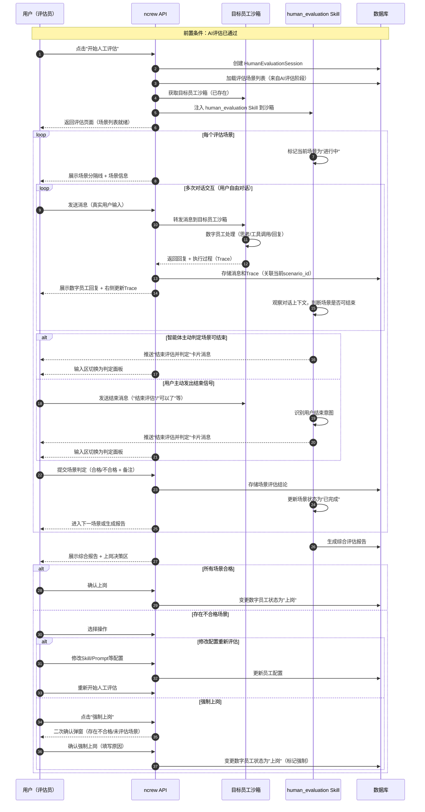

# 数字员工人工评估模块设计文档

> 版本: v0.3
> 日期: 2026-04-21
> 状态: 设计讨论中

---

## 1. 项目背景

### 1.1 整体流程

```
员工雇佣申请 → 提交资料 → AI评估（合格）→ 人工评估（本模块）→ 上岗
```

### 1.2 人工评估环节核心目标

AI评估通过后，由真实用户与数字员工进行会话，在真实交互中验证数字员工的实际工作能力，作为是否上岗的最终决策依据。

### 1.3 与AI评估的关系

| 对比维度 | AI评估 | 人工评估 |
|---------|--------|---------|
| 前置条件 | 雇佣资料提交完成 | AI评估通过 |
| 执行主体 | 评估专家数字员工（自动化） | 真实用户（人工） |
| 沙箱环境 | 评估专家沙箱 + 目标员工沙箱 | 目标员工沙箱（直接交互） |
| 测试方式 | 自动注入测试输入，沙箱执行 | 用户自由对话，真实交互 |
| 评估判分 | AI自动多维度打分 | 用户主观判定合格/不合格 |
| 技能支撑 | 评估专家的4个评估Skill | 内置人工评估Skill（场景管理、判定收集） |
| 结果性质 | 资格筛选（通过才能进入人工评估） | 最终决策（决定是否上岗） |

---

## 2. 需求分析

### 2.1 核心功能需求

| 需求项 | 描述 |
|-------|------|
| **场景评估会话** | 按场景逐一与数字员工进行真实会话，每个场景独立评估 |
| **轮次区分** | 同一会话内区分多个评估轮次（场景），每轮包含多次对话交互 |
| **中间产物展示** | 实时展示数字员工的思考链路、工具调用记录等执行过程 |
| **场景结论判定** | 评估智能体主动判断合适时机，推送"结束评估并判定"卡片；同时识别用户主动发出的结束信号（如"结束评估"、"可以了"等），触发判定流程 |
| **综合报告生成** | 所有场景评估完成后，汇总生成综合评估报告 |
| **上岗决策** | 综合合格时变更数字员工状态为上岗；不合格时允许修改配置后重新评估 |
| **强制上岗入口** | 存在不合格/未评估场景时，提供二次确认的强制上岗入口 |

### 2.2 典型交互流程示例

以客服数字员工为例，假设有3个评估场景：

```
会话开始
│
├── 场景1：投诉处理
│   ├── 用户输入："我要投诉，这个商品太烂了，我要退货"
│   ├── 数字员工回复 + 工具调用（查询商品、创建工单）
│   ├── 用户追问："什么时候能退款？"
│   ├── 数字员工回复
│   ├── ...（多次对话）
│   └── 用户判定：✅ 合格 / ❌ 不合格
│
├── 场景2：功能建议
│   ├── 用户输入："我要建议，增加xxxxx功能，不然太烂了"
│   ├── 数字员工回复 + 工具调用
│   ├── ...（多次对话）
│   └── 用户判定：✅ 合格 / ❌ 不合格
│
├── 场景3：售后咨询
│   ├── 用户输入："我的订单什么时候发货？"
│   ├── 数字员工回复 + 工具调用
│   ├── ...（多次对话）
│   └── 用户判定：✅ 合格 / ❌ 不合格
│
└── 综合报告生成 → 上岗决策
```

---

## 3. 技术架构设计

### 3.1 整体架构

> **核心设计理念**：人工评估直接与目标数字员工沙箱交互，无需额外的评估专家沙箱。平台内置一个人工评估 Skill，在用户点击"开始人工评估"入口时注入到目标员工沙箱中，负责场景管理、判定收集等评估流程管控。

```
┌─────────────────────────────────────────────────────────────────────────────────┐
│                           ncrew 平台                                             │
├─────────────────────────────────────────────────────────────────────────────────┤
│                                                                                  │
│   ┌───────────────────────────────────────────────────────────────────────────┐ │
│   │                     目标员工沙箱（被评估对象）                              │ │
│   │                                                                           │ │
│   │   ┌─────────────────────────────────────────────────────────────────────┐│ │
│   │   │                     目标数字员工                                      ││ │
│   │   │                                                                     ││ │
│   │   │   Harness 配置: (雇佣时上传的员工模板)                              ││ │
│   │   │   • Skills: 根据岗位配置的技能清单                                  ││ │
│   │   │     └── 🆕 human_evaluation (内置人工评估Skill，入口点击时注入)     ││ │
│   │   │   • Tools: 根据岗位配置的工具权限                                   ││ │
│   │   │   • Ontology: 员工专属的企业语境                                    ││ │
│   │   │                                                                     ││ │
│   │   └─────────────────────────────────────────────────────────────────────┘│ │
│   │                                                                           │ │
│   └───────────────────────────────────────────────────────────────────────────┘ │
│                                    ▲                                            │
│                                    │ 用户直接对话                               │
│                                    │                                            │
│   ┌───────────────────────────────────────────────────────────────────────────┐ │
│   │                        人工评估前端页面                                    │ │
│   │                                                                           │ │
│   │   ┌─────────────────────────────────────────────────────────────────────┐│ │
│   │   │                     顶部：评估进度条                                 ││ │
│   │   │  场景1 ✅ → 场景2 ⏳ → 场景3 ⏸ → 综合报告                          ││ │
│   │   └─────────────────────────────────────────────────────────────────────┘│ │
│   │                                                                           │ │
│   │   ┌──────────────────────────────────────┐ ┌──────────────────────────┐ │ │
│   │   │        左侧：会话窗口                  │ │  右侧：评估产物面板      │ │ │
│   │   │        (用户与数字员工直接对话)        │ │  (Trace/工具调用/对话)   │ │ │
│   │   │                                       │ │                          │ │ │
│   │   │  ┌─────────────────────────────────┐ │ │                          │ │ │
│   │   │  │ 场景导航                         │ │ │  场景选择 + Tab切换      │ │ │
│   │   │  └─────────────────────────────────┘ │ │                          │ │ │
│   │   │                                       │ │                          │ │ │
│   │   │  对话消息列表                         │ │  执行过程展示            │ │ │
│   │   │  (含场景分隔线)                       │ │  (思考链路、工具调用)    │ │ │
│   │   │                                       │ │                          │ │ │
│   │   │  消息输入 / 场景判定                   │ │                          │ │ │
│   │   │                                       │ │                          │ │ │
│   │   └──────────────────────────────────────┘ └──────────────────────────┘ │ │
│   │                                                                           │ │
│   └───────────────────────────────────────────────────────────────────────────┘ │
│                                                                                  │
└─────────────────────────────────────────────────────────────────────────────────┘
```

**架构设计要点：**

| 设计要素 | 说明 |
|---------|------|
| **无独立评估沙箱** | 人工评估不创建额外的沙箱，直接使用目标数字员工的沙箱 |
| **内置人工评估 Skill** | 平台内置的 `human_evaluation` Skill，仅在人工评估入口点击时注入 |
| **用户直连** | 用户直接与目标数字员工对话，体验与真实工作场景一致 |
| **Skill 职责** | 负责场景轮次管理、判定结果收集、综合报告生成等评估流程管控 |
| **Trace 采集** | 复用 ncrew 平台的 trace_read 能力，展示数字员工的执行过程 |

**人工评估 Skill 与 AI 评估 Skills 的对比：**

| 对比维度 | AI评估 Skills（4个） | 人工评估 Skill（1个） |
|---------|---------------------|---------------------|
| 所属 | 评估专家数字员工 | 注入到目标员工沙箱 |
| 职责 | 场景解析、测试执行、评估判分、训练建议 | 场景轮次管理、判定收集、报告生成 |
| 执行方式 | 自动化驱动 | 人工驱动（用户对话） |
| 判定主体 | AI自动打分 | 用户主观判定 |
| 注入时机 | 创建评估专家时加载 | 用户点击"开始人工评估"时注入 |

### 3.2 核心概念：场景轮次与会话消息的区分

人工评估的核心难点在于：**所有场景共享同一个会话**，但需要清晰区分不同评估场景（轮次）。

#### 3.2.1 概念模型

```
HumanEvaluationSession（人工评估会话）
│
├── ScenarioRound 1（场景轮次1：投诉处理）
│   ├── Message 1: 用户 → "我要投诉，这个商品太烂了"
│   ├── Message 2: 数字员工 → "非常抱歉给您带来不便..."
│   │   └── Trace: 思考链路、工具调用记录
│   ├── Message 3: 用户 → "什么时候能退款？"
│   ├── Message 4: 数字员工 → "预计3个工作日内..."
│   │   └── Trace: 工具调用记录
│   └── Verdict: ✅ 合格
│
├── ScenarioRound 2（场景轮次2：功能建议）
│   ├── Message 5: 用户 → "我要建议增加xxxxx功能"
│   ├── Message 6: 数字员工 → "感谢您的建议..."
│   │   └── Trace: 工具调用记录
│   └── Verdict: ❌ 不合格
│
└── ComprehensiveReport（综合报告）
    ├── 场景1: ✅ 合格
    ├── 场景2: ❌ 不合格
    └── 综合结论: 不合格（需重新评估或强制上岗）
```

#### 3.2.2 场景分隔机制

| 机制 | 说明 |
|------|------|
| **视觉分隔** | 会话窗口中，不同场景之间插入分隔线，标注场景名称和编号 |
| **状态标识** | 每个场景有独立状态：待开始 → 进行中 → 已完成（合格/不合格） |
| **输入切换** | 场景进行中显示消息输入框；评估智能体推送判定卡片或用户主动结束场景时，输入区切换为合格/不合格判定 |
| **导航定位** | 点击左侧场景导航可快速跳转到对应场景的会话区域 |

### 3.3 人工评估 Skill 设计 (human_evaluation)

> **核心设计**：平台内置的 Skill，仅在"开始人工评估"入口点击时注入到目标数字员工沙箱中。该 Skill 不参与数字员工的业务逻辑，仅负责评估流程管控。

#### 3.3.1 Skill 配置

```yaml
---
name: human_evaluation
version: 1.0.0
category: evaluation
ontology_refs:
  - concept: "human_evaluation_protocol"
    action: "manage"
tools_required:
  - evaluation_report
memory_access: read_write
execution_mode: continuous
---

# 人工评估 Skill

## 目标
管理人工评估的完整流程：场景轮次切换、判定结果收集、综合报告生成。

## 注入条件
用户通过"开始人工评估"入口进入时，平台自动将此 Skill 注入到目标员工沙箱。

## 职责范围
此 Skill 仅管理评估流程，不影响数字员工的业务回复能力。
数字员工正常使用其业务 Skills 回复用户，此 Skill 在后台管理评估状态。

## 管理的场景生命周期
1. 场景开始 → 插入场景分隔消息，标记场景为"进行中"
2. 场景进行中 → 记录消息归属场景，收集执行Trace
3. 结束判定触发 → 智能判断场景结束时机（见下方"场景结束判定机制"）
4. 场景判定 → 用户提交合格/不合格，记录结论
5. 场景结束 → 更新状态，切换到下一场景
6. 所有场景完成 → 生成综合评估报告

## 场景结束判定机制（核心能力）

### 智能体主动触发
评估智能体持续观察对话上下文，在以下条件满足时主动推送"结束评估并判定"卡片：

**触发条件（满足其一即可）：**
- 数字员工已完成当前场景的核心任务链（如：安抚→查询→处理→工单，4步都已执行）
- 用户问题已被数字员工完整回复，且无未解决的追问
- 对话已进入自然的结束状态（数字员工表达了"还有其他可以帮助您的吗"等收尾话术）
- 当前场景对话轮数达到预设阈值（默认10轮）

**识别方式：**
- 基于当前场景的 expected_behavior_sequence 判断完成度
- 分析最近N轮对话是否已无实质性业务交互
- 追踪数字员工的工具调用是否已覆盖预期行为

### 用户主动触发
用户在对话中发出结束信号时，智能体需识别并推送判定卡片：

**识别的用户结束信号：**
- 显式指令："结束评估"、"可以了"、"差不多了"、"判定吧"
- 隐式信号："没有了"、"就这样"、"不用了，可以结束了"
- 其他语义上表达"评估到此为止"的表述

### 推送行为
无论哪种触发方式，统一执行：
1. 在会话中插入一条判定请求卡片消息
2. 输入区切换为合格/不合格判定面板
3. 用户仍可选择"返回继续对话"拒绝判定

## 输出
调用 `evaluation_report` Tool 生成综合评估报告。
```

#### 3.3.2 Skill 与业务 Skills 的关系

```
┌─────────────────────────────────────────────────────────────────────┐
│                      目标数字员工沙箱                                │
│                                                                     │
│   ┌───────────────────────────────────────────────────────────────┐│
│   │  Skills                                                       ││
│   │                                                               ││
│   │  ┌─────────────┐  ┌─────────────┐  ┌───────────────────────┐ ││
│   │  │ 业务 Skill  │  │ 业务 Skill  │  │ 🆕 human_evaluation   │ ││
│   │  │ (客服回复)  │  │ (工单处理)  │  │ (评估流程管控)        │ ││
│   │  │             │  │             │  │                       │ ││
│   │  │ 职责:       │  │ 职责:       │  │ 职责:                 │ ││
│   │  │ 回复用户    │  │ 创建工单    │  │ 管理场景轮次          │ ││
│   │  │ 处理咨询    │  │ 查询状态    │  │ 智能判定结束时机      │ ││
│   │  │             │  │             │  │ 识别用户结束信号      │ ││
│   │  │             │  │             │  │ 收集判定结果          │ ││
│   │  │             │  │             │  │ 生成综合报告          │ ││
│   │  └─────────────┘  └─────────────┘  └───────────────────────┘ ││
│   │                                                               ││
│   └───────────────────────────────────────────────────────────────┘│
│                                                                     │
│   用户消息 ──→ 业务 Skills 处理 ──→ 回复用户                       │
│                  ↑                                                  │
│            human_evaluation Skill                                   │
│            在后台记录消息归属场景、收集Trace                        │
│                                                                     │
└─────────────────────────────────────────────────────────────────────┘
```

**关键原则：** human_evaluation Skill 不拦截或修改用户与数字员工之间的业务对话。它是一个旁路（sidecar）角色，仅在后台管理评估状态，在场景切换和判定收集时介入。同时它需要持续观察对话上下文，智能判断场景是否已达到可判定的时机。

### 3.3 关键流程时序

> **核心变化**：无评估专家沙箱，用户直接与目标数字员工对话。内置人工评估 Skill 注入后，负责场景轮次管理和判定收集。



### 3.4 数据模型设计

#### 3.4.1 人工评估会话

```json
{
  "human_evaluation_session": {
    "session_id": "HEVAL-001",
    "employee_id": "EMP-001",
    "employee_template_id": "TPL-001",
    "ai_evaluation_session_id": "EVAL-001",

    "status": "in_progress",
    "started_at": "2026-04-21T14:00:00Z",
    "completed_at": null,

    "scenarios": [
      {
        "scenario_id": "HS-001",
        "scenario_name": "投诉处理",
        "source_test_case_id": "TC-001",
        "status": "completed",
        "verdict": "passed",
        "verdict_comment": "语气友好，问题解决完整",
        "verdict_by": "admin_001",
        "verdict_at": "2026-04-21T14:15:00Z",
        "started_at": "2026-04-21T14:00:00Z",
        "completed_at": "2026-04-21T14:15:00Z",
        "message_count": 6
      },
      {
        "scenario_id": "HS-002",
        "scenario_name": "功能建议",
        "source_test_case_id": "TC-002",
        "status": "in_progress",
        "verdict": null,
        "verdict_comment": null,
        "started_at": "2026-04-21T14:15:30Z",
        "completed_at": null,
        "message_count": 2
      }
    ],

    "comprehensive_report": null,

    "onboarding_decision": {
      "decision": null,
      "decided_by": null,
      "decided_at": null,
      "is_forced": false,
      "force_reason": null
    }
  }
}
```

#### 3.4.2 会话消息（扩展）

在现有消息模型基础上，新增以下字段以支持场景轮次区分：

```json
{
  "message": {
    "message_id": "MSG-001",
    "session_id": "HEVAL-001",
    "scenario_id": "HS-001",
    "role": "user",
    "content": "我要投诉，这个商品太烂了，我要退货",
    "timestamp": "2026-04-21T14:01:00Z",
    "trace": null
  }
}
```

```json
{
  "message": {
    "message_id": "MSG-002",
    "session_id": "HEVAL-001",
    "scenario_id": "HS-001",
    "role": "assistant",
    "content": "非常抱歉给您带来不便，我马上为您处理...",
    "timestamp": "2026-04-21T14:01:15Z",
    "trace": {
      "thoughts": [
        {
          "content": "用户情绪激动，需要先安抚，再处理退货请求",
          "timestamp": "2026-04-21T14:01:10Z"
        }
      ],
      "tool_calls": [
        {
          "tool_name": "query_product_info",
          "parameters": {"product_id": "PROD-12345"},
          "result": {"return_eligible": true},
          "duration_ms": 120,
          "success": true,
          "timestamp": "2026-04-21T14:01:12Z"
        }
      ]
    }
  }
}
```

#### 3.4.3 场景分隔消息

场景之间插入系统级分隔消息：

```json
{
  "message": {
    "message_id": "MSG-DIVIDER-001",
    "session_id": "HEVAL-001",
    "scenario_id": null,
    "role": "system",
    "type": "scenario_divider",
    "content": "进入场景2：功能建议",
    "metadata": {
      "scenario_id": "HS-002",
      "scenario_name": "功能建议",
      "scenario_index": 2,
      "total_scenarios": 3
    },
    "timestamp": "2026-04-21T14:15:30Z"
  }
}
```

#### 3.4.4 综合评估报告

```json
{
  "comprehensive_report": {
    "session_id": "HEVAL-001",
    "employee_id": "EMP-001",
    "employee_type": "客服专员",

    "generated_at": "2026-04-21T15:00:00Z",

    "scenario_results": [
      {
        "scenario_id": "HS-001",
        "scenario_name": "投诉处理",
        "verdict": "passed",
        "verdict_comment": "语气友好，问题解决完整",
        "message_count": 6,
        "duration_seconds": 900
      },
      {
        "scenario_id": "HS-002",
        "scenario_name": "功能建议",
        "verdict": "passed",
        "verdict_comment": "正确记录建议，服务态度好",
        "message_count": 4,
        "duration_seconds": 600
      },
      {
        "scenario_id": "HS-003",
        "scenario_name": "售后咨询",
        "verdict": "failed",
        "verdict_comment": "未正确查询订单状态，回答不准确",
        "message_count": 5,
        "duration_seconds": 750
      }
    ],

    "summary": {
      "total_scenarios": 3,
      "passed_scenarios": 2,
      "failed_scenarios": 1,
      "pending_scenarios": 0,
      "overall_verdict": "failed",
      "pass_rate": "66.7%"
    },

    "onboarding_recommendation": "不建议上岗，存在1个不合格场景（售后咨询）。建议修改相关Skill后重新评估。"
  }
}
```

---

## 4. 前端页面设计

### 4.1 页面布局结构

```
┌─────────────────────────────────────────────────────────────────────────────────┐
│              HumanEvaluationPage (/human-evaluation/:sessionId)                  │
├─────────────────────────────────────────────────────────────────────────────────┤
│                                                                                  │
│  ┌─────────────────────────────────────────────────────────────────────────────┐│
│  │                        顶部进度条区域 (固定高度 56px)                        ││
│  │  场景1: 投诉处理 ✅ → 场景2: 功能建议 ⏳ → 场景3: 售后咨询 ⏸               ││
│  │  进度 ████████████░░░░░░░░░░░░░░ 33%                                       ││
│  └─────────────────────────────────────────────────────────────────────────────┘│
│                                                                                  │
│  ┌──────────────────────────────────────┐ ┌──────────────────────────────────┐ │
│  │        左侧：会话窗口                  │ │      右侧：评估产物面板          │ │
│  │        (flex-grow, 主区域)             │ │      (360px, 可折叠)             │ │
│  │                                       │ │                                  │ │
│  │  ┌─────────────────────────────────┐ │ │  ┌────────────────────────────┐ │ │
│  │  │ 场景导航卡片                     │ │ │  │ 场景: 投诉处理 ✅ [▼]     │ │ │
│  │  │                                 │ │ │  └────────────────────────────┘ │ │
│  │  │ ✅ 场景1: 投诉处理  (6条消息)   │ │ │  ────────────────────────────  │ │
│  │  │ ⏳ 场景2: 功能建议  (进行中)     │ │ │  [思考链路] [工具调用] [对话]  │ │
│  │  │ ⏸ 场景3: 售后咨询  (待开始)     │ │ │  ────────────────────────────  │ │
│  │  │                                 │ │ │                                  │ │
│  │  │ [点击跳转]                      │ │ │  💭 思考                        │ │
│  │  └─────────────────────────────────┘ │ │  "用户情绪激动，先安抚..."      │ │
│  │                                       │ │  14:01:10                       │ │
│  │  ┌─────────────────────────────────┐ │ │                                  │ │
│  │  │ 会话消息列表                    │ │ │  🔧 工具调用                    │ │
│  │  │                                 │ │ │  query_product_info             │ │
│  │  │ ═══ 场景2：功能建议 ═══         │ │ │  → {product_id: "P-12345"}     │ │
│  │  │                                 │ │ │  ← {eligible: true} ✅ 120ms   │ │
│  │  │ 👤 用户:                        │ │ │                                  │ │
│  │  │ 我要建议增加xxxxx功能           │ │ │  💬 回复                        │ │
│  │  │                                 │ │ │  "非常抱歉给您带来不便..."      │ │
│  │  │ 🤖 数字员工:                    │ │ │  语气: 友好 ✅                  │ │
│  │  │ 感谢您的建议，我已为您记录...   │ │ │                                  │ │
│  │  │ [🔧 submit_suggestion]          │ │ │                                  │ │
│  │  │                                 │ │ │                                  │ │
│  │  │ 👤 用户:                        │ │ │                                  │ │
│  │  │ 你们什么时候能做出来？          │ │ │                                  │ │
│  │  │                                 │ │ │                                  │ │
│  │  │ 🤖 数字员工:                    │ │ │                                  │ │
│  │  │ 您的建议已提交给产品团队...     │ │ │                                  │ │
│  │  │                                 │ │ │                                  │ │
│  │  │ ┌─────────────────────────────┐ │ │ │                                  │ │
│  │  │ │ 📋 评估判定请求卡片          │ │ │ │                                  │ │
│  │  │ │ 当前场景已进入可判定阶段     │ │ │ │                                  │ │
│  │  │ │ [✅ 合格]  [❌ 不合格]       │ │ │ │                                  │ │
│  │  │ └─────────────────────────────┘ │ │ │                                  │ │
│  │  │                                 │ │ │                                  │ │
│  │  └─────────────────────────────────┘ │ │                                  │ │
│  │                                       │ │                                  │ │
│  │  ┌─────────────────────────────────┐ │ │                                  │ │
│  │  │ 消息输入区                      │ │ │                                  │ │
│  │  │ [输入消息...]        [发送]     │ │ │                                  │ │
│  │  │ (用户也可输入"结束评估"触发)   │ │ │                                  │ │
│  │  └─────────────────────────────────┘ │ │                                  │ │
│  │                                       │ │                                  │ │
│  └──────────────────────────────────────┘ └──────────────────────────────────┘ │
│                                                                                  │
└─────────────────────────────────────────────────────────────────────────────────┘
```

### 4.2 场景判定交互

#### 4.2.1 判定触发方式

判定由评估智能体在合适时机主动推送，用户也可主动触发。两种方式最终都展示同一个判定卡片。

**触发方式一：智能体主动推送（在会话中插入卡片消息）**

```
┌─────────────────────────────────────────────────┐
│ 📋 评估判定请求                                  │
│ ─────────────────────────────────────────────── │
│                                                  │
│ 当前场景「功能建议」的对话已达到可判定阶段。     │
│ 数字员工已完成：记录建议 → 提交产品团队 → 回复   │
│                                                  │
│ 请根据数字员工的表现给出判定：                    │
│                                                  │
│ ┌─────────────────────────────────────────────┐ │
│ │  ✅  合格                                    │ │
│ │  数字员工表现符合预期，能够胜任该场景任务     │ │
│ └─────────────────────────────────────────────┘ │
│                                                  │
│ ┌─────────────────────────────────────────────┐ │
│ │  ❌  不合格                                  │ │
│ │  数字员工表现未达到预期，需要改进             │ │
│ └─────────────────────────────────────────────┘ │
│                                                  │
│ 备注（可选）:                                    │
│ ┌─────────────────────────────────────────────┐ │
│ │                                             │ │
│ └─────────────────────────────────────────────┘ │
│                                                  │
│ [确认提交]              [继续对话]               │
└─────────────────────────────────────────────────┘
```

**触发方式二：用户主动触发（在输入框中输入结束信号或点击"结束评估"）**

用户在对话中发送"结束评估"、"可以了"等结束信号，或点击输入框旁的"结束评估"按钮，智能体识别后推送同样的判定卡片。

```
┌─────────────────────────────────────────────────┐
│ 📋 评估判定请求                                  │
│ ─────────────────────────────────────────────── │
│                                                  │
│ 用户主动结束场景「功能建议」的评估。              │
│ 对话轮数: 4轮  |  持续时间: 3分25秒              │
│                                                  │
│ 请根据数字员工的表现给出判定：                    │
│                                                  │
│ （同上判定面板）                                  │
│                                                  │
│ [确认提交]              [继续对话]               │
└─────────────────────────────────────────────────┘
```

#### 4.2.2 用户拒绝判定

用户点击"继续对话"可拒绝判定，回到消息输入模式继续与数字员工交互。智能体会继续观察后续对话，在下一个合适时机再次推送判定请求。
```

### 4.3 综合报告页面

所有场景评估完成后，底部弹出综合报告区域：

```
┌─────────────────────────────────────────────────────────────────────────────────┐
│ 综合评估报告                                                          [导出报告] │
├─────────────────────────────────────────────────────────────────────────────────┤
│                                                                                  │
│  员工: 客服专员 (EMP-001)                    评估时间: 2026-04-21 14:00 - 15:30  │
│                                                                                  │
│  ┌──────────────┬──────────┬──────────┬────────────────────────────────────┐     │
│  │ 场景         │ 消息轮数 │ 持续时间 │ 评估结论                          │     │
│  ├──────────────┼──────────┼──────────┼────────────────────────────────────┤     │
│  │ 投诉处理     │ 6轮      │ 15分钟   │ ✅ 合格 - 语气友好，问题解决完整  │     │
│  │ 功能建议     │ 4轮      │ 10分钟   │ ✅ 合格 - 正确记录建议            │     │
│  │ 售后咨询     │ 5轮      │ 12分钟   │ ❌ 不合格 - 回答不准确            │     │
│  └──────────────┴──────────┴──────────┴────────────────────────────────────┘     │
│                                                                                  │
│  通过率: 2/3 (66.7%)                                                             │
│  综合结论: ❌ 不合格                                                              │
│                                                                                  │
├─────────────────────────────────────────────────────────────────────────────────┤
│                                                                                  │
│  ┌───────────────────────────────────────────────────────────────────────────┐  │
│  │  ✅ 确认上岗                                                              │  │
│  │  所有场景均已通过评估，变更数字员工状态为"上岗"                            │  │
│  └───────────────────────────────────────────────────────────────────────────┘  │
│                                                                                  │
│  ┌───────────────────────────────────────────────────────────────────────────┐  │
│  │  🔄 修改配置重新评估                                                      │  │
│  │  修改数字员工的Skill、Prompt等配置后，重新开始人工评估                     │  │
│  └───────────────────────────────────────────────────────────────────────────┘  │
│                                                                                  │
│  ┌───────────────────────────────────────────────────────────────────────────┐  │
│  │  ⚠️  强制上岗                                                             │  │
│  │  存在不合格/未评估场景，但仍要求上岗                                       │  │
│  └───────────────────────────────────────────────────────────────────────────┘  │
│                                                                                  │
└─────────────────────────────────────────────────────────────────────────────────┘
```

### 4.4 强制上岗确认弹窗

```
┌─────────────────────────────────────────────────┐
│ ⚠️  强制上岗确认                                 │
│ ─────────────────────────────────────────────── │
│                                                  │
│ 当前人工评估存在以下问题：                       │
│                                                  │
│ ❌ 场景3「售后咨询」— 不合格                     │
│    原因: 未正确查询订单状态，回答不准确          │
│                                                  │
│ 强制上岗后，该数字员工将直接进入工作状态。       │
│ 请确认是否继续？                                 │
│                                                  │
│ 强制上岗原因（必填）:                            │
│ ┌─────────────────────────────────────────────┐ │
│ │                                             │ │
│ └─────────────────────────────────────────────┘ │
│                                                  │
│ [取消]                            [确认强制上岗] │
└─────────────────────────────────────────────────┘
```

### 4.5 修改配置重新评估

用户选择修改配置重新评估时，展开配置修改面板：

```
┌─────────────────────────────────────────────────────────────────────────────────┐
│ 修改配置 — 重新人工评估                                                          │
├─────────────────────────────────────────────────────────────────────────────────┤
│                                                                                  │
│  不合格场景问题分析：                                                             │
│  ────────────────────────────────────────────────────────────────────────────── │
│  场景3「售后咨询」：未正确查询订单状态，回答不准确                               │
│  建议：在Prompt中增加订单查询流程指引                                            │
│                                                                                  │
│  ┌───────────────────────────────────────────────────────────────────────────┐  │
│  │ 修改类型: [Skill修改 ▼]                                                   │  │
│  └───────────────────────────────────────────────────────────────────────────┘  │
│                                                                                  │
│  当前 Skill 配置:                                                                │
│  ┌───────────────────────────────────────────────────────────────────────────┐  │
│  │ # 客服回复 Skill                                                          │  │
│  │                                                                           │  │
│  │ 你是一个客服专员，负责处理用户咨询。                                       │  │
│  │ ...                                                                       │  │
│  └───────────────────────────────────────────────────────────────────────────┘  │
│                                                                                  │
│  修改后 Skill 配置:                                                              │
│  ┌───────────────────────────────────────────────────────────────────────────┐  │
│  │ # 客服回复 Skill                                                          │  │
│  │                                                                           │  │
│  │ 你是一个客服专员，负责处理用户咨询。                                       │  │
│  │ **当用户询问订单状态时，必须先调用query_order工具查询后再回复。**          │  │
│  │ ...                                                                       │  │
│  └───────────────────────────────────────────────────────────────────────────┘  │
│                                                                                  │
│  [预览Diff]  [取消]  [应用修改并重新评估]                                        │
│                                                                                  │
└─────────────────────────────────────────────────────────────────────────────────┘
```

### 4.6 页面组件清单

| 组件 | 职责 |
|------|------|
| `ScenarioProgressBar` | 顶部场景进度条，展示所有场景的完成状态 |
| `ScenarioNavigator` | 左侧场景导航卡片，支持点击跳转 |
| `ChatWindow` | 会话消息列表，含场景分隔线 |
| `ChatInput` | 消息输入框 + "结束评估"快捷按钮 |
| `VerdictCard` | 会话内判定的卡片消息（智能体推送或用户触发后展示） |
| `ArtifactPanel` | 右侧评估产物面板（Trace/工具调用/对话详情） |
| `ScenarioSelector` | 右侧场景选择下拉框 |
| `TraceTab` | 思考链路展示 |
| `ToolCallTab` | 工具调用记录展示 |
| `ConversationTab` | 对话详情展示 |
| `ComprehensiveReport` | 综合评估报告 |
| `OnboardingActions` | 上岗操作区（确认上岗/修改配置/强制上岗） |
| `ForceOnboardingDialog` | 强制上岗二次确认弹窗 |
| `ConfigEditor` | 配置修改编辑器（Skill/Prompt） |

---

## 5. 关键交互流程

### 5.1 进入人工评估

```
用户在待人工评估列表中点击"开始评估"
    ↓
系统加载该员工的AI评估结果（场景列表）
    ↓
获取目标员工已有的沙箱，注入内置 human_evaluation Skill
    ↓
进入评估页面，展示场景列表，第一个场景标记为"进行中"
    ↓
用户直接与数字员工对话
```

### 5.2 场景评估流程

```
用户在当前场景中自由输入消息
    ↓
数字员工实时回复，右侧展示执行过程（Trace）
    ↓
用户观察数字员工表现（回复内容、工具调用、思考过程）
    ↓
┌── 智能体判断场景可结束 ──→ 在会话中推送"判定请求"卡片
│
├── 用户主动发送"结束评估" ──→ 智能体识别后推送"判定请求"卡片
│
└── 用户点击"结束评估"快捷按钮 ──→ 智能体推送"判定请求"卡片
    ↓
用户在卡片中选择合格/不合格并填写备注
    ↓
用户点击"继续对话"拒绝判定 → 回到消息输入，智能体继续观察等待下次时机
    ↓
提交判定 → 记录结论 → 自动进入下一场景
    ↓
（如果是最后一个场景 → 生成综合报告）
```

### 5.3 上岗决策流程

```
所有场景评估完成 → 展示综合报告
    ↓
┌── 所有场景合格 ──→ 点击"确认上岗" ──→ 变更状态为"上岗"
│
├── 存在不合格 ──→ 用户选择：
│   ├── "修改配置重新评估" → 打开配置编辑器 → 修改Skill/Prompt → 重新评估
│   └── "强制上岗" → 弹出确认窗口（必须填写原因）→ 确认 → 变更状态为"上岗"（标记强制）
│
└── 存在未评估场景（跳过）──→ 同"存在不合格"逻辑
```

---

## 6. 待讨论/待确认的问题

| 问题 | 描述 | 优先级 |
|-----|------|-------|
| **Skill 注入时机** | human_evaluation Skill 是沙箱创建时预置（根据入口判断是否激活），还是运行时动态注入？ | 高 |
| **场景跳过** | 是否允许用户跳过某个场景不评估？跳过的场景是否算不合格？ | 中 |
| **重新评估范围** | 修改配置后重新评估，是重新评估所有场景还是只评估不合格的场景？ | 中 |
| **最大重试次数** | 人工评估的修改配置重新评估是否有限制次数？ | 中 |
| **评估超时** | 单个场景是否有最大对话轮数或时间限制？ | 低 |
| **多人评估** | 是否支持多人同时评估同一个数字员工（多人各自独立评估）？ | 低 |
| **报告导出** | 人工评估报告是否需要导出功能？格式？ | 低 |

---

## 附录

### A. 术语表

| 术语 | 定义 |
|-----|------|
| **人工评估** | 由真实用户与数字员工进行对话交互，验证其工作能力的评估方式 |
| **场景轮次** | 人工评估中的一次完整场景测试，包含多轮对话交互和一个合格/不合格判定 |
| **场景分隔** | 会话窗口中区分不同评估场景的视觉标识 |
| **综合报告** | 所有场景评估完成后汇总生成的评估结论报告 |
| **强制上岗** | 在存在不合格场景的情况下，经二次确认后强制变更数字员工为上岗状态 |
| **评估产物** | 数字员工执行过程中的中间产物，包括思考链路、工具调用记录、对话内容 |

---

**文档维护记录**

| 版本 | 日期 | 修改人 | 修改内容 |
|-----|------|--------|---------|
| v0.1 | 2026-04-21 | - | 初始版本，定义人工评估核心需求、页面设计、交互流程、数据模型 |
| v0.2 | 2026-04-21 | - | **架构调整：去除独立评估沙箱**。改为直接与目标员工沙箱交互，新增内置 human_evaluation Skill 设计（旁路模式，不干扰业务对话）。更新时序图、数据模型、待确认问题 |
| v0.3 | 2026-04-22 | - | **场景结束判定改为智能体主动触发**。去除手动"结束场景"按钮，改为 human_evaluation Skill 智能判断合适时机主动推送判定卡片，同时支持识别用户主动结束信号（显式/隐式）。更新：Skill 场景结束判定机制设计（§3.3.1）、时序图、页面布局、判定交互（§4.2）、评估流程（§5.2） |

---

*本文档为设计讨论稿，内容将持续更新和完善。*
