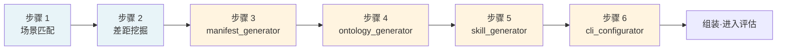
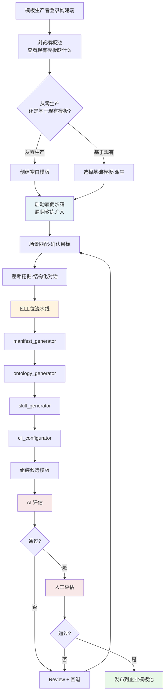
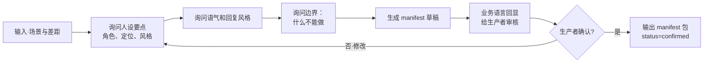
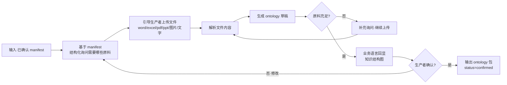
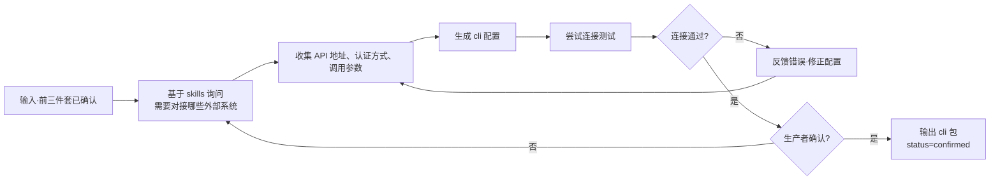
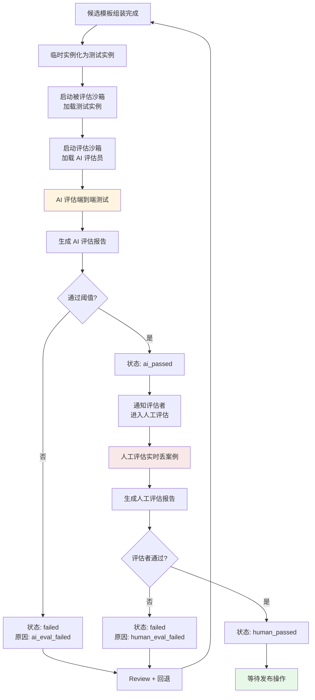
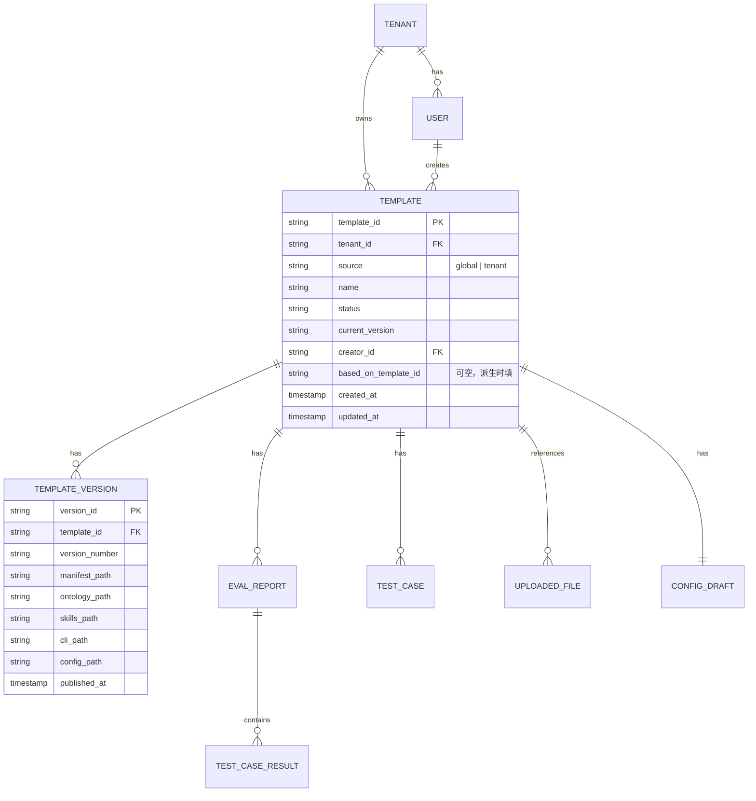
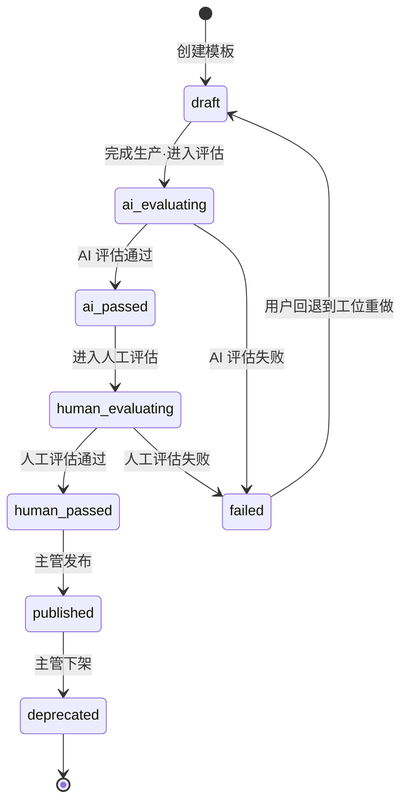

# 构建端详细需求规格说明书

> **文档版本**：v1.0  
> **文档定位**：平台二（企业模板构建平台）的详细需求规格，工程团队据此开发，产品团队据此对齐  
> **读者**：产品团队、工程团队（前端、后端、算法）  
> **配套文档**：《产品设计备忘录》

---

## 第一部分 · 总体说明

## 1. 平台定位

### 1.1 平台基本信息

| 项目 | 内容 |
|---|---|
| 平台名称 | 企业模板构建平台（构建端） |
| 在三平台架构中的位置 | 平台二 |
| 主要使用者 | 企业内的模板管理部门 |
| 核心产出 | 企业专属模板池 |
| 与雇佣端的关系 | 上游产出方，模板池下沉到雇佣端 |
| 与平台一的关系 | 下游接收方，接收全局通用模板和创世员工 |

### 1.2 平台核心价值

构建端解决的核心问题是：**如何让企业拥有适配自身业务场景的数字员工模板，而不只是依赖通用模板**。

通用模板（来自平台一）只能覆盖通用人设和通用 skill，触达不到企业特有的业务知识、SOP、术语、外部系统对接。这部分必须靠企业自己生产专属模板。

构建端是企业生产这些专属模板的工作平台。

### 1.3 平台与雇佣端的边界

构建端和雇佣端在很多地方共用同一套底层能力（创世员工、沙箱、雇佣流水线），但产出物本质不同：

| 维度 | 构建端 | 雇佣端 |
|---|---|---|
| 使用者 | 模板管理部门 | 部门长、普通职员 |
| 产出物 | **模板**（可被实例化的蓝图） | **实例**（直接运行的数字员工） |
| 产出物状态 | 静态资源，存放在模板池 | 动态资源，运行在沙箱中 |
| 产出物归属 | 企业模板池（多人可见） | 个人或部门 |
| 评估通过后 | 发布到企业模板池 | 实例上岗，接入 IM |
| 是否绑定 IM | 否 | 是 |

**核心理解**：构建端走的是同一套雇佣流水线（场景匹配 → 五件套生产 → 双阶段评估），但流水线终点产出的是模板而不是实例。

---

## 2. 角色与权限

### 2.1 角色清单

构建端的使用者是企业模板管理部门。MVP 阶段建议设置以下角色：

| 角色 | 职责 | 关键权限 |
|---|---|---|
| 模板部门主管 | 部门管理、模板发布决策、模板下架决策 | 模板全生命周期权限 |
| 模板生产者 | 实际操作雇佣教练生产模板、上传材料、对接评估 | 生产、修改自己产出的模板 |
| 模板评估者 | 执行人工评估环节 | 对模板进行人工评估 |

**MVP 阶段简化方案**：可合并为单一角色"模板管理员"，由部门内多人共同承担。后续按规模扩展再分化。

### 2.2 权限矩阵

| 操作 | 模板部门主管 | 模板生产者 | 模板评估者 |
|---|---|---|---|
| 浏览企业模板池 | ✓ | ✓ | ✓ |
| 浏览全局通用模板（来自平台一） | ✓ | ✓ | ✓ |
| 创建新模板 | ✓ | ✓ | ✗ |
| 修改自己产出的模板 | ✓ | ✓（仅限自己） | ✗ |
| 修改他人产出的模板 | ✓ | ✗ | ✗ |
| 启动 AI 评估 | ✓ | ✓ | ✗ |
| 执行人工评估 | ✓ | ✗ | ✓ |
| 发布模板到企业模板池 | ✓ | ✗ | ✗ |
| 下架模板 | ✓ | ✗ | ✗ |
| 修改创世员工 | ✗ | ✗ | ✗ |
| 反馈给平台一 | ✓ | ✓ | ✓ |

---

## 3. 核心概念定义

### 3.1 模板（Template）

**定义**：模板是一个可被反复实例化的"数字员工蓝图"，由完整的五件套（manifest + ontology + skill + cli + config 模板）构成，但 config 中的实例级参数为占位符。

**模板的形态**：
- 模板本身**不在沙箱中运行**
- 模板需要被"实例化"后才能运行（实例化时填入具体的实例级参数）
- 一个模板可以被实例化为 N 个实例

**模板的生命周期状态**：

| 状态 | 含义 |
|---|---|
| `draft` | 草稿，正在生产中 |
| `ai_evaluating` | AI 评估中 |
| `ai_passed` | AI 评估通过，等待人工评估 |
| `human_evaluating` | 人工评估中 |
| `published` | 已发布到企业模板池，可被雇佣端使用 |
| `deprecated` | 已下架，不再可被新雇佣使用，但已有实例继续运行 |
| `failed` | 评估失败，可被重新进入流程 |

### 3.2 模板与实例包的差异

| 维度 | 模板（Template） | 实例包（Instance Package） |
|---|---|---|
| 产出方 | 构建端 | 雇佣端 |
| 包含内容 | 五件套 + config 模板 | 五件套 + 完整 config |
| config 中的实例级参数 | 占位符 | 真实值（实例 id、归属、机器码等） |
| 是否运行 | 否，是静态资源 | 是，运行在沙箱中 |
| 评估对象 | 模板的默认实例化结果 | 候选实例包本身 |

### 3.3 创世员工的角色

构建端的整个流程依赖两个创世员工：

- **digital_employee_discovery**（即"雇佣教练"）：引导模板生产者完成模板的五件套生产
- **AI 评估员**：对生产完成的模板进行端到端评估

创世员工由平台一生产并维护，构建端**只调用、不修改**。

> **命名说明**：digital_employee_discovery 与"雇佣教练"是同一对象的不同称呼,文档中可能混用,工程实现统一以 digital_employee_discovery 为准。

### 3.4 digital_employee_discovery 的内部结构

digital_employee_discovery 自身是一个完整的数字员工实例,具有自己的五件套。其内部结构如下:

```
digital_employee_discovery 数字员工
├── manifest 包       ← 它自己的人设(引导者、产品经理、配置助手)
├── ontology 包       ← 它自己的知识(模板市场全貌、雇佣最佳实践、各类业务场景的常见诉求模式)
├── skill 包          ← 它自己的能力清单
│   ├── manifest_generator    ← 子 skill,用于生成被雇佣员工的 manifest 包
│   ├── ontology_generator    ← 子 skill,用于生成被雇佣员工的 ontology 包
│   ├── skill_generator       ← 子 skill,用于生成被雇佣员工的 skill 包
│   └── cli_configurator      ← 子 skill,用于配置被雇佣员工的 cli 包
└── cli 包            ← 它自己对接的外部系统(模板市场、上传系统、沙箱编排器)
```

**关键区分**:digital_employee_discovery **自己用的子 skill**(manifest_generator 等)是它内置的工具,**它生产出来的产物**(被雇佣员工的 manifest 包、ontology 包等)是给被雇佣者的物料。两者不能混淆。

工程实现要求(参见《产品设计备忘录》7.1 创世员工资产隔离):

- digital_employee_discovery 的实例包必须独立存储,与业务模板隔离
- 内置的四个子 skill 随 digital_employee_discovery 整体一次性部署,不需要单独获取
- 平台一的迭代权完全在产品方手里,构建端只调用、不修改

### 3.5 digital_employee_discovery 的六大步骤总览

digital_employee_discovery 引导整个模板生产流程,共分为六大步骤。详细规格见第 6 节。

| 步骤 | 名称 | 性质 | 是否调用子 skill | 文档章节 |
|---|---|---|---|---|
| 1 | 场景匹配 | 对话引导 | 否 | 6.1 |
| 2 | 差距挖掘 | 对话引导 | 否 | 6.2 |
| 3 | 人设生成 | 工位执行 | manifest_generator | 6.3 |
| 4 | 知识生成 | 工位执行 | ontology_generator | 6.4 |
| 5 | 能力生成 | 工位执行 | skill_generator | 6.5 |
| 6 | 外部对接配置 | 工位执行 | cli_configurator | 6.6 |



**前两步(场景匹配、差距挖掘)由 digital_employee_discovery 主体直接执行,不调用子 skill**。这两步的核心动作是结构化对话,把用户描述的具体任务抽象成四类需求清单(知识缺口、能力清单、外部系统清单、边界清单),供后续四个工位作为输入。

**后四步(工位 1 至工位 4)各调用一个子 skill 完成对应组件的生产**。四个工位有顺序依赖:

- 人设(manifest)是身份基础,必须最先确定
- 知识(ontology)依赖人设范围,在人设之后
- 能力(skill)的执行需要调用知识,必须在知识之后
- 外部对接(cli)服务于能力,在能力之后

回退时也需要按依赖关系考虑:回退到上游工位通常意味着下游需要重做。

---

## 第二部分 · 功能需求

## 4. 模板生产主流程

### 4.1 流程总览



### 4.2 流程各阶段说明

#### 阶段 1：浏览与决策

**功能要求**：
- 模板生产者登录后能看到三类模板：
  - 全局通用模板（来自平台一，只读）
  - 本企业已发布的模板（已存在的专属模板）
  - 本企业 draft 状态的模板（生产中）
- 支持按场景、关键词搜索
- 支持查看模板详情（人设、能力描述、覆盖场景），但**不可见模板源代码**
- 支持两种创建方式：从零生产、基于现有模板派生

**派生模式特别说明**：
- 派生时会复制基础模板的五件套作为起点
- 派生后的模板与基础模板**完全脱钩**（快照式独立）
- 基础模板更新不会自动同步到派生后的模板（与雇佣端分身脱钩逻辑一致）

#### 阶段 2：启动雇佣沙箱

**功能要求**：
- 系统创建一个临时雇佣沙箱
- 加载创世员工"雇佣教练"的实例包
- 初始化 config 早期版本（参见 5.1）
- 进入交互式对话界面

#### 阶段 3-7：场景匹配与四工位流水线

详见第 5、6 节。

#### 阶段 8：组装候选模板

**功能要求**：
- 系统将四工位产出物组装为完整模板
- 生成 config 模板（实例级参数留空，作为占位符）
- 模板状态切换为 `ai_evaluating`

#### 阶段 9-10：双阶段评估

详见第 7 节。

#### 阶段 11：发布

详见第 8 节。

---

## 5. config 文件结构

### 5.1 config 早期版本（生产中）

config 文件在雇佣教练流水线运行过程中边走边填，最终定型为模板配置。

```json
{
  "template_id": "tpl_xxxxx",
  "tenant_id": "tenant_xxxxx",
  "name": "草稿名称",
  "based_on_template_id": "若派生自其他模板，记录基础模板 id",
  "based_on_template_version": "基础模板版本",
  "creator": {
    "user_id": "...",
    "role": "template_producer",
    "department_id": "..."
  },
  "created_at": "ISO timestamp",
  "stage": "matching | gap_analysis | manifest | ontology | skill | cli | assembling | ai_eval | human_eval | published",
  "stage_history": [
    {"stage": "matching", "completed_at": "...", "duration_seconds": 120}
  ],
  
  "use_case": {
    "scenario_summary": "用户描述的目标场景",
    "covered_by_base": ["基础模板已覆盖的能力点"],
    "customization_needs": ["需要定制的能力点"],
    "out_of_scope": ["明确不在该模板职责内的事"]
  },
  
  "components": {
    "manifest": {
      "path": "manifest/v1.json",
      "status": "draft | confirmed",
      "confirmed_at": "..."
    },
    "ontology": {
      "path": "ontology/v1/",
      "source_documents": ["uploaded_file_id_1", "uploaded_file_id_2"],
      "status": "draft | confirmed"
    },
    "skills": {
      "path": "skills/v1/",
      "skill_list": ["skill_a", "skill_b"],
      "status": "draft | confirmed"
    },
    "cli": {
      "path": "cli/v1.json",
      "external_systems": ["crm", "ticket_system"],
      "status": "draft | confirmed"
    }
  },
  
  "evaluation": {
    "ai_eval_report_id": null,
    "human_eval_report_id": null,
    "human_evaluator": null
  }
}
```

### 5.2 模板发布后的 config（最终版）

发布后状态切换为 `published`，并补全：

```json
{
  "version": "1.0.0",
  "published_at": "...",
  "publisher": "...",
  "test_case_set_id": "用于评估的测试任务集 id"
}
```

注意：模板的 config **不包含**实例级参数（如机器码、IM 通道、运行时绑定等）——这些字段在被雇佣端实例化时才填入。

---

## 6. digital_employee_discovery 流水线详细规格

### 6.1 步骤 1：场景匹配（Scenario Matching）

#### 输入
- 模板生产者的对话内容
- 现有模板池的元数据

#### 输出
- 确认的目标场景描述
- 选定的基础模板（若派生）或确认从零生产
- 写入 config.use_case.scenario_summary

#### 交互要求
- 雇佣教练通过 3-5 轮对话明确：
  - 这个模板要服务什么场景？
  - 目标用户是哪种角色（客服、销售、运营等）？
  - 主要工作内容是什么？
- 给出基础模板推荐时，必须说明匹配度估计和缺口

### 6.2 步骤 2：差距挖掘（Gap Discovery）

#### 输入
- 步骤 1 的输出
- 基础模板的能力描述（若有）

#### 输出
- 调教需求清单（需要在四工位中定制的内容）
- 写入 config.use_case.customization_needs 和 out_of_scope

#### 交互要求
- 雇佣教练心里要有结构化的清单（按 manifest/ontology/skill/cli 四维度）
- 通过对话引导生产者把缺口说出来
- **必须显式询问**有什么是这个员工**不应该做**的（用于填充 out_of_scope）

### 6.3 步骤 3 / 工位 1：manifest_generator

#### 输入
- E1、E2 阶段的输出
- 基础模板的 manifest（若派生）

#### 输出
- 完整的 manifest 文件（人设、定位、风格、边界）
- 写入 config.components.manifest

#### 子流程



#### 关键设计点
- 雇佣教练**必须**用业务语言回显生成的 manifest（不能给生产者看 json 源文件）
- 支持反复迭代直到生产者确认
- 确认后状态锁定为 confirmed

### 6.4 步骤 4 / 工位 2：ontology_generator

#### 输入
- 已确认的 manifest
- 生产者上传的原料文件

#### 输出
- 完整的 ontology 文件（领域本体、SOP、术语、关系）
- 写入 config.components.ontology
- 记录上传的源文件 id 列表

#### 子流程



#### 文件上传要求
- 支持的格式：docx、xlsx、pdf、pptx、txt、md、png、jpg
- 单个文件上限：50 MB（建议值，可按基础设施调整）
- 同一模板上传文件总数上限：100 个
- 上传文件存储在租户隔离的对象存储中

#### 关键设计点
- 雇佣教练要能判断"原料是否充足"——这是教练能力的核心
- ontology 必须用业务语言回显（如客户分类、流程节点、术语解释），不展示底层数据结构
- **MVP 阶段**：原料解析失败的文件要明确提示生产者，不能静默忽略

### 6.5 步骤 5 / 工位 3：skill_generator

#### 输入
- 已确认的 manifest
- 已确认的 ontology

#### 输出
- 完整的 skill 包（具体可调用的技能集合）
- 写入 config.components.skills

#### 关键设计点
- skill 生成必须基于已确认的 ontology（不能生成知识范围外的能力）
- skill 必须遵守 manifest 的 out_of_scope 边界
- **MVP 阶段限制**:用户**不能上传私有 skill**,所有 skill 由 skill_generator 自动产出
- skill 清单要用业务语言回显（"这个员工可以：处理退款、查询订单、回答常见问题……"）

### 6.6 步骤 6 / 工位 4：cli_configurator

#### 输入
- 已确认的 manifest、ontology、skills
- 生产者提供的外部系统配置信息

#### 输出
- 完整的 cli 包（外部系统接入配置）
- 写入 config.components.cli

#### 子流程



#### 关键设计点
- 不让生产者直接配置 json/yaml，而是用业务语言询问"客户信息在哪查？工单在哪开？"
- cli 配置完成后**必须做连接测试**——避免运行时才发现配置错误
- 敏感信息（如 API key）要加密存储，UI 中只显示遮蔽后的版本

### 6.7 流水线收尾：组装候选模板

#### 输入
- 已确认的 manifest、ontology、skills、cli

#### 输出
- 完整的候选模板（含 config 模板）
- 模板状态从 `cli` 切换到 `assembling`，组装完成后切换到 `ai_evaluating`

#### 处理逻辑
- 系统将四个组件文件聚合到模板存储路径
- 生成 config 模板，实例级参数为占位符
- 触发 AI 评估流程

---

## 7. 双阶段评估流程

### 7.1 评估流程总览



### 7.2 临时实例化机制

#### 为什么需要临时实例化
模板本身不在沙箱运行，但评估必须端到端跑测试任务，所以需要先把模板临时实例化为一个"测试实例"加载到沙箱中。

#### 临时实例的特征
- 仅用于评估，评估完成即销毁
- 不绑定 IM 通道（用评估专用通道）
- 实例级参数填默认值或占位符
- 不进入运行时实例池

#### 处理逻辑

```python
# 伪代码
def create_test_instance_from_template(template):
    test_instance = {
        "instance_id": generate_temp_id(),
        "based_on_template": template.id,
        "instance_type": "test_only",
        "ttl": "until_evaluation_done",
        # 实例级参数填默认值
        "im_channel": "evaluation_channel",
        "owner": "evaluation_system",
        # 五件套引用模板的
        "components": template.components
    }
    return test_instance
```

### 7.3 AI 评估详细规格

#### 7.3.1 测试任务集来源

**MVP 阶段方案**：
- 模板自带通用测试集（生产时雇佣教练顺便引导沉淀几个典型任务）
- 模板生产者**强制**在步骤 2 之后提供至少 5 个真实工作任务样例作为该模板的测试用例
- 测试用例存放在 config.test_case_set_id 关联的测试集中

**测试用例格式**：

```json
{
  "test_case_id": "...",
  "template_id": "...",
  "input": "用户消息文本（作为测试输入）",
  "expected_behavior": "期望行为描述（业务语言）",
  "category": "normal | edge | out_of_scope",
  "weight": 1.0
}
```

#### 7.3.2 评估维度

AI 评估员按以下维度对每个测试任务的执行结果打分：

| 维度 | 评分依据 | 关联包 |
|---|---|---|
| 任务完成度 | 是否解决了用户问题 | 整体 |
| 知识准确性 | ontology 涉及内容是否答对 | ontology |
| 边界遵守 | 是否拒绝 out_of_scope 请求 | manifest |
| 外部调用正确性 | cli 调用是否成功且参数对 | cli |
| 人设一致性 | 风格是否符合 manifest 设定 | manifest |

每个维度 0-100 分，加权平均得到总分。

#### 7.3.3 通过阈值

**MVP 阶段建议**：总分 ≥ 75 分且无单维度低于 60 分，视为 AI 评估通过。

阈值应可由平台一统一配置，企业不能自行调低（避免放水）。

#### 7.3.4 AI 评估报告

```json
{
  "report_id": "...",
  "template_id": "...",
  "template_version": "...",
  "evaluated_at": "...",
  "overall_score": 78.5,
  "passed": true,
  "dimension_scores": {
    "task_completion": 82,
    "knowledge_accuracy": 75,
    "boundary_compliance": 90,
    "external_call_correctness": 70,
    "persona_consistency": 80
  },
  "test_case_results": [
    {
      "test_case_id": "...",
      "input": "...",
      "actual_output": "...",
      "score_per_dimension": {...},
      "issues": ["在 cli 调用时使用了错误的参数名"]
    }
  ],
  "summary": "本次评估总体通过，但外部调用维度偏弱，建议复查 cli 配置"
}
```

### 7.4 人工评估详细规格

#### 7.4.1 评估者

| 评估场景 | 评估者 |
|---|---|
| 构建端模板的人工评估 | 模板部门主管或指定的模板评估者 |

#### 7.4.2 评估方式

**核心理念**：人工评估和 AI 评估同构，都是端到端测试。差别只在测试集来源（评估者临场挑）和评判方式（主观）。

**界面要求**：
- 一个对话框界面（技术上等同于运行时沙箱，只是 IM 通道换成网页对话框）
- 评估者输入测试任务 → 系统加载测试实例处理 → 显示回复
- 评估者对每条回复打"通过/不通过"标记，可写笔记
- 评估者勾选"嫌疑包"（manifest / ontology / skill / cli）— 可选

**评估完成的判定**：
- 评估者主动点击"评估通过"或"评估不通过"
- **不允许跳过人工评估**（即使 AI 评估满分也必须人工过）

#### 7.4.3 人工评估报告

```json
{
  "report_id": "...",
  "template_id": "...",
  "evaluated_at": "...",
  "evaluator_id": "...",
  "passed": true,
  "test_cases_run": 8,
  "cases": [
    {
      "input": "评估者临场输入",
      "actual_output": "数字员工回复",
      "evaluator_judgment": "pass | fail",
      "evaluator_note": "回复偏长，但内容对",
      "suspect_components": ["manifest"]
    }
  ],
  "overall_note": "整体可接受，建议发布"
}
```

#### 7.4.4 测试案例的沉淀

**MVP 必须做的**：人工评估时评估者输入的测试任务，**自动沉淀到该模板的测试用例库**，作为后续评估的补充。

这是测试集随时间增长的关键机制。

---

## 8. 评估失败处理（Review）

### 8.1 MVP 简化版方案

按《产品设计备忘录》5.4 的决策，MVP 阶段做最小可用的失败处理：

| 完整版能力 | MVP 简化版 |
|---|---|
| 五个包可视化 review | 仅展示评估报告，不展示包内容 |
| 嫌疑包定位 | 报告里写清楚哪个测试任务失败、为什么 |
| 任意工位回退 | 提供六个回退按钮，用户盲选 |
| 子 skill 二次进入 | 不做，回退即重做 |
| 已上传材料保留 | 必须保留 |

### 8.2 Review 界面规格

评估失败后，进入 Review 界面：

**界面元素**：
- 评估报告全文展示
- 六个回退按钮：
  - 回到场景匹配（E1）
  - 回到差距挖掘（E2）
  - 回到 manifest 工位
  - 回到 ontology 工位
  - 回到 skill 工位
  - 回到 cli 工位
- "维持当前状态、重新评估"按钮（最多用 2 次/未修改）

**回退处理逻辑**：


### 8.3 失败次数兜底

**MVP 阶段方案**：
- 同一模板连续失败 3 次后，系统主动提示："建议从场景匹配重新梳理目标，或考虑该场景是否适合用模板覆盖"
- 不强制限流，允许用户继续尝试
- 记录所有失败历史用于后续分析

---

## 9. 模板发布与生命周期

### 9.1 发布流程


### 9.2 模板元数据

发布时需填写：

| 字段 | 说明 | 示例 |
|---|---|---|
| 模板名称 | 业务用户能理解的名称 | "客户咨询数字员工" |
| 描述 | 这个模板是什么、能解决什么问题 | 自由文本 |
| 适用场景 | 几个典型使用场景（用于雇佣端的场景匹配） | 标签 + 自由文本 |
| 不适用场景 | 明确不适合的场景 | 标签 + 自由文本 |
| 版本号 | 语义化版本 | 1.0.0 |
| 发布说明 | 与上一版本的差异（首次发布可省略） | 自由文本 |

### 9.3 版本管理（MVP 简化版）

| 能力 | MVP 是否做 |
|---|---|
| 语义化版本号 | 是 |
| 首次发布固定为 1.0.0 | 是 |
| 重新评估通过后版本号自动 +0.0.1 | 是 |
| 重大变更时手动指定主版本号 | 是 |
| 多版本共存 | **MVP 不做**——同一模板只保留最新发布版本 |
| 版本回滚 | **MVP 不做** |

### 9.4 模板下架

由模板部门主管手动操作：

- 模板状态切换为 `deprecated`
- 雇佣端列表中不再显示该模板（可被新雇佣使用）
- **已经基于该模板雇佣出的实例继续运行**——分身已经脱钩，不受影响

---

## 第三部分 · 技术规格

## 10. 数据模型

### 10.1 核心实体



### 10.2 关键字段说明

#### TEMPLATE 表

| 字段 | 类型 | 说明 |
|---|---|---|
| template_id | string | 主键 |
| **tenant_id** | string | **多租户隔离字段，MVP 必加** |
| **source** | enum | **`global`（来自平台一）/ `tenant`（企业专属）** |
| name | string | 模板名称 |
| status | enum | draft / ai_evaluating / ai_passed / human_evaluating / published / deprecated / failed |
| current_version | string | 当前版本号 |
| creator_id | string | 创建者用户 id |
| based_on_template_id | string | 派生关系，nullable |
| created_at, updated_at | timestamp | 时间戳 |

#### CONFIG_DRAFT 表（config 早期版本存储）

存储模板生产过程中的 config 早期版本，结构对应第 5 节。

#### TEST_CASE 表

存储每个模板的测试用例，对应第 7.3.1 节的格式。

#### EVAL_REPORT 表

存储 AI 评估和人工评估的报告，对应第 7.3.4 和 7.4.3 节的格式。`type` 字段区分 `ai` / `human`。

#### UPLOADED_FILE 表

| 字段 | 类型 | 说明 |
|---|---|---|
| file_id | string | 主键 |
| tenant_id | string | 隔离字段 |
| template_id | string | 关联模板 |
| file_name | string | 原始文件名 |
| file_type | string | 类型（docx / pdf / ...） |
| storage_path | string | 对象存储路径 |
| uploaded_at | timestamp | 上传时间 |

### 10.3 多租户隔离要求

- **所有业务数据表必须包含 `tenant_id` 字段**
- 数据查询必须始终携带 tenant_id 过滤条件
- 文件存储路径必须按 tenant_id 隔离（如 `s3://bucket/{tenant_id}/templates/{template_id}/...`）
- 即使 MVP 阶段只有一个租户，也必须按多租户标准实施（《产品设计备忘录》6.2 已明确）

---

## 11. 接口规格

### 11.1 与雇佣端的接口

#### 11.1.1 模板池查询接口

**用途**：雇佣端在场景匹配阶段查询可用模板

```
GET /api/templates
Query params:
  - tenant_id: required
  - source: optional (global | tenant | all, default all)
  - keyword: optional
  - status: required (published)
```

**返回**：

```json
{
  "templates": [
    {
      "template_id": "...",
      "name": "...",
      "description": "...",
      "applicable_scenarios": [...],
      "non_applicable_scenarios": [...],
      "version": "1.0.0",
      "source": "tenant"
    }
  ]
}
```

#### 11.1.2 模板详情接口

**用途**：雇佣端在模板被选中后，加载模板的五件套用于实例化

```
GET /api/templates/{template_id}
```

**返回**：完整的模板包（包括 manifest、ontology、skills、cli、config 模板）

**权限要求**：
- 调用方必须传 tenant_id
- `source=global` 的模板对所有租户可见
- `source=tenant` 的模板只对相同 tenant_id 的请求可见

### 11.2 与创世员工的接口

#### 11.2.1 启动雇佣教练

```
POST /api/coach/start
Body:
  - tenant_id
  - user_id
  - mode: "build_template"  // 区分构建端 vs 雇佣端
  - based_on_template_id: optional
```

**返回**：会话 id、雇佣沙箱 id

**说明**：构建端调用时 mode 必须为 `build_template`，雇佣教练据此知道流水线终点是产出模板而不是实例。

#### 11.2.2 启动 AI 评估员

```
POST /api/evaluator/start
Body:
  - tenant_id
  - target_type: "template"  // 区分评估对象类型
  - target_id: template_id
  - test_case_set_id
```

**返回**：评估会话 id、预计完成时间

**回调**：评估完成后通过 webhook 通知构建端，附带评估报告 id。

### 11.3 文件上传接口

```
POST /api/uploads
Multipart form:
  - tenant_id
  - template_id
  - file: binary
```

**返回**：file_id、解析状态

**约束**：
- 单文件 ≤ 50 MB
- 文件类型限制（docx、xlsx、pdf、pptx、txt、md、png、jpg）
- 同一模板上传文件总数 ≤ 100

---

## 12. 非功能性需求

### 12.1 性能要求

| 场景 | 指标要求 |
|---|---|
| 模板池查询 | P95 ≤ 500ms |
| 模板详情加载 | P95 ≤ 1s |
| 雇佣教练对话回复 | P95 ≤ 5s |
| 文件上传（10 MB） | P95 ≤ 10s |
| AI 评估启动 | ≤ 3s 内进入评估状态 |
| AI 评估完成 | 取决于测试集规模，10 个用例 P95 ≤ 5 分钟 |
| 沙箱冷启动 | P95 ≤ 10s |

### 12.2 安全要求

#### 12.2.1 数据隔离

- 多租户严格隔离，任何 API 必须验证 tenant_id 与调用者身份匹配
- 文件存储按租户隔离物理路径
- 数据库查询强制带 tenant_id 过滤（建议在 ORM 层做拦截）

#### 12.2.2 敏感信息处理

- cli 配置中的 API key、密码等敏感字段必须加密存储
- UI 中显示时遮蔽（如只显示后 4 位）
- 日志中禁止打印敏感字段

#### 12.2.3 权限控制

- 每个 API 调用必须验证用户身份和操作权限
- 模板的写操作必须验证用户是否为该模板的 creator 或部门主管
- 不允许跨租户访问

### 12.3 可观测性要求

- 所有雇佣教练对话日志可追溯
- 所有评估过程的输入输出可追溯
- 沙箱生命周期事件可追溯
- 关键操作（创建模板、发布、下架）有审计日志

### 12.4 资源约束（MVP 阶段）

#### 12.4.1 沙箱资源

- 单租户同时存在的临时沙箱数量上限：建议 10 个
- 单个沙箱内存：≤ 2 GB
- 沙箱超时回收：临时沙箱 30 分钟无活动自动销毁

#### 12.4.2 存储约束

- 单租户模板数量上限：建议 100 个
- 单租户上传文件总容量：建议 10 GB

上述约束 MVP 可以软限制（超过提示用户），后续按业务调整。

### 12.5 创世员工资产隔离要求

按《产品设计备忘录》6.1 的健康检查清单，构建端必须满足：

- 创世员工的代码和数据存储路径**独立于**业务模板存储
- 创世员工的版本可追溯（至少有 git tag 或类似机制）
- 创世员工的迭代权完全在产品方手里，构建端**只调用、不修改**

---

## 第四部分 · MVP 边界与排期建议

## 13. MVP 范围明确

### 13.1 MVP 必做清单

| 模块 | 优先级 |
|---|---|
| 模板池浏览与查询 | P0 |
| 模板创建（从零 + 派生） | P0 |
| 雇佣教练流水线（场景匹配 + 差距挖掘 + 四工位） | P0 |
| 文件上传与解析 | P0 |
| AI 评估流程（含测试用例机制） | P0 |
| 人工评估流程（含测试沉淀） | P0 |
| 评估失败简化 Review | P0 |
| 模板发布与下架 | P0 |
| 多租户隔离基础（tenant_id、source 字段） | P0 |
| 沙箱生命周期管理 | P0 |
| 与雇佣端的模板池同步接口 | P0 |
| 创世员工资产隔离 | P0 |

### 13.2 MVP 不做清单（明确推迟）

| 模块 | 推迟原因 |
|---|---|
| 五个包的可视化 review | 工作量大，简化版报告已能满足核心需求 |
| 子 skill 二次进入 | 工程复杂度高，回退即重做可接受 |
| 多版本共存 | 同一模板只保留最新发布版即可 |
| 版本回滚 | 可通过新建版本绕过 |
| 试运行沙箱（模板预览） | 雇佣教练通过 manifest 描述即可 |
| 模板使用统计与质量评级 | 数据积累后再做 |
| 跨部门 / 跨租户的模板共享 | 私转公已明确不做 |
| 私有 skill 上传 | 与"不允许过度自由"原则冲突 |

### 13.3 MVP 边界守护

下列情况出现时需要警惕，坚守 MVP 边界：

- 用户要求"我能不能在生产时直接写一段 skill 代码"——**拒绝**，违背原则
- 用户要求"不同部门看不同模板"——**评估**，可能是合理需求但与 MVP 范围冲突，记录到迭代池
- 试点企业要求"我们的特殊场景需要 X 功能"——**评估行业共性 vs 这家特殊**，前者纳入，后者拒绝

---

## 14. 关键风险点

| 风险 | 影响 | 应对 |
|---|---|---|
| 创世员工资产与试点企业数据混存 | 未来扩展第二家时无法干净复用 | 工程团队立即审查存储路径与代码模块化 |
| 试点企业的反馈被过度产品化 | 产品长成"这家公司的形状" | 反馈分类机制（行业共性 / 这家特殊） |
| 单点验证误判为产品验证 | 扩展时撞墙 | 明确 MVP 是单点验证，规划第二家时间窗口 |
| 工程团队替用户兜底过多 | "开箱即用"未真正跑通 | 定义清楚"产品该做的事 vs 服务该做的事" |
| 多租户隔离字段缺失 | 未来扩租户时大规模重构 | 字段必须 MVP 阶段加入 |

---

## 附录 A：核心状态机

### A.1 模板状态流转



### A.2 工位 status 流转

每个工位（manifest / ontology / skill / cli）的 status 流转：

```
[空] → draft → confirmed
       ↑________|（用户回退）
```

---

## 附录 B：关键决策追溯

| 决策 | 来源 |
|---|---|
| 双阶段评估必经，不可跳过 | 用户原始需求"不可跨级" |
| 私有 skill 不允许上传 | 用户原始需求"企业中不允许过度自由" |
| 分身快照式独立 | 用户简化决策（无迭代逻辑） |
| 私转公不做 | 用户简化决策 |
| 模板供应方与市场管理员合并 | 用户简化决策 |
| 评估失败用 Review 简化版 | 备忘录 5.4 决策 |
| MVP 单一试点策略 | 用户战略判断 |
| 创世员工事实存在 | 用户确认 |
| 三平台架构方向 | 用户战略决策 |
| 平台一暂不独立构建 | 用户分阶段决策 |

---

**文档结束**
