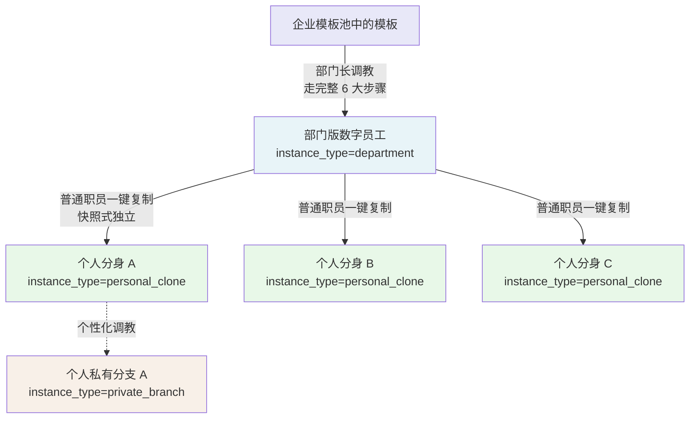
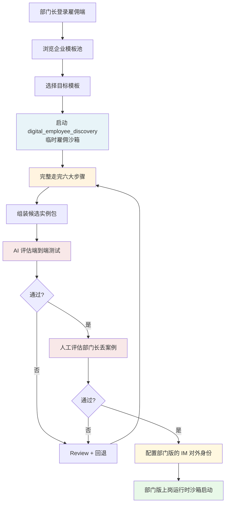
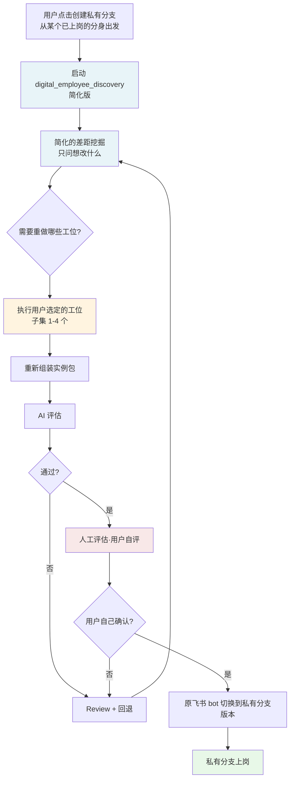
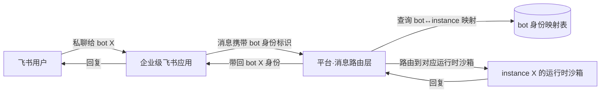
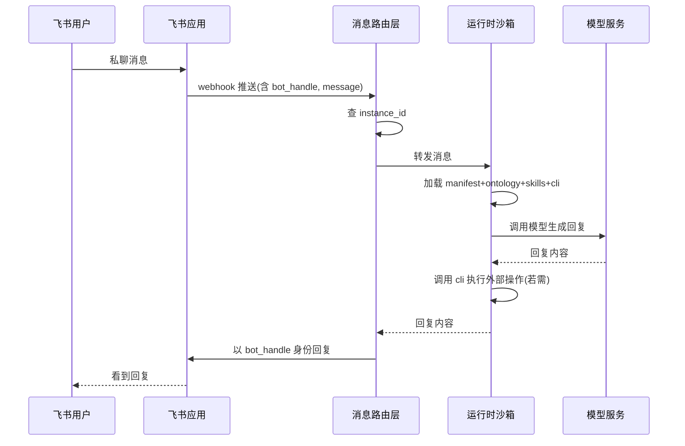
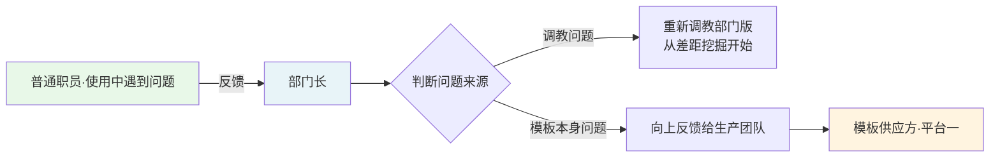
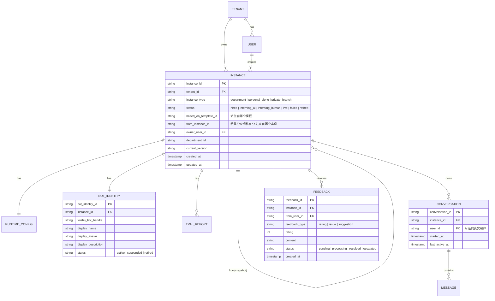
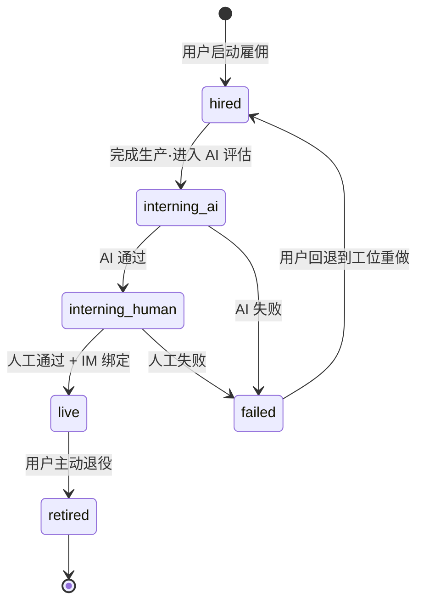
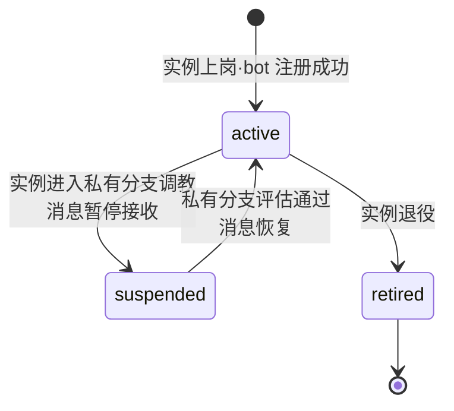

# 雇佣端详细需求规格说明书

> **文档版本**:v1.0  
> **文档定位**:平台三(雇佣平台)的详细需求规格,工程团队据此开发,产品团队据此对齐  
> **读者**:产品团队、工程团队(前端、后端、算法、IM 集成)  
> **配套文档**:《产品设计备忘录》、《构建端详细需求规格说明书》

---

## 第一部分 · 总体说明

## 1. 平台定位

### 1.1 平台基本信息

| 项目 | 内容 |
|---|---|
| 平台名称 | 雇佣平台(雇佣端) |
| 在三平台架构中的位置 | 平台三 |
| 主要使用者 | 企业内的部门长、普通职员 |
| 核心产出 | 运行时数字员工分身(已上岗、可在 IM 中接受任务) |
| 与构建端的关系 | 下游接收方,从企业模板池中获取模板进行实例化 |
| 与平台一的关系 | 下游接收方,接收全局通用模板和创世员工 |

### 1.2 平台核心价值

雇佣端解决的核心问题是:**让企业员工以最低门槛获得能在飞书中实际工作的数字员工分身**。

对部门长而言,雇佣端把已有模板调教为"为我们部门量身定制"的部门版。对普通职员而言,雇佣端让他们一键复制部门版分身,接入个人飞书,通过私聊布置任务获得真实产出。

雇佣端是整个产品体系中**唯一面向业务终端用户**的平台——开箱即用的核心理念在雇佣端必须百分百兑现。

### 1.3 雇佣端与构建端的边界

雇佣端和构建端共用大量底层能力(创世员工、沙箱、雇佣流水线),但产出物本质不同:

| 维度 | 构建端 | 雇佣端 |
|---|---|---|
| 使用者 | 模板管理部门 | 部门长、普通职员 |
| 产出物 | 模板(可被实例化的蓝图) | 实例(直接运行的数字员工) |
| 产出物状态 | 静态资源,存放在模板池 | 动态资源,运行在沙箱中 |
| 评估对象 | 模板的默认实例化结果 | 候选实例包本身 |
| 评估通过后 | 发布到企业模板池 | 实例上岗,接入 IM |
| 是否绑定 IM | 否 | **是,核心动作** |
| 是否涉及分身复制 | 否 | **是,核心动作** |
| 是否涉及私有分支 | 否 | **是** |
| 用户技术门槛 | 中等(模板管理部门有一定专业度) | **极低(开箱即用是底线)** |

**关键理解**:雇佣端跟构建端走的是同一套雇佣流水线(场景匹配 → 五件套生产 → 双阶段评估),但流水线终点产出的是**实例**而非模板;并且雇佣端在实例上岗后还要做**飞书绑定、分身复制、运行时管理**等构建端不涉及的工作。

### 1.4 雇佣端核心子场景

雇佣端服务三类核心子场景,工程实现时需明确区分:

| 子场景 | 主体角色 | 核心动作 | 产出 |
|---|---|---|---|
| **部门版调教** | 部门长 | 走完整六大步骤,把模板实例化为部门版 | 部门版数字员工(已上岗) |
| **分身复制** | 普通职员 | 从部门版一键复制,绑定个人飞书 | 个人分身(已上岗,与母版脱钩) |
| **私有分支** | 普通职员(可选) | 在分身基础上做个性化调教 | 个人版数字员工(仅自己使用) |

---

## 2. 角色与权限

### 2.1 角色清单

| 角色 | 职责 | 关键权限 |
|---|---|---|
| 部门长 | 调教部门版数字员工、参与双阶段评估、处理部门反馈、向上反馈给生产团队 | 可见全部数字员工、调教权、人工评估权 |
| 普通职员 | 复制分身、布置任务、评分、可选创建私有分支 | 仅可见已上岗的、复制权、个人分支权 |

MVP 阶段不再细分角色,简洁为这两类即可。

### 2.2 权限矩阵

| 操作 | 部门长 | 普通职员 |
|---|---|---|
| 浏览企业模板池 | ✓(全部) | ✗ |
| 浏览部门版数字员工 | ✓(全部状态) | ✓(仅已上岗) |
| 启动模板调教(部门版) | ✓ | ✗ |
| 上传调教材料 | ✓(部门级) | ✓(仅私有分支) |
| 启动 AI 评估 | ✓ | ✓(仅私有分支) |
| 执行人工评估 | ✓(部门版) | ✓(仅自己的私有分支) |
| 部门版上岗确认 | ✓ | ✗ |
| 复制分身 | ✓ | ✓ |
| 接入个人飞书 | ✓ | ✓ |
| 私聊布置任务 | ✓ | ✓ |
| 评分 | ✓ | ✓ |
| 接收部门反馈 | ✓ | ✗ |
| 向上反馈给生产团队 | ✓ | ✗ |
| 创建私有分支 | ✓ | ✓ |
| 修改创世员工 | ✗ | ✗ |
| 上传私有 skill | ✗ | ✗ |

### 2.3 数据可见性边界

雇佣端的可见性规则比构建端更严格,因为涉及个人分身的隐私:

| 数据对象 | 部门长可见 | 普通职员可见 |
|---|---|---|
| 部门版本身的运行配置 | ✓ | ✗ |
| 自己产生的对话记录 | ✓(自己的) | ✓(自己的) |
| 他人产生的对话记录 | ✗ | ✗ |
| 自己分身的评分历史 | ✓(自己的) | ✓(自己的) |
| 部门版的聚合反馈 | ✓ | ✗ |
| 私有分支(他人的) | ✗ | ✗ |

**关键原则**:**不同人产生的对话记录、任务执行记录之间完全隔离**——部门长也不能看到下属在飞书里跟数字员工的具体对话内容,只能看到聚合的评分和反馈。

---

## 3. 核心概念定义

### 3.1 数字员工实例的状态

雇佣端的数字员工实例有以下生命周期状态:

| 状态 | 含义 | 可见性 |
|---|---|---|
| `hired` | 已雇佣,刚启动雇佣流程 | 仅雇佣者可见 |
| `interning_ai` | 实习中 - AI 评估阶段 | 仅雇佣者可见 |
| `interning_human` | 实习中 - 人工评估阶段 | 仅雇佣者可见 |
| `live` | 已上岗,可在 IM 中工作 | 部门版对全部门可见;分身和私有分支仅雇佣者可见 |
| `failed` | 评估失败,需 Review 后重试 | 仅雇佣者可见 |
| `retired` | 已退役,不再接受新任务 | 仅雇佣者可见,只读历史记录 |

> **状态映射(对仗用户原始描述)**:用户描述的"已雇佣 / 实习中 / 已上岗"三种状态,在工程上拆分为更细的六个状态——其中"实习中"细分为 AI 评估和人工评估两个子阶段,以便精确管理双阶段评估流程。

### 3.2 部门版 / 分身 / 私有分支三层关系

雇佣端的实例有三种"亲缘关系"形态,工程实现时必须严格区分:



| 实例类型 | 来源 | 谁能创建 | 谁能使用 | 是否双阶段评估 |
|---|---|---|---|---|
| 部门版(department) | 模板调教 | 部门长 | 部门内所有人(通过复制分身) | 是 |
| 个人分身(personal_clone) | 部门版的快照式复制 | 部门长 / 普通职员 | 仅复制者本人 | 否(继承部门版的评估结果) |
| 私有分支(private_branch) | 在分身基础上的个性化调教 | 部门长 / 普通职员 | 仅创建者本人 | 是(评估者=用户自己) |

### 3.3 快照式独立的工程含义

"分身一旦复制即与母版脱钩"——这是核心原则。工程实现要点:

- 复制分身时,**完整拷贝**部门版的五件套到新的存储路径,不使用引用
- 部门版后续若被部门长重新调教,**不会影响**已经复制出去的分身
- 分身被退役、被改造,也**不会影响**部门版

也就是说,**部门版和分身在数据层是完全独立的两个实例**,只在 metadata 中保留 "from_template_instance_id" 这个溯源字段(用于审计和反馈聚合)。

### 3.4 创世员工在雇佣端的调用

雇佣端的整个流程依赖两个创世员工(详细规格见《产品设计备忘录》第五章):

- **digital_employee_discovery**(雇佣教练):引导部门长完成部门版的调教、引导普通职员完成私有分支的调教
- **AI 评估员**:对候选实例包进行端到端评估

> **命名说明**:digital_employee_discovery 与"雇佣教练"是同一对象的不同称呼,工程实现统一以 digital_employee_discovery 为准。

雇佣端**只调用、不修改**创世员工。创世员工的内部结构、子 skill 清单、六大步骤详情参见《产品设计备忘录》第五章和《构建端详细需求规格说明书》第三、六章。

### 3.5 雇佣端的六大步骤形态差异

digital_employee_discovery 的六大步骤在雇佣端的不同子场景下表现略有不同:

| 步骤 | 部门版调教 | 分身复制 | 私有分支调教 |
|---|---|---|---|
| 1 场景匹配 | 完整执行(选模板) | **跳过**(已确定使用某个部门版) | 简化(仅确认想调整的方向) |
| 2 差距挖掘 | 完整执行 | **跳过** | 简化(只挖差异点) |
| 3 manifest_generator | 完整执行 | **跳过** | 仅在用户想改人设时执行 |
| 4 ontology_generator | 完整执行 | **跳过** | 仅在用户想补充知识时执行 |
| 5 skill_generator | 完整执行 | **跳过** | 仅在用户想增减能力时执行 |
| 6 cli_configurator | 完整执行 | **跳过** | 仅在用户想换外部对接时执行 |

**关键设计**:**分身复制完全跳过六大步骤**——这是开箱即用的关键。普通职员复制分身时,流程极简:**选部门版 → 命名分身 → 接入飞书 → 上岗**。整个过程秒级完成,不需要走任何雇佣教练对话。

私有分支则走"按需重做"的逻辑——用户只重做想改的工位,其他工位继承分身的现状。这跟备忘录 6.4 节"评估失败时回退到任意工位"的机制工程上同源。

---

## 第二部分 · 功能需求

## 4. 部门版调教流程(部门长发起)

### 4.1 流程总览



### 4.2 各阶段说明

#### 阶段 1:模板浏览与选择

**功能要求**:
- 部门长可见的模板包括:
  - 全局通用模板(来自平台一,只读)
  - 本企业已发布的模板(来自构建端)
- 支持按场景、关键词搜索
- 支持查看模板详情(人设、能力描述、覆盖场景),不可见模板源代码
- 部门长选定模板后进入调教流程

**与构建端的差异**:雇佣端**不支持"派生模板"**——部门长不能基于现有部门版去创建另一个部门版。如有需要,应通过构建端走标准模板派生流程。

#### 阶段 2-7:完整六大步骤

详见第 6 节,六大步骤的执行规格与构建端基本相同(同一套 digital_employee_discovery),差异在于产出物:

| 维度 | 构建端 | 雇佣端(部门版调教) |
|---|---|---|
| config 中的实例级参数 | 留作占位符 | **填入真实值**(实例 id、归属部门、评估结果等) |
| 产出后状态切换 | 进入模板池(待发布) | 进入运行时沙箱(待上岗) |
| 后续步骤 | 模板发布 | **IM 绑定 + 上岗** |

#### 阶段 8-9:双阶段评估

详见第 7 节。评估对象是候选实例包本身。

#### 阶段 10:IM 绑定

部门版评估通过后,部门长需要为该部门版**配置对外身份**(详见第 9 节飞书集成)。这一步在构建端不存在,是雇佣端独有。

#### 阶段 11:上岗

完成绑定后,系统启动运行时沙箱,部门版正式上岗。状态切换为 `live`,部门内所有职员可见,可被复制分身。

---

## 5. 分身复制流程(普通职员发起)

### 5.1 流程总览


### 5.2 流程极简化要求

分身复制是雇佣端**最高频的操作**,也是"开箱即用"理念的核心体现。要求:

- 整个流程从点击"复制"到完成上岗,**用户操作步骤不超过 3 步**
- 总耗时(含沙箱启动)**P95 ≤ 30 秒**
- **不需要任何对话引导**——digital_employee_discovery 不在分身复制场景中介入
- 用户只需做三件事:**确认复制 → 设个人对外身份 → 绑飞书**

### 5.3 各阶段说明

#### 阶段 1:浏览部门版

**功能要求**:
- 普通职员只能看见**本部门的、状态为 `live` 的**数字员工
- 列表展示:对外身份(display_name + avatar)、能力简介、已被多少人复制使用
- 不可见部门版的内部配置、五件套源文件

#### 阶段 2:确认复制

**功能要求**:
- 一键确认,系统自动:
  - 生成新的 instance_id
  - 在新存储路径下完整拷贝部门版的五件套
  - 设置 instance_type=`personal_clone`、from_template_instance_id 指向母版
  - 不进入双阶段评估(继承母版的评估结果)

#### 阶段 3:配置个人对外身份

**功能要求**:
- 用户必须填写在飞书里这个分身的呈现身份(详见第 9 节)
  - display_name(必填):比如"我的客服小张"
  - display_avatar(可选):默认沿用部门版的头像
  - display_description(可选):简短描述
- 同一用户的不同分身**不能重名**(避免飞书联系人列表混淆)

#### 阶段 4:绑定个人飞书机器码

**功能要求**:
- 系统在统一的企业级飞书应用下,为该分身分配一个独立的 bot 身份
- 用户在飞书联系人列表中看到这个 bot 身份
- 详见第 9 节

#### 阶段 5:上岗

- 启动运行时沙箱(持久化沙箱)
- 加载分身的实例包
- 状态切换为 `live`
- 用户在飞书里给该 bot 发消息即可开始使用

### 5.4 分身的退役与重建

- 用户可主动退役自己的分身,状态切换为 `retired`,运行时沙箱销毁,IM 对外身份解绑
- 退役后,用户可以重新从同一部门版复制一个新分身——这跟"部门版被重新调教"是两件事,前者是用户行为,后者不存在(部门版被重新调教不会影响已有分身)
- 退役后的对话历史保留,只读

---

## 6. 私有分支流程(部门长 / 普通职员可选)

### 6.1 触发条件

私有分支是个**可选的高级功能**——用户用一段时间分身后,觉得某些方面想个性化定制(比如希望它的回复风格更简洁,或想让它了解一些自己的工作偏好),才会触发。

入口:在用户的某个分身的"使用反馈"界面提供"创建私有分支"按钮。

### 6.2 流程总览



### 6.3 关键约束

**1. 评估强度不变**

虽然影响范围只到自己,但 MVP 阶段**仍然要求双阶段评估,不可跳过人工评估**(参见《产品设计备忘录》6.3)。这是产品价值观——企业级数字员工的门槛严格性不因用户规模缩小而降低。

**2. 评估者**

- AI 评估:由 AI 评估员执行,跟部门版评估同构
- 人工评估:**由用户自己执行**——用户在评估界面临场丢案例、看回复、做主观判断

**3. 数据隔离**

- 私有分支的 ontology、对话记录、产出全部归用户私有
- 部门长**不能查看**下属的私有分支内容(包括 ontology 内容)
- 私有分支与他人完全隔离

**4. 飞书侧的处理**

- 私有分支创建后,**沿用原分身的飞书对外身份**(用户不需要在飞书联系人列表里多一个新联系人)
- 系统将该 bot 的消息路由从原分身切换到私有分支版本
- 用户在飞书的体验上,感觉就是"这个员工变聪明/变了一点风格",不是"多了一个员工"

**5. 不可二次分支**

- 用户不能在私有分支基础上再创建私有分支(避免无限套娃)
- 如果用户对私有分支不满意,只能丢弃后重新基于原分身创建一个新的私有分支

### 6.4 私有分支的废弃与回退

- 用户可主动废弃私有分支,系统将该飞书 bot 的消息路由切换回原始分身
- 废弃操作不可撤销,但用户可以重新创建私有分支

---

## 7. 双阶段评估流程

### 7.1 评估流程与构建端的对仗关系

雇佣端的评估流程跟构建端**结构完全相同**(都是 AI 评估端到端 → 人工评估同构验证),区别只在评估对象和评估者:

| 维度 | 构建端 | 雇佣端·部门版 | 雇佣端·私有分支 |
|---|---|---|---|
| 评估对象 | 模板的默认实例化结果 | 候选实例包(部门版) | 候选实例包(私有分支) |
| AI 评估员 | 创世员工 AI 评估员 | 创世员工 AI 评估员 | 创世员工 AI 评估员 |
| 人工评估者 | 模板部门主管 / 模板评估者 | **部门长** | **用户自己** |
| 通过阈值 | 总分 ≥ 75 且无单维度低于 60 | 总分 ≥ 75 且无单维度低于 60 | 总分 ≥ 75 且无单维度低于 60 |

详细评估规格(测试任务集来源、评分维度、报告格式等)参见《构建端详细需求规格说明书》第 7 节。本节只描述雇佣端独有的内容。

### 7.2 测试任务集

雇佣端的评估也需要测试任务集。来源:

| 来源 | 部门版 | 私有分支 |
|---|---|---|
| 模板自带的通用测试集 | ✓ 复用模板的测试集 | ✓ 复用基础分身的测试集 |
| 调教过程中沉淀的测试用例 | ✓ digital_employee_discovery 在六大步骤中引导部门长沉淀至少 5 个真实任务 | ✓ 引导用户沉淀至少 3 个真实任务(简化要求) |
| 人工评估时临场输入的案例 | ✓ 评估完成后自动沉淀回测试集 | ✓ 评估完成后自动沉淀回**该用户私有的**测试集 |

**关键设计**:私有分支的测试集是**用户私有的**,不会回流到部门版的测试集中——保护用户隐私。

### 7.3 评估失败的 Review

跟构建端一致,采用 MVP 简化版方案:

- 仅展示评估报告,不展示包内容
- 提供六个回退按钮(场景匹配、差距挖掘、四个工位)
- 已上传的源文件保留,生成产物重新生成
- 连续失败 3 次后系统主动提示"建议从场景匹配重新梳理"

详见《构建端详细需求规格说明书》第 8 节。

### 7.4 雇佣端独有:评估通过后的"上岗准备"

构建端评估通过后是"等待发布",雇佣端评估通过后是"等待上岗"——这两个动作工程上不同:

| 步骤 | 构建端发布 | 雇佣端上岗 |
|---|---|---|
| 1 | 模板部门主管确认发布 | 用户确认上岗 |
| 2 | 填写模板元数据 | **配置 IM 对外身份(必须)** |
| 3 | 状态切换:human_passed → published | 状态切换:interning_human → live |
| 4 | 同步到雇佣端模板池 | **启动持久化运行时沙箱 + 飞书 bot 注册** |
| 5 | 通知雇佣端有新模板上架 | 用户在飞书联系人列表看到新员工 |

雇佣端的上岗动作详见第 9 节(飞书集成)。

---

## 8. 评估失败处理(Review)

### 8.1 与构建端共用 Review 机制

雇佣端的评估失败处理流程跟构建端**完全相同**——MVP 简化版,提供六个回退按钮,用户盲选回退到哪个工位重做。

详细规格参见《构建端详细需求规格说明书》第 8 节,本节不重复。

### 8.2 雇佣端独有的 Review 触发场景

除了构建端有的"模板生产中评估失败",雇佣端还有一个独有的触发场景:**用户在私有分支调教时评估失败**。

这个场景下:
- 评估者是用户自己,用户对自己的标准
- Review 时用户能看到的报告内容跟部门版评估失败时一致
- 用户可以选择"放弃私有分支"——系统直接销毁未上岗的私有分支,飞书 bot 路由保持在原分身

"放弃私有分支"是私有分支独有的退出路径,部门版调教没有这个出口(因为部门版调教启动后,部门长有责任完成它)。

---

## 9. 飞书集成(雇佣端核心独有章节)

### 9.1 接入模式选型

雇佣端基于飞书企业内部的多 bot 模式实现"一员工接入多个独立数字员工"的体验。

**采用模式**:**模式 C·一企业一应用,多 bot 身份**

| 维度 | 选择内容 |
|---|---|
| 飞书侧应用数量 | 整个企业**一个**自建应用 |
| 飞书机器码 | 整个企业一份机器码 |
| 数字员工对外呈现 | 在企业级应用下注册多个 bot 身份,每个 bot 独立头像、独立名字 |
| 用户飞书联系人列表 | 看到多个独立联系人,每个对应一个数字员工 |
| 群聊接收 | **统一禁用**(应用级配置) |

**为什么不选模式 A(一员工一应用)**:每个分身都需要去飞书后台新建应用,这是飞书后台的运维操作不是平台内的操作,违背开箱即用;且飞书企业自建应用数量有上限,大规模分身会撞配额。

**模式 C 的前提依赖**:**飞书的多 bot 身份能力在试点企业的飞书版本下必须支持**——工程团队接入前必须先与飞书开放平台对接确认。如果飞书版本不支持,需要降级到模式 A 并补充"飞书后台应用自动创建"的能力。

### 9.2 对外身份机制

数字员工的"对外身份"是雇佣端独有的概念,用于在飞书侧呈现:

| 字段 | 必填 | 说明 |
|---|---|---|
| display_name | 是 | 在飞书联系人列表显示的名字(如"客服小张") |
| display_avatar | 否 | 在飞书联系人列表显示的头像;不填则使用 manifest 中的默认头像 |
| display_description | 否 | 短描述(飞书联系人详情里显示) |

**关键区分**:

| 维度 | manifest 中的人设 | 对外身份(display_*) |
|---|---|---|
| 性质 | 它**怎么工作**(角色定位、风格、边界) | 它**怎么被找到**(头像、名字) |
| 归属 | 实例包内部,影响数字员工行为 | 运行时配置,影响 IM 呈现 |
| 修改成本 | 触发评估流程 | 只是 IM 侧的元数据更新 |

这两件事**必须分开存储和管理**,否则修改一个会牵连另一个。

### 9.3 群聊禁用策略

按用户原始需求"不能被拉到同一个群聊",MVP 阶段采用最简单的方案:

- 在企业级飞书应用层面统一配置**只接收 P2P 消息**(私聊消息)
- 群聊消息一律忽略,**不回复**
- 一处配置,所有 bot 身份生效

> **MVP 不做**:更复杂的"被拉群时礼貌拒绝并退群"——这需要 bot 主动行为,工程复杂度高,先不做。

### 9.4 消息路由

模式 C 下,所有 bot 共享同一个企业级应用,工程上需要在平台侧做精细的消息路由:



**bot 身份映射表的关键字段**:

| 字段 | 说明 |
|---|---|
| bot_identity_id | bot 身份唯一标识(平台内分配) |
| feishu_bot_handle | 飞书侧的 bot 身份标识 |
| instance_id | 对应的数字员工实例 id |
| owner_user_id | 这个 bot 归谁所有 |
| display_name | 当前显示名 |
| status | active / suspended / retired |

**消息路由的关键判断**:

- 消息进来时:用 feishu_bot_handle 反查 instance_id,路由到该实例的运行时沙箱
- 消息出去时:用 instance_id 找到对应的 bot_identity,以该身份发回飞书
- 路由失败时(如 instance 已退役):向用户发"这个员工已退役"的标准提示

### 9.5 消息处理时序



**性能要求**:从用户发消息到收到回复,P95 ≤ 8 秒(含模型推理时间)。

### 9.6 异常处理

| 异常场景 | 处理方式 |
|---|---|
| 沙箱冷启动延迟 | 先回复"正在思考...",待真实回复就绪后追加 |
| 沙箱报错 | 向用户发标准错误提示"我遇到了一些问题,稍后请重试",不暴露内部错误 |
| 外部系统(cli)调用超时 | 向用户说明"调用 X 系统超时,请稍后再试" |
| 飞书 webhook 重复投递 | 平台侧做幂等处理,基于 message_id 去重 |
| 用户消息过长 | 截断 + 提示用户"消息过长已截断" |
| 用户上传文件 | MVP 阶段拒收,提示"暂不支持文件,请用文字描述" |

---

## 10. 评分与反馈机制

### 10.1 评分

**功能要求**:
- 用户在飞书私聊中,可以通过指令(如发"/评分")或界面菜单对最近一次回复打分
- 评分范围:1-5 星
- 可附带文字评论(可选)

**评分数据归属**:

| 评分场景 | 评分归谁看 |
|---|---|
| 用户给自己分身的评分 | 主要给用户自己看(决定要不要继续用、要不要做私有分支) |
| 同一部门版下所有分身的评分聚合 | 给部门长看(判断部门版本身好不好用) |
| 私有分支的评分 | 仅用户自己看,不外溢 |

### 10.2 反馈分发



**关键设计**:

- 反馈是**结构化的**(选择反馈类型 + 文字描述 + 关联具体的对话或评分)
- 反馈分发是**单向的、跨层的**——职员→部门长→生产团队,不允许跨级
- 部门长收到反馈后,有责任在合理时间内(MVP 不强制 SLA,但要给出反馈状态:待处理/调教中/已上报)给到职员可见的状态更新

### 10.3 部门长视角的反馈聚合面板

部门长在雇佣端有一个独立面板:

- 部门版数字员工的评分聚合(平均分、分布、趋势)
- 待处理的部门内反馈列表
- 已上报给生产团队的反馈跟踪

**MVP 简化**:不做实时仪表盘,做静态报表即可——每周/每月生成一份。

---

## 第三部分 · 技术规格

## 11. 数据模型

### 11.1 核心实体



### 11.2 关键字段说明

#### INSTANCE 表

| 字段 | 类型 | 说明 |
|---|---|---|
| instance_id | string | 主键 |
| **tenant_id** | string | **多租户隔离字段,MVP 必加** |
| **instance_type** | enum | **department / personal_clone / private_branch** |
| status | enum | hired / interning_ai / interning_human / live / failed / retired |
| based_on_template_id | string | 派生自哪个模板(模板 id) |
| from_instance_id | string | 若是 personal_clone 或 private_branch,记录母实例 id;部门版为空 |
| owner_user_id | string | 实例归属用户(部门版归部门长,分身归职员) |
| department_id | string | 所在部门 |
| current_version | string | 实例的当前版本(私有分支会有版本迭代) |

#### BOT_IDENTITY 表

| 字段 | 类型 | 说明 |
|---|---|---|
| bot_identity_id | string | 主键 |
| instance_id | string | 关联的实例 |
| feishu_bot_handle | string | 飞书侧的 bot 身份标识(对应模式 C 的多 bot 注册结果) |
| display_name | string | 显示名(用户填的,如"我的客服小张") |
| display_avatar | string | 头像 URL |
| status | enum | active / suspended / retired |

**关键约束**:同一 owner_user_id 下的所有 active 状态 BOT_IDENTITY 记录,display_name **必须唯一**(避免飞书联系人列表混淆)。

#### CONVERSATION 和 MESSAGE 表

存储对话历史。**关键隔离原则**:

- conversation 必须按 instance_id + user_id 双重隔离
- 部门长不能查询非自己 owner_user_id 的 conversation
- 跨租户查询绝对禁止

#### FEEDBACK 表

存储反馈链路。

### 11.3 多租户隔离要求

跟构建端要求一致:
- 所有业务数据表必须包含 `tenant_id` 字段
- 所有查询必须始终携带 tenant_id 过滤条件
- 文件存储路径按 tenant_id 隔离

### 11.4 个人数据隐私保护

雇佣端涉及大量个人对话数据,额外要求:

- CONVERSATION 和 MESSAGE 数据必须有**用户级别的可见性控制**——即使在同一租户内,A 用户也不能查询 B 用户的对话
- 部门长对部门版的"反馈聚合"权限,**仅限于看聚合统计,不能下钻到具体对话内容**
- 私有分支的 ontology 内容、对话内容只对 owner_user_id 可见

---

## 12. 接口规格

### 12.1 与构建端的接口

#### 12.1.1 模板池查询

```
GET /api/templates
Query params:
  - tenant_id: required
  - source: optional (global | tenant | all)
  - keyword: optional
  - status: required (published)
```

返回字段:见构建端规格 11.1.1 节。

#### 12.1.2 模板详情加载

```
GET /api/templates/{template_id}
```

雇佣端在选定模板进入调教时调用,加载完整五件套用于实例化。

### 12.2 与创世员工的接口

#### 12.2.1 启动 digital_employee_discovery

```
POST /api/coach/start
Body:
  - tenant_id
  - user_id
  - mode: "hire_department" | "hire_personal_clone" | "hire_private_branch"
  - based_on_template_id: 当 mode=hire_department 时必填
  - based_on_instance_id: 当 mode=hire_personal_clone 或 hire_private_branch 时必填
```

**关键差异(对比构建端)**:`mode` 字段取值不同——构建端是 `build_template`,雇佣端是 `hire_*`。digital_employee_discovery 据此知道流水线的产出物类型和执行深度。

特别地:
- `hire_personal_clone` 模式下,digital_employee_discovery 跳过六大步骤,直接进入实例化和 IM 绑定
- `hire_private_branch` 模式下,简化执行差距挖掘,按需调用工位

#### 12.2.2 启动 AI 评估员

```
POST /api/evaluator/start
Body:
  - tenant_id
  - target_type: "instance"
  - target_id: instance_id
  - test_case_set_id
```

跟构建端的 evaluator/start 共用接口,只是 target_type 不同。

### 12.3 与飞书的接口

#### 12.3.1 注册 bot 身份

```
POST /api/feishu/bot-identity
Body:
  - tenant_id
  - instance_id
  - display_name
  - display_avatar (optional)
  - display_description (optional)
```

平台底层会调用飞书开放平台 API,在企业级应用下注册一个新的 bot 身份。返回 feishu_bot_handle。

#### 12.3.2 接收消息(webhook)

飞书将私聊消息推送到平台:

```
POST /api/feishu/webhook (由飞书调用)
Body: 飞书标准 webhook payload(含 bot_handle、message 内容、用户 id 等)
```

平台据此查 instance_id,路由到对应运行时沙箱。

#### 12.3.3 发送消息

平台向飞书发送回复:

```
POST 飞书 API: 发送消息
携带:
  - bot_handle (作为发送者身份)
  - 用户 id (作为接收者)
  - 消息内容
```

#### 12.3.4 退役 bot 身份

```
DELETE /api/feishu/bot-identity/{bot_identity_id}
```

平台底层调用飞书 API 注销该 bot 身份。

---

## 13. 非功能性需求

### 13.1 性能要求

雇佣端是面向终端用户的运行时平台,性能要求比构建端更严格:

| 场景 | 指标要求 |
|---|---|
| 模板池查询 | P95 ≤ 500ms |
| 部门版调教对话回复(digital_employee_discovery) | P95 ≤ 5s |
| 分身复制全流程(从点击到飞书可用) | **P95 ≤ 30s**(开箱即用关键指标) |
| 飞书消息收到 → 回复发出 | **P95 ≤ 8s**(含模型推理) |
| 文件上传(10 MB,仅私有分支调教时使用) | P95 ≤ 10s |
| AI 评估完成 | 10 个用例 P95 ≤ 5 分钟 |
| 沙箱冷启动 | P95 ≤ 10s |

### 13.2 安全要求

#### 13.2.1 数据隔离

跟构建端要求一致(多租户、tenant_id 强制过滤),并加强:

- **用户级隔离**:同租户内 A 用户不能访问 B 用户的实例、对话、反馈
- **部门长的越权防护**:部门长对部门版有调教权,但不能访问部门内其他成员的私有分支和个人对话

#### 13.2.2 敏感信息处理

- 部门版的 cli 配置中的敏感字段(API key 等)加密存储
- 对话内容中可能包含的敏感业务信息,平台侧不做内容审查,但日志中需脱敏

#### 13.2.3 飞书侧安全

- 企业级飞书应用的 app_secret 必须加密存储,定期轮换
- 飞书 webhook 必须校验签名,防止伪造请求
- bot 身份的注册/注销操作记录审计日志

### 13.3 可观测性要求

- 所有飞书消息流转可追溯(从飞书 webhook 进 → 路由 → 沙箱处理 → 回复发出)
- 所有沙箱生命周期事件可追溯
- 所有评估过程的输入输出可追溯
- 关键操作(创建实例、复制分身、上岗、退役、私有分支创建)有审计日志

### 13.4 资源约束(MVP 阶段)

#### 13.4.1 持久化沙箱

雇佣端的运行时沙箱是**持久化沙箱**——这是雇佣端独有的概念:

- 一旦实例上岗,运行时沙箱长期在线接收消息
- MVP 阶段建议采用**消息唤醒模式**:沙箱按需启动,处理完消息后休眠,下次消息再唤醒
- 上下文(对话历史)外置存储,不依赖沙箱内存
- 单实例的运行时沙箱内存:运行时 ≤ 2 GB,休眠时不占用计算资源

#### 13.4.2 飞书 bot 数量约束

- 单租户活跃 bot 身份数量:MVP 阶段建议 ≤ 1000(超过需要做配额监控和限流)
- 单租户每秒消息数:受飞书应用级配额限制,MVP 阶段做监控,不主动限流

#### 13.4.3 临时沙箱

- 雇佣沙箱(部门长调教中)、评估沙箱、被评估沙箱:跟构建端要求一致
- 单租户同时存在的临时沙箱数量:建议 20 个(雇佣端的并发度比构建端高)

### 13.5 创世员工资产隔离要求

跟构建端一致——**创世员工的代码和数据存储路径独立于业务实例**,雇佣端只调用、不修改。

详见《产品设计备忘录》7.1。

---

## 第四部分 · MVP 边界与排期建议

## 14. MVP 范围明确

### 14.1 MVP 必做清单

| 模块 | 优先级 |
|---|---|
| 部门长视角的部门版调教完整流程(完整六大步骤) | P0 |
| 普通职员视角的分身一键复制流程 | P0 |
| 飞书集成(模式 C 的多 bot 身份机制) | P0 |
| 飞书消息路由(bot↔instance 映射) | P0 |
| 群聊统一禁用 | P0 |
| 双阶段评估流程(部门版) | P0 |
| 评估失败简化 Review | P0 |
| 持久化运行时沙箱 | P0 |
| 部门版 / 分身 / 私有分支三层关系建模 | P0 |
| 多租户隔离基础 | P0 |
| 用户级数据隔离(对话内容、私有分支) | P0 |
| 评分与反馈基础(评分 + 文字反馈) | P1 |
| 私有分支调教流程 | P1 |
| 反馈分发(职员→部门长→生产团队) | P1 |

P0 是必须做的,P1 是 MVP 阶段强烈建议做的(没有这些功能,产品价值大打折扣)。

### 14.2 MVP 不做清单(明确推迟)

| 模块 | 推迟原因 |
|---|---|
| 飞书群聊接收 / 群聊任务 | 与"一对一私聊"原则冲突 |
| 数字员工之间的协作 | 与原始需求"不需要协作"一致 |
| 多 IM 渠道支持(钉钉、企业微信等) | MVP 聚焦飞书 |
| 部门长越权访问部门成员对话 | 与隐私保护原则冲突 |
| 实时仪表盘(评分、使用量) | MVP 用静态报表 |
| 私有分支的二次分支 | 避免无限套娃 |
| 用户上传私有 skill | 与"不允许过度自由"原则冲突 |
| 跨部门的分身共享 | 与数据隔离原则冲突 |
| 部门版的灰度升级 | 分身快照式独立,不存在级联升级 |

### 14.3 MVP 边界守护

下列情况出现需要警惕:

- 用户要求"我能不能让两个数字员工拉群一起讨论我的问题"——**拒绝**,违背一对一私聊原则
- 用户要求"我能不能在飞书群里 @ 数字员工让它回复"——**拒绝**,违背群聊禁用原则
- 用户要求"我能不能在分身里直接写一段 skill 代码"——**拒绝**,违背"不允许过度自由"原则
- 部门长要求"我想看一下下属跟数字员工的对话"——**拒绝**,违背隐私保护原则
- 用户要求"我能不能在私有分支基础上再分支一次"——**拒绝**,避免无限套娃

### 14.4 与构建端的协同边界

- 雇佣端**不实现模板的生产能力**——所有模板必须来自构建端或平台一
- 雇佣端**不修改创世员工**——平台一全权管理
- 雇佣端的反馈通道是**单向输出**给构建端和平台一,不接收它们的运行时控制

---

## 15. 关键风险点

| 风险 | 影响 | 应对 |
|---|---|---|
| 飞书的多 bot 身份能力不支持 | 模式 C 整个方案不可行 | 工程团队接入前**优先确认**飞书侧能力,准备模式 A 降级方案 |
| 飞书企业应用配额撞上限 | 大规模 bot 注册失败 | MVP 阶段做配额监控,接近上限时告警 |
| 持久化沙箱的资源消耗 | 大量分身在线推高成本 | 采用消息唤醒模式,休眠时不占用计算资源 |
| 用户对"快照式独立"的认知差 | 用户期待"母版升级我也升级",实际上不会发生 | 产品文案明确说明,UI 上提示分身的独立性 |
| 私有分支的隐私边界被部门长越权 | 严重的信任崩塌 | 在数据库 ACL 层面强制隔离,代码评审重点关注 |
| 群聊禁用未彻底,用户被拉群后 bot 异常回复 | 信息泄漏风险 | 应用层硬编码群聊消息忽略,加单元测试覆盖 |
| 部门版调教完成后部门长不上岗 | 资源占用、用户困惑 | 提供"放弃此次雇佣"的明确出口,定期清理超时未上岗的实例 |

---

## 附录 A:核心状态机

### A.1 数字员工实例状态流转



### A.2 BOT_IDENTITY 状态流转



---

## 附录 B:关键决策追溯

| 决策 | 来源 |
|---|---|
| 一对一私聊,不支持群聊 | 用户原始需求 |
| 一员工接入多个独立数字员工 | 用户原始需求 |
| 飞书侧采用模式 C(一应用多 bot) | 讨论中决策(开箱即用 + 运维成本权衡) |
| 分身快照式独立,不级联升级 | 用户简化决策(无迭代逻辑) |
| 私有分支必须双阶段评估 | 用户原始需求(企业级严格门槛) |
| 私有分支评估者=用户自己 | 讨论中决策(影响范围只到自己) |
| 部门长不能越权访问下属对话 | 讨论中决策(隐私保护) |
| 评分主要给用户自己看 | 讨论中决策 |
| 反馈分层分发,不可跨级 | 用户原始需求("逐一确认,不可跨级") |
| 不允许私有分支二次分支 | 讨论中决策(避免无限套娃) |

---

**文档结束**
