# 雇佣端详细需求规格说明书

> **文档版本**: v4.0（新增：站内对话、多平台 IM 接入）
> **文档定位**: 平台三(雇佣平台)的详细需求规格，工程团队据此开发，产品团队据此对齐
> **读者**: 产品团队、工程团队(前端、后端、算法、IM 集成)
> **相较 v3.0 的变更**: 新增 10.站内对话；第 9 节由"飞书集成"扩展为"多平台 IM 集成（飞书/钉钉/企微）"；更新数据模型、接口规格、MVP 范围

---

## 目录

**第一部分 · 总体说明**

- [1. 平台定位](#1-平台定位)
  - [1.1 平台基本信息](#11-平台基本信息)
  - [1.2 平台核心价值](#12-平台核心价值)
  - [1.3 雇佣端与构建端的边界](#13-雇佣端与构建端的边界)
  - [1.4 雇佣端核心子场景](#14-雇佣端核心子场景)
- [2. 角色与权限](#2-角色与权限)
  - [2.1 角色清单](#21-角色清单)
  - [2.2 权限矩阵](#22-权限矩阵)
  - [2.3 数据可见性边界](#23-数据可见性边界)
- [3. 核心概念定义](#3-核心概念定义)
  - [3.1 数字员工实例的状态](#31-数字员工实例的状态)
  - [3.2 部门员工 / 我的分身 / 私人定制三层关系](#32-部门员工--我的分身--私人定制三层关系)
  - [3.3 快照式独立的工程含义](#33-快照式独立的工程含义)
  - [3.4 创世员工在雇佣端的调用](#34-创世员工在雇佣端的调用)
  - [3.5 对话渠道定义](#35-对话渠道定义)
  - [3.6 沙箱模型](#36-沙箱模型)

**第二部分 · 功能需求**

- [4. 部门版雇佣流程（部门长发起）](#4-部门版雇佣流程部门长发起)
  - [流程总览](#流程总览)
  - [4.1 模板浏览与选择](#41-模板浏览与选择)
  - [4.2 雇佣一名数字员工](#42-雇佣一名数字员工)
    - [4.2.1 雇佣教练的会话初始化](#421-雇佣教练的会话初始化)
    - [4.2.2 雇佣环节四阶段装配过程](#422-雇佣环节四阶段装配过程)
    - [4.2.3 雇佣教练的 Skill 结构](#423-雇佣教练的skill结构)
    - [4.2.4 雇佣流程时序图](#424-雇佣流程时序图)
  - [4.3 AI 评估环节](#43-ai-评估环节)
    - [4.3.1 AI 评估流程与构建端的对仗关系](#431-ai-评估流程与构建端的对仗关系)
    - [4.3.1.1 AI 评估员工作流程](#4311-ai-评估员工作流程)
    - [4.3.2 测试任务集](#432-测试任务集)
    - [4.3.2.1 测试用例的来源与兜底机制](#4321-测试用例的来源与兜底机制)
    - [4.3.3 AI 评估失败的 Review](#433-ai-评估失败的-review)
    - [4.3.3.1 MVP 简化版方案](#4331-mvp-简化版方案)
    - [4.3.3.2 Review 界面规格](#4332-review-界面规格)
    - [4.3.3.3 AI 评估失败次数兜底](#4333-ai-评估失败次数兜底)
  - [4.4 人工评估环节](#44-人工评估环节)
    - [4.4.1 功能入口](#441-功能入口)
    - [4.4.2 页面元素](#442-页面元素)
    - [4.4.3 评估机制](#443-评估机制)
    - [4.4.4 评估结果处理](#444-评估结果处理)
    - [4.4.5 私有分支的人工评估](#445-私有分支的人工评估)
    - [4.4.6 发布到部门员工列表](#446-发布到部门员工列表)
  - [4.5 分身复制流程（部门长 / 普通成员发起）](#45-分身复制流程部门长--普通成员发起)
    - [4.5.1 流程总览](#451-流程总览)
    - [4.5.2 流程极简化要求](#452-流程极简化要求)
    - [4.5.3 各阶段说明](#453-各阶段说明)
    - [4.5.4 分身的退役、删除与重建](#454-分身的退役删除与重建)
- [5. 私有分支流程（部门长 / 普通成员可选）](#5-私有分支流程部门长--普通成员可选)
  - [5.1 触发条件](#51-触发条件)
  - [5.2 流程总览](#52-流程总览)
  - [5.3 关键约束](#53-关键约束)
  - [5.4 私有分支的废弃与回退](#54-私有分支的废弃与回退)
- [6. 数字员工的两种使用渠道](#6-数字员工的两种使用渠道)
  - [6.1 功能定位](#61-功能定位)
  - [6.2 平台会话进入方式](#62-平台会话进入方式)
  - [6.2A 拉起 IM 进入方式](#62a-拉起-im-进入方式)
  - [6.3 平台会话功能要求](#63-平台会话功能要求)
  - [6.4 性能要求](#64-性能要求)
  - [6.5 两种渠道对比](#65-两种渠道对比)
- [7. 多平台 IM 集成（飞书 / 钉钉 / 企微）](#7-多平台-im-集成飞书--钉钉--企微)
  - [7.1 多平台接入概述](#71-多平台接入概述)
  - [7.2 各平台接入模式与凭证](#72-各平台接入模式与凭证)
    - [7.2.1 飞书接入](#721-飞书接入)
    - [7.2.2 钉钉接入](#722-钉钉接入)
    - [7.2.3 企业微信（企微）接入](#723-企业微信企微接入)
  - [7.3 消息路由](#73-消息路由)
  - [7.4 消息处理时序](#74-消息处理时序)
  - [7.5 异常处理](#75-异常处理)
  - [7.6 IM 配置的快捷入口](#76-im-配置的快捷入口)

**第三部分 · 技术规格**

- [8. 数据模型](#8-数据模型)
  - [8.1 核心实体](#81-核心实体)
  - [8.2 关键字段说明](#82-关键字段说明)
  - [8.3 多租户隔离要求](#83-多租户隔离要求)
  - [8.4 个人数据隐私保护](#84-个人数据隐私保护)
- [9. 接口规格](#9-接口规格)
  - [9.1 与构建端的接口](#91-与构建端的接口)
    - [9.1.1 模板池查询](#911-模板池查询)
    - [9.1.2 模板详情加载](#912-模板详情加载)
  - [9.2 与创世员工的接口](#92-与创世员工的接口)
    - [9.2.1 启动雇佣教练](#921-启动雇佣教练)
    - [9.2.2 启动 AI 评估员](#922-启动-ai-评估员)
    - [9.2.3 轮询评估进度](#923-轮询评估进度)
    - [9.2.4 提交人工评估结论](#924-提交人工评估结论)
  - [9.3 站内对话接口](#93-站内对话接口)
  - [9.4 多平台 IM 接口](#94-多平台-im-接口)
  - [9.5 实例生命周期管理接口](#95-实例生命周期管理接口)
    - [9.5.1 浏览实例列表](#951-浏览实例列表)
    - [9.5.2 创建个人分身（快照复制）](#952-创建个人分身快照复制)
    - [9.5.3 发布实例上岗](#953-发布实例上岗)
    - [9.5.4 退役实例](#954-退役实例)
    - [9.5.4A 彻底删除实例](#954a-彻底删除实例)
    - [9.5.5 创建私有分支](#955-创建私有分支)
    - [9.5.6 废弃私有分支](#956-废弃私有分支)
- [10. 非功能性需求](#10-非功能性需求)
  - [10.1 性能要求](#101-性能要求)
  - [10.2 安全要求](#102-安全要求)
    - [10.2.1 数据隔离](#1021-数据隔离)
    - [10.2.2 敏感信息处理](#1022-敏感信息处理)
    - [10.2.3 IM 侧安全](#1023-im-侧安全)
  - [10.3 可观测性要求](#103-可观测性要求)
  - [10.4 资源约束（MVP 阶段）](#104-资源约束mvp-阶段)
    - [10.4.1 持久化沙箱](#1041-持久化沙箱)
    - [10.4.2 上下文存储约束](#1042-上下文存储约束)
    - [10.4.3 AI 评估训练循环资源约束](#1043-ai-评估训练循环资源约束)
    - [10.4.4 IM 应用数量说明](#1044-im-应用数量说明)

**第四部分 · MVP 边界与排期建议**

- [11. MVP 范围明确](#11-mvp-范围明确)
  - [11.1 MVP 必做清单](#111-mvp-必做清单)
  - [11.2 MVP 不做清单（明确推迟）](#112-mvp-不做清单明确推迟)
  - [11.3 MVP 边界守护](#113-mvp-边界守护)
  - [11.4 与构建端的协同边界](#114-与构建端的协同边界)
- [12. 关键风险点](#12-关键风险点)

**附录**

- [附录 A：核心状态机](#附录-a核心状态机)
  - [A.1 数字员工实例状态流转](#a1-数字员工实例状态流转)
  - [A.2 IM_CONFIG 状态流转](#a2-im_config-状态流转)
- [附录 B：关键决策追溯](#附录-b关键决策追溯)
- [附录 C：术语与枚举定义](#附录-c术语与枚举定义)
  - [C.1 channel（对话渠道）](#c1-channel对话渠道)
  - [C.2 instance_status（实例状态）](#c2-instance_status实例状态)
  - [C.3 im_config_status（IM 配置状态）](#c3-im_config_statusim-配置状态)
  - [C.4 instance_type（实例类型）](#c4-instance_type实例类型)
- [附录 D：实例 × 渠道 × IM_CONFIG 三维行为矩阵](#附录-d实例--渠道--im_config-三维行为矩阵)
  - [D.1 主路由矩阵（instance_status × channel）](#d1-主路由矩阵instance_status--channel)
  - [D.2 IM 渠道子矩阵（instance_status = live 时）](#d2-im-渠道子矩阵instance_status--live-时)
  - [D.3 实例类型特殊路由规则](#d3-实例类型特殊路由规则)
  - [D.4 复合异常状态优先级](#d4-复合异常状态优先级)
- [附录 E：雇佣教练 Skill 架构与调用机制](#附录-e雇佣教练-skill-架构与调用机制)
- [附录 F：评估专家系统 Skill 架构与评估机制](#附录-f评估专家系统-skill-架构与评估机制)

---

## 第一部分 · 总体说明

## 1. 平台定位

### 1.1 平台基本信息

| 项目 | 内容 |
|---|---|
| 平台名称 | 雇佣平台（雇佣端） |
| 在三平台架构中的位置 | 平台三 |
| 主要使用者 | 企业内的部门长、普通成员 |
| 核心产出 | 运行时数字员工分身（已上岗、可在站内或 IM 中接受任务） |
| 与构建端的关系 | 下游接收方，从企业模板池中获取模板进行实例化 |
| 与平台一的关系 | 下游接收方，接收全局通用模板和创世员工 |

### 1.2 平台核心价值

雇佣端解决的核心问题是：**让企业员工以最低门槛获得能在平台内和 IM 中实际工作的数字员工分身**。

对部门长而言，雇佣端把已有模板雇佣为本部门可复用的"部门员工"。对部门长和普通成员而言，雇佣端让他们从部门员工创建自己的分身，通过**站内对话**直接在平台内布置任务，也可按需接入 IM 进行外部通信。

雇佣端是整个产品体系中**唯一面向业务终端用户**的平台——开箱即用的核心理念在雇佣端必须百分百兑现。

### 1.3 雇佣端与构建端的边界

雇佣端和构建端共用大量底层能力（创世员工、沙箱、雇佣流水线），但产出物本质不同：

| 维度 | 构建端 | 雇佣端 |
|---|---|---|
| 使用者 | 模板管理部门 | 部门长、普通成员 |
| 产出物 | 模板（可被实例化的蓝图） | 实例（直接运行的数字员工） |
| 产出物状态 | 静态资源，存放在模板池 | 动态资源，运行在沙箱中 |
| 评估对象 | 模板的默认实例化结果 | 四阶段装配完成后的完整实例配置 |
| 评估通过后 | 发布到企业模板池 | 实例上岗，接入站内对话 + 可选 IM |
| 是否绑定 IM | 否 | 是，可选核心动作 |
| 是否支持站内对话 | 否 | **是，主要对话渠道** |
| 是否涉及分身复制 | 否 | **是，核心动作** |
| 是否涉及私有分支 | 否 | **是** |
| 用户技术门槛 | 中等（模板管理部门有一定专业度） | **极低（开箱即用是底线）** |

**关键理解**：雇佣端跟构建端走的是同一套雇佣流水线（场景匹配 → 实例包生产 → 双阶段评估），但流水线终点产出的是**实例**而非模板；并且雇佣端在实例上岗后还要做**站内对话、IM 绑定（可选）、分身复制、运行时管理**等构建端不涉及的工作。

**实例包结构**：每个数字员工实例包含 3 个目录 + 3 个文件，与构建端包格式完全对齐：

| 组件 | 类型 | 说明 |
|---|---|---|
| **config/** | 目录 | 人格配置层：定义这个员工是什么人。包含 `IDENTITY.md`（外显身份与人格气质）、`SOUL.md`（价值取向与行为准则）、`MEMORY.md`（记忆约束）、`AGENTS.md`（代理行为规则），对话期间可被用户授权修改 |
| **ontology/** | 目录 | 本体知识层：业务知识本体切片，是员工上岗前已具备的行业知识底座，来源于 `ontology-extraction` 的产出 |
| **skill/** | 目录 | 技能层：全部技能定义，包含编排中枢技能与各执行子技能（`ontology-extraction`、`skill-generation`、`external-config` 等） |
| **manifest.json** | 文件 | 数字员工身份档案：名称、使命、负责范围、自主权级别、绝不能事项 |
| **describe.md** | 文件 | 数字员工能力描述：面向外部的功能说明，供模板池展示和搜索使用 |
| **README.md** | 文件 | 包说明文档：结构说明、版本信息、使用注意事项 |

### 1.4 雇佣端核心子场景

雇佣端服务四类核心子场景，工程实现时需明确区分：

| 子场景 | 主体角色 | 核心动作 | 产出 |
|---|---|---|---|
| **部门版雇佣** | 部门长 | 走完整六大步骤，把模板实例化为部门员工 | 部门员工（已上岗） |
| **分身复制** | 部门长 / 普通成员 | 从部门员工创建个人分身，可选配置 IM | 我的分身（已上岗，与母版脱钩） |
| **私有分支** | 部门长 / 普通成员（可选） | 在"我的分身"基础上做个性化定制 | 私人定制（仅自己使用） |

---

## 2. 角色与权限

### 2.1 角色清单

| 角色 | 职责 | 关键权限 |
|---|---|---|
| 部门长 | 浏览企业模板池、发起部门版雇佣、参与双阶段评估、管理部门数字员工、创建分身 | 可见企业模板池、部门数字员工全部状态、人工评估权、创建分身权 |
| 普通成员 | 从部门员工创建分身、站内对话、评分、可选创建私有分支、可选配置 IM | 仅可见已上岗的部门员工、创建分身权、个人分支权 |

MVP 阶段不再细分角色，简洁为这两类即可。

### 2.2 权限矩阵

| 操作 | 部门长 | 普通成员 |
|---|---|---|
| 浏览企业模板池 | ✓（全部） | ✗ |
| 浏览"部门数字员工"中的部门员工 | ✓（全部状态） | ✓（仅已上岗） |
| 启动模板雇佣（部门版） | ✓ | ✗ |
| 上传雇佣 / 定制材料 | ✓（部门级） | ✓（仅私有分支） |
| 启动 AI 评估 | ✓ | ✓（仅私有分支） |
| 执行人工评估 | ✓（部门员工） | ✓（仅自己的私有分支） |
| 部门员工上岗确认 | ✓ | ✗ |
| 创建分身 | ✓ | ✓ |
| **站内对话** | **✓** | **✓** |
| 配置 IM（飞书/钉钉/企微） | ✓ | ✓ |
| 私聊布置任务（IM） | ✓ | ✓ |
| 评分 | ✓ | ✓ |
| 创建私有分支 | ✓ | ✓ |
| 修改创世员工 | ✗ | ✗ |
| 上传私有 skill | ✗ | ✗ |

### 2.3 数据可见性边界

| 数据对象 | 部门长可见 | 普通成员可见 |
|---|---|---|
| 部门员工本身的运行配置 | ✓ | ✗ |
| 自己产生的对话记录（站内 + IM） | ✓（自己的） | ✓（自己的） |
| 他人产生的对话记录 | ✗ | ✗ |
| 自己分身的评分历史 | ✓（自己的） | ✓（自己的） |
| 部门员工的评分聚合 | ✓ | ✗ |
| 私有分支（他人的） | ✗ | ✗ |

**关键原则**：**不同人产生的对话记录、任务执行记录之间完全隔离**——部门长也不能看到下属的具体对话内容，只能看到聚合的评分信息。

---

## 3. 核心概念定义

### 3.1 数字员工实例的状态

| 状态 | 含义 | 可见性 |
|---|---|---|
| `hired` | 已雇佣，刚启动雇佣流程 | 仅雇佣者可见 |
| `interning_ai` | 实习中 - AI 评估阶段 | 仅雇佣者可见 |
| `interning_human` | 实习中 - 人工评估阶段 | 仅雇佣者可见 |
| `live` | 已上岗，可在站内对话和 IM 中工作 | 部门员工对全部门可见；分身和私有分支仅雇佣者可见 |
| `error` | 上岗后沙箱连续 3 次冷启动失败，实例暂时不可用；IM 消息进入重试队列，站内对话提示异常 | 仅雇佣者可见；平台运维可见（用于告警处理） |
| `failed` | 评估失败，需 Review 后重试 | 仅雇佣者可见 |
| `retired` | 已退役，不再接受新任务 | 仅雇佣者可见，只读历史记录 |

### 3.2 部门员工 / 我的分身 / 私人定制三层关系

雇佣端的实例有三种"亲缘关系"形态：

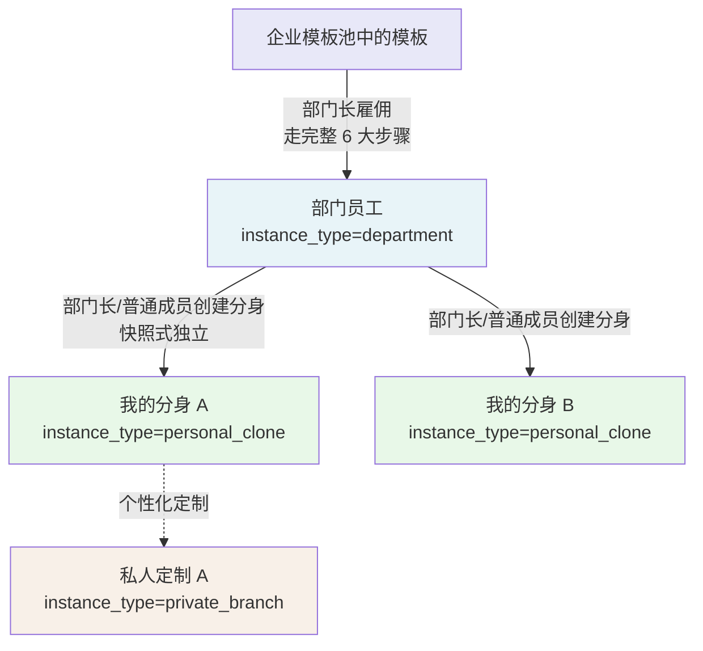

| 实例类型 | 来源 | 谁能创建 | 谁能使用 | 是否双阶段评估 | IM 配置 |
|---|---|---|---|---|---|
| 部门员工（department） | 模板雇佣 | 部门长 | 部门内所有人（通过创建分身） | 是 | **无**，部门员工不配置 IM |
| 我的分身（personal_clone） | 部门员工的快照式复制 | 部门长 / 普通成员 | 仅创建者本人 | 否（继承部门员工的评估结果） | **可选**，分身 owner 自行配置，每平台独立 |
| 私人定制（private_branch） | 在"我的分身"基础上的个性化定制 | 部门长 / 普通成员 | 仅创建者本人 | 是（评估者=用户自己） | **复用原分身的 IM 配置** |

### 3.3 快照式独立的工程含义

"分身一旦创建即与母版脱钩"——这是核心原则。工程实现要点：

- 创建分身时，**完整拷贝**部门员工的实例包（config / ontology / skill 目录及 manifest.json / describe.md / README.md）到新的存储路径，不使用引用
- 部门员工后续若被部门长重新雇佣，**不会影响**已经创建出去的分身
- 分身被退役、被改造，也**不会影响**部门员工

**部门员工和分身在数据层是完全独立的两个实例**。

### 3.4 创世员工在雇佣端的调用

雇佣端的整个流程依赖两个创世员工：

- **employee_coach_conversation**（雇佣教练）：以数字员工的身份参与整个雇佣过程，引导部门长完成部门版雇佣。
- **AI 评估员**：以数字员工的身份对完整实例配置进行端到端评估，底层逻辑与 雇佣教练 相同，承载方式也是同一包格式（config / ontology / skill + manifest.json / describe.md / README.md）

雇佣端**只调用、不修改**创世员工。

#### 雇佣教练 的定位

雇佣教练**本身就是一个数字员工**，不是工具，也不是流程引擎。对外身份名为 雇佣教练，温和、利落、专业，与用户是**并肩装配**的关系，不是上下级。核心立场：不替用户擅自下业务结论，不接受模糊描述混过去，追求"能被下游直接执行"的明确度。

#### 三个执行子技能

`digital_employee_discovery` 在装配过程中按需调用三个执行子技能：

| 子技能 | 触发阶段 | 产物 |
|---|---|---|
| **ontology-extraction** | 资料阶段就绪后 | 本体切片 + 自动生成测试用例 |
| **skill-generation** | 技能阶段就绪后 | 技能配置包 |
| **external-config** | 外部系统阶段就绪后 | 外部系统配置草案 |

> 三个子技能的调用机制、Handoff 工单协议与完整信号流转，见**附录 E：雇佣教练 Skill 架构与调用机制**。

`ontology-extraction` 在产出本体切片的同时，自动生成测试用例（覆盖三类：实体识别、动作执行、约束合规，其中约束合规优先级最高），直接传入 AI 评估环节使用。

### 3.5 对话渠道定义

v4.0 起，数字员工支持两类对话渠道，用户可按需选择，上岗后默认提供第一类：

| 渠道 | 入口 | 说明 | 是否需要额外配置 |
|---|---|---|---|
| **平台会话** | 我的员工列表 → 点击员工卡片 | 在雇佣端平台内嵌界面直接对话，上岗即可用 | **否，上岗即开放** |
| **IM 渠道** | ① 平台员工卡片 / 详情页 → "去 {平台名}"按钮（拉起 IM）；② 用户自行在 IM 应用中找到机器人（直接私聊） | 在飞书 / 钉钉 / 企微中与员工私聊；两种入口本质相同，共用同一 IM 上下文 | 需先完成 IM 注册（凭证回填 + 连接成功） |

**两种渠道的关系说明**：
- "平台会话"与"IM 渠道"是**独立的对话上下文**，消息历史互不共享
- 同一员工可同时开启两类渠道，各渠道底层共用同一运行时沙箱
- "拉起 IM"和"直接在 IM 私聊"是 IM 渠道的**两种入口**，上下文完全共用，不是独立渠道

### 3.6 沙箱模型

#### 基本原则

| 原则 | 说明 |
|---|---|
| **一任务一沙箱** | 每个雇佣任务（部门雇佣或私有分支定制）分配一个永久 雇佣教练 沙箱；每个上岗后的数字员工实例分配一个独立的运行时沙箱 |
| **一任务一窗口** | 一个雇佣任务对应唯一的会话窗口，不能为同一任务新建第二个窗口 |
| **状态自然延续** | 用户中断后再回来，进入同一个会话窗口、同一个沙箱，待办状态与会话历史自动恢复，无需重新初始化 |
| **目录结构对齐** | 沙箱内部的目录结构与最终实例包完全一致（`config/` · `ontology/` · `skill/` + `manifest.json` · `describe.md` · `README.md`），便于直接打包交付 |

#### 沙箱类型与初始化触发

| 触发动作 | 沙箱类型 | 生命周期 |
|---|---|---|
| 选择数字员工模板 → 点击"雇佣" | **雇佣教练 沙箱**（雇佣任务专属） | 随雇佣任务创建，四阶段装配期间持久存在，实例包生成后转为只读存档 |
| 从数字员工列表 → 进入 AI 评估 | **评估员沙箱**（编排）+ **目标沙箱**（被评估实例，双沙箱） | 评估员沙箱随评估任务存在；目标沙箱按测试用例单次创建、用完即销毁 |
| 雇佣端员工卡片 → 开始平台会话 | **运行时沙箱**（数字员工上岗后） | 随实例上岗创建，持久运行；实例退役时销毁 |
| IM bot 列表 → 发起与机器人的私聊 | **运行时沙箱**（同上岗实例共用） | 与平台会话共用同一运行时沙箱，仅对话上下文独立 |

---

## 第二部分 · 功能需求

## 4. 部门版雇佣流程（部门长发起）

- [流程总览](#流程总览)
- [4.1 模板浏览与选择](#41-模板浏览与选择)
- [4.2 雇佣一名数字员工](#42-雇佣一名数字员工)
  - [4.2.1 雇佣教练的会话初始化](#421-雇佣教练的会话初始化)
  - [4.2.2 雇佣环节四阶段装配过程](#422-雇佣环节四阶段装配过程)
  - [4.2.3 雇佣教练的 Skill 结构](#423-雇佣教练的skill结构)
  - [4.2.4 雇佣流程时序图](#424-雇佣流程时序图)
- [4.3 AI 评估环节](#43-ai-评估环节)
  - [4.3.1 AI 评估流程与构建端的对仗关系](#431-ai-评估流程与构建端的对仗关系)
  - [4.3.1.1 AI 评估员工作流程](#4311-ai-评估员工作流程)
  - [4.3.2 测试任务集](#432-测试任务集)
  - [4.3.2.1 测试用例的来源与兜底机制](#4321-测试用例的来源与兜底机制)
  - [4.3.3 AI 评估失败的 Review](#433-ai-评估失败的-review)
  - [4.3.3.1 MVP 简化版方案](#4331-mvp-简化版方案)
  - [4.3.3.2 Review 界面规格](#4332-review-界面规格)
  - [4.3.3.3 AI 评估失败次数兜底](#4333-ai-评估失败次数兜底)
- [4.4 人工评估环节](#44-人工评估环节)
  - [4.4.1 功能入口](#441-功能入口)
  - [4.4.2 页面元素](#442-页面元素)
  - [4.4.3 评估机制](#443-评估机制)
  - [4.4.4 评估结果处理](#444-评估结果处理)
  - [4.4.5 私有分支的人工评估](#445-私有分支的人工评估)
  - [4.4.6 发布到部门员工列表](#446-发布到部门员工列表)
- [4.5 分身复制流程（部门长 / 普通成员发起）](#45-分身复制流程部门长--普通成员发起)
  - [4.5.1 流程总览](#451-流程总览)
  - [4.5.2 流程极简化要求](#452-流程极简化要求)
  - [4.5.3 各阶段说明](#453-各阶段说明)
  - [4.5.4 分身的退役、删除与重建](#454-分身的退役删除与重建)

---

###  流程总览

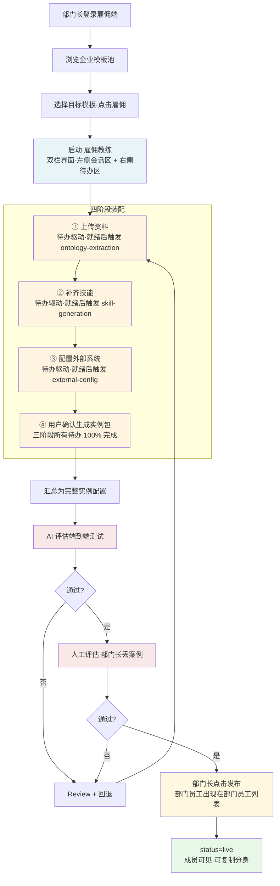


#### 4.1 模板浏览与选择

**功能要求**：
- 部门长可见的模板包括全局通用模板（来自平台一，只读）和本企业已发布的模板（来自构建端）
- 仅支持关键词搜索，不提供模板来源、业务场景、所属部门等筛选入口
- 支持查看模板详情（人设、能力描述、覆盖场景），不可见模板源代码
- 部门长在模板详情中点击"雇佣"后进入流程


#### 4.2 雇佣一名数字员工

雇佣教练 与用户**并肩装配**——不替用户擅自下业务结论，不接受模糊描述，持续引导直到每条信息都能被下游子技能直接执行。

点击"雇佣"后，系统初始化，进入**左右双栏界面**：

| 区域 | 内容 | 说明 |
|---|---|---|
| **左侧·会话区** | 与 雇佣教练 的对话（开场白） | 引导用户上传资料、描述业务场景、补充需求；雇佣教练 引导提问、反馈进展 |
| **右侧·待办区** | 实时更新的待办事项列表 | 会话内容触发待办的创建或更新；待办完成推进主流程，初始化需要展示上传资料、补齐技能、配置外部系统、生成实例包4大环节框架。 |


##### 4.2.1 雇佣教练的会话初始化

雇佣教练作为一个沙箱初始化阶段默认加载的数字员工，详细说明参考需求文档\SystemSkills\employment-coach-conversation

用户选定模板（如"智能客服"）并进入会话后，雇佣教练 主技能按序执行以下初始化步骤：

1. **创建沙箱目录**：为本次雇佣任务创建专属沙箱，目录结构与最终实例包完全一致
2. **复制模板包**：将所选模板的完整包目录（`config/` · `ontology/` · `skill/` + `manifest.json` · `describe.md` · `README.md`）完整复制到沙箱
3. **加载完备性清单**：将模板的完备性清单（待办项定义及各阶段推进条件）加载到主技能运行时
4. **加载人设文件**：将 `config/` 下的四个 MD 文件（`IDENTITY.md` · `SOUL.md` · `MEMORY.md` · `AGENTS.md`）内容加载到主技能运行时
5. **以数字员工身份开场**：雇佣教练 以所选数字员工的身份发出开场介绍，介绍内容来自 `soul.md` 和 `identity.md`，让用户感受到"正在和这个员工一起上岗准备"
6. **推送初始待办**：仅展示**当前阶段（① 上传资料）的待办项**，后续阶段的待办在前一阶段 100% 完成后才依次解锁显示

##### 4.2.2 雇佣环节四阶段装配过程

四阶段必须**按序完成**，每阶段的所有待办 100% 完成后才能进入下一阶段。任意阶段均可随时回退补充内容，但只要有待办未完成，生成实例包的入口不可用。

##### ① 上传资料

- **待办触发**：用户在会话中描述业务场景、上传文件、提及资料需求时，每识别到一类资料即产生一条待办
- **阶段推进条件**：至少一条资料待办被确认可用
- **子技能调用**：触发 `ontology-extraction`，产出**本体切片**；同时自动生成测试用例（覆盖实体识别、动作执行、约束合规三类，约束合规优先级最高），供后续 AI 评估使用
- **雇佣教练 引导策略**：主动把用户的抽象描述转化为真实场景，从失败/抱怨/重做等情绪信号中捕捉高价值业务约束

**UI变化**：上传资料阶段，从左侧的会话上传文件，右侧面板展示附件。点击可以放大。

##### ② 补齐技能

- **待办触发**：雇佣教练 基于①阶段已确认资料自动推断生成技能待办；用户在会话中补充技能需求时也可新增
- **阶段推进条件**：至少一条技能待办被确认可用
- **子技能调用**：触发 `skill-generation`，产出**技能配置包**
- **待办明确度标准**：技能名称、触发条件、预期产出均须有明确定义，雇佣教练 不接受"处理售后"此类模糊描述

**UI变化**：补齐节能阶段，在左侧会话框输入或者上传skill文件，右侧展示模板已有skill和新生成的或者新上传的skill。skill可以展开看到name和description.

##### ③ 配置外部系统

- **待办触发**：会话中提及外部系统、接口或集成需求时触发，每个系统对应一条待办，通过**表单**收集信息
- **阶段推进条件**：至少一条外部系统配置待办被确认可用
- **子技能调用**：触发 `external-config`，产出**外部系统配置草案**
- **无外部系统**：若业务场景不涉及外部系统，此阶段可标记为"跳过"，不阻塞后续

**UI变化**：配置外部系统阶段，在左侧会话框输入要对接的外部系统类型，右侧展示该系统的名称和配置表单的按钮，点击【配置】按钮展示表单输入框信息。需要根据不同的cli的对接方式，渲染不同的填写字段。

##### ④ 生成实例包

- **触发条件**：①②③三个阶段**所有待办 100% 完成**（硬性校验），用户手动点击确认
- **系统动作**：汇总三阶段产物为完整实例配置，同时将 `ontology-extraction` 产出的测试用例**一并打包进实例包**（用户无感知），进入 AI 评估；AI 评估环节直接读取实例包内的测试用例作为评估素材

**待办状态说明：**

| 状态 | 含义 | 算作完成 |
|---|---|---|
| **信息收集中** | 信息还不够，雇佣教练 引导补充 | ❌ |
| **处理中** | 信息充分，已提交子技能处理 | ❌ |
| **已完成** | 子技能处理完毕，用户确认 | ✅ |
| **已取消** | 用户主动撤销 | — |

##### 4.2.3 雇佣教练的skill结构
雇佣教练以**数字员工身份**全程参与装配过程，通过Handoff 工单机制按顺序调度三个执行子技能，自身不直接写产物目录。

**包目录结构：**

```
employment-coach-conversation/
├── config/
│   ├── IDENTITY.md         # 雇佣教练身份定义（以数字员工身份开场）
│   ├── SOUL.md             # 价值观与行为准则（并肩装配·不接受模糊描述）
│   ├── MEMORY.md           # 记忆初始化
│   └── AGENTS.md           # 子技能注册
├── ontology/
│   └── ontology-slice.md   # 本体切片
└── skills/
    ├── employment-coach-conversation/
    │   └── SKILL.md        # 主技能：对话引导 + Handoff 工单管理
    ├── ontology-extraction/
    │   └── SKILL.md        # 阶段一：本体抽取 + 测试用例自动生成
    ├── skill-generation/
    │   └── SKILL.md        # 阶段二：技能配置包生成
    └── external-config/
        └── SKILL.md        # 阶段三：外部系统配置草案生成
```

**子技能说明：**

| 子技能 | 角色 | 职责 | 触发阶段 |
|---|---|---|---|
| **employment-coach-conversation** | 指挥官 / 对话引导者 | 以数字员工身份与用户对话，将信息整理为 Handoff 工单并调度下游子技能；维护 `config/` 人设文件；不直接写 `ontology/` / `skills/` / `external/` | 全程在线 |
| **ontology-extraction** | 阶段一执行者 | 从业务资料中抽取本体切片（员工本体 + 评估本体），同时自动生成三类测试用例（实体识别 / 动作执行 / 约束合规）；产物写入 `ontology/` | 资料阶段就绪，雇佣教练 Handoff 触发 |
| **skill-generation** | 阶段二执行者 | 将技能描述归一化为 SkillSpec，渲染模板并通过质量校验，生成技能配置包；产物写入 `skills/<skill_slug>/` | 技能阶段就绪，雇佣教练 Handoff 触发 |
| **external-config** | 阶段三执行者 | 对外部系统能力建模，生成含凭据槽位的配置草案（不收集真实凭据）；产物写入 `external/` | 外部系统阶段就绪，雇佣教练 Handoff 触发 |

> 四个 Skill 的 Handoff 工单协议、dispatch 信号流转与完整调用链路，见**附录 E：雇佣教练 Skill 架构与调用机制**。

##### 4.2.4 雇佣流程时序图

展示从部门长点击"雇佣"到实例包生成完毕、进入 AI 评估的完整交互时序。

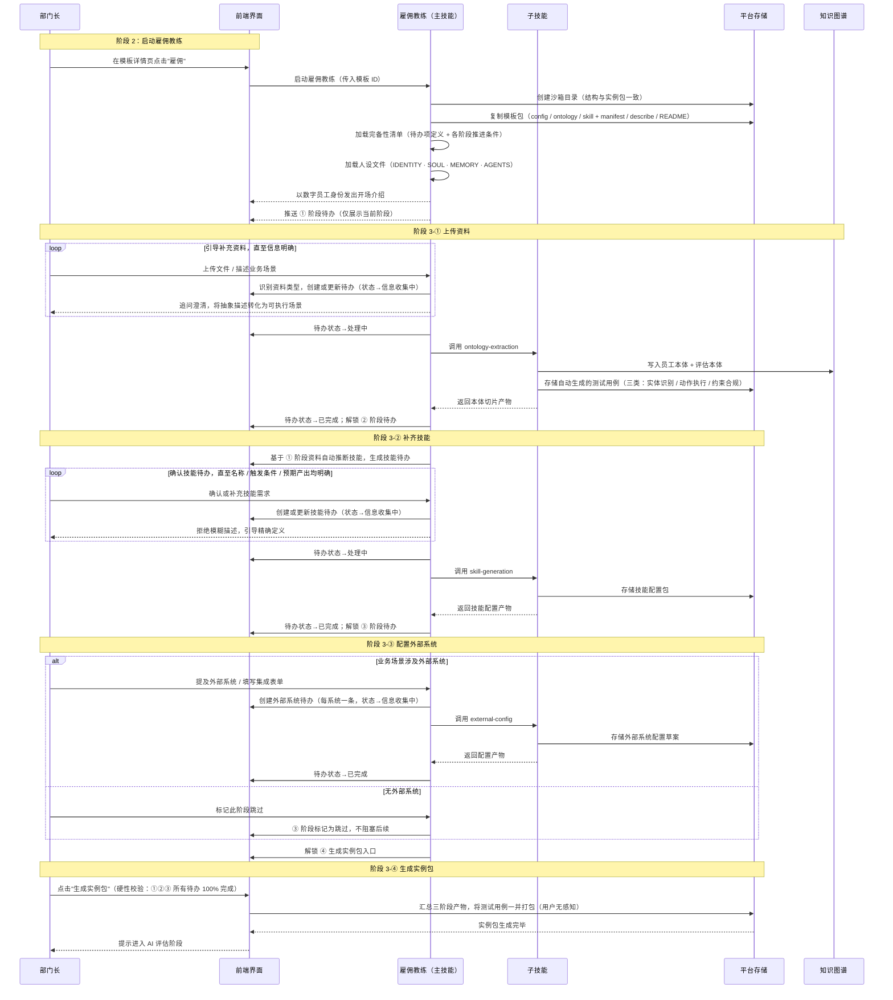

### 阶段3：4.3 AI评估环节
此处需要参考文档：需求文档\02-1 雇佣端AI评估环节产品设计文档.md
AI评估数字员工作为一个沙箱初始化阶段默认加载的数字员工，详细说明参考需求文档\SystemSkills\employment-coach-conversation

#### AI 评估员的子技能

AI 评估员以**双沙箱**模式运行（评估员沙箱 + 目标沙箱），内部按顺序调用以下子技能。

**包目录结构：**

```
evaluation-expert/
├── SKILL.md                          # 入口技能：AI 评估专家，全局评估原则与六步流程
├── manifest.json                     # 包元数据
├── live_evaluation_coordinator/
│   └── SKILL.md                      # 交互入口，将用户意图映射到 evaluation_orchestrator
├── evaluation_orchestrator/
│   └── SKILL.md                      # 主编排，驱动完整评估流水线
├── scenario_parser/
│   └── SKILL.md                      # 兜底解析，数据缺失时生成测试用例与评分规则
├── test_executor/
│   └── SKILL.md                      # 测试执行，向目标沙箱发送用例并采集 trace
├── evaluator/
│   └── SKILL.md                      # 多维评分，逐维度打分并引用 trace 证据
├── report_generator/
│   └── SKILL.md                      # 报告生成，持久化报告并返回访问链接
└── training_advisor/
    └── SKILL.md                      # 改进建议，仅在评估失败时调用
```

**子技能说明：**

| 子技能 | 职责 | 调用工具 |
|---|---|---|
| **live_evaluation_coordinator** | 交互入口：解析用户意图，向用户展示评估进度，将请求路由至 evaluation_orchestrator | `evaluation_orchestrator`（子技能调用） |
| **evaluation_orchestrator** | 主编排：加载被评估实例 → 获取测试用例 → 查询评分本体 → 驱动逐用例执行 → 汇总评分 → 生成报告；数据缺失时触发 scenario_parser 兜底分支 | `target_bootstrap` · `fetch_testcases` · `ontology_query` · `target_execute` · `trace_read` · `report_upsert` |
| **scenario_parser** | 兜底：当测试用例或评分规则缺失时，解析用户上传的素材文档，生成结构化测试用例和评分规则并写入存储 | `document_parser` |
| **test_executor** | 执行：向目标沙箱发送测试消息，读取完整执行 trace，返回含 trace_json 的执行证据 | `target_execute` · `trace_read` |
| **evaluator** | 评分：从评估本体图谱动态查询维度规则，对每个维度逐一打分，comment 必须引用具体 trace 证据 | `ontology_query` |
| **report_generator** | 报告：将评分结果、总结、建议持久化为评估报告，返回 JSON 和 HTML 两种格式的访问链接 | `report_upsert` |
| **training_advisor** | 改进建议：仅在评估失败时调用，基于各维度评分结果生成具体可操作的改进方向，标注优先级（high / medium / low） | — |

> 七个子技能的调用链路、评分维度与权重、工具职责与流程分支，见**附录 F：评估专家系统 Skill 架构与评估机制**。


#### 4.3.1 AI评估流程与构建端的对仗关系

| 维度 | 构建端 | 雇佣端·部门员工 | 雇佣端·私人定制 |
|---|---|---|---|
| 评估对象 | 模板的默认实例化结果 | 完整实例配置（部门员工） | 完整实例配置（私人定制） |
| AI 评估员 | 创世员工 AI 评估员 | 创世员工 AI 评估员 | 创世员工 AI 评估员 |
| 人工评估者 | 模板部门主管 / 模板评估者 | **部门长** | **用户自己** |
| 通过阈值 | 总分 ≥ 70 且无单维度低于 60 且所有一票否决项满足 | 总分 ≥ 70 且无单维度低于 60 且所有一票否决项满足 | 总分 ≥ 70 且无单维度低于 60 且所有一票否决项满足 |

#### 两种本体：员工本体与评估本体

AI 评估的评分标准来源于**评估本体**，与员工使用的员工本体严格区分：

| 本体类型 | 归属 | 用途 | 内容示例 |
|---|---|---|---|
| **员工本体** | 目标数字员工 | 员工上岗后做业务时参考 | 企业业务规则、岗位操作知识、产品上下文 |
| **评估本体** | AI 评估员 | 评估专家判定员工是否合格的依据 | 评估维度定义、评分规则、权重配置、一票否决项、行业标准 |

两种本体源头相同（均来自雇佣流程①阶段用户上传的资料），但视角不同：同一份 SOP，员工本体提取"SOP 说先安抚用户"（告诉员工怎么做），评估本体提取"必须先安抚用户，否则交互质量扣分"（告诉评估专家怎么判）。

评估本体由 `ontology-extraction` 在雇佣①阶段同步提取，存入知识图谱（`graph.jsonl`），以 `schema.yaml` 做约束校验。评估员通过 `ontology_query` 动态查询当前岗位的评分标准——**评分维度与权重不硬编码**，不同岗位完全独立。

#### 训练反馈循环

AI 评估不通过时，经人工审核后可触发重新训练并再次评估，循环至多 **30 轮**：
- 每轮训练前须人工审核确认，`training_advisor` 生成具体可落地的改进建议（含优先级）
- 达到 30 轮仍未通过时，系统标记"训练失败"，通知管理员，提供每轮分析报告，由人工决定是否重置或放弃

#### 4.3.1.1 AI 评估员工作流程

AI 评估员以**双沙箱**模式运行：**评估员沙箱**负责编排全流程，**目标沙箱**独立运行被评估的数字员工实例接收测试请求并产生执行 trace。两个沙箱完全隔离，评估员不能修改目标沙箱的代码、配置或数据。AI 评估对象是雇佣环节四阶段全部完成后的完整实例包。

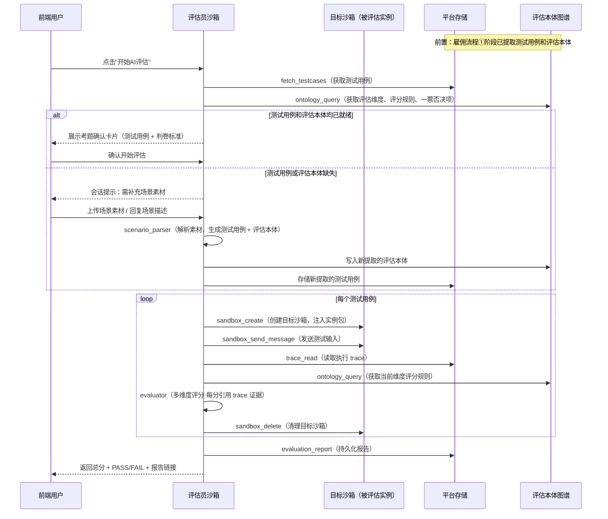

**评分维度说明：**

评分维度和权重**由评估本体动态确定**，通过 `ontology_query` 查询 `RoleType → has_dimension → EvaluationDimension` 获得，不同岗位完全独立。典型维度示例（不限于此）：

| 维度示例 | 说明 |
|---|---|
| functional_completeness | 完成所有必要功能步骤、创建必要产出物 |
| interaction_quality | 沟通是否专业友好、是否安抚/引导/闭环 |
| process_compliance | 是否遵循标准操作流程、不违反红线 |
| problem_resolution | 最终是否有效解决用户问题 |
| tool_call_correctness | 是否正确调用预期工具（遗漏必调工具直接判 0 分） |

每个维度的评分必须引用具体的 trace 证据（step 号 / content 片段），不允许无证据打分。**人工 Override 机制**：AI 判定通过/不通过后，人工可确认或反向覆盖，最终结论以人工决定为准。

#### 4.3.2 测试任务集

| 来源 | 部门员工 | 私有分支 |
|---|---|---|
| 模板自带的通用测试集 | ✓ 复用模板的测试集 | ✓ 复用基础分身的测试集 |
| 雇佣/定制过程中沉淀的测试用例 | ✓ 雇佣教练 引导部门长在①上传资料阶段沉淀至少 5 个真实任务 | ✓ 雇佣教练 引导用户沉淀至少 3 个真实任务 |
| ontology-extraction 自动生成的测试用例 | ✓ 雇佣流程①阶段由 ontology-extraction 基于本体切片自动生成 | ✓ 同上 |
| 人工评估时临场输入的案例 | ✓ 评估完成后自动沉淀回测试集 | ✓ 评估完成后自动沉淀回**该用户私有的**测试集 |

#### 4.3.2.1 测试用例的来源与兜底机制

测试用例在**④ 生成实例包**阶段随实例包一并打包（来自 `ontology-extraction` 产出，用户无感知）。AI 评估启动时直接读取实例包内的测试用例作为评估素材，无需额外触发。

若测试用例或评估本体缺失（雇佣流程异常中断等情况），评估员在初始化阶段通过**会话消息**提示用户补充场景素材；用户上传素材后，调用 `scenario_parser` 解析并生成测试用例 + 评估本体，写入图谱/数据库后继续评估。

```
AI 评估初始化
   ├── fetch_testcases + ontology_query 均就绪（正常路径）
   │     → 展示考题确认卡片 → 用户确认 → 进入评估
   └── 测试用例或评估本体缺失（异常路径）
         → 评估员会话提示用户补充场景素材
               → 用户上传素材
                     → scenario_parser 解析，生成 testcases + 评估本体
                           → 写入 DB / OG → 重新检查 → 进入评估
```

`generated_on_demand: true` 表示本次评估触发了 `scenario_parser` 兜底生成，属于异常路径。

#### 4.3.3 AI评估失败的 Review

#### 4.3.3.1 MVP 简化版方案

MVP 阶段做最小可用的失败处理：
报告里写清楚哪个测试任务失败以及原因
提供重新雇佣按钮，重新进入雇佣界面，保存上一轮进入AI评估前的所有材料、技能、配置和会话历史


#### 4.3.3.2 Review 界面规格

评估失败后，进入 Review 界面：

**界面元素**：
- 评估报告全文展示
- 回退按钮：
  - 回到雇佣会话界面
  可以点击任何一个环节进行环节信息锚定
  - 定位到上传资料环节
  - 定位到配置技能环节
  - 定位到外部系统接入环节
  - 定位到重新生成实例环节
- "维持当前状态、重新评估"按钮（最多用 2 次/未修改）

**回退处理逻辑**：

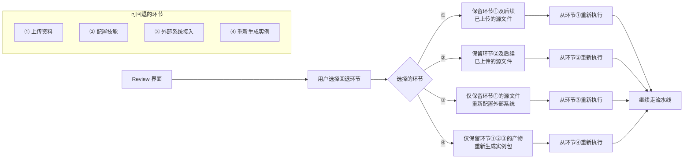

#### 4.3.3.3 AI评估失败次数兜底

**MVP 阶段方案**：
- 同一模板连续失败 3 次后，系统主动提示："建议从场景匹配重新梳理目标，或考虑该场景是否适合用模板覆盖"
- 不强制限流，允许用户继续尝试
- 记录所有失败历史用于后续分析

---

### 4.4 人工评估环节

需要参考文档：需求文档\02-2 雇佣端人工评估环节产品设计文档.md

#### 4.4.1 功能入口

人工评估有两种进入方式：
- **方式一**：在数字员工列表中，选择「实习列表」中状态为「待人工评估」的数字员工，点击进入
- **方式二**：在 AI 评估通过后，在 AI 评估结果页面点击【人工评估】按钮

#### 4.4.2 页面元素

| 区域 | 说明 |
|---|---|
| **顶部信息区** | 展示数字员工基本信息（名称、所属模板、当前状态）、AI 评估报告摘要（总分、是否通过） |
| **会话区** | 主要交互区域，展示与该数字员工的对话界面（加载的是 AI 评估完成后的实例包，不包含测试用例） |
| **操作区** | 「发布上岗」按钮（仅部门长可见）、回退按钮 |

#### 4.4.3 评估机制

**会话评估**：
- 用户（部门长）在会话框中输入指令，或上传文件、表格等富文本，发送到会话中
- 数字员工根据用户输入返回回复，用户根据回复内容判断该员工是否达到上岗要求
- 会话区加载的是 AI 评估完成后的实例包（config / ontology / skill + manifest.json / describe.md / README.md），**不包含测试用例**

**评判标准**：
- 由部门长自行判断数字员工的回复是否满足业务要求
- 无量化分数要求，部门长的主观判断即为最终结论

#### 4.4.4 评估结果处理

| 结果 | 后续动作 |
|---|---|
| **通过并发布** | 部门长点击「发布上岗」→ 状态从 `interning_human` 切换为 `live` → 实例包部署到运行时沙箱 → 数字员工正式上岗 |
| **通过待发布** | 部门长不点击「发布上岗」→ 状态从还是实习中，需要记录状态为AI评估已通过。
| **不通过** | 可选择：① 回退到雇佣环节（进入 Review 界面）；② 重新进入 AI 评估 |


#### 4.4.5 私有分支的人工评估

私有分支场景下，人工评估由**用户自己**执行，评估标准同上。评估通过后，消息路由自动从原分身切换到私有分支。

**关键说明**：部门员工发布后不需要配置 IM。IM 接入属于个人分身层面的操作，由各成员在自己的分身上按需完成。


#### 4.4.6 发布到部门员工列表

人工评估评估通过后，部门长在平台内确认发布：
- 启动运行时沙箱
- 状态切换为 `live`
- **部门员工直接出现在"部门数字员工"列表**，部门内所有成员可见
- 成员可从该员工创建个人分身；个人分身 owner 可按需配置 IM
- **部门员工本身不配置 IM**——IM 接入在个人分身层面完成


### 4.5 分身复制流程（部门长 / 普通成员发起）

#### 4.5.1 流程总览

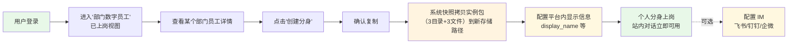

#### 4.5.2 流程极简化要求

- 从点击"创建分身"到完成上岗，**用户操作步骤不超过 3 步**（去掉了 IM 配置作为必须步骤）
- 平台侧 P95 ≤ 30 秒
- **不需要任何对话引导**——digital_employee_discovery 不在分身复制场景中介入
- 用户只需做三件事：**确认复制 → 设平台内显示信息 → 上岗**
- IM 配置为**可选操作**，在员工卡片上提供"配置 IM"入口
- **分身数量上限**：同一用户下处于非 `retired` 状态的分身总数不超过 **10 个**（跨所有部门员工合计）；达到上限后"创建分身"按钮置灰并提示"已达分身上限（10/10），请退役不再使用的分身后重试"

#### 4.5.3 各阶段说明

#### 阶段 1：浏览部门数字员工并查看详情

- 普通成员只能看见**本部门的、状态为 `live` 的**部门员工；部门长可见所有状态的部门员工
- 详情页在 `live` 状态下展示"创建分身"按钮

#### 阶段 2：确认创建分身

一键确认，系统自动：
- 生成新的 `instance_id`
- 完整拷贝部门员工的实例包（config / ontology / skill 目录及 manifest.json / describe.md / README.md）到新存储路径
- `instance_type=personal_clone`、`from_instance_id` 指向母实例
- 不进入双阶段评估（继承母实例的评估结果）

#### 阶段 3：配置平台内显示信息

- `display_name`（必填）：平台内显示名，同一用户下不能重名
- `display_avatar`（可选）：默认沿用部门员工头像
- `display_description`（可选）

#### 阶段 4：上岗

- 启动运行时沙箱（持久化）
- 状态切换为 `live`
- **站内对话立即可用**——用户在"我的员工列表"点击该员工即可进入对话
- 员工卡片展示"配置 IM"入口，用户可按需接入外部 IM

#### 4.5.4 分身的退役、删除与重建

**退役**：
- 用户可主动退役自己的分身，状态切换为 `retired`，运行时沙箱销毁，IM 配置解绑
- 退役后分身不再计入 10 个上限，其他分身不受影响
- 退役后可重新从同一部门员工创建新分身——需要重新配置 IM（若需要）

**删除**：
- `retired` 状态的分身支持用户主动**彻底删除**，删除后对话历史、评估报告、测试用例一并清除，操作**不可撤销**
- 删除前系统弹出二次确认弹窗："删除后数据无法恢复，确认删除《{display_name}》吗？"
- `live` / `interning_*` / `hired` 状态的分身**不允许直接删除**，须先退役再删除
- 退役后**不强制要求立即删除**：`retired` 分身保留在"已退役"列表中，用户按需清理；对话历史在删除前保持只读可查阅

**快照复制失败处理**：

| 场景 | 判定条件 | 系统行为 | 用户提示 |
|---|---|---|---|
| 文件拷贝失败 | 任一目录或根文件复制报错 | 回滚：删除已创建的不完整实例包；`instance_id` 标记为无效 | "分身创建失败，请稍后重试；若持续失败请联系平台支持" |
| 拷贝超时 | 单次拷贝操作 > 60 秒 | 同上，强制回滚 | 同上 |
| 存储空间不足 | 目标路径写入返回磁盘空间错误 | 回滚并触发告警（平台运维通知）；同一租户暂停新分身创建 | "存储空间不足，暂时无法创建分身，平台已收到通知" |

快照失败不消耗分身数量上限；失败后用户可立即重试。

**沙箱启动超时处理**：

| 场景 | 判定条件 | 系统行为 | 用户提示 |
|---|---|---|---|
| 冷启动超时 | 沙箱启动 > 30 秒（P95 ≤ 10s 的 3 倍容忍上限） | 中止本次启动；实例状态保持 `live`（未变更），下次收到消息或用户主动进入对话时重新触发启动 | 对话界面显示"员工正在准备中，请稍候…"转圈动画；超时后提示"启动超时，请刷新重试" |
| 重试仍失败（连续 3 次） | 3 次冷启动均超时 | 实例标记 `status=error`（新增中间状态）；触发平台运维告警 | "员工暂时无法上岗，已通知平台处理，请稍后查看" |
| 沙箱崩溃（运行中） | 沙箱进程异常退出 | 自动重启一次；重启失败则转 `status=error` | IM 侧：消息进入重试队列（最长保留 24 小时，与 IM 错误处理一致）；站内：提示"员工暂时离线，正在恢复中" |

---

---

## 5. 私有分支流程（部门长 / 普通成员可选）

### 5.1 触发条件

入口：在"我的数字员工"中，从某个"我的分身"的详情页提供"创建私有分支"按钮。

### 5.2 流程总览

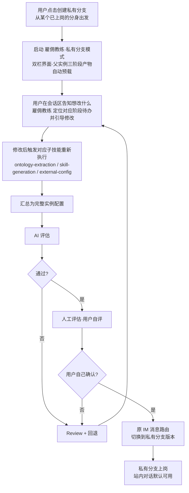

### 5.3 关键约束

**1. 评估强度不变**：MVP 阶段仍然要求双阶段评估，不可跳过人工评估。

**2. 雇佣教练 简化模式**：私有分支启动时，雇佣教练 自动预载父实例的①②③三阶段产物（本体切片、技能配置、外部系统配置）。用户通过会话告知想要修改的内容，雇佣教练 定位对应阶段的待办并引导针对性修改，修改完毕后触发对应子技能（`ontology-extraction` / `skill-generation` / `external-config`）重新执行，再汇总为新的完整实例配置。未触及的阶段保持原产物不变。

**3. 评估者**：AI 评估由 AI 评估员执行；人工评估**由私有分支 owner（即创建该私有分支的用户）自行执行**，不涉及部门长或其他人。

**4. 数据隔离**：私有分支的 ontology、对话记录、产出全部归用户私有。

**5. IM 侧的处理**：
- 私有分支创建后，生成**独立的 IM_CONFIG 记录**（每平台各一条，初始 `status=unconfigured`），不继承也不复用原分身的凭证
- 原分身（即来源 personal_clone）的 IM_CONFIG **全程保持不变**，评估期间和发布后均正常接收 IM 消息
- **评估期间**：私有分支无 IM 流量（IM_CONFIG 尚未配置）；评估仅通过站内对话进行
- **评估通过发布后**：私有分支以独立身份上岗，owner 可自行为私有分支配置各平台 IM 凭证，配置后方可接收该平台的 IM 消息；原分身与私有分支的 IM 相互独立，互不影响

**6. 禁止嵌套，同时只能有一个活跃私有分支**：用户不能在私有分支基础上再创建私有分支（禁止套娃）；同一个人分身在同一时刻只能存在一个活跃的私有分支（`status` 非 `retired`）；若现有私有分支已销毁（`retired`），可重新创建。

### 5.4 私有分支的废弃与回退

- 用户可主动废弃私有分支，私有分支的 IM_CONFIG 随实例退役（各平台 Webhook 停止响应）；原分身的 IM 全程独立运行，不受影响
- 废弃操作不可撤销；私有分支销毁后，同一个人分身**可以重新创建**私有分支（从零开始新一轮雇佣流程）
---


## 6. 数字员工的两种使用渠道

### 6.1 功能定位

雇佣端提供两类主动发起对话的方式：

- **平台会话**：用户无需任何额外配置，直接在平台 Web 界面内与员工对话，上岗即可用。
- **拉起 IM**：已完成 IM 注册的员工，在平台内提供"去 {平台名}"快捷按钮，一键跳转到对应 IM 应用并进入与该员工机器人的私聊界面。
- **不同IM渠道的数据独享**一个沙箱，被接到不同的IM，在不同的IM内不需要实现数据共享。在服务端查看沙箱底层数据，可以看到所有数据。

两种方式面向不同使用场景，不互斥，用户可自由切换。

### 6.2 平台会话进入方式

- 在"我的员工列表"中，**点击任意 `live` 状态的员工卡片**，即进入该员工的平台会话界面
- 不需要跳转到任何外部平台

### 6.2A 拉起 IM 进入方式

**触发条件**：该员工至少有一个 IM 平台已注册且连接成功（`IM_CONFIG.status = active`）

**入口位置**：
- 我的员工列表 → 员工卡片次要操作区：显示已配置平台的图标按钮（飞书 / 钉钉 / 企微）
- 数字员工详情页 → IM 接入区：每个已连接平台显示"去 {平台名}"按钮
- 平台会话页 → 顶部栏：显示"切换到 IM"快捷入口

**跳转行为**：

| 平台 | 跳转方式 | 说明 |
|---|---|---|
| 飞书 | 飞书 deep link（`lark://`协议）或飞书 Web 链接 | 跳转后直接定位到与该机器人的私聊会话 |
| 钉钉 | 钉钉 deep link（`dingtalk://`协议）或钉钉 Web 链接 | 跳转后直接定位到与该机器人的私聊会话 |
| 企微 | 企微 deep link（`wxwork://`协议）或企微 Web 链接 | 跳转后直接定位到与该应用的私聊会话 |

**多平台处理**：若该员工已配置多个 IM 平台，点击"去 IM"时弹出平台选择气泡（飞书 / 钉钉 / 企微的图标列表），用户选择后跳转。

**未配置处理**：若该员工尚未配置任何 IM，点击"去 IM"时显示引导提示"该员工尚未接入 IM，是否立即配置？"，提供"去配置"和"取消"两个选项。

### 6.3 平台会话功能要求

#### 6.3.1 对话界面

| 功能项 | 说明 |
|---|---|
| 消息输入 | 文本输入框，支持换行（Shift+Enter），Enter 发送 |
| 消息展示 | 用户消息（右对齐）+ 员工回复（左对齐），时间戳 |
| 流式回复 | 员工回复支持流式输出（逐字显示），提升体感 |
| 加载状态 | 回复生成中显示加载动画 |
| 员工信息 | 对话顶部展示员工的 display_name 和 display_avatar |
| 历史记录 | 默认展示最近 50 条消息，支持上拉加载更多 |

#### 6.3.2 对话历史

- 对话历史**持久化保存**，用户重新进入对话界面时可继续上次会话
- 对话历史按 `instance_id + user_id` 隔离，他人不可见
- 站内对话历史与 IM 对话历史**分开存储、分开展示**（两个独立的上下文）
- 用户可主动清空自己的站内对话历史（不影响 IM 历史）

#### 6.3.3 上下文管理

- 站内对话维护独立的上下文，不与 IM 渠道的上下文混用
- 上下文长度上限：最近 20 轮对话（超出部分自动截断最早消息）
- 沙箱重启后上下文从外部存储恢复，用户无感知

### 6.4 性能要求

| 场景 | 指标要求 |
|---|---|
| 进入对话界面（列表页加载） | P95 ≤ 500ms |
| 第一个字符出现（流式） | P95 ≤ 3s |
| 完整回复输出完成 | P95 ≤ 8s |

### 6.5 两种渠道对比

| 维度 | 平台会话 | IM 渠道 |
|---|---|---|
| 是否需要 IM 配置 | 否，上岗即可用 | 是，需先注册 IM |
| 入口 | 平台员工卡片"开始对话" | ① 平台"去 {平台名}"按钮（拉起 IM）；② 用户自行在 IM 中找到机器人（直接私聊）；两种入口共用同一 IM 上下文 |
| 跳转 | 不跳转，在平台内打开 | 跳转到 IM 应用 / 或在 IM 中直接发起 |
| 对话上下文 | 平台会话独立上下文 | IM 渠道独立上下文 |
| 历史记录 | 平台内查看 | 各 IM 平台聊天记录 |
| 底层沙箱 | 共用同一运行时沙箱 | 共用同一运行时沙箱 |

---

## 7. 多平台 IM 集成（飞书 / 钉钉 / 企微）

> **v4.0 变更**：本节由"飞书集成"扩展为"多平台 IM 集成"，支持飞书、钉钉、企微三个平台，每个平台独立配置，同一员工可同时接入多个平台。IM 接入为**可选**操作，数字员工上岗后默认提供站内对话，IM 为额外通道。

### 7.1 多平台接入概述

| 维度 | 说明 |
|---|---|
| 支持平台 | 飞书、钉钉、企业微信（企微）三个平台 |
| 配置主体 | **仅个人分身（personal_clone）和私人定制（private_branch）**；部门员工（department）不配置 IM |
| 配置方式 | 分身 owner 在对应平台后台创建机器人，将凭证回填到平台 |
| 多平台并行 | 同一分身可同时接入多个平台，各平台消息独立处理 |
| 是否必须配置 | **否**，上岗后平台会话默认可用，IM 为可选扩展 |
| 接入时机 | 分身上岗后随时可配置，每个平台独立管理 |
| 私有分支处理 | 复用原分身已有的各平台 IM 配置，仅切换内部路由 |

**选择"用户自建机器人，回填凭证"模式的原因**：
- 每个平台账号归属清晰，企业对机器人身份有完全控制权
- 无需平台与各 IM 厂商之间建立特殊 API 合作关系
- 每个数字员工对应一个独立机器人，消息路由通过 Webhook URL 天然解决
- 配置为一次性操作，操作难度低

### 7.2 各平台接入模式与凭证

每个平台均支持两种接入模式，用户在配置时选择其一：

| 接入模式 | 说明 | 适用场景 |
|---|---|---|
| **WebSocket 长连接** | 平台主动向 IM 服务端建立持久连接，消息实时推送，无需暴露公网 URL | 推荐，配置最简单 |
| **URL 回调（Webhook）** | IM 平台将消息推送到平台提供的公网 URL | 网络环境要求公网可达时使用 |

#### WebSocket 心跳与重连机制（三平台通用）

**心跳参数：**

| 参数 | 规格 | 说明 |
|---|---|---|
| 心跳间隔 | 30 秒 | 客户端主动发送 Ping 帧；飞书 / 钉钉 / 企微 SDK 均支持此配置 |
| 心跳超时 | 10 秒 | 发出 Ping 后 10 秒内未收到 Pong，视为连接断开，立即触发重连 |
| 连接空闲保活 | 是 | 即使无业务消息，心跳帧也持续发送，防止中间网关因空闲断开连接 |

**重连策略：**

| 参数 | 规格 | 说明 |
|---|---|---|
| 首次重连 | 立即（0 ms） | 瞬时抖动优先快速恢复 |
| 退避算法 | 指数退避 + 随机抖动 | 间隔依次为 1s / 2s / 4s / 8s / 16s / 30s，每次加 ±20% 随机抖动，避免惊群 |
| 最大退避上限 | 60 秒 | 到达上限后以 60 秒固定间隔持续重试 |
| 重连次数上限 | 无限 | 持续尝试，直至连接成功或实例下线（退役 / 手动关闭） |
| 重连触发条件 | 心跳超时 / 连接主动断开 / 网络异常（TCP RST / 超时） | 三类事件均自动触发，无需人工干预 |

**消息可靠性：**

| 机制 | 说明 |
|---|---|
| 消息幂等 | 每条消息携带平台侧 `message_id`；重连期间若收到重复消息，服务端按 `message_id` 去重后再路由 |
| 断线期间消息补偿 | 重连成功后，平台调用各 IM 平台的历史消息拉取接口，回填重连窗口内漏收的消息（飞书 / 钉钉 / 企微均提供此接口） |
| 发送侧重试 | 平台向 IM 平台发送消息失败时，最多重试 3 次（间隔 1s / 3s / 9s）；超出次数后记录到错误日志并告警，不再自动重试 |

**连接生命周期时序：**

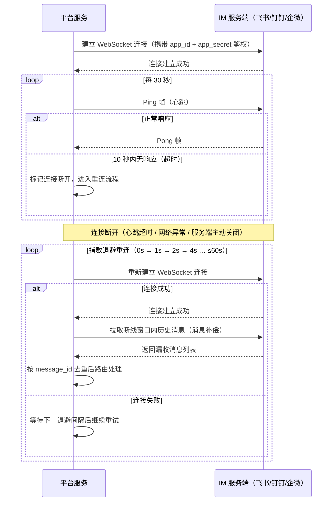

#### 7.2.1 飞书接入

**WebSocket 长连接**（推荐）：

| 凭证字段 | 来源 | 说明 |
|---|---|---|
| `app_id` | 飞书应用后台 → 凭证与基础信息 | 应用唯一标识 |
| `app_secret` | 飞书应用后台 → 凭证与基础信息 | 加密存储，用于鉴权与发送消息 |

**URL 回调**：

平台提供 Webhook URL：`https://{platform_domain}/im/feishu/webhook/{instance_id}`

| 凭证字段 | 必填 | 来源 | 说明 |
|---|---|---|---|
| `app_id` | 是 | 飞书应用后台 → 凭证与基础信息 | 应用唯一标识 |
| `app_secret` | 是 | 飞书应用后台 → 凭证与基础信息 | 加密存储，用于发送消息 |
| `encrypt_key` | 是 | 飞书应用后台 → 事件订阅 → 加密策略 | 加密存储，用于解密飞书推送的消息体 |
| `verification_token` | 否 | 飞书应用后台 → 事件订阅 | 加密存储，用于校验 Webhook 签名 |

**注意事项**：
- 飞书企业自建应用存在数量配额，平台在接入引导中需提示用户关注企业配额情况
- 用户在飞书应用后台需设置机器人仅接收 P2P（私聊）消息，统一禁用群聊

#### 7.2.2 钉钉接入

**WebSocket 长连接**（推荐）：

| 凭证字段 | 来源 | 说明 |
|---|---|---|
| `app_id` | 钉钉应用后台 → 基础信息 | 应用唯一标识（ClientID） |
| `app_secret` | 钉钉应用后台 → 基础信息 | 加密存储，用于鉴权与发送消息 |

**URL 回调**：

平台提供 Webhook URL：`https://{platform_domain}/im/dingtalk/webhook/{instance_id}`

| 凭证字段 | 必填 | 来源 | 说明 |
|---|---|---|---|
| `app_id` | 是 | 钉钉应用后台 → 基础信息 | 应用唯一标识（ClientID） |
| `app_secret` | 是 | 钉钉应用后台 → 基础信息 | 加密存储，用于发送消息 |
| `encrypt_key` | 是 | 钉钉应用后台 → 消息加密配置 | 加密存储，用于解密推送消息体 |
| `token` | 否 | 钉钉应用后台 → 消息加密配置 | 加密存储，用于校验签名 |
| `aes_key` | 否 | 钉钉应用后台 → 消息加密配置 | 加密存储，消息体 AES 解密密钥 |

#### 7.2.3 企业微信（企微）接入
**WebSocket 长连接**（推荐）：
| 凭证字段 | 来源 | 说明 |
|---|---|---|
| `app_id` | 企微管理后台 → 应用管理 → 应用 | 应用 AgentID |
| `app_secret` | 企微管理后台 → 应用管理 → 应用 | 加密存储，用于鉴权与发送消息 |

**URL 回调**：

平台提供 Webhook URL：`https://{platform_domain}/im/wecom/webhook/{instance_id}`

| 凭证字段 | 必填 | 来源 | 说明 |
|---|---|---|---|
| `token` | 是 | 企微管理后台 → 应用接收消息配置 | 加密存储，用于校验消息签名 |
| `encoding_aes_key` | 是 | 企微管理后台 → 应用接收消息配置 | 加密存储，消息体 AES 解密密钥 |

> **企微 URL 回调说明**：URL 回调模式下，`token` 和 `encoding_aes_key` 用于接收消息验证；发送回复时仍需企微应用凭证，建议通过企业统一管理后台获取，或在应用初始化时额外配置 corp_id + agent_id + agent_secret。

### 7.3 消息路由

多平台消息路由机制统一，通过 Webhook URL 中的 `instance_id` 天然路由：

```mermaid
flowchart LR
    UserFeishu[飞书用户] -->|私聊| FeishuBot[飞书机器人]
    UserDing[钉钉用户] -->|私聊| DingBot[钉钉机器人]
    UserWecom[企微用户] -->|私聊| WecomBot[企微应用]

    FeishuBot -->|POST /im/feishu/webhook/{id}| Platform[平台 Webhook 层]
    DingBot -->|POST /im/dingtalk/webhook/{id}| Platform
    WecomBot -->|POST /im/wecom/webhook/{id}| Platform

    Platform -->|按 instance_id 路由| Sandbox[实例运行时沙箱]
    Sandbox -->|回复| Platform

    Platform -->|飞书消息 API| FeishuBot
    Platform -->|钉钉消息 API| DingBot
    Platform -->|企微消息 API| WecomBot
```

**消息路由说明**：

| 环节 | 说明 |
|---|---|
| 消息进来 | Webhook URL 含 `instance_id`，平台直接定位对应沙箱，无需查表 |
| 消息出去 | 平台用该实例对应平台的凭证调用对应 IM 的消息 API 发送回复 |
| 路由失败 | 如 instance 已退役，向用户发"这个员工已退役"的标准提示 |
| 多平台并行 | 同一沙箱处理来自不同平台的消息，各渠道上下文独立，不互通（inapp / feishu / dingtalk / wecom 上下文分开存储） |

**私有分支的路由处理**：私有分支上岗后，复用原分身的各平台 IM 配置，平台将各平台 Webhook 的请求转发到私有分支实例的沙箱处理。废弃私有分支时，恢复转发至原分身实例。

### 7.4 消息处理时序

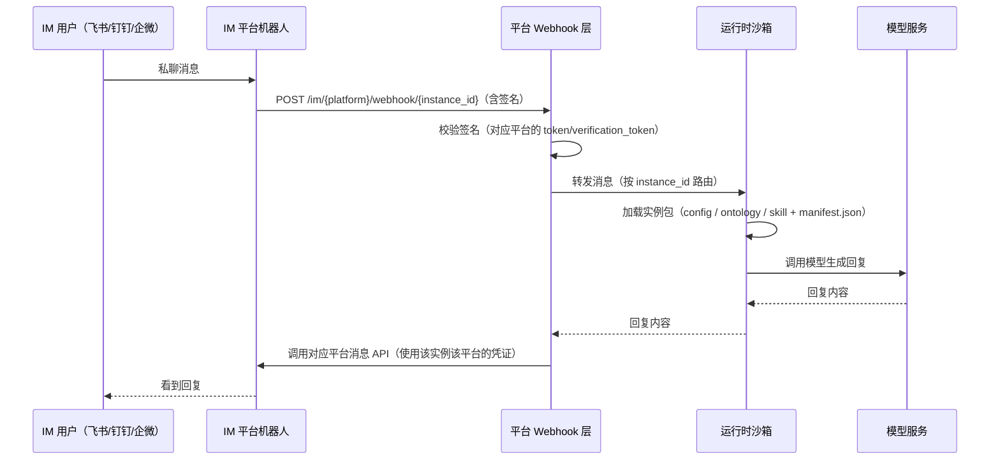

**性能要求**：从用户在 IM 发消息到收到回复，P95 ≤ 8 秒（含模型推理时间）。

### 7.5 异常处理

| 异常场景 | 处理方式 |
|---|---|
| 沙箱冷启动延迟 | 先回复"正在思考..."，待真实回复就绪后追加 |
| 沙箱报错 | 向用户发标准错误提示，不暴露内部错误 |
| 外部系统（cli）调用超时 | 向用户说明"调用 X 系统超时，请稍后再试" |
| Webhook 重复投递 | 平台侧做幂等处理，基于 message_id 去重 |
| 用户消息过长 | 截断 + 提示用户"消息过长已截断" |
| 用户上传文件 | MVP 阶段拒收，提示"暂不支持文件，请用文字描述" |
| 签名验证失败 | 丢弃请求，记录告警日志 |
| IM 凭证填写有误 | 注册失败，提示用户重新检查凭证信息 |
| IM 凭证过期或被重置 | 向实例 owner 发平台站内通知，提示重新配置 |
| 未配置 IM 但用户想去 IM | 引导用户先配置对应平台 IM 凭证 |

### 7.6 IM 配置的快捷入口

为方便用户随时配置和访问 IM，员工卡片和详情页提供快捷入口：

| 入口 | 出现条件 | 点击行为 |
|---|---|---|
| "配置 IM" | 员工 `live` 状态，某平台尚未配置 | 跳转到对应平台的 IM 配置页 |
| "去飞书" | 飞书已注册且连接成功（status=active） | 跳转飞书（或提示在飞书联系人中找到该机器人） |
| "去钉钉" | 钉钉已注册且连接成功 | 跳转钉钉 |
| "去企微" | 企微已注册且连接成功 | 跳转企微 |

---


## 第三部分 · 技术规格

## 8. 数据模型

### 8.1 核心实体

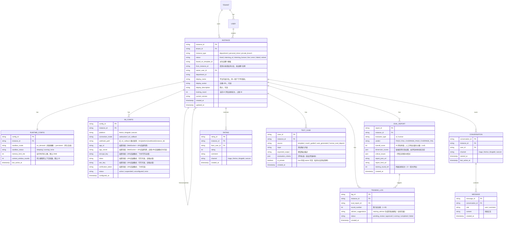

### 8.2 关键字段说明

#### INSTANCE 表

| 字段 | 类型 | 说明 |
|---|---|---|
| `instance_id` | string | 主键 |
| `tenant_id` | string | **多租户隔离字段，MVP 必加** |
| `instance_type` | enum | `department` / `personal_clone` / `private_branch` |
| `status` | enum | hired / interning_ai / interning_human / live / **error** / failed / retired |
| `based_on_template_id` | string | 派生自哪个模板（模板 id） |
| `from_instance_id` | string | 若是 personal_clone / private_branch，记录来源实例 id |
| `owner_user_id` | string | 实例归属用户 |
| `department_id` | string | 所在部门 |
| `display_name` | string | 平台内显示名，同一 `owner_user_id` 下不可重名；分身创建阶段 3 必填 |
| `display_avatar` | string | 头像 URL，可选；默认沿用母实例头像 |
| `display_description` | string | 简介，可选 |
| `training_round` | int | 当前 AI 评估已使用的训练轮次，初始为 0，上限 30；达到 30 后系统标记"训练失败" |

#### IM_CONFIG 表

> 本表替代 v3.0 中的 `FEISHU_APP_CONFIG` 表，支持多平台。一个实例可有多条记录（每平台一条）。

| 字段 | 类型 | 说明 |
|---|---|---|
| `config_id` | string | 主键 |
| `instance_id` | string | 关联的实例 |
| `platform` | enum | `feishu` / `dingtalk` / `wecom` |
| `webhook_path` | string | 平台分配的 Webhook 路径（`/im/{platform}/webhook/{instance_id}`） |
| `status` | enum | `unconfigured`（未配置）/ `active`（已注册，连接成功）/ `error`（连接失败或凭证异常）/ `retired`（随实例退役已清除） |
| `configured_at` | timestamp | 最近一次成功配置的时间 |

**各平台各模式凭证字段说明**：

| 平台 | 模式 | app_id | app_secret | encrypt_key | token | aes_key | verification_token |
|---|---|---|---|---|---|---|---|
| feishu | websocket | 必填 | 必填 | - | - | - | - |
| feishu | url_callback | 必填 | 必填 | 必填 | - | - | 可选 |
| dingtalk | websocket | 必填 | 必填 | - | - | - | - |
| dingtalk | url_callback | 必填 | 必填 | 必填 | 可选 | 可选 | - |
| wecom | websocket | 必填（AgentID） | 必填 | - | - | - | - |
| wecom | url_callback | - | - | - | 必填 | 必填（EncodingAESKey） | - |

> **私有分支说明**：私有分支拥有独立的 IM_CONFIG 记录（每平台各一条），初始 `status=unconfigured`，由 owner 在上岗后自行配置；不复用、不继承原分身凭证。

**唯一性约束**：同一 `instance_id` 下每个 `platform` 最多一条有效记录。

#### CONVERSATION 表

新增 `channel` 字段区分对话渠道（`inapp` / `feishu` / `dingtalk` / `wecom`）。对话历史按 `instance_id + user_id + channel` 三重隔离。

#### MESSAGE 表

| 字段 | 类型 | 说明 |
|---|---|---|
| `message_id` | string | 主键 |
| `conversation_id` | string | 关联的对话 |
| `role` | enum | `user`（用户输入）/ `assistant`（员工回复） |
| `content` | string | 消息正文（文本；富文本暂不支持） |
| `created_at` | timestamp | 消息时间 |

上下文截断策略：向员工沙箱传递上下文时取最近 20 轮（40 条消息），超出部分不传入模型，但持久化存储完整历史供用户查看。

#### EVAL_REPORT 表

| 字段 | 类型 | 说明 |
|---|---|---|
| `report_id` | string | 主键 |
| `instance_id` | string | 被评估的实例 |
| `evaluator_type` | enum | `ai`（AI 评估员）/ `human`（人工评估） |
| `verdict` | enum | `PASS` / `FAIL` / `OVERRIDE_PASS` / `OVERRIDE_FAIL`（人工 Override 后的结论） |
| `overall_score` | int | AI 评估综合得分（0-100）；人工评估无量化分数，字段为 null |
| `dimension_scores` | json | 各维度得分及权重；结构由评估本体动态决定，不同岗位字段不同 |
| `critical_issues` | json | 命中的一票否决项列表；若无则为空数组 |
| `report_json_url` | string | 报告 JSON 格式访问链接 |
| `report_html_url` | string | 报告 HTML 格式访问链接（供前端展示） |
| `training_round_ref` | int | 本报告所属训练轮次（0 = 首次评估，1-30 = 重训后评估） |
| `created_at` | timestamp | 报告生成时间 |

**唯一性说明**：同一实例可有多条 EVAL_REPORT 记录（每轮训练 + 首次共最多 31 条 AI 报告 + 最多 1 条人工报告）。人工 Override 不新建报告，直接更新对应 AI 报告的 `verdict` 字段。

#### TEST_CASE 表

| 字段 | 类型 | 说明 |
|---|---|---|
| `case_id` | string | 主键 |
| `instance_id` | string | 归属实例（部门员工 / 私有分支） |
| `source` | enum | `template`（模板自带）/ `coach_guided`（雇佣教练引导沉淀）/ `auto_generated`（ontology-extraction 自动生成）/ `human_eval_deposit`（人工评估后沉淀） |
| `input` | string | 测试输入内容 |
| `expected_output` | string | 期望输出描述 |
| `evaluation_criteria` | json | 评判标准（来自评估本体；约束合规类型优先级最高） |
| `is_private` | boolean | `true` 时仅 `owner_user_id` 可见，用于私有分支独立测试集 |
| `created_at` | timestamp | 创建时间 |

测试用例在**④ 生成实例包**阶段随实例包打包，AI 评估启动时直接读取，无需额外触发。人工评估时临场输入的案例，评估结束后自动以 `source=human_eval_deposit` 写入。

#### TRAINING_LOG 表

| 字段 | 类型 | 说明 |
|---|---|---|
| `log_id` | string | 主键 |
| `instance_id` | string | 归属实例 |
| `eval_report_id` | string | 触发本轮训练的失败报告 ID |
| `round_number` | int | 第几轮训练（1-30） |
| `advisor_suggestions` | string | `training_advisor` 生成的改进建议全文（含优先级 high / medium / low） |
| `status` | enum | `pending_review`（等待人工审核）/ `approved`（审核通过开始训练）/ `running`（训练进行中）/ `completed`（训练完成，进入下一轮评估）/ `failed`（训练失败） |
| `created_at` | timestamp | 创建时间 |

每轮训练前须人工审核确认（`status: pending_review → approved`），达到 30 轮仍未通过时系统标记"训练失败"，提供所有轮次报告由管理员决定是否重置。

### 8.3 多租户隔离要求

所有业务数据表必须包含 `tenant_id` 字段，所有查询必须始终携带 `tenant_id` 过滤条件，文件存储路径按 `tenant_id` 隔离。

### 8.4 个人数据隐私保护

- CONVERSATION 和 MESSAGE 数据必须有**用户级别的可见性控制**
- 部门长对部门员工的评分聚合权限，**仅限于看聚合统计，不能下钻到具体对话内容**
- 私有分支的 ontology 内容、对话内容只对 `owner_user_id` 可见
- `is_private=true` 的 TEST_CASE 记录只对 `owner_user_id` 可见；部门员工的测试集（`is_private=false`）对部门长可见，对普通成员不可见
- TRAINING_LOG 记录只对 `owner_user_id`（及租户管理员）可见；普通成员不得查看其他人的训练历史
- EVAL_REPORT 中的 `dimension_scores` 和 `critical_issues` 仅评估发起方（部门长 / 用户自己）可查阅；运营聚合统计不包含具体评分内容

---

## 9. 接口规格

### 9.1 与构建端的接口

#### 9.1.1 模板池查询

```
GET /api/templates
Query params:
  - tenant_id: required
  - keyword: optional
  - status: required (published)
```

#### 9.1.2 模板详情加载

```
GET /api/templates/{template_id}
```

### 9.2 与创世员工的接口

#### 9.2.1 启动 employee_coach_conversation（雇佣教练）

```
POST /api/coach/start
Body:
  - tenant_id
  - user_id
  - mode: "hire_department" | "hire_private_branch"
  - based_on_template_id: 当 mode=hire_department 时必填
  - based_on_instance_id: 当 mode=hire_private_branch 时必填
```

**模式说明**：
- `hire_department`：启动完整四阶段装配（① 上传资料 → ② 补齐技能 → ③ 配置外部系统 → ④ 生成实例包），面向部门长的部门版雇佣
- `hire_private_branch`：预载父实例的三阶段产物（本体切片、技能配置、外部系统配置）进入双栏界面，用户仅需修改目标部分，触发对应子技能（`ontology-extraction` / `skill-generation` / `external-config`）重新执行后重新汇总

**注**：分身复制（personal_clone）流程不调用 雇佣教练，无对应 mode。

#### 9.2.2 启动 AI 评估员

```
POST /api/evaluator/start
Body:
  - tenant_id
  - target_type: "instance"
  - target_id: instance_id
  - test_case_set_id
```

系统在执行此接口前，自动完成测试用例来源检查（§4.3.2.1）。接口启动后进入异步评估流程（双沙箱模式），评估完成后通过 webhook 或轮询获取结果。

**启动响应：**

```json
{
  "evaluation_id": "...",
  "status": "initializing",
  "generated_on_demand": false
}
```

评估流程为异步，通过轮询 `/api/evaluator/{evaluation_id}` 获取进度。`status` 流转：`initializing` → `pending_confirmation`（等待用户确认考题卡片）→ `running` → `completed` / `failed`。

**评估完成响应：**

```json
{
  "evaluation_id": "...",
  "status": "completed",
  "verdict": "PASS",
  "overall_score": 82,
  "dimension_scores": [
    { "dimension": "functional_completeness", "score": 90, "weight": 0.25 },
    { "dimension": "interaction_quality", "score": 82, "weight": 0.30 },
    { "dimension": "process_compliance", "score": 88, "weight": 0.15 },
    { "dimension": "problem_resolution", "score": 80, "weight": 0.20 },
    { "dimension": "tool_call_correctness", "score": 95, "weight": 0.10 }
  ],
  "critical_issues": [],
  "manual_review": { "required": true, "status": "pending" },
  "report_json_url": "https://.../reports/{evaluation_id}.json",
  "report_html_url": "https://.../reports/{evaluation_id}.html"
}
```

注：`dimension_scores` 中的维度和权重由评估本体动态确定，不同岗位结构不同。`generated_on_demand: true` 表示触发了 `scenario_parser` 兜底生成，属于异常路径。

#### 9.2.3 轮询评估进度

```
GET /api/evaluator/{evaluation_id}
Query params:
  - tenant_id: required
```

返回：

```json
{
  "evaluation_id": "...",
  "status": "initializing | pending_confirmation | running | completed | failed",
  "current_case_index": 3,
  "total_cases": 10,
  "verdict": "PASS | FAIL | null（进行中）",
  "overall_score": 82,
  "report_json_url": "...",
  "report_html_url": "..."
}
```

`status` 流转：`initializing` → `pending_confirmation`（等待用户确认考题卡片）→ `running` → `completed` / `failed`。前端建议以 3 秒间隔轮询，`completed` 或 `failed` 后停止。

#### 9.2.4 提交人工评估结论

```
POST /api/evaluator/{evaluation_id}/human-result
Body:
  - tenant_id: required
  - verdict: required  ("PASS" | "FAIL")
  - override_ai: optional  (boolean，true 时表示推翻 AI 结论)
  - comment: optional  (人工评语，建议在 override 时填写)
```

返回：

```json
{
  "report_id": "...",
  "verdict": "OVERRIDE_PASS | OVERRIDE_FAIL | PASS | FAIL",
  "next_action": "publish_available | review_required"
}
```

- `override_ai=true` 时：AI 报告的 `verdict` 更新为 `OVERRIDE_PASS` 或 `OVERRIDE_FAIL`，最终结论以人工决定为准
- `next_action=publish_available` 表示人工通过，前端展示"发布上岗"按钮
- `next_action=review_required` 表示人工不通过，前端展示"回退到 Review"入口

### 9.3 站内对话接口

#### 9.3.1 发送消息

```
POST /api/instances/{instance_id}/inapp-chat/messages
Body:
  - user_id: required
  - content: required（文本内容）
  - tenant_id: required
```

返回（流式，SSE）：
```
Content-Type: text/event-stream
data: {"delta": "..."}
data: {"delta": "..."}
data: [DONE]
```

#### 9.3.2 获取对话历史

```
GET /api/instances/{instance_id}/inapp-chat/messages
Query params:
  - user_id: required
  - tenant_id: required
  - limit: optional（默认 50）
  - before: optional（cursor，用于分页）
```

#### 9.3.3 清空对话历史

```
DELETE /api/instances/{instance_id}/inapp-chat/messages
Body:
  - user_id: required
  - tenant_id: required
```

### 9.4 多平台 IM 接口

#### 9.4.1 获取实例 IM Webhook URL

```
GET /api/instances/{instance_id}/im-webhook-url?platform={feishu|dingtalk|wecom}
```

返回：
```json
{
  "platform": "feishu",
  "webhook_url": "https://{platform_domain}/im/feishu/webhook/{instance_id}"
}
```

#### 9.4.2 注册 IM 配置（含连接验证）

```
PUT /api/instances/{instance_id}/im-config/{platform}
Body:
  - connection_mode: required  ("websocket" | "url_callback")

  # WebSocket 模式（飞书/钉钉/企微通用）
  - app_id: required
  - app_secret: required

  # URL 回调模式·飞书
  - app_id: required
  - app_secret: required
  - encrypt_key: required
  - verification_token: optional

  # URL 回调模式·钉钉
  - app_id: required
  - app_secret: required
  - encrypt_key: required
  - token: optional
  - aes_key: optional

  # URL 回调模式·企微
  - token: required
  - aes_key: required  (EncodingAESKey)
```

平台接收后：
1. 加密存储所有凭证字段
2. 根据 `connection_mode` 自动发起连接验证（WebSocket 握手 或 URL 可达性测试）
3. 返回注册结果与连接状态

返回：
```json
{
  "status": "active" | "error",
  "connection_mode": "websocket" | "url_callback",
  "message": "连接成功" | "连接失败原因描述"
}
```

#### 9.4.3 获取 IM 配置状态

```
GET /api/instances/{instance_id}/im-config
```

返回：
```json
{
  "configs": [
    { "platform": "feishu", "status": "active", "configured_at": "..." },
    { "platform": "dingtalk", "status": "unconfigured" },
    { "platform": "wecom", "status": "unconfigured" }
  ]
}
```

#### 9.4.4 撤销 IM 配置

```
DELETE /api/instances/{instance_id}/im-config/{platform}
```

退役实例时或用户主动解除绑定时调用，清空对应平台的凭证字段，Webhook URL 停止响应。

#### 9.4.5 接收 IM 消息（Webhook，由各平台调用）

```
POST /api/im/feishu/webhook/{instance_id}    （飞书推送）
POST /api/im/dingtalk/webhook/{instance_id}  （钉钉推送）
POST /api/im/wecom/webhook/{instance_id}     （企微推送）
```

各平台按自身标准 Webhook payload 格式推送，平台先校验对应平台的签名，通过后路由到对应运行时沙箱。

### 9.5 实例生命周期管理接口

#### 9.5.1 浏览实例列表

```
GET /api/instances
Query params:
  - tenant_id: required
  - department_id: optional（按部门过滤）
  - instance_type: optional  ("department" | "personal_clone" | "private_branch")
  - status: optional（多值逗号分隔，如 "live,hired"）
  - owner_user_id: optional（仅查自己的实例时传入）
```

返回字段包含 `instance_id`、`instance_type`、`status`、`display_name`、`display_avatar`、`from_instance_id`、`im_config_summary`（各平台状态摘要）。

#### 9.5.2 创建个人分身（快照复制）

```
POST /api/instances/clone
Body:
  - tenant_id: required
  - source_instance_id: required  (部门员工 instance_id，status 必须为 live)
  - display_name: required
  - display_avatar: optional
  - display_description: optional
```

返回：

```json
{
  "instance_id": "...",
  "status": "live",
  "message": "分身已上岗，站内对话立即可用"
}
```

操作含义：完整拷贝源实例包（config / ontology / skill 目录及三个根文件）到新存储路径；`instance_type=personal_clone`；`from_instance_id` 指向源实例；**不进入双阶段评估**；立即启动运行时沙箱。

#### 9.5.3 发布实例上岗

```
POST /api/instances/{instance_id}/publish
Body:
  - tenant_id: required
```

适用场景：部门员工人工评估通过后发布（`interning_human` → `live`）；私有分支人工自评通过后发布（`interning_human` → `live`）。发布时自动启动持久化运行时沙箱。

#### 9.5.4 退役实例

```
POST /api/instances/{instance_id}/retire
Body:
  - tenant_id: required
```

状态切换为 `retired`；销毁运行时沙箱；清空 IM 配置凭证（Webhook URL 停止响应）；对话历史保留（只读）。前置校验：`live` / `interning_*` / `hired` 状态均可退役；`retired` 状态重复调用返回 400。

#### 9.5.4A 彻底删除实例

```
DELETE /api/instances/{instance_id}
Body:
  - tenant_id: required
```

前置条件：`status` 必须为 `retired`，否则返回 409（"请先退役该分身"）。

操作内容（按序执行，任一步骤失败则整体回滚）：
1. 删除实例包文件（config / ontology / skill 目录及根文件）
2. 删除 CONVERSATION + MESSAGE 记录
3. 删除 EVAL_REPORT 记录
4. 删除 TEST_CASE（`is_private=true`）记录
5. 删除 TRAINING_LOG 记录
6. 删除 INSTANCE 记录

返回 204 No Content；操作写入审计日志（记录删除时间、操作用户、实例 display_name 快照）。

#### 9.5.5 创建私有分支

```
POST /api/instances/{instance_id}/private-branch
Body:
  - tenant_id: required
  - user_id: required
```

前置条件：`instance_id` 必须为 `personal_clone` 类型且 `status=live`；同一分身下不可有 `status` 非 `retired` 的私有分支（同一时刻只允许一个活跃私有分支）；不可为 `private_branch` 类型实例创建（禁止嵌套）。创建后：生成新 `instance_id`（`instance_type=private_branch`，`status=hired`）；为每个支持平台创建独立 IM_CONFIG 记录（`status=unconfigured`）；原分身 IM_CONFIG 不受任何影响；启动 雇佣教练 私有分支模式，预载父实例三阶段产物。

#### 9.5.6 废弃私有分支

```
DELETE /api/instances/{instance_id}/private-branch
Body:
  - tenant_id: required
```

将私有分支状态置为 `retired`；各平台 IM_CONFIG 同步置为 `retired`（Webhook URL 停止响应）；原分身 IM_CONFIG 全程不受影响。操作不可撤销；废弃后同一个人分身**可重新创建**新的私有分支（从零开始新一轮雇佣流程）。

---

## 10. 非功能性需求

### 10.1 性能要求

| 场景 | 指标要求 |
|---|---|
| 模板池查询 | P95 ≤ 500ms |
| 进入对话界面（列表页加载） | P95 ≤ 500ms |
| 部门版雇佣对话回复（employee_coach_conversation） | P95 ≤ 5s |
| 分身复制平台侧耗时 | **P95 ≤ 30s** |
| 站内对话首字符出现（流式） | **P95 ≤ 3s** |
| 站内对话完整回复输出 | **P95 ≤ 8s** |
| IM 消息收到 → 回复发出 | **P95 ≤ 8s**（含模型推理） |
| AI 评估完成 | 10 个用例 P95 ≤ 5 分钟 |
| 沙箱冷启动（消息唤醒） | P95 ≤ 10s |
| WebSocket 重连恢复时间 | P95 ≤ 30s（首次立即重连 + 退避至 1 次成功） |
| WebSocket 长连接可用性 | 月可用率 ≥ 99.5%（单实例维度，不含 IM 平台侧故障） |
| 评估报告生成后可访问（JSON/HTML） | P95 ≤ 2s |

### 10.2 安全要求

#### 10.2.1 数据隔离

- **多租户隔离**：所有查询强制携带 tenant_id 过滤
- **用户级隔离**：同租户内 A 用户不能访问 B 用户的实例、对话、评分记录
- **部门长的越权防护**：不能访问部门内其他成员的私有分支和个人对话

#### 10.2.2 敏感信息处理

- IM_CONFIG 中所有凭证字段必须**加密存储**，UI 中遮蔽显示（`****`）
- 部门员工的 api 配置中的敏感字段（API key、token、凭证等）加密存储
- 对话内容中可能包含的敏感业务信息，日志中需脱敏

#### 10.2.3 IM 侧安全

- 每次收到各平台 Webhook 推送时，必须校验平台签名，防止伪造请求
- **各平台应用身份凭证定期提醒用户轮换**：
  - 轮换对象：主要指**应用身份凭证**（`app_id` + `app_secret` / `agent_id` + `agent_secret`），即调用各IM平台API的身份密钥
  - 轮换原因：各IM平台对应用密钥有有效期要求（飞书/钉钉通常90-180天，企微类似），到期后平台侧可能强制失效
  - 提醒周期：凭证到期前 **30 天**、**7 天**、**1 天** 各提醒一次
  - 通知渠道：平台站内通知（触达实例 owner）+ 邮件备投
  - 提醒内容：提示用户前往哪个实例、哪个平台配置页更新`app_id`/`app_secret`
  - **回调加解密凭证**（`encrypt_key` / `aes_key` / `encoding_aes_key`）通常为一次性设置，无需定期轮换
- **凭证轮换期间消息处理**：
  - 采用**热更新方案**：用户在配置页提交新凭证后，系统先验证新凭证有效性（调用平台接口校验），通过后**立即切换**到新凭证，切换期间消息不丢弃、不中断
  - 若新凭证验证失败，保持旧凭证继续使用，向用户提示"新凭证无效，请重新填写"
- **error 状态消息路由降级策略**：
  - `error` 状态（凭证失效/连接异常）时，**消息进入重试队列**，保留 **24 小时**，期间若用户重新配置成功，积压消息自动投递
  - 超过 24 小时未恢复，消息转为**死信**，向消息发送方返回"该员工暂时无法响应，请稍后再试"
  - 系统向实例 owner 发送告警通知（站内 + 邮件），告知积压消息量和剩余恢复时间窗口
- IM 配置的回填和更新操作记录审计日志

### 10.3 可观测性要求

- 所有 IM 消息流转可追溯（Webhook 进 → 签名校验 → 路由 → 沙箱处理 → 回复发出）
- 所有站内对话请求可追溯
- 所有沙箱生命周期事件可追溯
- 关键操作（创建实例、创建分身、上岗、退役、私有分支创建、IM 配置回填）有审计日志

### 10.4 资源约束（MVP 阶段）

#### 10.4.1 持久化沙箱

- 一旦实例上岗，运行时沙箱长期在线接收消息（站内和 IM）
- MVP 阶段采用**消息唤醒模式**：沙箱按需启动，处理完消息后休眠，下次消息再唤醒
- 上下文（对话历史）外置存储，不依赖沙箱内存；沙箱重启后从外部存储恢复，用户无感知
- 单实例运行时内存：≤ 2 GB；休眠时不占用计算资源
- **并发沙箱数量**：MVP 阶段单租户最多同时唤醒 50 个沙箱；超出时消息排队等待，SLA 放宽至 P95 ≤ 20s

#### 10.4.2 上下文存储约束

- 单个 CONVERSATION 保留完整历史消息，不设条数上限（用于前端翻页查看）
- 传入模型的上下文窗口：**最近 20 轮（40 条消息）**；超出部分截断最早消息，不影响存储
- 单条消息内容长度上限：**8000 字符**；超出时前端提示拆分发送
- 对话历史存储按 `instance_id + user_id + channel` 三重隔离，不同渠道（inapp / feishu / dingtalk / wecom）的上下文完全独立，**不互通**

#### 10.4.3 AI 评估训练循环资源约束

- 每轮训练需要额外的双沙箱资源（评估员沙箱 + 目标沙箱），最多并发进行 **5 个实例**的训练评估循环
- 单轮评估（10 个用例）最长允许运行 **10 分钟**，超时后自动标记为本轮 `failed`，不计入 30 轮上限
- 30 轮耗尽后，实例状态保持 `failed`，管理员可手动重置 `training_round=0` 重新开始；重置操作需在审计日志中记录
- 测试用例存储（TEST_CASE 表）单实例上限：**500 条**；超出时覆盖最旧的 `auto_generated` 来源记录（`coach_guided` 和 `human_eval_deposit` 来源不覆盖）

#### 10.4.4 IM 应用数量说明

- 多平台模式下，每个上岗的数字员工每平台对应一个 IM 机器人
- 各平台均存在企业应用数量配额，平台在 IM 接入引导页面中需明确提示
- MVP 阶段做各平台配额使用量监控，接近上限时向租户管理员告警

---

## 第四部分 · MVP 边界与排期建议

## 11. MVP 范围明确

### 11.1 MVP 必做清单

| 模块 | 优先级 |
|---|---|
| 部门长视角的部门版雇佣完整流程 | P0 |
| 部门长 / 普通成员的分身创建流程 | P0 |
| **站内对话（主要对话渠道）** | **P0** |
| **站内对话历史持久化** | **P0** |
| 飞书 IM 接入引导 + 凭证回填 + 注册（WebSocket/URL回调两种模式） | P0 |
| 飞书消息接收（Webhook 签名校验 + 路由） | P0 |
| 飞书消息发送 | P0 |
| 双阶段评估流程（部门员工） | P0 |
| 评估失败简化 Review | P0 |
| 持久化运行时沙箱 | P0 |
| 部门员工 / 我的分身 / 私人定制三层关系建模 | P0 |
| 多租户隔离基础 | P0 |
| 用户级数据隔离 | P0 |
| 员工卡片快捷 IM 入口（配置 IM / 去 IM） | P0 |
| **钉钉 IM 接入** | **P1** |
| **企微 IM 接入** | **P1** |
| 评分基础 | P1 |
| 私有分支定制流程 | P1 |

### 11.2 MVP 不做清单（明确推迟）

| 模块 | 推迟原因 |
|---|---|
| 飞书 / 钉钉 / 企微群聊接收 | 与"一对一私聊"原则冲突 |
| 数字员工之间的协作 | 与原始需求"不需要协作"一致 |
| QQ 机器人接入 | 暂不支持 |
| 部门长越权访问部门成员对话 | 与隐私保护原则冲突 |
| 实时仪表盘（评分、使用量） | MVP 用静态报表 |
| 私有分支的二次分支 | 避免无限套娃 |
| 用户上传私有 skill | 与"不允许过度自由"原则冲突 |
| 跨部门的分身共享 | 与数据隔离原则冲突 |
| 站内对话与 IM 上下文互通 | MVP 各渠道维护独立上下文 |
| IM 配置自动同步到平台 display_* 字段 | MVP 由用户手动保持一致 |
| 私有分支持续进化不改变 IM 配置（重新雇佣时 IM 凭证无缝继承） | MVP 中私有分支上岗后 owner 独立配置 IM，废弃重建后需重新配置；不涉及凭证自动继承或路由无缝切换 |
| 对话评分与反馈链路 | MVP 不建设独立评分入口和反馈流转；运营数据依赖后期迭代补充（原第 11 节内容，评分范围 1-5 星 + 文字评论 + 按分身/部门聚合查看） |

### 11.3 MVP 边界守护

下列情况出现需要警惕：
- 用户要求"让两个数字员工拉群一起讨论"——**拒绝**，违背一对一原则
- 用户要求"在飞书群里 @ 数字员工"——**拒绝**，违背群聊禁用原则
- 用户要求"在分身里直接写 skill 代码"——**拒绝**，违背"不允许过度自由"原则
- 部门长要求"我想看下属跟数字员工的对话"——**拒绝**，违背隐私保护原则
- 用户要求"在私有分支基础上再分支"——**拒绝**，避免无限套娃
- 用户要求"把站内对话和飞书对话的上下文合并"——**拒绝，MVP 不做**

### 11.4 与构建端的协同边界

- 雇佣端**不实现模板的生产能力**——所有模板必须来自构建端或平台一
- 雇佣端**不修改创世员工**——平台一全权管理
- 雇佣端当前版本**不建设**回流到构建端和平台一的运行时反馈链路

---

## 12. 关键风险点

| 风险 | 影响 | 应对 |
|---|---|---|
| 各 IM 平台应用配额触顶 | 大规模分身时无法创建新机器人 | MVP 阶段做配额监控，接近上限时告警；提前告知用户申请扩容 |
| 用户忘记在 IM 平台禁用群聊 | 群聊消息可能触发 Webhook | 接入引导中明确步骤；平台侧对群聊消息做安全过滤 |
| IM 凭证泄漏 | 攻击者可伪造消息发送 | 加密存储；提醒用户定期轮换；Webhook 必须校验签名 |
| 持久化沙箱的资源消耗 | 大量分身在线推高成本 | 消息唤醒模式，休眠时不占用计算资源 |
| 用户对"快照式独立"的认知差 | 用户期待母版升级后分身也升级 | 产品文案明确说明，UI 上提示分身的独立性 |
| 私有分支的隐私边界被部门长越权 | 严重的信任崩塌 | 在数据库 ACL 层面强制隔离，代码评审重点关注 |
| 站内对话与 IM 上下文割裂带来的用户困惑 | 用户期望"在飞书说过的我在平台里也能看到" | 明确告知两个渠道的上下文独立，界面上做区分展示 |

---

## 附录 A：核心状态机

### A.1 数字员工实例状态流转

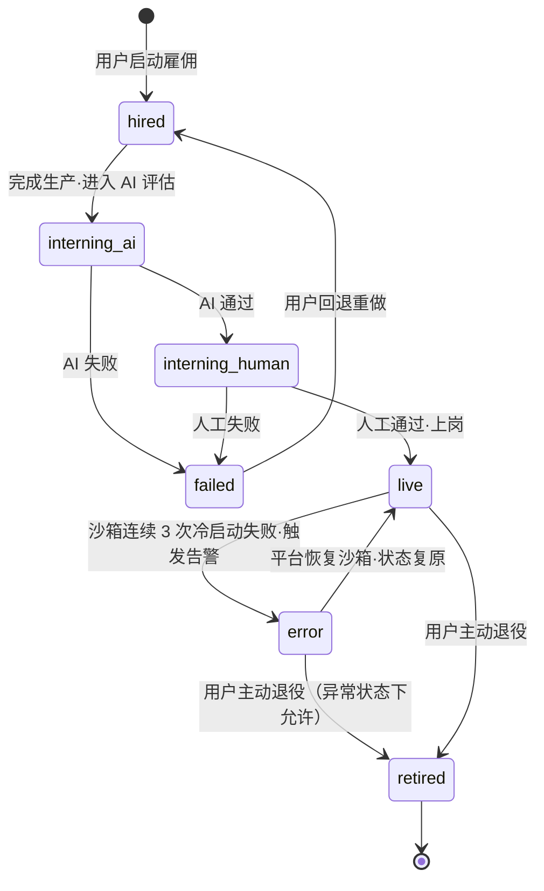

### A.2 IM_CONFIG 状态流转

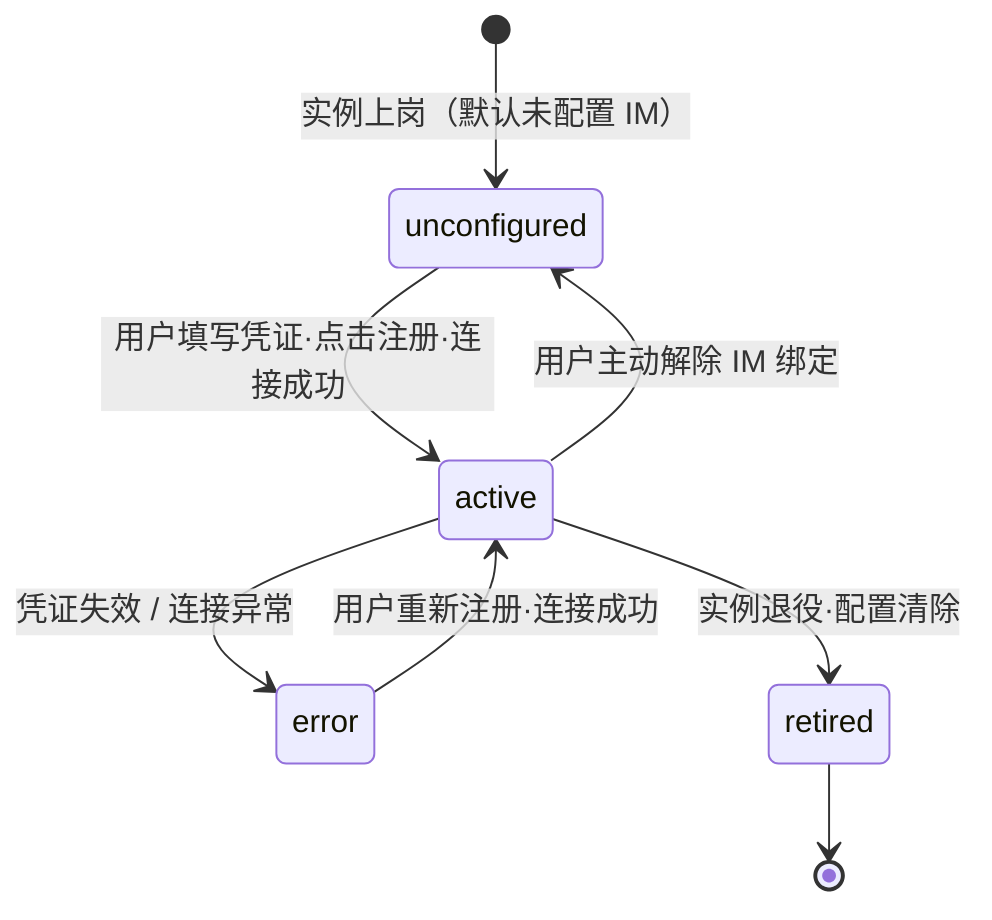

---

## 附录 C：术语与枚举定义

本附录汇总文档中所有枚举字段的**完整合法值、含义、适用实体**及**扩展规则**，供工程侧实现和 Code Review 时对照使用。枚举值一旦上线即为契约，变更须走版本升级流程。

---

### C.1 `channel`（对话渠道）

**适用实体**：CONVERSATION、MESSAGE、RATING

| 值 | 含义 | 备注 |
|---|---|---|
| `inapp` | 平台站内对话（Web 界面） | 上岗即可用，无需额外配置 |
| `feishu` | 飞书 IM 渠道 | 需 IM_CONFIG.platform=feishu 且 status=active |
| `dingtalk` | 钉钉 IM 渠道 | 需 IM_CONFIG.platform=dingtalk 且 status=active |
| `wecom` | 企业微信 IM 渠道 | 需 IM_CONFIG.platform=wecom 且 status=active |

**上下文隔离规则**：`inapp` 与任何 IM 渠道的对话上下文完全独立，不互通。三个 IM 平台之间的对话上下文也彼此独立，底层共用同一运行时沙箱。

**扩展规则**：新增 IM 平台（如 Teams、Slack）时在此枚举追加新值，同时须在 IM_CONFIG.platform、Webhook 路由、消息处理时序三处同步扩展，不得仅改单处。

---

### C.2 `instance_status`（实例状态）

**适用实体**：INSTANCE（字段名 `status`）

| 值 | 阶段 | 含义 | 允许的后续状态 |
|---|---|---|---|
| `hired` | 雇佣中 | 已启动雇佣流程，四阶段装配进行中 | `interning_ai` |
| `interning_ai` | 评估中 | AI 双沙箱评估进行中 | `interning_human`（AI 通过）/ `failed`（AI 失败） |
| `interning_human` | 评估中 | 人工评估进行中 | `live`（人工通过）/ `failed`（人工不通过） |
| `live` | 上岗 | 运行时沙箱在线，可接收站内对话和 IM 消息 | `error` / `retired` |
| `error` | 异常 | 沙箱连续 3 次冷启动失败，实例暂时不可用；IM 消息进入重试队列 | `live`（平台恢复后）/ `retired`（用户主动退役） |
| `failed` | 失败 | AI 或人工评估失败，等待 Review 后重新雇佣 | `hired`（用户回退重做） |
| `retired` | 退役 | 沙箱已销毁，IM 解绑，历史只读；可被彻底删除 | —（终态，下一步只有删除） |

**不可达路径**：`interning_ai` / `interning_human` 不可直接跳到 `retired`，须先经过 `failed → hired` 再退出；`hired` 不可直接跳到 `live`。

**`error` 与 `failed` 的区别**：
- `failed`：评估期间判定不通过，是**业务结论**，需要用户介入修改后重跑评估
- `error`：上岗后基础设施故障，是**技术故障**，由平台运维修复，用户无需操作

**扩展规则**：新增状态前须评估对以下系统的影响：前端列表筛选逻辑、IM 路由中间件、分身数量上限计数器（仅排除 `retired`）、沙箱生命周期管理。变更须更新本附录、§3.1 状态表、§8.1 ER 图、附录 A.1 状态机，四处保持一致。

---

### C.3 `im_config_status`（IM 配置状态）

**适用实体**：IM_CONFIG（字段名 `status`）

| 值 | 含义 | 消息路由行为 | 允许的后续状态 |
|---|---|---|---|
| `unconfigured` | 尚未配置该平台的 IM 凭证 | 无 Webhook，该平台消息不可达 | `active` |
| `active` | 凭证已注册，连接验证成功，正常接收消息 | 消息路由到本实例沙箱 | `error` / `unconfigured` / `retired` |
| `error` | 凭证失效或 WebSocket / Webhook 连接异常 | 消息进入重试队列，保留 24 小时；超时转死信 | `active`（用户重新注册成功后） |
| `retired` | 实例退役，凭证已清除，Webhook URL 停止响应 | 无路由（终态） | —（终态） |


**`error` 与 `unconfigured` 的区别**：
- `unconfigured`：从未配置过，是初始状态
- `error`：曾经 `active`，因凭证过期或网络异常变为异常，历史配置仍保留（加密存储），用户只需重新触发连接验证而无需重新填写所有字段

**扩展规则**：新增状态须同步更新附录 A.2 状态机；`error` 状态的消息重试 TTL（当前为 24 小时）如需调整，须同步更新 §10.2.3 和本附录。

---

### C.4 `instance_type`（实例类型）

**适用实体**：INSTANCE（字段名 `instance_type`）

| 值 | 来源 | 创建者 | 使用者 | 是否双阶段评估 | IM 配置 |
|---|---|---|---|---|---|
| `department` | 从模板雇佣 | 部门长 | 部门内所有人（通过创建分身） | 是 | 无（IM 在分身层完成） |
| `personal_clone` | 从部门员工快照复制 | 部门长 / 普通成员 | 仅 owner | 否（继承部门员工评估结果） | 可选，owner 自行配置 |
| `private_branch` | 从个人分身个性化定制 | 部门长 / 普通成员 | 仅 owner | 是（owner 自评） | 独立配置，上岗后 owner 自行配置（初始 `unconfigured`） |

**扩展规则**：新增实例类型须评估对以下逻辑的影响：分身数量上限计数器、双阶段评估是否触发、IM 路由策略、快照复制 / 实例包打包逻辑、可见性规则。

---

## 附录 B：关键决策追溯

| 决策 | 来源 |
|---|---|
| 一对一私聊，不支持群聊 | 用户原始需求 |
| 一个部门数字员工复制成多个独立数字员工 | 用户原始需求 |
| IM 接入采用"用户自建机器人回填凭证"模式（Mode A） | 工程简洁性决策（避免多 bot 身份复杂度） |
| 分身快照式独立，不级联升级 | 用户简化决策（无迭代逻辑） |
| 私有分支必须双阶段评估 | 用户原始需求（企业级严格门槛） |
| 私有分支评估者=用户自己 | 讨论中决策（影响范围只到自己） |
| 私有分支复用原分身 IM 配置 | 讨论中决策（用户 IM 体验不变，无需多一个联系人） |
| 部门长不能越权访问下属对话 | 讨论中决策（隐私保护） |
| **站内对话为主要对话渠道，IM 为可选** | **讨论中决策（降低接入门槛，上岗即可用）** |
| **支持飞书/钉钉/企微三平台，同一员工可多平台并行** | **讨论中决策（多平台覆盖，各平台独立凭证）** |
| **分身复制统一流程：部门长和普通成员均从部门员工空间复制到个人空间** | **讨论中决策（统一操作路径，降低认知负担）** |

---

## 附录 D：实例 × 渠道 × IM_CONFIG 三维行为矩阵

本附录描述在不同 `INSTANCE.status`、`channel`、`IM_CONFIG.status` 组合下，消息的完整路由行为。供工程侧实现消息路由中间件、前端状态展示和告警逻辑时使用。

---

### D.1 主路由矩阵（instance_status × channel）

> **说明**：IM 渠道列为汇总行为，`live` 状态下的细化规则见 D.2。`department` 类型实例 IM 渠道始终不可用（见 D.3）。

| `instance_status` | `inapp` 路由行为 | IM 渠道路由行为（feishu / dingtalk / wecom） |
|---|---|---|
| `hired` | ❌ 不可用：装配中，运行时沙箱尚未创建 | ❌ 不可用 |
| `interning_ai` | ❌ 不可用：AI 评估走独立双沙箱，不使用运行时沙箱 | ❌ 不可用；`private_branch` 此阶段 IM_CONFIG 为 `unconfigured`，无 IM 流量；原 personal_clone IM 正常运行（见 D.3） |
| `interning_human` | ✅ **可用（评估专用）**：加载实例包（不含测试用例），人工评估者通过 inapp 对话判断 | ❌ 不可用；`private_branch` 此阶段 IM_CONFIG 为 `unconfigured`，无 IM 流量；原 personal_clone IM 正常运行（见 D.3） |
| `live` | ✅ 路由到运行时沙箱，SSE 流式回复 | 取决于 `IM_CONFIG.status`，见 **D.2** |
| `error` | ⚠️ **降级**：提示"员工暂时离线，正在恢复中"；用户可刷新重试，不进队列 | ⚠️ **降级**：消息写入 24h 重试队列；沙箱恢复后按序投递；超时转死信并向发送方返回系统提示 |
| `failed` | ❌ 不可用：评估失败，等待 Review 后重启雇佣 | ❌ 不可用 |
| `retired` | ❌ 不可用：沙箱已销毁，历史只读 | ❌ 不可用：Webhook URL 返回 HTTP 404，不再响应 |

---

### D.2 IM 渠道子矩阵（仅当 instance_status = `live` 时适用）

> **前提**：INSTANCE.status = `live`。每个平台独立计算，同一实例可同时在多个平台处于不同状态。

| `IM_CONFIG.status` | Webhook 可达性 | 平台内部路由目标 | 最终消息落点 | 用户侧表现 |
|---|---|---|---|---|
| `unconfigured` | ❌ URL 不存在，平台从未注册 | N/A | N/A | 用户在 IM 中找不到机器人 |
| `active` | ✅ 正常接收推送，签名验证通过 | 本实例运行时沙箱 | 本实例处理并回复 | 正常对话 |
| `error` | ⚠️ Webhook 可达但连接异常 / 凭证失效，无法转发到沙箱 | 写入 24h 重试队列 | 恢复后投递本实例；超时写死信 | 机器人无响应；超时后平台返回"暂时无法响应" |
| `retired` | ❌ URL 停止响应（HTTP 404） | N/A | N/A | 消息发出后平台报错，无任何回复 |

---

### D.3 实例类型特殊路由规则

不同 `instance_type` 在标准矩阵之上有额外约束：

#### department（部门员工）

| 渠道 | 规则 |
|---|---|
| `inapp` | 部门员工本身无 inapp 对话入口；成员须创建分身后通过分身使用 |
| IM 渠道 | **始终不可用**：department 实例不存在 IM_CONFIG 记录；IM 接入在 personal_clone 层完成 |

#### personal_clone（个人分身）

标准矩阵规则完全适用，无额外约束。

#### private_branch（私有分支）

| 阶段 | inapp | IM 渠道 |
|---|---|---|
| 评估中（`interning_ai` / `interning_human`） | ✅ 可用（仅评估用途） | ❌ 无 IM 流量（private_branch 的 IM_CONFIG 此时为 `unconfigured`）；原 personal_clone IM 照常运行，互不影响 |
| 上岗后（`live`） | ✅ 路由到 private_branch 运行时沙箱 | 取决于 private_branch 自身的 `IM_CONFIG.status`（owner 自行配置后方可接收）；原 personal_clone IM 独立运行，互不干扰 |
| 废弃（`retired`） | ❌ 不可用 | private_branch 各平台 IM_CONFIG 随实例退役（Webhook 停止响应）；原 personal_clone IM 全程不受任何影响 |

---

### D.4 复合异常状态优先级

当多个维度同时处于异常时，路由行为按以下优先级决策（高优先级覆盖低优先级）：

| 优先级 | 触发条件 | 路由结果 |
|---|---|---|
| **P1（最高）** | `INSTANCE.status = retired` | 无论 IM_CONFIG 状态，Webhook 停止响应（HTTP 404） |
| **P2** | `INSTANCE.status = error` | 无论 IM_CONFIG 状态，消息进入 24h 重试队列（沙箱故障优先于凭证状态） |
| **P3** | `INSTANCE.status = live` + `IM_CONFIG.status = error` | 消息进入 24h 重试队列（凭证/连接异常） |
| **P4（最低）** | `INSTANCE.status = live` + `IM_CONFIG.status = active` | 正常路由到本实例沙箱 |

**惊群抑制**：`error` 状态的重试队列消费速率限制为单实例每秒最多 2 条，防止沙箱恢复后积压消息集中冲击。


---

## 附录 E：雇佣教练 Skill 架构与调用机制

> 本附录说明主雇佣流程（`employment-coach-conversation`）如何通过 Handoff 机制调用本体提取、技能生成和外部对接三个下游 skill，以及各 skill 的职责边界与信号流转方式。供工程侧实现雇佣教练调度逻辑时对照使用。

---

### E.1 四个 Skill 的角色定位

| Skill | 角色 | 写入目录 | 阶段 |
|---|---|---|---|
| `employment-coach-conversation` | **指挥官 / 对话引导者** | 不直接写产物目录；只维护 Handoff 工单 + 更新 config 文件 | 全程在线 |
| `ontology-extraction` | **本体提取执行者** | `ontology/` | 阶段一：资料 |
| `skill-generation` | **技能生成执行者** | `skills/<skill_slug>/` | 阶段二：技能 |
| `external-config` | **外部系统配置执行者** | `external/` | 阶段三：外部 |

核心设计原则：**雇佣教练只发信号，不直接执行**。它把用户输入整理成结构化 Handoff 工单，由下游 skill 按工单执行，执行完再回传结果给雇佣教练复述给用户。

---

### E.2 主流程：三阶段顺序解锁

```
阶段一：资料
  用户上传业务文档 / 描述业务场景
  雇佣教练 → 维护 material Handoff todo
  → dispatch → ontology-extraction 抽取本体切片
  → dispatch_callback → 用户确认
  → 阶段一完成

阶段二：技能
  用户描述"它要会做什么"
  雇佣教练 → 维护 skill Handoff todo
  → dispatch → skill-generation 生成技能包
  → dispatch_callback → 用户确认
  → 阶段二完成

阶段三：外部
  用户描述"它要能调什么外部系统"
  雇佣教练 → 维护 external Handoff todo
  → dispatch → external-config 生成配置草案
  → dispatch_callback → 用户确认
  → 阶段三完成
```

**硬卡点规则**：前置阶段必须完全闭环（所有 Handoff todo 进入 `confirmed`）才能解锁下一阶段。雇佣教练不允许跳步或并行推进。

---

### E.3 Handoff 工单机制（Dispatch 协议）

#### E.3.1 Handoff 工单结构

每一条 Handoff 工单是下游 skill 的可执行任务单，核心字段：

```yaml
session_id: session_20260508_001      # 会话 ID，贯穿全程
handoff_id: m_cs_rules_001           # 工单唯一 ID（m=material / s=skill / e=external）
kind: handoff_todo
stage: material | skill | external   # 对应三个阶段
target_skill: ontology-extraction | skill-generation | external-config
status: drafting | ready_to_dispatch | dispatched | dirty | confirmed | needs_review | dismissed
payload: {...}                        # 具体的执行内容（见各阶段说明）
acceptance: "..."                     # 下游产物必须满足的验收条件
```

#### E.3.2 工单状态流转

```
drafting          → 信息不完整，还在收集
ready_to_dispatch → 信息已够，等用户说"先这些"就可以发出
dispatched        → 已发给下游，等回传
dirty             → 发出后用户又改了，需要重发
confirmed         → 下游回传 + 用户确认，闭环完成
needs_review      → 上游规则变了，需要复核
dismissed         → 用户取消
```

#### E.3.3 Dispatch 触发条件

用户说出"先这些"/"就这些"/"可以了"等确认语，且当前阶段所有活跃工单都处于 `ready_to_dispatch`（无 `drafting`、`dispatched`、`needs_review` 阻塞项），雇佣教练才发出 dispatch 信号。

---

### E.4 阶段一：调用本体提取（ontology-extraction）

#### E.4.1 触发方式

```yaml
dispatch:
  target: ontology-extraction
  handoff_ids: [m_cs_rules_001, m_cs_style_001]
  mode: incremental   # incremental = 增量合并; full_replace = 全量替换
```

#### E.4.2 Handoff payload 结构

```yaml
payload:
  objective: "抽取《非标退货处理规则》里的判定条件、处置档位、分流触发条件"
  source_files: [非标退货处理规则.docx]
  scene_hint: customer_service   # 场景类型提示
  category: 决策规则              # 本体分类
  mode: incremental
```

#### E.4.3 执行过程

1. 校验工单：只处理 `stage=material`、`target_skill=ontology-extraction`、`status=ready_to_dispatch | dirty` 的工单
2. 读取 `payload.source_files` 中的资料文件
3. 围绕 `objective` 构造**最小语义闭包**（concepts / relations / constraints / sources）
4. 同时输出两份产物：
   - `ontology/<topic>.slice.json`：工程消费格式（codegen / prompt 编排用）
   - `ontology/<topic>.slice.md`：人工评审格式

#### E.4.4 回传结构

```yaml
dispatch_callback:
  source_dispatch_target: ontology-extraction
  handoff_ids: [m_cs_rules_001]
  user_summary: "已从这批资料中抽出退货判定条件和处置档位；结果已写入 ontology，并标出仍需确认的边界。"
  artifacts:
    - path: ontology/return-policy.slice.json
    - path: ontology/return-policy.slice.md
  todo_results:
    - handoff_id: m_cs_rules_001
      status: success | warning | failed | skipped
      validation: PASS | WARNING | FAIL
  status: success | partial | failed
```

雇佣教练拿到回传后，把 `user_summary` 用业务语言复述给用户，等用户确认后把工单标为 `confirmed`，才解锁阶段二。

---

### E.5 阶段二：调用技能生成（skill-generation）

#### E.5.1 触发方式

```yaml
dispatch:
  target: skill-generation
  handoff_ids: [s_refund_init_001]
```

#### E.5.2 Handoff payload 结构

```yaml
payload:
  skills:
    - origin: template_package          # 来源：模板包 / 对话 / 上传文件
      generation_action: reuse_existing # reuse_existing = 复用已有; generate_new = 新生成
      skill_name: 订单状态查询
      skill_description: 根据订单号查询订单状态和物流进度
      trigger: 用户询问订单状态 / 物流进度
      expected_output: 一条状态回复 + 下一步建议
      existing_skill_slug: order-status-query
      existing_artifact_path: skills/order-status-query/SKILL.md

    - origin: conversation
      generation_action: generate_new
      skill_name: 退货资格初判
      skill_description: 判断是否符合退货条件并把结论回给用户
      trigger: 出现退货 / 退款等关键词且匹配到具体订单
      expected_output: 一条回复（含结论 + 依据）+ 工单流转建议
```

**关键设计**：`payload.skills` 必须是**完整技能清单**，同时包含模板包已有的 skill（标记 `reuse_existing`）和本轮新增的 skill（标记 `generate_new`）。新生成的 skill 才会进入生成流程，已有的 skill 只记录引用不重复生成。

#### E.5.3 执行过程

1. 分流：Handoff 路径 / 直接路径 / 模糊路径
2. 将 `payload.skills[]` 归一为 **SkillSpec 中间模型**（统一 name / description / triggers / capabilities / boundaries）
3. 按模板渲染 `SKILL.md` + `metadata.json`
4. 质量校验：完整性、可触发性、可执行性、安全性、自包含性
5. 落盘到 `skills/<skill_slug>/`

#### E.5.4 产物目录结构

```
skills/<skill_slug>/
  SKILL.md              # 业务技能说明（面向运行时和人工审阅）
  metadata.json         # 完整 SkillSpec + 质量门 + 版本信息
  references/
    source-digest.md    # 输入来源归档
    extraction-notes.md # 能力提炼说明
    quality-report.md   # 质量校验结果
  contracts/            # 可选：当 ontology projection 信息足够时生成
    projections/ontology-extraction/...
```

#### E.5.5 回传结构

```yaml
dispatch_callback:
  source_dispatch_target: skill-generation
  user_summary: "已新增 1 个技能：退货资格初判；订单状态查询复用已有 skill。"
  todo_results:
    - handoff_id: s_refund_init_001
      status: success
      skill_results:
        - skill_name: 订单状态查询
          generation_action: reuse_existing
          status: reused
        - skill_name: 退货资格初判
          generation_action: generate_new
          status: success
          artifact: skills/seven-day-return-initial-check/SKILL.md
```

---

### E.6 阶段三：调用外部系统对接（external-config）

#### E.6.1 触发方式

```yaml
dispatch:
  target: external-config
  handoff_ids: [e_crm_read_001]
```

#### E.6.2 Handoff payload 结构

```yaml
payload:
  external_capabilities:
    - kind: normal                  # normal = 正常能力; skip = 用户明确不接外部系统
      category: read                # read / write / notify / search / transform
      objective: "退货咨询时从 CRM 拉指定订单的状态、客户等级、商品类型"
      target_system: 销售易 CRM
      integration_methods: [mcp]   # mcp / cli / http_api / sdk / webhook / manual
      linked_skills: [s_refund_init_001]
      auth_kind: API Key            # 认证类型，只描述类型不写实际值
      required_fields: [order_id, created_at, status, customer_tier, product_category]
```

**安全红线**：token / 密钥 / 密码 / API Key 等真实凭据绝不在 Handoff payload 里出现。`auth_kind` 只表示凭据类型，实际值只能通过系统层的安全表单通道传入。

#### E.6.3 执行过程

1. 入口校验（stage / target_skill / status / payload 字段合法性）
2. 凭据扫描（检测 payload 中是否混入疑似凭据，发现则阻断）
3. 系统归一化（`target_system` → `system_slug`，同一系统多条能力合并）
4. 能力建模（生成 capability 草案，保留字段映射占位和凭据槽位引用）
5. 落盘到 `external/` 目录

#### E.6.4 产物目录结构

```
external/
  external-config.index.json        # 总索引：所有能力、系统、skip 记录
  systems/
    xiaoshouyi-crm.json             # 按系统聚合：认证形式 + 凭据槽位 + 能力列表
  capabilities/
    e_crm_read_001.json             # 每条 Handoff todo 的配置草案
  README.md                         # 人工审阅说明（不含任何真实凭据）
```

#### E.6.5 回传结构

```yaml
dispatch_callback:
  source_dispatch_target: external-config
  user_summary: "已生成销售易 CRM 的订单读取配置初稿，包含字段占位；凭据需要在右侧表单补齐。"
  todo_results:
    - handoff_id: e_crm_read_001
      status: success
      credential_slots:
        - credential_slot: xiaoshouyi-crm-api-key
          secret_ref: EXTERNAL_XIAOSHOUYI_CRM_API_KEY
          binding_status: pending
```

---

### E.7 完整信号流转图

```
用户说话
    │
    ▼
employment-coach-conversation
    │  识别到可形成工单的内容
    │  ① 先调用 Handoff tool (action=upsert/patch) 记录工单
    │  ② 再给用户一句业务反馈
    │
    │  用户说"先这些"（阶段一）
    ├──► <dispatch target=ontology-extraction>
    │         │
    │         ▼
    │    ontology-extraction
    │    读取资料 → 抽取切片 → 写 ontology/
    │         │
    │         ▼
    │    dispatch_callback（含 user_summary + artifacts）
    │         │
    │         ▼
    ├──── 雇佣教练复述结果 → 用户确认
    │    工单状态: dispatched → confirmed
    │
    │  阶段一完成 → 解锁阶段二
    │
    │  用户说"先这些"（阶段二）
    ├──► <dispatch target=skill-generation>
    │         │
    │         ▼
    │    skill-generation
    │    SkillSpec 归一 → 渲染模板 → 质量校验 → 写 skills/
    │         │
    │         ▼
    │    dispatch_callback
    │         │
    │         ▼
    ├──── 雇佣教练复述结果 → 用户确认
    │    工单状态: dispatched → confirmed
    │
    │  阶段二完成 → 解锁阶段三
    │
    │  用户说"先这些"（阶段三）
    └──► <dispatch target=external-config>
              │
              ▼
         external-config
         能力建模 → 凭据槽位生成 → 写 external/
              │
              ▼
         dispatch_callback
              │
              ▼
         雇佣教练复述结果 → 用户确认凭据路径
         工单状态: dispatched → confirmed

         阶段三完成 → 进入实例打包（阶段四，不在本 skill 范围内）
```

---

### E.8 各 Skill 职责边界

| 能力 | 负责者 | 禁止跨界 |
|---|---|---|
| 引导对话、收集信息、维护 Handoff 工单 | `employment-coach-conversation` | 不直接写 ontology / skills / external |
| 更新 SOUL.md / IDENTITY.md / AGENTS.md | `employment-coach-conversation`（`<config_governance_patch>`） | MEMORY.md 永不修改 |
| 从业务资料抽取本体切片 | `ontology-extraction` | 不直接做 skill 生成或外部配置 |
| 生成业务技能包（SKILL.md） | `skill-generation` | 不修改 config / ontology / external |
| 生成外部系统配置草案 | `external-config` | 不收集真实凭据；不写 skills / ontology |
| 实例打包（阶段四） | 主 skill 自身 | 不在三个下游 skill 范围内 |

---

### E.9 关键约束汇总

| 约束 | 来源 |
|---|---|
| 前置阶段未完成时不创建下一阶段 Handoff 工单 | employment-coach-conversation 阶段硬卡点 |
| 雇佣教练不直接输出本体结构、skill 定义或外部配置内容 | employment-coach-conversation 禁止越权 |
| 下游 skill 只处理 `ready_to_dispatch` 或 `dirty` 状态的工单 | 三个下游 skill 均一致 |
| 产物必须同时有 `.md`（人读）和 `.json`（工程消费）两份 | ontology-extraction |
| `payload.skills[]` 必须同时包含复用项和新增项 | skill-generation |
| 真实凭据只能通过系统层安全表单通道传入，绝不出现在 payload | external-config + employment-coach-conversation |
| Handoff tool 调用先于对话输出，不能只在对话里复述 | employment-coach-conversation 全局原则 |

---


---

## 附录 F：评估专家系统 Skill 架构与评估机制

> 本附录说明评估专家系统（`evaluation-expert`）的整体架构，以及七个子 skill 如何分工协作，完成对目标 AI 沙箱的多维度自动化评估、报告生成和训练建议输出。供工程侧实现 AI 评估环节时对照使用。

---

### F.1 七个 Skill 的角色定位

| Skill | 角色 | 触发时机 |
|---|---|---|
| `live_evaluation_coordinator` | **交互入口 / 意图映射** | 用户发出评估请求时，最先响应 |
| `evaluation_orchestrator` | **主编排器 / 流程驱动者** | 由协调者调起，驱动完整评估生命周期 |
| `scenario_parser` | **场景解析器（降级路径）** | 仅当测试用例或评分规则缺失时 |
| `test_executor` | **测试执行者** | 对每条测试用例向目标沙箱发送请求并采集 trace |
| `evaluator` | **多维评分器** | 拿到 trace 证据后逐维打分 |
| `report_generator` | **报告持久化** | 评分完成后写入报告并返回链接 |
| `training_advisor` | **训练建议者（失败路径）** | 仅当评估结论为 FAIL 且人工允许重训时 |

核心设计原则：**编排器只调度，不直接评分；评分器只打分，不写报告；报告器只落盘，不给建议**。职责边界清晰，每个 skill 只做一件事。

---

### F.2 主流程：标准双沙箱评估路径

```
用户发起评估请求
    │
    ▼
live_evaluation_coordinator
    │  映射意图 → 触发 evaluation_orchestrator
    │
    ▼
evaluation_orchestrator
    │
    ├─① target_bootstrap     加载被评估目标沙箱（必须最先执行）
    ├─② fetch_testcases      拉取测试用例列表
    ├─③ ontology_query       查询评分维度和规则
    ├─④ 向用户展示测试用例卡片（question cards）
    │
    │  对每条测试用例循环：
    ├─⑤ test_executor
    │       ├─ target_execute  向目标沙箱发送输入
    │       └─ trace_read      读取执行 trace 证据
    │
    ├─⑥ evaluator
    │       └─ 四维打分（accuracy / completeness / compliance / communication）
    │          每个维度必须引用具体 trace 证据
    │
    ├─⑦ report_generator
    │       └─ report_upsert   持久化报告 → 返回 JSON 链接 + HTML 链接
    │
    └─⑧ 输出最终结论 + 等待人工审核决策
```

**硬约束**：
- `target_bootstrap` 必须在一切执行动作之前完成。
- `trace_read` 必须在评分之前完成；trace 读取失败则该用例标记为 `evidence_unavailable` 并停止本用例。
- `report_upsert` 成功之前，不允许宣告"评估完成"。

---

### F.3 降级路径：数据就绪分支

当测试用例列表为空或评分规则（ontology）缺失时，主流程转入降级路径：

```
evaluation_orchestrator 检测到数据缺失
    │
    ├─ 提示用户上传场景材料（文本描述 / 上传文件）
    │
    ▼
scenario_parser
    ├─ 从材料中提取 testcase（testcase_id / scenario_name / input / expected_steps）
    └─ 从材料中提取 ontology rules（dimension / description / weight）
    │
    ▼
evaluation_orchestrator 重新从第①步开始标准流程
```

`scenario_parser` 只负责**数据规范化**，绝不执行用例或打分。

---

### F.4 失败路径：训练建议分支

```
report_generator 落盘报告，结论为 FAIL
    │
    ▼
evaluation_orchestrator 等待人工审核
    │
    ├─ 人工审核：允许重训
    │       │
    │       ▼
    │   training_advisor
    │       ├─ 识别失分维度（focus dimensions）
    │       ├─ 给出具体可执行动作（concrete actions）
    │       └─ 预估改善后的分数增益（expected score gains）
    │
    └─ 人工审核：不重训 → 流程结束
```

`training_advisor` 的建议必须绑定报告中的具体证据，禁止给出泛泛的通用建议。

---

### F.5 工具职责表

| 工具 | 调用者 | 职责 |
|---|---|---|
| `target_bootstrap` | `evaluation_orchestrator` | 引导目标沙箱加载制品 zip |
| `fetch_testcases` | `evaluation_orchestrator` | 拉取结构化测试用例列表 |
| `ontology_query` | `evaluation_orchestrator` / `evaluator` | 查询评分维度权重和规则 |
| `target_execute` | `test_executor` | 向目标沙箱发送测试输入，拿到 `execution_id` |
| `trace_read` | `test_executor` | 读取 trace 证据（thinking / tool_calls / messages） |
| `evaluation_score` | `evaluator`（或顶层 skill）| 加权计算 `overall_score`，输出 `verdict`（PASS/FAIL） |
| `evaluation_generate_report` | `evaluator`（或顶层 skill）| 生成符合 schema 的结构化报告 JSON |
| `report_upsert` | `report_generator` | 持久化报告，返回 `report_json_url` 和 `report_html_url` |

---

### F.6 评分维度与权重

| 维度 | 默认权重 | 评估要点 |
|---|---|---|
| `accuracy`（准确性） | **0.35** | 事实正确性、工具调用选择恰当性、推理逻辑合理性 |
| `completeness`（完整性） | **0.25** | 功能点覆盖程度、边界条件处理、异常输入处理 |
| `compliance`（合规性） | **0.20** | 遵循安全策略、不暴露凭据、不执行危险操作 |
| `communication`（沟通质量） | **0.20** | 响应连贯性、信息清晰度、对用户意图的理解和引导 |

- **及格线**：`overall_score ≥ 75` → `PASS`，低于 75 → `FAIL`。
- 权重由 `ontology.dimension_weights` 字段提供，运行时可覆盖默认值。
- 每个维度打分必须在 `comment` 中引用具体 trace 证据（如 `trace://exec-xxx#step3`），允许第三方复核。

---

### F.7 输入数据结构（evaluation_score 调用入参）

```json
{
  "dimension_scores": [
    {
      "dimension": "accuracy",
      "score": 85,
      "max_score": 100,
      "comment": "响应内容准确，trace step 3 显示正确识别了用户意图...",
      "evidence_refs": ["trace://exec-xxx#step3"]
    },
    {
      "dimension": "completeness",
      "score": 78,
      "max_score": 100,
      "comment": "覆盖了主要功能点，但缺少对异常输入的处理",
      "evidence_refs": ["trace://exec-xxx#step5"]
    }
  ],
  "weights": {
    "accuracy": 0.35,
    "completeness": 0.25,
    "compliance": 0.20,
    "communication": 0.20
  },
  "pass_threshold": 75
}
```

---

### F.8 输出数据结构（evaluation_generate_report 调用入参）

```json
{
  "dimension_scores": [...],
  "overall_score": 82.5,
  "verdict": "PASS",
  "summary": "被评估沙箱整体表现良好，准确性和合规性表现突出，完整性有待提升",
  "strengths": [
    "工具调用选择准确，未出现误触发",
    "全程未暴露任何认证凭据"
  ],
  "weaknesses": [
    "对边界输入的处理不够完整",
    "多轮对话连贯性偶有断层"
  ],
  "suggestions": [
    {
      "area": "completeness",
      "suggestion": "增加对空输入和超长输入的边界校验用例",
      "priority": "high"
    },
    {
      "area": "communication",
      "suggestion": "在多轮对话中引入上下文摘要机制，防止信息丢失",
      "priority": "medium"
    }
  ]
}
```

---

### F.9 完整信号流转图

```
用户
    │
    ▼
live_evaluation_coordinator
    │  说明当前阶段 + 触发编排器
    ▼
evaluation_orchestrator
    │
    ├── target_bootstrap ──────────────────────────► 目标沙箱就绪
    ├── fetch_testcases ────────────────────────────► 用例列表
    ├── ontology_query ─────────────────────────────► 评分规则
    │
    │   [数据缺失？]──────────────────────────────► scenario_parser
    │                                                      │
    │   ◄─────────────── 补齐 testcase + ontology ─────────┘
    │
    │   for each testcase:
    │       ▼
    │   test_executor
    │       ├── target_execute ──────────────────────► execution_id
    │       └── trace_read ──────────────────────────► trace 证据
    │       ▼
    │   evaluator
    │       └── 四维打分 + evidence 引用
    │       ▼
    │   report_generator
    │       └── report_upsert ───────────────────────► JSON 链接 + HTML 链接
    │
    └── 输出最终结论（PASS/FAIL + overall_score + top 3 建议）
            │
            │   [FAIL + 允许重训？]
            └──────────────────────────────────────► training_advisor
                                                           │
                                                    具体改训动作 + 预期增益
```

---

### F.10 各 Skill 职责边界

| 能力 | 负责者 | 禁止跨界 |
|---|---|---|
| 接收用户意图、触发编排器、展示进度 | `live_evaluation_coordinator` | 不直接调用工具，不打分 |
| 驱动完整流程、决策分支、协调各子 skill | `evaluation_orchestrator` | 不直接打分，不直接写报告 |
| 从材料解析测试用例和评分规则 | `scenario_parser` | 不执行用例，不打分 |
| 向目标沙箱发送输入并读取 trace | `test_executor` | 不打分，不写报告 |
| 基于 trace 证据四维打分 | `evaluator` | 不执行用例，不写报告，不给训练建议 |
| 持久化报告并返回链接 | `report_generator` | 不修改评分，不给改进建议 |
| 生成可执行训练改善动作 | `training_advisor` | 仅在 FAIL 后使用，动作必须绑定证据 |

---

### F.11 关键约束汇总

| 约束 | 位置 |
|---|---|
| `target_bootstrap` 必须先于一切执行动作 | `evaluation_orchestrator` 硬卡点 |
| `trace_read` 失败则本用例停止，标记为 `evidence_unavailable` | `test_executor` |
| 每个维度评分必须引用具体 trace 证据，无证据不得打分 | `evaluator` |
| `report_upsert` 成功前不允许宣告评估完成 | `report_generator` |
| 训练建议必须绑定报告证据，禁止泛泛通用建议 | `training_advisor` |
| 全程不得在任何产物或对话中暴露沙箱认证凭据 | 全局安全红线 |
| 评分标准由 `ontology.dimension_rules` 提供，不自行定义 | `evaluator` + 顶层 skill |
