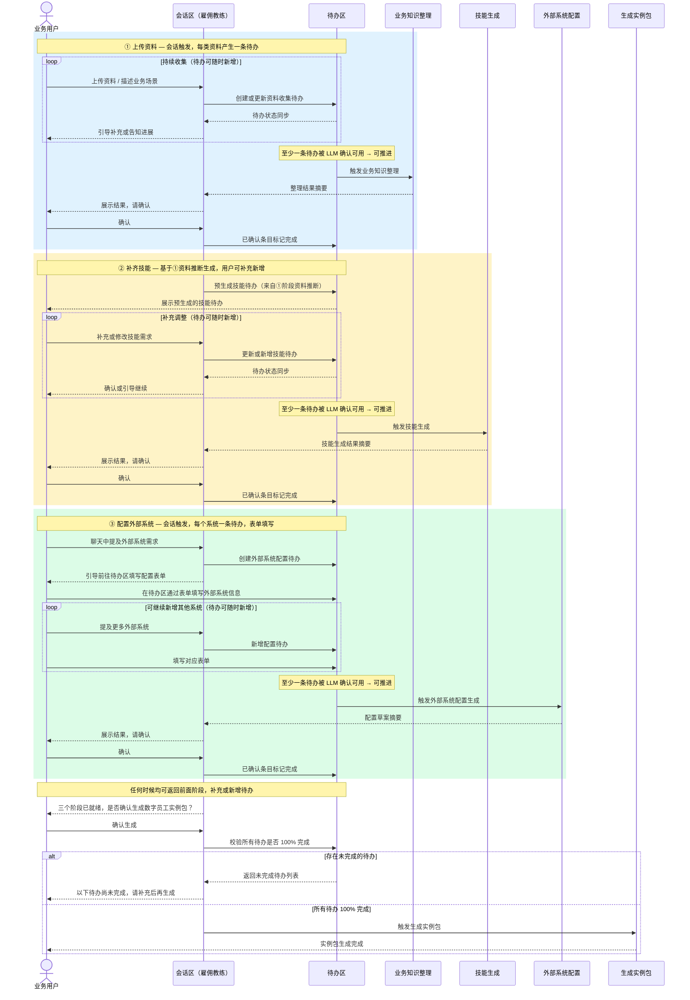
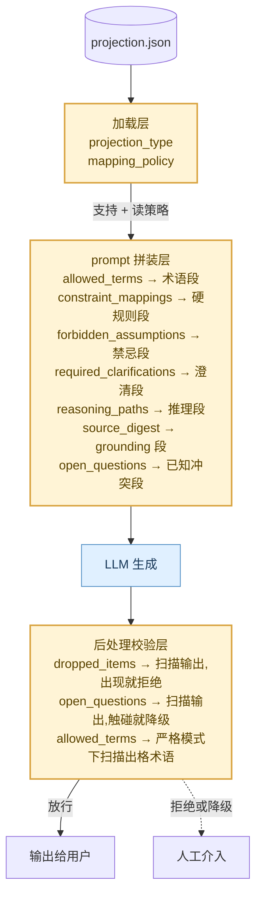
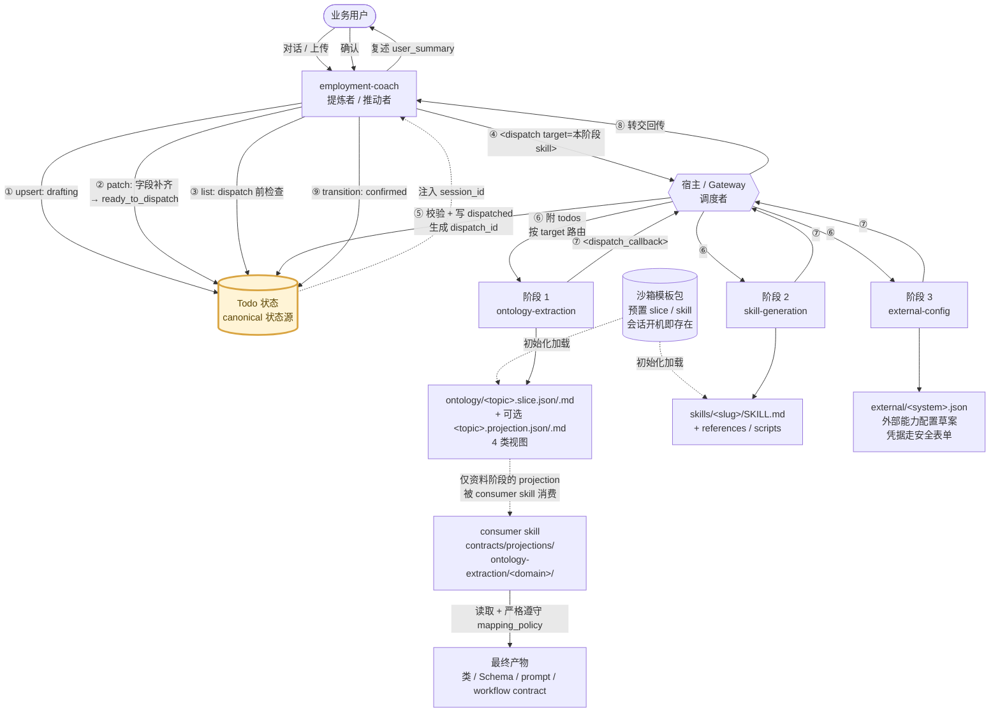

# 雇佣的流转流程

本文档梳理雇佣一名数字员工的完整流转机制，包括四个阶段的推进逻辑、待办事项的产生与完成规则、以及雇佣教练的作用和存在形式。

---

## 目录

- [一、雇佣教练作用和存在形式](#一雇佣教练作用和存在形式)
- [二、雇佣一名员工的4个环节](#二雇佣一名员工的4个环节)
- [三、雇佣教练如何提炼待办事项](#三雇佣教练如何提炼待办事项)
- [四、待办事项的状态与完成规则](#四待办事项的状态与完成规则)
- [五、本体切片与投影](#五本体切片与投影)
- [附录 A:名词解释](#附录-a名词解释)
- [附录 B:相关文件索引](#附录-b相关文件索引)

---

## 一、雇佣教练作用和存在形式

### 1.1 本质：一个数字员工

雇佣教练**本身就是一个数字员工**，不是工具，也不是流程引擎。它以数字员工的身份参与整个雇佣过程，自我呈现为"一个正在被雇佣、等待上岗配置完成的角色"，让业务用户感受到"它已经有了人格和岗位感"，而不是在和冷冰冰的系统打交道。

- **对外身份**：名为 HireBot，温和、利落、专业，像经验足的一线同事，与用户是**并肩装配**的关系，不是上下级，也不是"你问我答"的被动客服。
- **内在价值**：追求"能被下游直接执行"的明确度；场景优先、边界优先；不替用户擅自下业务结论，不接受模糊描述混过去。

### 1.2 承载方式：压缩包

雇佣教练的具体承载形式是一个**压缩包**，解压后的目录结构如下：

```
employment-coach-conversation/
├── config/                              # 人格配置（定义这个数字员工是谁）
│   ├── IDENTITY.md                      # 外显身份与人格气质
│   ├── SOUL.md                          # 价值取向与行为准则
│   ├── MEMORY.md                        # 记忆约束（哪些可记，哪些不可固化）
│   └── AGENTS.md                        # 代理行为规则
├── ontology/                            # 本体知识切片（这个员工懂什么）
│   └── ontology-slice.md
└── skills/                              # 技能包（这个员工会做什么）
    ├── employment-coach-conversation/   # 主技能：串联全流程的编排中枢
    │   ├── SKILL.md
    │   └── references/                  # 引用文档（协议、约束、交互规范）
    ├── ontology-extraction/             # 执行技能：业务知识整理
    ├── skill-generation/                # 执行技能：数字员工技能生成
    └── external-config/                 # 执行技能：外部系统配置生成
```

| 目录 | 作用 |
|---|---|
| `config/` | 定义数字员工的人格、价值观和行为边界，是"这个员工是什么人"的核心，对话期间可被用户授权修改 |
| `ontology/` | 存储业务知识本体切片，是员工上岗前已具备的"行业知识底座" |
| `skills/` | 存储全部技能定义；`employment-coach-conversation` 是**编排中枢**，负责串联全流程、驱动待办、触发下游；其余三个执行技能分别负责各阶段的实际产出 |

### 1.3 与业务用户的关系及核心立场

雇佣教练同时也是业务用户和下游子技能之间的**会话中枢**。核心立场（[SKILL.md:25](需求文档/SystemSkills/employment-coach-conversation/skills/employment-coach-conversation/SKILL.md#L25)）：

> 你是业务用户身边的"雇佣教练",不是顾问,也不是工程师。
> 你的工作不是把数字员工讲清楚,而是把每一步谈到**让下游 skill 可以直接执行**为止。

整个流程按 **资料 → 技能 → 外部** 三阶段硬卡点推进，每个阶段对应一个下游子技能：

| 阶段 | 对应子技能 | 产物 |
|---|---|---|
| 资料 | `ontology-extraction` | 本体切片 |
| 技能 | `skill-generation` | 技能配置包 |
| 外部 | `external-config` | 外部系统配置草案 |

三阶段全部闭环、用户确认后，触发 `instance_packaging` 生成实例包（不在本技能范围内）。

---

## 二、雇佣一名员工的4个环节

整个过程分为四个阶段，用户通过**左侧会话区**和雇佣教练对话，会话内容会实时影响**右侧待办区**的待办事项；待办事项完成后，主流程自动推进到下一步。

```mermaid
flowchart TD
    subgraph 左侧·会话区
        direction TB
        User([业务用户])
        Coach[雇佣教练]
        User -- 聊天 / 上传资料 --> Coach
        Coach -- 引导提问 / 进展反馈 --> User
    end

    subgraph 右侧·待办区
        direction TB
        T1["① 资料收集待办"]
        T2["② 技能定义待办"]
        T3["③ 外部系统配置待办（含表单）"]
        T1 --> T2 --> T3
    end

    Coach -- "会话内容触发，创建或更新" --> T1
    Coach -- "基于资料+会话内容，创建或更新" --> T2
    Coach -- "会话内容触发，创建或更新" --> T3
    T1 & T2 & T3 -- "待办完成，推进主流程" --> Coach

    T1 -- 就绪后触发 --> Onto[业务知识整理]
    T2 -- 就绪后触发 --> Skill[数字员工技能生成]
    T3 -- 就绪后触发 --> Ext[外部系统配置生成]

    Onto & Skill & Ext -- 三阶段产物就绪 --> Confirm{"用户确认生成"}
    Confirm -- 确认 --> Pack([生成实例包])

    subgraph 四个阶段·必须按序完成
      direction LR
      P1[① 上传资料] --> P2[② 补齐技能] --> P3[③ 配置外部系统] --> P4[④ 生成实例包]
    end
```

**各阶段待办触发条件与流转规则：**

| 阶段 | 待办触发条件 | 推进到下一阶段的条件 |
|---|---|---|
| ① 上传资料 | 会话中描述业务场景、上传文件、提及资料需求时，每识别到一类资料即产生一条待办 | 至少一条资料待办被 LLM 确认可用 |
| ② 补齐技能 | LLM 基于①阶段已确认资料自动推断生成；用户在会话中补充技能需求时也可新增 | 至少一条技能待办被 LLM 确认可用 |
| ③ 配置外部系统 | 会话中提及外部系统、接口或集成需求时触发，每个系统对应一条待办，通过表单收集信息 | 至少一条外部系统配置待办被 LLM 确认可用 |
| ④ 生成实例包 | 用户手动确认触发 | **前三阶段所有待办 100% 完成**（硬性校验） |

> **补充规则：** 待办可在任何阶段灵活新增；任何时候都可以返回前面阶段补充内容；只要有待办未完成，生成实例包的入口不可用。

下图从时间轴视角，展示会话区与待办区如何协同推进：



**横切机制**:对话期间 Coach 持续监听 `SOUL.md` / `IDENTITY.md` / `AGENTS.md` 的修改意图,通过 `<config_governance_patch>` 走"高置信度直接改 + 低置信度反问"双档;`MEMORY.md` 永远只读。改动若触及判定/边界/数据访问范围,反向把已 `confirmed` 的 todo 切回 `needs_review`。

---

## 三、雇佣教练如何提炼待办事项

整个提炼过程遵循一套清晰的逻辑：**识别触发信号 → 判断新建或更新 → 确认信息充分度**。

### 3.1 什么样的信息会触发待办

教练从以下两类信号中识别出需要记录为待办的内容：

**业务场景信号**
- 用户描述具体业务场景、资料种类、字段、规则、流程、案例
- 用户上传文件
- 用户提到技能需求（"它要会做什么"）
- 用户提到外部系统 / 集成需求

**情绪 / 故事信号**（高价值线索）
- 失败 / 延迟 / 重做 / 升级 / 投诉
- 抱怨 / 反复 / 绕过流程 / "本来不应该这样" / "每次都这样"
- 出现具体人名 / 客户 / 金额
- **强弱差异**："强的同事跟一般的同事差在哪" — 提炼技能描述的黄金时机
- **后果**："这件事做坏了会怎么样" — 确定预期产出边界的时机

教练会主动把抽象描述转化为真实场景：
- 用户给"我们一般会…"这种描述 → 引导说出"最近真实发生过的一次"
- 用户给"标准流程" → 问"最近一次没按标准走的是哪次"

### 3.2 新建 vs 更新待办的判断

收到新信息时，教练需要判断是更新已有待办还是新建一条：

| 情况 | 做法 |
|---|---|
| 新信息是对同一件事的补充、澄清或覆盖（同来源、同目标、父子包含关系） | 更新原来那条待办，不重复创建 |
| 确认是全新意图（不同来源、不同目标、不同对象） | 新建一条待办 |

### 3.3 待办信息充分的标准（以第二阶段为例）

| 描述维度 | ❌ 不够明确 | ✅ 够明确 |
|---|---|---|
| 技能名称 | "处理售后" | "退货资格初判" |
| 技能描述 | "用户问退货怎么办时回应一下" | "在用户提出退货请求时，根据订单状态、商品类型、是否超过 7 天来判断是否符合退货条件，并把结论和理由回给用户" |
| 触发条件 | "用户问起来" | "用户消息中出现退货/退款/退掉等关键词，且能匹配到具体订单" |
| 预期产出 | "回复用户" | "一条回复消息（含结论 + 依据），以及一条工单流转建议（如需要人工介入）" |

只有信息充分的待办才算"就绪"，才能推进到下一步处理。**所有待办都完成后，才能生成实例包。**

---

## 四、待办事项的状态与完成规则

雇佣过程中产生的每一条待办都有自己的状态，状态决定了它是否算作完成、是否阻塞下一步推进。

### 4.1 待办的 4 种状态

| 状态 | 含义 | 算作完成 |
|---|---|---|
| **信息收集中** | 待办信息还不够，教练还在引导补充 | ❌ |
| **处理中** | 信息已充分，已提交系统处理，等待结果 | ❌ |
| **已完成** | 系统处理完成，用户确认 — 唯一的完成态 | ✅ |
| **已取消** | 用户主动撤销，不再推进 | — |

### 4.2 正常推进路径

```
信息收集中 → 处理中 → 已完成
```

- 待办信息不够 → 教练继续引导补充，保持"信息收集中"
- 信息充分后提交系统 → 进入"处理中"
- 系统返回结果、用户确认 → 变为"已完成"

### 4.3 阶段推进规则

每个阶段可以有多条待办。只有本阶段**所有待办都达到"已完成"**，才能进入下一阶段。任意一条待办处于未完成状态，下一阶段入口关闭。

已取消的待办不算完成，只代表"用户主动放弃了这一项"。

### 4.4 生成实例包的条件

**三个阶段的所有待办 100% 已完成**，由用户主动确认后触发生成实例包。

---

## 五、本体切片与投影

雇佣教练本身不直接产出 本体切片slice / 和投影projection,但**资料阶段** dispatch 到 `ontology-extraction` 后,下游产出的就是 slice(以及可选的 projection)。本章梳理这套机制的核心契约,帮助理解"教练把资料交出去之后,下游到底产了什么、被谁消费"。

> 完整规范见 [ontology-extraction/README.md](SystemSkills/employment-coach-conversation/skills/ontology-extraction/README.md) 及其 references/ 与 templates/ 目录。

### 5.1 一句话定位

- **slice** = "**最小可验证语义闭包**",描述某个任务相关的 concepts / relations / constraints / sources。**两个来源**:
  - ① **沙箱模板包预置**:初始化时就已存在,让数字员工带着一组基础能力开机(对应一批默认 skill 及其 slice)
  - ② **上游 `ontology-extraction` 现场产出**:基于用户上传资料,通过资料阶段 dispatch 抽取得到
- **projection** = 把 slice **收敛到某一类下游视图**的投影,是其他 consumer skill 的"**受约束输入层**"

> slice 关心**语义完整**;projection 关心**下游能直接吃**。一份 slice 可以投影出多份 projection(各自服务一种下游)。两个来源的 slice 在结构、字段、校验规则上**完全一致**,差别只在"何时被加载进沙箱"——预置 slice 在会话开始前就已经在 `ontology/` 目录里,产出 slice 是会话中 dispatch 后增量写入的。

### 5.2 三层抽象

```
Semantic Layer   slice 原始语义,不绑定实现
       │
       ▼
Projection Layer 按目标场景投影成视图,允许裁剪,但必须记录裁剪规则
       │
       ▼
Delivery Layer   最终产物(类/Schema/prompt/workflow contract)
```

### 5.3 4 类 projection 视图

| projection_type | 文件名短名 | 服务对象 |
|---|---|---|
| `domain_model_projection` | `domain-model` | codegen(领域对象、值对象、枚举) |
| `json_schema_projection` | `json-schema` | Schema / 接口契约 |
| `prompt_constraint_projection` | `prompt-constraint` | prompt 编排、agent policy |
| `workflow_contract_projection` | `workflow-contract` | 工作流编排、tool contract |

### 5.4 slice 与 projection 的核心字段

#### slice(最小可验证闭包)

| 字段 | 含义 |
|---|---|
| `slice_request` | 当前任务、主题、目标、期望产出 |
| `scope.include` / `scope.exclude` | 纳入与排除范围 |
| `sources` | 切片依据与信任度(`trust_level: high/medium/low`) |
| `summary` | 一句话结论与选取依据 |
| `concepts` | 核心概念、定义、类型、关键属性 |
| `relations` | 主体、谓词、客体、条件、来源 |
| `constraints` | 规则、触发条件、禁止项、严重级别 |
| `ambiguities` / `uncertainties` / `conflicts` | 未决问题 |
| `next_actions` | 后续衔接动作 |

#### projection(投影到下游视图)

| 字段 | 作用 |
|---|---|
| `projection_type` / `target_format` / `target_runtime` | 这是哪类视图、什么格式、跑在哪 |
| `source_slice` | 回溯到哪份 slice(可追溯链路) |
| `mapping_policy` | **执行边界**(保留 trace? 是否扁平关系? 未映射项怎么处理?) |
| `concept_mappings` / `relation_mappings` / `constraint_mappings` | slice 三类元素的显式映射 |
| `delivery_artifacts` | 预期交付物(代码文件路径、prompt 片段路径等) |
| `dropped_items` | **被显式裁掉的项 + 原因**(下游不许偷偷补回去) |
| `open_questions` | **未决项**(非空时通常阻断定稿) |
| `prompt_projection.{allowed_terms, forbidden_assumptions, required_clarifications, reasoning_paths, source_digest}` | prompt 类视图专属字段 |

### 5.5 关键原则

- **projection 不是建议,是工作边界** — 下游 skill 必须严格遵守 `mapping_policy`、`dropped_items`、`open_questions`
- **风险信号必须传下去** — `mapping_policy.unresolved_item_policy = block_or_escalate` 时,遇到未映射项要停或升级,不能猜
- **不要静默丢语义** — 下游消费不了的 relation/constraint 要显式回写,不能默默忽略
- **保真映射优先于目标裁剪** — 任何 codegen / prompt orchestration 在裁剪字段之前,先保证关键概念、关系、约束、`source_ids` 都可追溯
- **一个 slice 可映射多个下游视图** — 不要为了适配某一个下游,把上游 slice 设计成只服务单一消费方

### 5.6 三种典型消费方式

#### Prompt 类 skill

优先消费:`prompt_projection.allowed_terms` / `forbidden_assumptions` / `required_clarifications` / `reasoning_paths` / `source_digest`

**最常见错误**:只拿 `summary` 写 prompt,完全丢掉 `constraints` 和 `forbidden_assumptions`。

#### Codegen / Schema 类 skill

优先消费:`concept_mappings` / `relation_mappings` / `constraint_mappings` / `delivery_artifacts`

接入规则:
- 只生成 `projection_action = map` 的项
- 依据 `target_kind` 决定生成实体 / 值对象 / 枚举 / schema rule / guard
- 依据 `severity_mapping` 决定校验规则的硬度(`hard → blocking_validation`)

**最常见错误**:看见 concept 就直接生成类,忽略 relation 和 constraint。

#### Workflow / Orchestration 类 skill

优先消费:`workflow_contract_projection` 类型 + `relation_mappings` 中的 `workflow_edge` + `constraint_mappings` 中的 `workflow_precondition`

接入规则:
- 把概念映射成 step input / step output / shared enum
- 把关系映射成**流程边,而不是注释**
- 把约束映射成 gating precondition / 审批条件 / 阻断条件

**最常见错误**:把 workflow contract 当普通说明文档处理,没有真正进入执行顺序和前置条件层。

### 5.7 consumer skill 的目录与命名规范

#### 默认目录结构

```text
src/OpenClaw.Gateway/skills/<consumer-skill>/
  contracts/
    projections/
      <producer-skill>/                    # 通常是 ontology-extraction
        <domain-slug>/                     # 业务主题/任务域
          <domain-slug>.<projection-type-short>.projection.json
          README.md                        # 服务哪个场景、当前生效文件
          REVIEW.md                        # 评审状态、风险、open questions、替换历史
```

#### 文件命名格式

```text
<domain-slug>.<projection-type-short>.projection.json
```

示例:
- `article-selection.prompt-constraint.projection.json`
- `skill-loading.workflow-contract.projection.json`
- `tool-capability.json-schema.projection.json`

#### 关键规则

- **`contracts/` 而不是 `references/`** — 前者表示真正消费,后者只是文档
- **不要把版本号塞进文件名** — 默认放 JSON 内的 `projection_version`;只在必须并存多版本时才加 `.v2.`
- **不要用 sample / final / latest 之类的词** — 时间一过就失真
- **不要在文件名里重复 skill 名** — skill 名已经在路径里

### 5.8 端到端示例:客服回复 consumer skill

为了把 slice → projection → consumer skill 串通,下面用一个具体场景演示。

#### 场景设定

数字员工"小琪"已经装配上岗,做电商客服的退货咨询。上游 `ontology-extraction` 基于「退货 SOP v3 + 客户分层规则 + Q1 投诉复盘」三份资料产出了:

- 一份 slice:`ontology/return-policy.slice.json`(因为 SOP 和分层规则在「VIP 是否可破例非标退货」上有 open conflict,被评为 **WARNING**)
- 一份 prompt 类投影:`ontology/return-reply.prompt-constraint.projection.json`

consumer skill `customer-service-reply` 的职责很单一——拿到用户咨询消息后,**按 projection 拼系统 prompt,调用 LLM 生成回复**。它的目录:

```
src/OpenClaw.Gateway/skills/customer-service-reply/
  SKILL.md
  contracts/projections/ontology-extraction/return-reply/
    return-reply.prompt-constraint.projection.json
    README.md
    REVIEW.md
```

#### projection 内容(简化版)

```json
{
  "projection": {
    "projection_type": "prompt_constraint_projection",
    "target_runtime": "llm_orchestrator",
    "source_slice": { "path": "../return-policy.slice.json" }
  },
  "mapping_policy": {
    "unresolved_item_policy": "block_or_escalate",
    "prompt_assumption_policy": "disallow_unmapped_terms"
  },
  "constraint_mappings": [
    { "constraint_id": "K1", "target_name": "高价商品退货必须人工审批",
      "severity_mapping": "hard -> blocking_validation" },
    { "constraint_id": "K2", "target_name": "超过 7 天默认不支持退货",
      "severity_mapping": "hard -> blocking_validation" }
  ],
  "prompt_projection": {
    "allowed_terms": ["订单状态", "商品类型", "客户等级", "7日内", "非标退货", "高价商品", "人工审批"],
    "forbidden_assumptions": [
      "不得假设所有客户享有同等退货权益",
      "不得编造任何退货时限数字(7 / 14 / 30 天等),只按 K2 表达"
    ],
    "required_clarifications": [
      "用户未提供订单号时,先请用户提供订单号",
      "用户身份不明时,不主动假设是 VIP"
    ],
    "reasoning_paths": ["订单状态 -> 商品类型 -> 7日内 -> 退货资格"],
    "source_digest": [
      "Primary source: S1 退货 SOP v3",
      "Conflict note: S1 vs S2 在 VIP 破例规则上有 open conflict"
    ]
  },
  "dropped_items": [
    { "item_type": "concept", "item_id": "C9",
      "reason": "C9 是历史的「满月优惠期」,新政策已废弃" }
  ],
  "open_questions": [
    { "question": "VIP 客户是否可破例进行非标退货",
      "impact": "影响 VIP 咨询非标退货回复" }
  ]
}
```

#### 消费流程(用户说:"我上周买的吹风机想退,可以吗?")

**第一步:加载 projection,判断能否继续**

```
读 projection_type → 是 prompt_constraint_projection ✓
读 mapping_policy  → unresolved_item_policy = block_or_escalate
读 open_questions  → 非空(标记"碰到 K3 路径要降级")
```

**第二步:按 projection 拼装 system prompt**

```text
你是客服员工小琪,回复用户的退货咨询。

【允许的术语】(不在此清单的概念不得引入)
订单状态 / 商品类型 / 客户等级 / 7日内 / 非标退货 / 高价商品 / 人工审批

【硬规则】
- K1:高价商品退货必须人工审批
- K2:超过 7 天默认不支持退货

【禁止的假设】
- 不得假设所有客户享有同等退货权益
- 不得编造任何退货时限数字(7 / 14 / 30 天等)

【遇到以下情况必须先澄清】
- 用户未提供订单号 → 请用户先提供订单号
- 用户身份不明 → 不主动假设是 VIP

【允许的推理路径】
订单状态 → 商品类型 → 7日内 → 退货资格

【已知冲突】
S1 SOP 和 S2 客户分层规则 在「VIP 破例非标退货」上有未决冲突,
触碰该路径时降级为"需人工介入",不要自行裁决。
```

**第三步:LLM 生成回复**

> 你好,可以帮你看一下。能提供一下订单号吗?上周的话还在 7 日内,具体能不能退要看商品类型——吹风机如果属于高价商品,会走人工审批流程。

它做到了:
- ✅ 没编造具体时限,只引用 K2
- ✅ 触发 `required_clarifications`,先要订单号
- ✅ 没假设客户是 VIP(避免触发未决冲突)
- ✅ 用词全部在 `allowed_terms` 内
- ✅ 保留 K1 的边界

**第四步:后处理校验**

```
扫描输出 → 是否出现 dropped_items 概念(如"满月优惠期")
            ↓ 出现 → 拒绝输出
            ↓
是否触碰 open_questions 路径(如用户自报 VIP)
            ↓ 触碰 → 替换为"需人工介入"
            ↓
输出给用户
```

#### 对比:不消费 projection 会发生什么

| 风险 | 表现 |
|---|---|
| **编造时限** | "我们支持 30 天无理由退货"(K2 实际是 7 天) |
| **越权裁决未决冲突** | "您是 VIP,这单可以破例退"(K3 还没确认) |
| **引入被裁掉的概念** | "您可以享受满月优惠期返还"(C9 已废弃) |
| **过度自信** | 用户没说订单号就直接判定退货资格 |

projection 把这些**风险信号**显式传递给下游,正是为了避免 consumer skill 在不知情时过度自信地补造。

#### 一句话回顾

**Coach 产 todo 让 ontology-extraction 抽 slice,slice 投影成 projection,consumer skill 消费 projection 拼 prompt,LLM 在边界内回话。** 整条链路里,projection 这一层的存在就是为了**让 consumer skill 不必回去理解原始 ontology**,只在 `mapping_policy` 限定的边界内做事——既保留语义,又避免自由发挥。

#### 5.8.1 完整 skill 文件示例

把 `customer-service-reply` 这个 consumer skill 的完整文件结构展开,包含 SKILL 主入口、projection 治理三件套(json + README + REVIEW)和 contract-index 发现入口,共 5 个文件。

##### 目录结构

```
src/OpenClaw.Gateway/skills/customer-service-reply/
├── SKILL.md
└── contracts/
    └── projections/
        ├── contract-index.json
        └── ontology-extraction/
            └── return-reply/
                ├── return-reply.prompt-constraint.projection.json
                ├── README.md
                └── REVIEW.md
```

##### 文件 1:`SKILL.md`

````md
---
name: customer-service-reply
description: 客服回复生成器。当用户向客服员工发起咨询(退货、订单状态、商品问题、投诉、催发货等)时,基于运行时绑定的 projection 拼装 system prompt,调用 LLM 生成合规、可追溯、不越权的回复消息。当用户消息匹配"我想退 / 怎么退 / 物流到哪了 / 这件商品 / 投诉 / 没收到货"等触发语时使用本 skill。
metadata: {"openclaw":{"emoji":"💬"}}
---

# customer-service-reply

当用户发来客服咨询消息,尤其是退货、订单状态、商品问题、投诉、催发货类话题时:

1) 识别会话边界
   - 确定本轮的咨询主题、是否包含订单号、是否能识别用户身份。
   - 主题不明确时,先用一句话澄清,而不是直接回答。

2) 加载正确的输入
   - 运行时会按主题选择并绑定一份 projection contract(prompt_constraint_projection)。
   - 把这份 projection 视为本轮回复的**语义边界**:术语、规则、推理路径、禁止假设、必须澄清的情形都以它为准。
   - 同时读取当前会话上下文:用户身份、订单状态、历史消息。

3) 产出回复
   - 严格按 projection 字段拼装 system prompt,调用 LLM 生成回复。
   - 回复中只使用 `prompt_projection.allowed_terms` 列出的术语,不引入未声明概念。
   - 命中 `required_clarifications` 的情形时,先澄清再判断。
   - 触碰 `open_questions` 涉及的路径时,降级为"需人工介入",不自行裁决。

4) 终态校验
   - 扫描 LLM 输出,确保未出现 `dropped_items` 中的概念。
   - 确认未越过 `mapping_policy` 限定的边界。
   - 输出长度、格式符合 skill 本地约束(见下方 Skill-Specific Constraints)。

## Projection Contracts

This skill is augmented by bound `ontology-extraction` projection contracts discovered under `contracts/projections/**/contract-index.json`.

- Projection discovery, route selection, and prompt patching are handled by runtime rather than by manual rules in this file.
- For human review, read `contract-index.json` first, then the selected topic's `README.md` and `REVIEW.md`, and then the chosen `*.projection.json` file.

### Projection Consumption

- 在规划本轮回复前必须先读取运行时绑定的 projection。
- 只消费本 skill 支持的字段:`prompt_projection`、`constraint_mappings`、`mapping_policy`、`open_questions`、`dropped_items`、`source_slice`。
- 把 projection 视为术语、澄清、裁剪范围和阻断条件的权威来源,不要回退到原始 ontology 自行推导。

### Blocking Rules

- 路由被阻断、绑定不到合适 projection 时,直接告诉用户"我去叫一下人工",不要凭直觉作答。
- `mapping_policy.unresolved_item_policy = block_or_escalate` 且当前用户输入触碰了 `open_questions` 中的路径时,降级为人工介入。
- 不得复活 `dropped_items` 中列出的概念,即使 LLM 试图主动引入。
- 用户在会话中提到具体凭据(密码、API Key、银行卡号 CVV 等)时,立刻提醒"这类信息请走客服后台或人工渠道,不要发在聊天框",不进入正常回复路径。

## Skill-Specific Constraints

- **Supported deliverables**: 一条聊天消息(text only,可包含必要的换行,不输出 markdown 标题或代码块)。
- **Supported projection types**: `prompt-constraint` 仅此一种。其他 projection 类型(domain-model / json-schema / workflow-contract)不在本 skill 处理范围。
- **Supported projection fields beyond the shared minimum**:
  - `prompt_projection.allowed_terms`(术语白名单)
  - `prompt_projection.forbidden_assumptions`(禁止假设)
  - `prompt_projection.required_clarifications`(澄清触发器)
  - `prompt_projection.reasoning_paths`(允许的推理路径)
  - `prompt_projection.source_digest`(grounding 摘要)
  - `constraint_mappings[].severity_mapping`(决定哪条约束进 prompt 硬规则段)
- **Local exclusions**:
  - 不直接调用外部系统(CRM、ERP、IM)——这是 `external-config` 的事;本 skill 只用上下文已提供的查询结果。
  - 不修改 todo 状态或 ontology slice。
  - 不在回复中暴露内部字段名(`fingerprint`、`todo_id`、`projection_id` 等)。
  - 单条回复不超过 200 字;一次只请用户补充 1 件事。
  - 触碰未决冲突时只说"我帮您转人工",不解释具体冲突内容。

## Output Format

- 文本消息,自然语气,与 SOUL.md 设定的人格一致。
- 不输出 JSON、markdown 标题、代码块。
- 引用规则时用业务语言,不暴露规则编号(K1 / K2 等内部 id)。

## References

- `../ontology-extraction/templates/CONSUMER_SKILL_PROJECTION_SECTION.md`: shared minimal `Projection Contracts` section
- `../ontology-extraction/references/PROJECTION_CONSUMPTION_GUIDE.md`: how consumer skills should consume projection contracts
- `../ontology-extraction/references/CONSUMER_PROJECTION_LAYOUT_GUIDE.md`: where to place local bound projection files
````

##### 文件 2:`contracts/projections/contract-index.json`

```json
{
  "$schema": "https://openclaw.dev/schemas/contract-index.v1.json",
  "skill": "customer-service-reply",
  "index_version": "1.0.0",
  "producer": "ontology-extraction",
  "topics": [
    {
      "topic_id": "return-reply",
      "domain": "退货咨询回复",
      "trigger_phrases": ["退货", "退款", "退掉", "想退", "怎么退", "不想要了"],
      "projection_files": [
        {
          "projection_type": "prompt_constraint_projection",
          "path": "./ontology-extraction/return-reply/return-reply.prompt-constraint.projection.json",
          "status": "active",
          "review_status": "WARNING"
        }
      ],
      "blocking_conditions": [
        "open_questions 非空时,触碰 VIP 破例规则路径需降级为人工介入"
      ]
    }
  ],
  "fallback_policy": {
    "when_no_topic_matches": "use_generic_reply_prompt",
    "when_all_topics_blocked": "escalate_to_human"
  },
  "meta": {
    "generated_at": "2026-05-11T00:00:00Z",
    "generated_by": "customer-service-reply"
  }
}
```

##### 文件 3:`return-reply.prompt-constraint.projection.json`

```json
{
  "$schema": "../../../../../ontology-extraction/templates/PROJECTION_TEMPLATE.schema.json",
  "template_type": "ontology_projection",
  "projection_version": "1.0.0",
  "projection": {
    "projection_id": "return-reply-prompt-v1",
    "projection_type": "prompt_constraint_projection",
    "target_name": "ReturnReplyPromptSeed",
    "target_format": "prompt_term_seed",
    "target_runtime": "llm_orchestrator",
    "projection_goal": "把退货政策切片投影为客服回复 LLM 的 system prompt 边界,确保只用允许术语、不编造时限、不越权处理 VIP 破例。",
    "source_slice": {
      "path": "../../../../../ontology-extraction/slices/return-policy/return-policy.slice.json",
      "slice_topic": "退货资格判断与处置路径",
      "schema_version": "1.0.0"
    },
    "intended_consumers": ["customer-service-reply"]
  },
  "mapping_policy": {
    "preserve_source_trace": true,
    "preserve_constraints": true,
    "relation_flattening_policy": "disallow_by_default",
    "unresolved_item_policy": "block_or_escalate",
    "dropped_item_policy": "record_with_reason",
    "prompt_assumption_policy": "disallow_unmapped_terms"
  },
  "concept_mappings": [
    { "concept_id": "C1", "projection_action": "map", "target_kind": "prompt_term",
      "target_name": "订单状态", "source_ids": ["S1"] },
    { "concept_id": "C2", "projection_action": "map", "target_kind": "prompt_term",
      "target_name": "商品类型", "source_ids": ["S1"] },
    { "concept_id": "C3", "projection_action": "map", "target_kind": "prompt_term",
      "target_name": "客户等级", "source_ids": ["S2"] },
    { "concept_id": "C4", "projection_action": "map", "target_kind": "prompt_term",
      "target_name": "7日内", "source_ids": ["S1"] },
    { "concept_id": "C5", "projection_action": "map", "target_kind": "prompt_term",
      "target_name": "非标退货", "source_ids": ["S1", "S3"] },
    { "concept_id": "C6", "projection_action": "map", "target_kind": "prompt_term",
      "target_name": "高价商品", "source_ids": ["S1"] },
    { "concept_id": "C7", "projection_action": "map", "target_kind": "prompt_term",
      "target_name": "人工审批", "source_ids": ["S1"] }
  ],
  "relation_mappings": [
    { "relation_id": "R1", "projection_action": "map", "target_kind": "inference_rule",
      "target_name": "订单状态 → 退货资格判断",
      "representation": "directed_with_condition",
      "source_ids": ["S1"] }
  ],
  "constraint_mappings": [
    { "constraint_id": "K1", "projection_action": "map", "target_kind": "prompt_rule",
      "target_name": "高价商品退货必须人工审批",
      "severity_mapping": "hard -> blocking_validation",
      "source_ids": ["S1"] },
    { "constraint_id": "K2", "projection_action": "map", "target_kind": "prompt_rule",
      "target_name": "超过 7 天默认不支持退货",
      "severity_mapping": "hard -> blocking_validation",
      "source_ids": ["S1"] }
  ],
  "prompt_projection": {
    "allowed_terms": [
      "订单状态", "商品类型", "客户等级",
      "7日内", "非标退货", "高价商品", "人工审批"
    ],
    "forbidden_assumptions": [
      "不得假设所有客户享有同等退货权益",
      "不得编造任何退货时限数字(7 / 14 / 30 天等),只按 K2 表达",
      "不得自行补造未在 allowed_terms 中的概念",
      "不得在用户未声明 VIP 身份时主动认定其为 VIP"
    ],
    "required_clarifications": [
      "用户未提供订单号时,先请用户提供订单号",
      "用户身份不明时,不主动假设是 VIP",
      "用户描述商品但未明确是否高价时,不直接给退货结论"
    ],
    "reasoning_paths": [
      "订单状态 -> 商品类型 -> 7日内 -> 退货资格"
    ],
    "source_digest": [
      "Primary source: S1 退货 SOP v3",
      "Secondary source: S2 客户分层规则",
      "Conflict note: S1 vs S2 在 VIP 是否可破例非标退货上有 open conflict"
    ]
  },
  "delivery_artifacts": [
    {
      "artifact_name": "ReturnReplyPromptSeed.md",
      "artifact_type": "prompt_fragment",
      "path": "prompts/return/ReturnReplyPromptSeed.md",
      "status": "planned"
    }
  ],
  "dropped_items": [
    { "item_type": "concept", "item_id": "C9",
      "reason": "C9 是历史的「满月优惠期」概念,新政策已废弃,不在本投影范围" },
    { "item_type": "constraint", "item_id": "K7",
      "reason": "K7 是旧 SOP 的「门店换货优先」规则,与当前线上场景不匹配" }
  ],
  "open_questions": [
    {
      "question": "VIP 客户是否可破例进行非标退货(原 K3)",
      "impact": "影响 VIP 身份用户咨询非标退货时的回复路径",
      "required_input": "需业务 owner 确认 S1 与 S2 哪个为准"
    }
  ],
  "meta": {
    "generated_at": "2026-05-08T03:14:00Z",
    "generated_by": "ontology-extraction",
    "workspace": "customer-service-starter",
    "notes": "首次落地版本。slice 因 VIP 破例规则未决被评为 WARNING;本投影继承 WARNING 状态,在 customer-service-reply 中通过 block_or_escalate 策略兜底。"
  }
}
```

##### 文件 4:`return-reply/README.md`

````md
# return-reply 投影目录

## 服务对象

本目录的 projection 文件由 `customer-service-reply` skill 在生成"退货咨询"类回复时消费。

## 当前生效文件

| 文件 | 类型 | 状态 |
|---|---|---|
| `return-reply.prompt-constraint.projection.json` | `prompt_constraint_projection` | WARNING(见 REVIEW.md) |

只有 active 状态的文件会被运行时绑定。新增其他 projection 类型(如 workflow-contract)时,在同一目录下并列存放,不要覆盖已有文件。

## 上游 slice

本投影来源:
- slice 路径:`../../../../../ontology-extraction/slices/return-policy/return-policy.slice.json`
- slice 主题:退货资格判断与处置路径
- slice 评审状态:WARNING(VIP 破例规则有 open conflict)

slice 更新后,本目录的 projection 必须重新校验并更新 REVIEW.md。

## 谁应该消费它

- `customer-service-reply`:把 projection 拼成 system prompt,调用 LLM 生成客服回复。
- **不应消费**:
  - `skill-generation`(本投影不是技能定义)
  - `external-config`(本投影不是外部能力描述)
  - 任何 codegen 类 skill(本投影是 prompt 类,无 target_path 等代码字段)

## 重要约定

- 触碰 `open_questions` 涉及的路径时,consumer skill 必须降级为人工介入,不得自行裁决。
- `dropped_items` 中的概念不允许通过任何方式重新引入。
- 凭据信息(token、密码、API Key 等)不进入此目录。

## 校验

```bash
# 在 ontology-extraction 技能根目录
c:/python314/python.exe ./scripts/validate-projection.py \
  ./examples/.../return-reply.prompt-constraint.projection.json --review-mode

# 或从仓库根目录
c:/python314/python.exe ./scripts/validate-ontology-projection.py \
  ./src/OpenClaw.Gateway/skills/customer-service-reply/contracts/projections/ontology-extraction/return-reply/return-reply.prompt-constraint.projection.json
```
````

##### 文件 5:`return-reply/REVIEW.md`

````md
# return-reply 投影评审记录

## 当前状态

**WARNING**(2026-05-11)

继承自上游 slice 的 WARNING 状态,主要因 VIP 破例规则未决。

## Open Questions

| ID | 问题 | 影响 | 当前处置 | 谁该回答 | 截止 |
|---|---|---|---|---|---|
| Q1 | VIP 客户是否可破例进行非标退货 | 影响 VIP 用户咨询非标退货回复路径 | `block_or_escalate` 降级人工 | 业务 owner @张经理 | 2026-06-01 |

Q1 来源于 slice 中 S1(SOP v3)与 S2(客户分层规则)的冲突:
- S1 写"非标退货一律走人工审批,不区分客户等级"
- S2 写"VIP 客户享有售后绿色通道,可破例处理"

两份资料同时被纳入 slice,导致 K3(VIP 破例规则)处于 open conflict。

## 已知风险

1. **回复体验下降**:Q1 解决前,VIP 用户咨询非标退货会被无差别转人工,可能引起 VIP 不满。
2. **不可由 LLM 自决**:即便 LLM 推理"VIP 应该有特权"也不允许直接给出破例承诺,必须等业务 owner 拍板。

## 评审历史

| 日期 | 评审人 | 结论 | 备注 |
|---|---|---|---|
| 2026-05-08 | @yesxiaoxuan | WARNING | 初次产出,继承 slice WARNING |
| 2026-05-11 | @yesxiaoxuan | WARNING(无变更) | 等 Q1 解决 |

## 升级注意事项

- Q1 解决后,需要:
  1. 更新上游 slice,把 K3 从 open conflict 推到 resolved
  2. 重跑 `validate-slice.py --review-mode`,确认 slice 已升至 READY
  3. 同步更新本 projection 的 `open_questions`(清空 Q1),并删除 `source_digest` 中的 conflict note
  4. 跑 `validate-projection.py`,确认升至 READY
  5. 更新本文件评审历史
  6. 更新 `contract-index.json` 中 `review_status` 字段为 `READY`

- 不要绕过 slice 直接改 projection——projection 必须始终是 slice 的派生物。

## 替换历史

| 版本 | 文件名 | 替换原因 | 替换日期 |
|---|---|---|---|
| v1 | `return-reply.prompt-constraint.projection.json` | 初次落地 | 2026-05-08 |

新版本未启用前,旧版本继续生效。版本切换需要同步更新 `contract-index.json`。
````

##### 关键说明

**这套文件之间的关系**:

| 文件 | 是什么 | 给谁看 |
|---|---|---|
| `SKILL.md` | skill 入口,声明"我消费 projection 但不耦合具体内容" | 运行时 + 工程师 |
| `contract-index.json` | 发现入口,机器可读路由表 | 运行时 |
| `*.projection.json` | 实际契约数据 | consumer skill 在运行时消费 |
| `README.md` | "这份契约服务谁、谁应该消费" | 工程师、PM |
| `REVIEW.md` | "这份契约现在能不能放心用、什么时候会变" | 评审人、业务 owner |

**核心边界**:
- `SKILL.md` **不写具体术语、规则**,只写"我会按 projection 字段拼 prompt"——所以 projection 变了,skill 不用改
- `REVIEW.md` **不写技术细节**,只写治理状态——给 PM、业务 owner 看
- `contract-index.json` 是机器可读的路由表,Skill.md 不重复它的内容
- **projection 必须始终是 slice 的派生物**——不许绕过 slice 直接改 projection

---

#### 5.8.2 双向消费解读

把 5.8 那个例子(用户问"我上周买的吹风机想退,可以吗?")正反两个方向看 consumer skill 怎么"用"了 projection,可以更直观理解每条约束的真实落点。

##### 正向:projection 每个字段在哪被消费

```
projection.json                    consumer skill 行为
─────────────────────  ──→  ───────────────────────────
projection_type        ──→  【加载层】判断是否支持
mapping_policy         ──→  【加载层 + 后处理】决定阻断 / 降级策略
constraint_mappings    ──→  【prompt 段 2】硬规则
prompt_projection.*    ──→  【prompt 段 3-7】术语 / 禁忌 / 澄清 / 推理 / grounding
open_questions         ──→  【prompt 段 7 + 后处理】已知冲突 + 触碰则降级
dropped_items          ──→  【后处理】扫描 LLM 输出,出现就拒绝
source_slice           ──→  【traceability】不进 prompt,只用于日志 / 审计
delivery_artifacts     ──→  【skill 自描述】不进 prompt,不影响生成
```

字段到行为的细化对照:

| projection 字段 | 在 consumer skill 哪里被消费 | 具体效果 |
|---|---|---|
| `projection_type` = `prompt_constraint_projection` | 加载时第一道检查 | 类型不匹配 → skill 拒绝继续 |
| `mapping_policy.unresolved_item_policy` = `block_or_escalate` | 整轮决策开关 | 触碰未决路径自动降级人工 |
| `mapping_policy.prompt_assumption_policy` = `disallow_unmapped_terms` | prompt 拼装规则 | 强制把 `allowed_terms` 作为白名单 |
| `constraint_mappings[K1, K2]`(severity=hard) | prompt 硬规则段 | 写入 system prompt 的"【硬规则】"块 |
| `prompt_projection.allowed_terms` | prompt 术语段 | 7 个术语注入"【允许的术语】"块,白名单约束 |
| `prompt_projection.forbidden_assumptions` | prompt 禁忌段 | 4 条注入"【禁止的假设】"块 |
| `prompt_projection.required_clarifications` | prompt 澄清段 | 3 条注入"【必须先澄清】"块 |
| `prompt_projection.reasoning_paths` | prompt 推理段 | 强制 LLM 按"订单状态 → 商品类型 → 7日内 → 退货资格"推理 |
| `prompt_projection.source_digest` | prompt grounding 段 | 告知优先来源 + 冲突提示 |
| `open_questions[Q1]` | prompt 末尾"已知冲突"段 + 后处理 | 显式声明降级路径 + 输出后扫描是否触碰 |
| `dropped_items[C9, K7]` | **不进 prompt**(避免反向暗示),只后处理 | LLM 输出后扫描是否出现"满月优惠期"等关键词 |

##### 反向:LLM 那条回复逐句解读

用户输入:**"我上周买的吹风机想退,可以吗?"**

LLM 回复:

> "你好,可以帮你看一下。能提供一下订单号吗?上周的话还在 7 日内,具体能不能退要看商品类型——吹风机如果属于高价商品,会走人工审批流程。"

把这句话逐子句拆开,每个子句背后是哪条约束在起作用:

| 子句 | 行为 | 受哪个约束驱动 |
|---|---|---|
| **"你好,可以帮你看一下"** | 礼貌开场 | **SOUL.md**(不来自 projection) |
| **"能提供一下订单号吗?"** | 主动澄清,不直接判定 | `required_clarifications[0]`:"用户未提供订单号时,先请用户提供订单号" |
| **"上周的话还在 7 日内"** | 用"7日内"而**不说"7 天内"** | `allowed_terms` 含"7日内";`forbidden_assumptions[1]` 禁止编造"7/14/30 天"等数字 |
| **"具体能不能退要看商品类型"** | 不跳步,引入下一节点 | `reasoning_paths`:订单状态 → **商品类型** → 7日内 → 退货资格;按指定顺序推进 |
| **"吹风机如果属于高价商品"** | **不下结论**,用"如果" | `required_clarifications[2]`:"用户描述商品但未明确是否高价时,不直接给退货结论";`allowed_terms` 含"高价商品" |
| **"会走人工审批流程"** | 命中硬规则 | `constraint_mappings[K1]`:"高价商品退货必须人工审批",`severity=hard→blocking` |

整段回复的"用词清单"对照 `allowed_terms`:

| 回复中出现的术语 | 在 allowed_terms 里? |
|---|---|
| 订单号(订单状态的口语化) | ✓ |
| 7日内 | ✓ |
| 商品类型 | ✓ |
| 高价商品 | ✓ |
| 人工审批 | ✓ |

**全部命中**,没有一个未声明的术语。

##### 被阻止的"可能回复"——隐性消费

projection 的价值不仅在于"让 LLM 这样说",更在于"**让 LLM 不那样说**"。下面列举几条 LLM 在没有 projection 约束时**很可能犯**、但这次被压住的错误:

| LLM 可能说的话 | 被哪条约束阻止 | 后果 |
|---|---|---|
| **"我们支持 30 天无理由退货"** | `forbidden_assumptions[1]`:不得编造时限数字 | 避免误导用户,实际只有 7 日 |
| **"您是 VIP 会员吗?VIP 可以破例"** | `forbidden_assumptions[3]`:不得主动认定 VIP;`required_clarifications[1]`:用户身份不明时不主动假设;`open_questions[Q1]`:VIP 破例未决,触碰即降级 | 避免越权裁决,守住未决冲突边界 |
| **"您可以享受满月优惠期返还"** | `dropped_items[C9]`:满月优惠期已废弃 | 避免引入历史废弃概念 |
| **"建议您到附近门店换货"** | `dropped_items[K7]`:门店换货优先规则被裁(线上场景不匹配) | 避免给出错误处置路径 |
| **"上周买的肯定能退"** | `reasoning_paths` 必须走完整路径;`constraint_mappings[K1]` 硬规则未走完不能下结论 | 避免跳步给保证 |
| **"具体细则请参考我司退货 SOP v3 第 4.2 条"** | `source_digest` 用于 grounding 但不暴露内部文档结构;skill-local exclusion 也写明不暴露内部字段 | 避免泄漏内部资料 |

##### 后处理阶段——projection 的最后一道关

LLM 生成回复后,consumer skill 不是直接发给用户,而是再做一遍**后处理校验**,这一步又用到了 projection 的两个字段:

```python
# 伪代码示意,实际由 consumer skill 实现
def post_check(llm_output, projection):
    # 关 1:dropped_items 不许复活
    for dropped in projection["dropped_items"]:
        if mentions_concept(llm_output, dropped["item_id"]):
            return reject("输出包含已废弃概念", dropped["reason"])

    # 关 2:open_questions 不许越权裁决
    for q in projection["open_questions"]:
        if touches_unresolved_path(llm_output, q):
            return escalate("触碰未决路径", q["question"])

    # 关 3:allowed_terms 白名单(严格模式)
    if projection["mapping_policy"]["prompt_assumption_policy"] == "disallow_unmapped_terms":
        unknown = extract_unknown_terms(
            llm_output,
            projection["prompt_projection"]["allowed_terms"]
        )
        if unknown:
            return reject("引入未声明术语", unknown)

    return llm_output  # 全部通过,放行
```

**这是为什么 projection 必须保留 `dropped_items` 和 `open_questions`**——它们不进 prompt(避免反向暗示 LLM 去用),但要在后处理时拿来扫描输出,做最后兜底。

##### 消费链路总览

```
projection.json
     │
     ├──→ 【加载层】projection_type / mapping_policy
     │       (决定能不能用这个 projection,以及阻断策略)
     │
     ├──→ 【prompt 拼装层】
     │       allowed_terms          → 【术语段】
     │       constraint_mappings    → 【硬规则段】
     │       forbidden_assumptions  → 【禁忌段】
     │       required_clarifications → 【澄清段】
     │       reasoning_paths        → 【推理段】
     │       source_digest          → 【grounding 段】
     │       open_questions         → 【已知冲突段】
     │
     └──→ 【后处理校验层】
             dropped_items    → 扫描输出,出现就拒绝
             open_questions   → 扫描输出,触碰就降级
             allowed_terms    → (严格模式)扫描出格术语
```

##### 时序版(mermaid)

如果把同一套消费关系按"**加载 → 拼装 → LLM → 后处理**"的时序展开,可以画成下面这张 mermaid 图。两张图传达的信息一致,只是切入角度不同:

- **ASCII 图**:**字段视角** — projection 有哪些字段、各自被哪一层用
- **mermaid 图**:**时序视角** — 字段是按什么顺序在 consumer skill 一次完整调用里流转的



注意 mermaid 版图里多出了 ASCII 图没有的两个节点:
- **LLM 生成**:把"加载/拼装"和"后处理"的边界画出来,让读者看清楚 projection 在 LLM 之前和之后都各介入一次
- **人工介入**:`open_questions` 或 `dropped_items` 触发的降级出口,体现 `mapping_policy.unresolved_item_policy = block_or_escalate` 的实际落点

**核心规律**:
- **能让 LLM 看到的(prompt 拼装)** 主要用来**引导**它在边界内回话
- **不让 LLM 看到的(后处理)** 主要用来**兜底**——尤其是 `dropped_items`,不告诉 LLM 这些概念存在,反而比告诉它"不许用 X"更稳

---

### 5.9 红黄绿评审

| 状态 | 触发条件 |
|---|---|
| `READY` | 结构校验通过 + 无 warning 信号 |
| `WARNING` | 结构通过,但命中下列任一信号:`sources` 无任何 `trust_level=high` / 存在 `trust_level=low` / `conflicts` 有 `status=open` 或 `deferred` / `ambiguities` 有 `status=open` 或 `deferred` / `uncertainties` 数组非空 |
| `FAIL` | 结构校验未通过 |

校验脚本:
- slice:[scripts/validate-slice.py](SystemSkills/employment-coach-conversation/skills/ontology-extraction/scripts/validate-slice.py) 或仓库根 `scripts/validate-ontology-slice.py`
- projection:[scripts/validate-projection.py](SystemSkills/employment-coach-conversation/skills/ontology-extraction/scripts/validate-projection.py) 或仓库根 `scripts/validate-ontology-projection.py`
- `--review-mode` 会在结构校验后额外输出 READY / WARNING / FAIL 启发式判定

### 5.10 与雇佣教练流程的衔接

**Todo 状态是贯穿全流程的 canonical 状态源**,**三个阶段(资料/技能/外部)走同一套 todo 状态机**,只是 `target_skill` 不同。下图把三阶段都画上:



#### 三阶段下游执行者对照

| 阶段 | target_skill | 输入(来自 Todo) | 产出物落点 | 是否产生 projection |
|---|---|---|---|---|
| **资料** | `ontology-extraction` | `payload.source_files` + `objective` + `scene_hint` | `ontology/*.slice.json/.md` + 可选 `*.projection.json/.md` | ✅ 可选产出(4 类视图) |
| **技能** | `skill-generation` | `payload.skills[]`(含 `reuse_existing` / `generate_new`) | `skills/<slug>/SKILL.md` + references / scripts | ❌ 不产 projection |
| **外部** | `external-config` | `payload.external_capabilities[]`(含 category / target_system / linked_skills / auth_kind) | `external/<system>.json` 配置草案 | ❌ 不产 projection |

**注意**:只有 `ontology-extraction` 才产出 slice/projection。`skill-generation` 产出的是 SKILL.md 技能包(给数字员工实例运行时加载),`external-config` 产出的是外部能力的配置草案(凭据由用户在安全表单里填,不进 payload)。本章重点是 slice/projection,所以图里把"被 consumer skill 消费"的箭头画在 `A1` 上。

**关于左上角的 `Template` 节点(沙箱模板包预置)**:沙箱不是"空白工作区"——它从模板包派生,初始化时就已经在 `ontology/` 和 `skills/` 目录里加载了一批默认 slice 和 skill。这意味着 `A1` / `A2` 节点的内容有两个来源:模板预置(初始化加载,虚线分支) + 三阶段 dispatch 后下游 skill 产出(实线分支)。两个来源的产物**结构完全一致**,区别只在"何时进入沙箱"。这也是为什么阶段 2 技能阶段的 `payload.skills[].generation_action` 要分 `reuse_existing`(模板预置已有)和 `generate_new`(本轮要新建)两类——前者就是预置 skill,跳过实际生成,只在 todo 中标记复用。

**Todo 状态在流程中的真实角色**:

| 触发方 | 操作 | 内部动作 |
|---|---|---|
| Coach(首轮初始化) | `upsert` 占位 todo | 创建 `material:first-batch` 草稿,分配 `todo_id`,`status=drafting` |
| Coach(用户提供信息) | `patch` 或 `upsert` | 合并到同 fingerprint 条目,补齐 payload,推进到 `ready_to_dispatch` |
| Coach(发 dispatch 前) | `list` | 读当前阶段活跃项,做明确度自检 |
| 宿主(接 `<dispatch>`) | 校验 + 写状态 | 检查 `status=ready_to_dispatch/dirty`,合格才写 `dispatched`,**生成真实 `dispatch_id`** |
| 宿主(转发下游) | 取 todos 完整结构 | 把 payload 灌给下游 skill |
| Coach(收 callback + 用户确认) | `transition` | 写 `confirmed`,记录 `callback_summary` |
| 用户撤销 / 配置反向触发 | `transition` | `dismissed` / `needs_review` |

**关键事实**:
- **Todo 是贯穿全程的状态权威**——不是收尾时才写一次,而是 todo 每一次身份/字段/状态变化都过它
- **Coach 写大多数 mutation**(`upsert` / `patch` / `transition` / `list`),但**不能写 `dispatched`**——那一步是宿主独占
- **下游 skill 不直接写 Todo**——它通过 `<dispatch_callback>` 回传结果,由 Coach 在用户确认后才 `transition` 到 `confirmed`
- **`<dispatch>` / `<dispatch_callback>` 只走 `todo_ids`** 表达主键,数据始终在 Todo 状态内
- Coach 本身**不消费 projection**——它只负责把 slice/projection 产出过程通过 todo 状态机闭环;projection 的真正消费方是其他 consumer skill

### 5.11 5 步交付路径(从上传文件到 consumer skill 可消费)

1. **资料 → slice**:`ontology-extraction` 读取 `payload.source_files`,按 `incremental` / `full_replace` 生成或更新当前主题 slice,确认 `sources` 与 `extraction_summary` 对齐
2. **slice 校验**:在技能根目录用 `validate-slice.py`,在仓库根目录用 `validate-ontology-slice.py`
3. **选定主交付视图**:`domain-model` / `json-schema` / `prompt-constraint` / `workflow-contract` 四选一
4. **slice → projection**:按映射规范填充 `PROJECTION_TEMPLATE.json`,把 `concepts` / `relations` / `constraints` 显式映射到 projection
5. **projection 校验 + 落地**:用 `validate-projection.py` 校验通过后,放入 consumer skill 的 `contracts/projections/`,同步更新 `contract-index.json`、view 路由和必要的 routing hints

### 5.12 何时不该直接消费 projection

- projection 结构未通过 schema 校验
- projection 评审结论仍是 `WARNING`,但当前任务需要最终定稿产物
- `source_digest` 明确带 conflict 或 warning
- 目标 skill 实际需要的是另一类交付视图(如只有 prompt projection,却想直接生成 workflow contract)

→ 这时应**回到 slice 或 projection 层先修正**,不要在消费 skill 内静默修补。

### 5.13 常见错误清单

- 直接把 `concepts` 生成为数据库表,完全跳过 relations 和 constraints
- 把所有 `relations` 压平成对象字段,丢失方向和条件
- 只把 `summary` 塞进 prompt,完全不带 `constraints`
- 生成代码时忽略 `conflicts` / `uncertainties`
- 为了适配单个下游,把 ontology slice 结构反向改坏
- 丢弃 `source_ids`,导致生成结果无法追溯
- 把 `dropped_items` 偷偷"补回去"
- `open_questions` 非空时直接定稿

### 5.14 一句话总结

**slice 是 ontology 的"全息切片",projection 是 slice 针对特定 consumer skill 的"投影子集"**——slice 不绑定实现,projection 不超越边界;两者都不允许下游静默改写。这套契约的核心,是把 `ontology-extraction` 产出从"给人看的中间 JSON"升级成"skill 间可传递的语义契约"。

## 附录 A 名词解释

按主题分组,方便按需查找。

### A.1 角色与系统组件

| 名词 | 解释 |
|---|---|
| **Coach / 雇佣教练** | 即 `employment-coach-conversation` skill,业务用户与下游 skill 之间的会话中枢。负责把对话提炼成结构化 todo,并推进阶段。 |
| **宿主 / Host / Gateway** | 平台运行时,负责注入 `session_id`、生成 `dispatch_id`、校验状态机转移、调起下游 skill。Coach 不能写的 canonical 状态由它独占。 |
| **下游 skill** | 三个执行 skill 的统称:`ontology-extraction`(本体抽取)、`skill-generation`(技能生成)、`external-config`(外部配置)。 |
| **业务用户** | 在沙箱内雇佣 / 装配数字员工的人,拍板"先这些"和"确认/可以"的最终判官。 |
| **consumer skill** | 消费 projection 的下游 skill(如 prompt orchestrator、codegen 等)。 |
| **producer skill** | 产出 projection 的上游 skill,本场景下通常是 `ontology-extraction`。 |
| **数字员工** | 用户正在装配、即将上岗的目标产物。雇佣流程的终点是把它打包成实例。 |
| **沙箱** | 当前会话的隔离工作区,从**模板包派生**,初始化即包含:`config/` 四份配置文件、**预置的 `skills/`**(模板包默认 skill)、**预置的 `ontology/`**(模板包默认 slice + 可选 projection)、上传资料目录、Todo 状态。会话开机就已经有一组可复用的能力和切片基线,不需要从零谈起;新内容(用户资料的 slice、新建的 skill、外部配置)会增量写入对应目录。 |

### A.2 沙箱配置文件

| 名词 | 解释 |
|---|---|
| **SOUL.md** | 数字员工的"灵魂层":使命、判断基线、价值取向、行为准则。Coach 持续监听其修改意图。 |
| **IDENTITY.md** | 数字员工的外显身份:名字、岗位、第一印象、人格气质。Coach 持续监听其修改意图。 |
| **AGENTS.md** | 主代理职责、执行规则、边界与禁区、协作方式。Coach 持续监听其修改意图。 |
| **MEMORY.md** | 运行时会话记忆与状态索引的预留位。**全程只读,Coach 不写**。 |
| **`<config_governance_patch>`** | Coach 向系统提交配置修改的输出标签。仅作用于 SOUL/IDENTITY/AGENTS,不动 MEMORY。 |


### A.3 状态机(7 个状态)

| 状态 | 解释 |
|---|---|
| **drafting** | 信息还没谈够,不能 dispatch。阻塞下一阶段。 |
| **ready_to_dispatch** | 明确度达标,可发 dispatch。**不是完成态**。 |
| **dispatched** | 已发出,等下游回传。**不是完成态**。只能由宿主写。 |
| **dirty** | 等回传期间被用户改了,必须重发,不能用旧回传确认。 |
| **confirmed** | **唯一的完成态**。需"下游回传 + 用户确认"双信号才能切到。 |
| **needs_review** | 曾完成,但 SOUL/IDENTITY/AGENTS 改动反向触发,需复核。 |
| **dismissed** | 用户主动撤销,保留 id 不再 dispatch。**不等于完成**。 |
| **活跃项** | `status` 不是 `confirmed` / `dismissed` 的 todo。 |
| **阻塞项** | 活跃项中 `drafting` / `dispatched` / `dirty` / `needs_review` 的 todo,阻塞下一阶段。 |


### A.4 Dispatch 与回传

| 名词 | 解释 |
|---|---|
| **`<dispatch>`** | Coach 输出的下游调用信号,包含 `target` / `todo_ids` / `mode` / `note`。 |
| **dispatch_id** | 宿主接受 `<dispatch>` 后生成的真实调度 id。Coach **禁止伪造**。 |
| **`<dispatch_callback>`** | 下游 skill 回传的结构化摘要,包含 `user_summary` / `todo_results` / `artifacts` / 整体 `status` 与 `errors`。 |
| **user_summary** | 下游回传中给业务用户复述的一两句话摘要。Coach 用它向用户请确认。 |
| **todo_results** | 回传中每条 todo_id 的执行结果:`success` / `warning` / `failed` / `skipped`。 |
| **artifacts** | 下游产出的文件路径(slice.json / projection.json / SKILL.md 等)。 |
| **mode** | 资料阶段 dispatch 的模式:`incremental`(增量合并)/ `full_replace`(替换同主题)。 |
| **出口信号** | 三阶段全部 confirmed 后,Coach 输出的 `<dispatch target=stage_transition to=instance_packaging>`。 |
| **stage_transition** | 阶段切换的目标 target,用于触发 instance_packaging。 |
| **instance_packaging** | 第四阶段(打包实例),**不在 Coach 范围内**。 |

### A.7 配置治理与场景识别

| 名词 | 解释 |
|---|---|
| **混合反问** | 配置治理的双档机制:置信度高直接输出 patch + 一行确认;置信度低先反问回放识别到的内容。 |
| **scene_hint** | 场景类型推断字段(`客服 / 销售 / 内勤 / 营销 / 法务 / 技术` 等),从 IDENTITY/SOUL 推断,推断错了 `patch` 静默修正。 |
| **story-driven 推进** | 不按字段填表追问,而是从"最近真实发生过的一次"拉一条故事出来,顺着场景拉资料。 |
| **明确度** | Coach 的核心判断标准:谈到什么程度叫"下游可以直接执行"。决定 `drafting → ready_to_dispatch` 的转移时机。 |
| **凭据红线** | token / 密钥 / 密码 / API Key 绝不在会话里收集,只走右侧安全表单。 |

### A.8 阶段术语

| 名词 | 解释 |
|---|---|
| **资料阶段** | 阶段 1,target_skill=`ontology-extraction`。把业务资料转换成"该抽什么本体"的明确指令。 |
| **技能阶段** | 阶段 2,target_skill=`skill-generation`。把"它要会做什么"转成结构化 skill 定义工单。 |
| **外部阶段** | 阶段 3,target_skill=`external-config`。把"它要能调用什么外部能力"转成有分类有目标的工单。 |
| **阶段硬卡点** | 未走过的阶段严格按"资料 → 技能 → 外部"顺序解锁;走过的允许跳转回改。 |
| **阶段完成条件** | 每阶段除了"所有 required todo 进入 confirmed",还要满足"用户明确表达先这些"等附加条件。详见第六章。 |
| **首轮初始化** | 进入会话第一轮就必须 `upsert` 一条 `fingerprint=material:first-batch`、`status=drafting` 的占位 todo,等待第一批资料。**注意:沙箱已经从模板包派生了一批预置 skill 与 slice,这些不需要为它们建 todo——首轮 todo 只面向"等待用户新资料"这件事**。 |

### A.9 本体切片(slice)与投影(projection)

| 名词 | 解释 |
|---|---|
| **ontology / 本体** | 描述某个业务领域的概念、关系、约束的语义网络。 |
| **slice / 切片** | 围绕当前任务抽取的**最小可验证语义闭包**,不是整份 ontology。 |
| **projection / 投影** | 把 slice 收敛到**某一类下游消费视图**的产物,是 consumer skill 的受约束输入层。 |
| **concepts** | slice 里当前任务真正依赖的核心概念。 |
| **relations** | slice 里概念之间必须保留的关系(主体、谓词、客体、条件、来源)。 |
| **constraints** | slice 里会改变判断 / 实现 / 生成结果的规则边界。 |
| **sources** | slice 里所有结论的可追溯依据,带 `trust_level: high/medium/low`。 |
| **projection_type** | 投影的目标视图类型,4 类:`domain_model_projection` / `json_schema_projection` / `prompt_constraint_projection` / `workflow_contract_projection`。 |
| **mapping_policy** | projection 的执行边界(是否保留 trace、是否扁平关系、未映射项怎么处理)。 |
| **concept_mappings / relation_mappings / constraint_mappings** | slice 三类元素的显式映射,只有 `projection_action=map` 才生效。 |
| **delivery_artifacts** | projection 预期交付物(代码文件路径、prompt 片段路径等)。 |
| **dropped_items** | 被显式裁掉的项 + 原因,**下游不允许偷偷补回去**。 |
| **open_questions** | 未决项,非空时通常阻断定稿。 |
| **prompt_projection** | prompt_constraint_projection 专属字段块,含 `allowed_terms` / `forbidden_assumptions` / `required_clarifications` / `reasoning_paths` / `source_digest`。 |
| **trust_level** | sources 的信任度,`high` / `medium` / `low`。无任何 high 或存在 low 会触发 WARNING。 |
| **contracts/projections/** | consumer skill 真正消费 projection 的目录(对应 `references/` 是文档型引用)。 |

### A.10 评审与校验

| 名词 | 解释 |
|---|---|
| **READY** | 结构校验通过 + 无 warning 信号,可直接交付。 |
| **WARNING** | 结构通过但有黄灯信号(无 high trust 源 / 有 low trust 源 / open conflict / open ambiguity / 非空 uncertainties)。 |
| **FAIL** | 结构校验未通过。 |
| **validate-slice / validate-projection** | 本地校验脚本,支持 `--schema-path` 和 `--review-mode`(输出红黄绿启发式判定)。 |
| **schema_version / projection_version** | slice 和 projection 各自的版本号,当前固定 `1.0.0`。 |

### A.11 反复出现的设计原则

| 名词 | 解释 |
|---|---|
| **工具调用优先于对话输出** | 识别到可形成 todo 的内容,先调 tool 写入 Todo 状态,再给用户一行反馈。不能只在对话里复述。 |
| **Todo 承载** | 所有下游执行信息必须用 Todo 状态承载,禁止在对话文本、临时记忆、自建文件里另维护清单。 |
| **canonical 状态** | 唯一权威的状态源,只在 `SessionMetadata.TodoItems`。UI、对话、artifact 都是它的投影。 |
| **同阶段串行** | 同一阶段只要还有任一活跃 todo 处于 `drafting` / `dispatched` / `needs_review`,就不能发新的 dispatch。 |
| **dispatched ≠ 完成** | 已发出不等于已完成,必须经过下游回传 + 用户确认双信号才能 `confirmed`。 |
| **不越权** | Coach 不直接写 `ontology/` / `skills/` / `external/` 目录,只维护 Todo 状态和走配置治理通道改 SOUL/IDENTITY/AGENTS。 |

---

## 附录 B 相关文件索引

| 文件 | 用途 |
|---|---|
| [SKILL.md](需求文档/SystemSkills/employment-coach-conversation/skills/employment-coach-conversation/SKILL.md) | 主 skill 入口,定义阶段顺序、Todo 承载规则、不做的事 |
| [config/IDENTITY.md](需求文档/SystemSkills/employment-coach-conversation/config/IDENTITY.md) | 外显身份、内部定位、人格气质、用户关系 |
| [config/SOUL.md](需求文档/SystemSkills/employment-coach-conversation/config/SOUL.md) | 核心身份、行为准则、对话风格、进化机制 |
| [config/AGENTS.md](需求文档/SystemSkills/employment-coach-conversation/config/AGENTS.md) | 主代理职责、执行规则、边界与禁区、协作方式 |
| [config/MEMORY.md](需求文档/SystemSkills/employment-coach-conversation/config/MEMORY.md) | 记忆定位、默认状态、写入约束(全程只读) |
| [references/handoff-tools.md](需求文档/SystemSkills/employment-coach-conversation/skills/employment-coach-conversation/references/handoff-tools.md) | Todo 状态结构化交接合约、状态机、各阶段 payload |
| [references/dispatch-protocol.md](需求文档/SystemSkills/employment-coach-conversation/skills/employment-coach-conversation/references/dispatch-protocol.md) | dispatch 信号格式、等回传期间会话行为、出口信号 |
| [references/flow-constraints.md](需求文档/SystemSkills/employment-coach-conversation/skills/employment-coach-conversation/references/flow-constraints.md) | 阶段 2/3 引导细则、流程约束、决策启发式、质量自检 |
| [references/scene-types.md](需求文档/SystemSkills/employment-coach-conversation/skills/employment-coach-conversation/references/scene-types.md) | 场景类型 → first ask 对照、判定原则、story-driven 推进 |
| [references/interaction-quality.md](需求文档/SystemSkills/employment-coach-conversation/skills/employment-coach-conversation/references/interaction-quality.md) | 节奏与口吻、真实场景优先、情绪信号识别、反馈风格 |
| [references/config-file-governance.md](需求文档/SystemSkills/employment-coach-conversation/skills/employment-coach-conversation/references/config-file-governance.md) | SOUL/IDENTITY/AGENTS 修改意图监听、混合反问机制 |
| [skills/ontology-extraction/SKILL.md](需求文档/SystemSkills/employment-coach-conversation/skills/ontology-extraction/SKILL.md) | 下游 skill:本体切片抽取 |
| [skills/skill-generation/SKILL.md](需求文档/SystemSkills/employment-coach-conversation/skills/skill-generation/SKILL.md) | 下游 skill:业务技能包生成 |
| [skills/external-config/SKILL.md](需求文档/SystemSkills/employment-coach-conversation/skills/external-config/SKILL.md) | 下游 skill:外部系统配置草案 |
